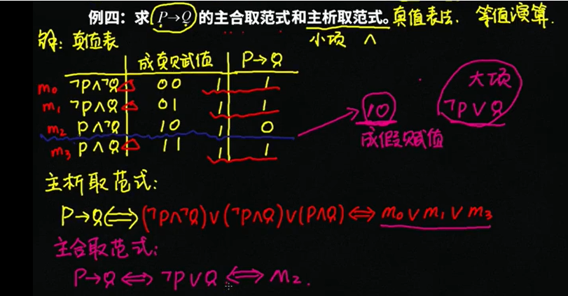
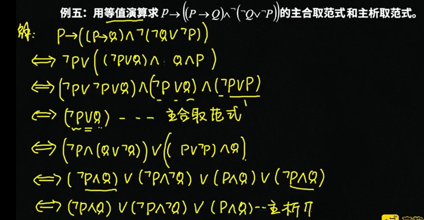
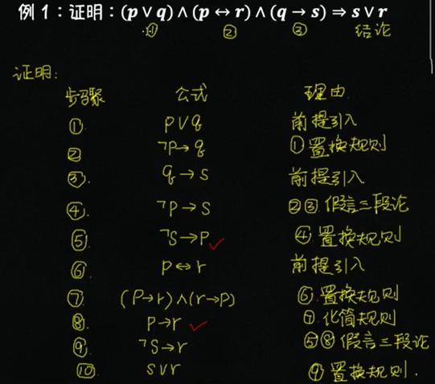
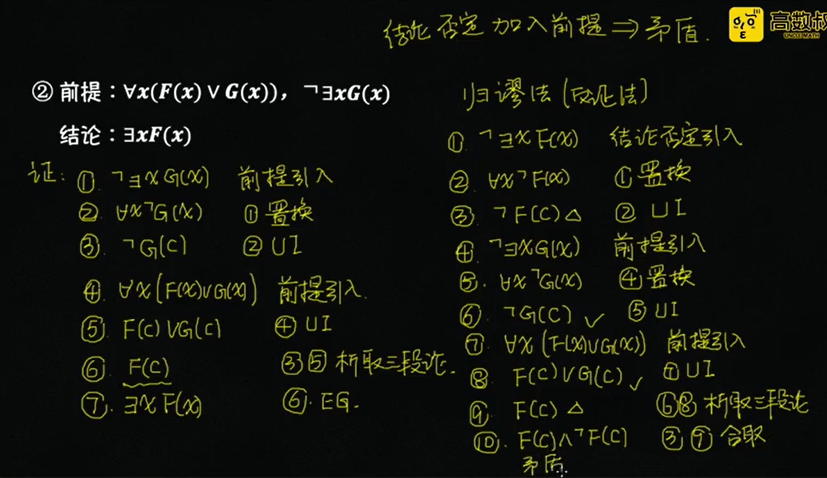
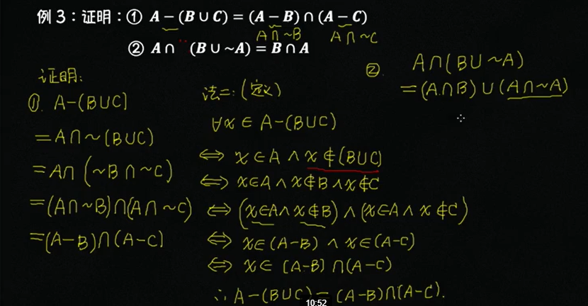
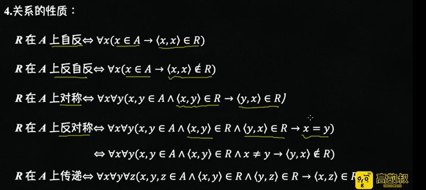
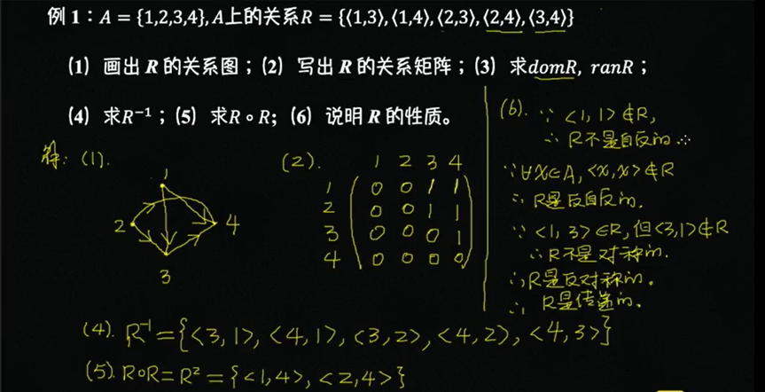
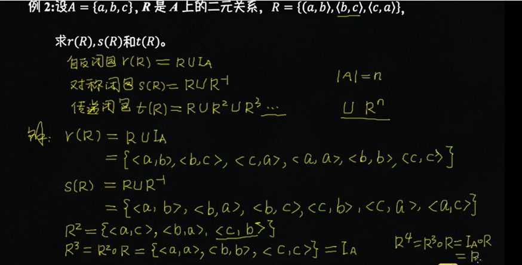
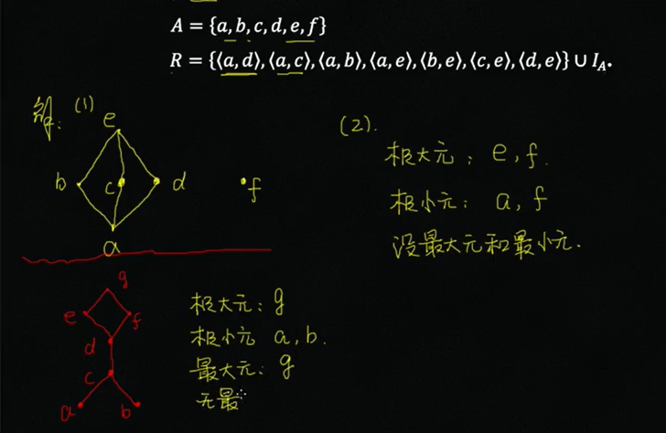

[北航面试基础](https://wenku.baidu.com/view/505ec49aaff8941ea76e58fafab069dc502247ea.html)

等价关系：自反性，对称性，传递性

偏序关系：自反性，**反**对称性，传递性

> 离散数学是什么？包含哪些内容？

离散数学是研究离散量的结构和相互关系的数学学科。

包含数理逻辑、集合论、抽象代数、图论等数学分支。

> 离散数学各个部分的研究目标？

+ 数理逻辑：用数学方法研究逻辑
+ 集合论：研究集合的数学分支
+ 抽象代数：研究代数系统的结构和性质
+ 图论：研究图和网络的分支

> 命题逻辑和谓词逻辑的区别？

谓词逻辑=命题逻辑+谓词特性（量词描述命题本身的特性）

> 什么是二元关系？

> 等价关系？偏序关系？良序？全序？划分？子句？合取范式？

> 集合的势？无限集合大小的比较？

> 图、无向图、有向图、欧拉图、哈密顿图、树

# 数理逻辑

What？用数学方法研究逻辑。

## 命题逻辑

### 命题&联结词&符号化

**目的：如何形式化表示命题逻辑**。

**命题**：能判断真假的陈述句

+ 真值：真或假
+ 真假分类：真命题，假命题
+ 组成分类：原子命题，复合命题

**逻辑联结词**（按优先级**从高到低**排列如下）：掌握对应的**真值表**

+ $\lnot$：非（否定）
+ $\land$ ：合取（且）
+ $\or$：析取（或）
+ $\rightarrow$：蕴含（如果...那么...）
+ $\leftrightarrow$：等价（当且仅当）

**命题符号化**：将文字描述的命题用逻辑联结词进行符号化

+ 如果天气好，我就去公园
  + p：天气好
  + q：去公园
  + 命题：$p\rarr q$
+ 经一事，长一智，并且不经一事，不长一智
  + p：经一事
  + q：长一智
  + 命题：$(p\rarr q)\land (\lnot p\rarr \lnot q)$

### 命题公式类型

**目的：如何判断命题公式的真假。**

**公式类型**：三种类型

+ 重言式：永真式
+ 矛盾式：永假式
+ 可满足式：不是矛盾式

**等值演算**：利用公式进行等价的推导演算，逻辑等价符号用 $\iff$（注意和逻辑联结词 $\leftrightarrow$ 不同）

+ 双否律：$\lnot \lnot A \iff A$
+ 德摩根律：$\lnot(A\lor B)\iff \lnot A \land \lnot B$；$\lnot(A\land B)\iff \lnot A \lor \lnot B$
+ 蕴含等价式：$A\rightarrow B \iff \lnot A\lor B$
+ 归谬论：$(A\rarr B) \land (A\rarr \lnot B) \iff \lnot A$

**命题真假判断方法**：

+ **真值表**：适合变量少，公式短
+ **命题公式等值演算**：适合变量多，公式短，可用计算机替代推导演算

### 范式

#### 析取范式&合取范式

**析取范式&合取范式**：仅含 $\lnot \land \lor$

+ 文字：p 为任意的**命题变量**，则 $p$ 和 $\lnot p$ 称作文字（公式的最小单元）
+ 析取式&合取式
  + 析取式：有限个文字的析取，形如 $P_1\lor P_2\lor ...\lor P_N$
  + 合取式：有限个文字的合取，形如 $P_1\land P_2\land ...\land P_N$
+ 析取范式&合取范式：根据**中间**的联结词命名（记忆方法-中间和内部相反）
  + 析取范式：有限个合取式的**析取**，形如 $(P_{11}\lor ...\lor P_{1n})\land (P_{21}\lor ...\lor P_{2n})\land ...\land (P_{n1}\lor ...\lor P_{nn})$
  + 合取范式：有限个析取式的**合取**，形如$(P_{11}\land ...\land P_{1n})\lor (P_{21}\land ...\land P_{2n})\lor ...\lor (P_{n1}\land ...\land P_{nn})$

#### 主析取范式&主合取范式

析取范式与合取范式答案不唯一，给计算带来困难，为了统一结果，定义**主析取范式**和**主合取范式**

+ 在原有范式基础上，对 $P_{ij}$ 增加限制，要求每个**命题变量**必须按顺序出现一次（可加 $\lnot$ 进行修饰），比如有 2 个命题变量 $A和B$，那么 $Aop B$、$Aop\lnot B$、$\lnot AopB$、$\lnot A op\lnot B$ 均为满足条件的组合。
+ 主析取范式：$op=\land$
+ 主合取范式：$op=\lor$

主析取和主合取范式**求解方法**：和命题真假值判断一样，有真值表和等值推导法：

+ **真值表**

+ **等值推导**

逻辑联结词的**完备集**：即当前联结词可以表示任何命题，如 {$\land,\lor$} 即可表示任意的命题。换句话说，任何命题都可以转换为仅包含这两个联结词的命题公式。

### 推理理论

已知前提推导结论的常用方法

+ 真值表
+ 等值演算推导
+ **自然系统的推理规则**

本文的推理主要使用自然系统的推理规则。

利用已知的推理规则进行推导，也可用斜型证明。

## 谓词逻辑

谓词逻辑是命题逻辑的推广，其组成如下：

+ 个体词：可独立存在的客体/对象

+ 谓词：个体的性质或者个体间关系

最重要的两个联结词：

+ 存在量词：存在一个个体满足条件
+ 全称量词：任意个体均满足条件

前束范式：把所有的量词移到**最前面**，形如 $Q_1x_1Q_2x2...Q_nx_nM$，其中 $Q_i$ 表示量词 $\forall$ 或 $\exists$，$M$ 为不包含量词的公式。

需掌握如下内容（类似命题逻辑）

+ 谓词逻辑符号化
+ 真假值判断：真值表或等价推理
+ 推理证明：斜型证明

# 集合论

元素和集合的关系：属于

集合与集合的关系：包含

集合的基本运算：并、交、差、对称差、幂集（所有子集的集合）

等式证明：

+ 定义证明：根据集合的定义进行证明等式

+ 集合运算律：利用运算律进行等式证明

## 二元关系

笛卡尔积：有序对集合

关系：笛卡尔积的子集

关系表示：关系图、关系矩阵

关系性质：自反，对称，传递性质

计算实例：关系图和关系矩阵表示；定义域和值域；逆；复合；性质判断

自反，对称，传递闭包计算：

## 等价关系

等价关系：同时满足自反、对称、传递性。

等价类：存在等价关系的元素集合（类似于聚类/朋友圈划分）

需掌握以下题目：

+ 给定具体关系判断是否等价：带入数据逐个进行验证
+ 给定抽象关系判断是否等价：从定义出发

## 偏序关系

偏序关系：同时满足自反、**反对称**、传递性。

偏序集：满足偏序关系的元素集合

绘制哈斯图，找对应元素

+ 极大元：上面无元素
+ 极小元：下面无元素
+ 最大元：从极大元中挑选，且可以与任何元素比较
+ 最小元：从极小元中挑选，且可以与任何元素比较

## 全序关系

全序=偏序+完全性（任何一对元素均可比较）

## 良序关系

良序=全序+**任意子集**均存在**最小元**

# 图论