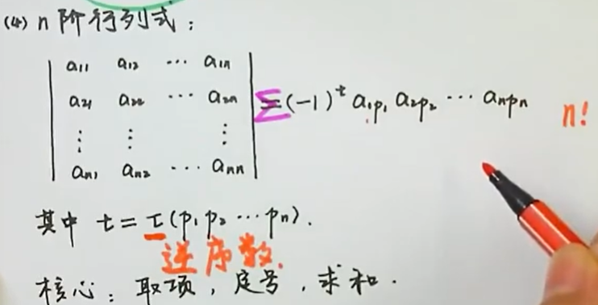
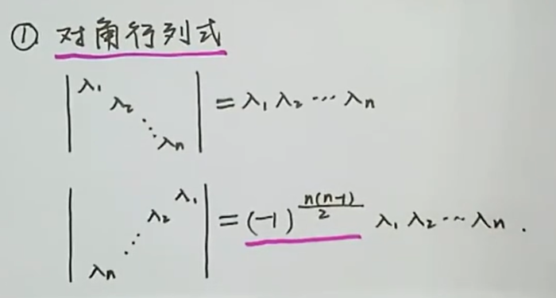
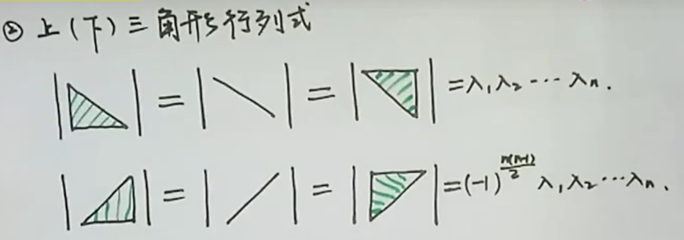
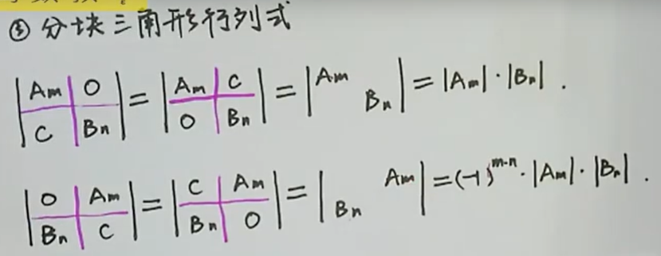
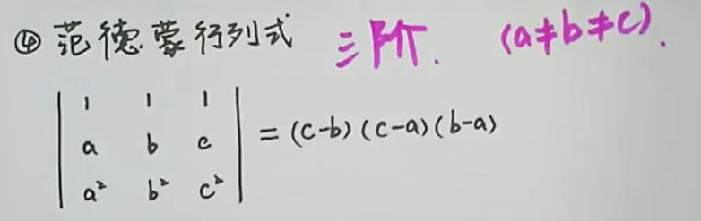
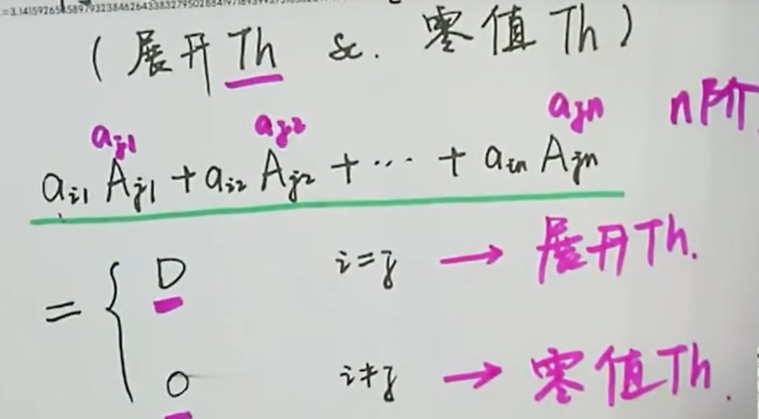
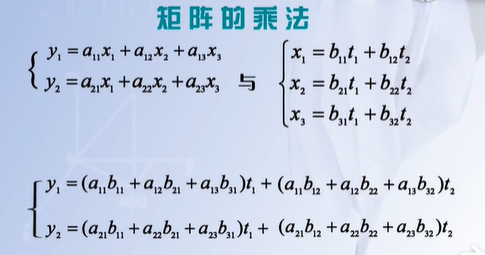
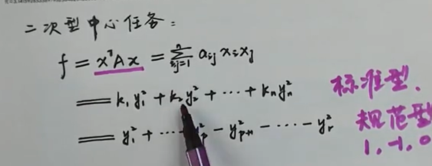
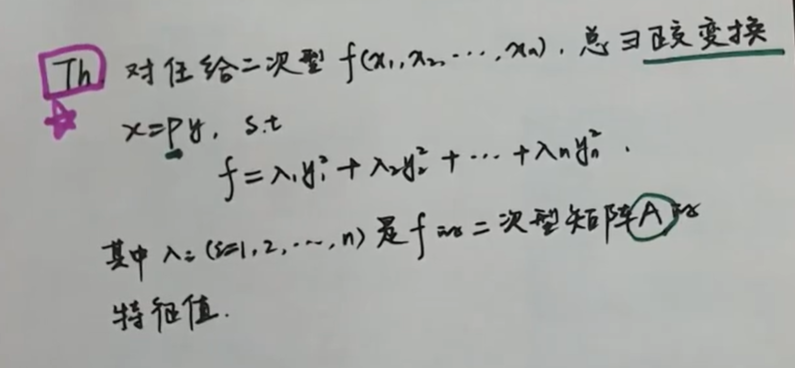
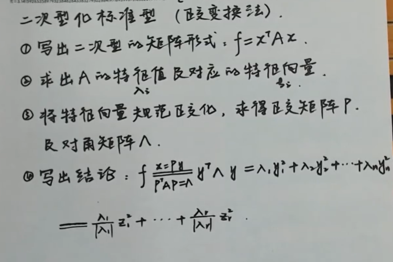

[宋浩老师](https://www.bilibili.com/video/BV1aW411Q7x1?p=2)：讲解有趣

[山东大学秦静](https://www.bilibili.com/video/BV1xJ411M7Rz/?spm_id_from=333.788.videocard.3)：逻辑性强，有整体框架

[高数叔](https://www.bilibili.com/video/BV1Pb41177LQ?from=search&seid=435885249046740328)：最短最通俗易懂，只讲会考的知识点，**手把手教做题，适合考前突击**

Ax=B 何时有解？

Ax=0 何时有解？

线性方程组的分类和求解

行列式

+ 二阶：对角相乘相减
+ 三阶：划线法
+ N 阶

排列：

+ 奇排列：奇数个逆序对
+ 偶排列：偶数个逆序对

逆序对：

对换：交换两个数，改变排列的奇偶性

问概率论分布函数、高斯分布、函数公式、F分布定义、大数定律以及贝叶斯公式及用途

+ 分布函数：$F(x)=P(X<x)=\int_{-\infty}^{x} f(x)\, {\rm d}x$
+ 高斯分布/正态分布：通式和标准式
+ F 分布：两个服从卡方分布的独立随机变量除以各自的自由度后的比值的抽样分布。方差分析，回归方差显著性检验
+ 卡方分布：
+ 大数定理：在随机试验中，大量的实验结果的平均值接近某个确定值（频率=概率）。[参考](https://wiki.mbalib.com/wiki/%E5%A4%A7%E6%95%B0%E5%AE%9A%E5%BE%8B)
+ 贝叶斯公式：[超棒解释](https://zhuanlan.zhihu.com/p/37768413)，根据已有的部分信息预测未来。公式为两个条件概率的关系，从全概率推导而来

> 线性代数（线性相关、线性无关）

+ 线性相关：**至少**有一个向量可由其余向量**线性**表示
+ 线性无关：任意一个向量都不可由其余向量线性表示

> 操作系统包括哪些重要部分。BIOS是什么，在OS中什么用途。微内核是什么。按了开机键后电脑的启动过程

+ 操作系统：处理器、存储、文件、外设、接口
+ BIOS：基本输入输出系统，电脑启动后加载的第一个程序
+ BIOS 用途
  + 自检及初始化
    + 加电自检：通电后检查硬件
    + 初始化：创建中断向量、设置寄存器、对外部设备进行初始化
    + 引导程序：从软盘或硬盘的第一个扇区读取引导记录（引导操作系统）
  + 程序服务处理
  + 硬件中断处理
+ 开启键后启动过程：
  + BIOS：加点自检，选择启动顺序（从哪个外部设备启动，硬盘？软盘？）
  + 确定激活分区：被选中的外部设备的前 512 KB 存储的叫做主引导记录 MBR，4 个分区仅一个是激活的分区，遍历 4 个分区来确定激活分区
  + 确定操作系统位置：激活分区的第一个扇区为卷引导记录 VBR
  + 加载操作系统内核到内存：VBR 实现
+ 微内核vs宏内核

> 死锁是什么？操作系统中解决死锁的办法有哪几种？

+ 死锁：两个或多个进程因为竞争资源，双方相互阻塞。例如 A 等 B，B 等 A
+ 解决方法
  + 死锁预防：破坏某些条件
  + 死锁检测：事后画依赖图
  + 死锁避免：银行家算法
  + 死锁解除：配合检测使用

> 问锁怎么实现

+ 硬件
  + 关中断-测试-开中断
  + test-and-set 是原语（硬件指令）
+ 软件
  + 信号量
  + 条件变量

> 系统调用和库函数调用区别？

+ 系统调用是特殊的库函数调用
+ 系统调用通过软中断陷入核心态，库函数调用运行在用户态

开发一个新的硬件设备，没有驱动程序，该怎么把它连接到电脑上？

> 描述计算机网络的拥塞处理过程。

+ 慢开始
+ 拥塞避免
+ 快速恢复：3 ACK
+ 快重传

你最擅长的数学课？线性代数

> 链路层有哪些协议

+ PPP

+ CSMA/CD：有线广播
+ CSMA/CA：无线

离散的同态

# 行列式

行列式是作用在**方阵**上的**运算**。仅仅是为了**便于记忆**而引入的**简记符号**[^山东大学秦静第一课《行列式引进》]。

+ 二阶行列式：求解二元一次方程时引入的简记符号
+ 三阶行列式：求解三元一次方程时引入的简记符号

主对角线：左上-右下

副对角线：右上-左下

## 行列式类型

+ 一阶行列式：本身
+ 二阶行列式：对角线法
+ 三阶行列式
+ N 阶行列式

## 行列式性质

转置：行列对换即可，元素 $a_{ij}$ 转为 $a_{ji}$

+ 行列式 A 等价于 A 的转置，$|A|=|A^T|$

+ 互换两行或两列，行列式变号，$|A|=-|A'|$，$|A'|$ 是 $|A|$ 交换某两行/列的得到的
+ 某一行/列的公共因子可提取到行列式外面
+ 若有两行或两列成比例，行列式为 0
+ 行列式可按行或按列拆开运算（**每次仅能拆一行或一列，其余保持不动**）
+ **某行/列的 k 倍加到另一行/列，行列式值不变**

## 特殊行列式

### 对角行列式

+ 主对角行列式

+ 斜对角行列式

### 上/下三角形行列式

+ 主对角线的上下三角形

+ 斜对角线的上下三角形

### 分块三角形行列式

+ 主对角线
+ 斜对角线

### 范德蒙行列式

第二行任意两个值的差的乘积，注意按照一定顺序，从最后一列开始。

## 余子式

余子式：删除当前元素所在的**行和列**得到的行列式，表示为 $M_{ij}$

代数余子式：$A_{ij}=(-1)^{i+j}M_{ij}$，仅多了一个符号

## 展开定理&零值定理

+ 按行/列展开
+ 系数与代数余子式的下标相同，结果为行列式的值 D；否则为 0

## 克莱姆/克拉默法则

应用：线性方程组的求解，n 个方程，n 个未知元的**唯一解（D不为0**）。

前提：N 个方程，N 个未知元，$D\neq 0$ 。

可直接写出 N 元一次方程组每个解的行列式表达式，每个解均为分子/分母的形式，即 $x_i=\frac{D_i}{D}$。

+ 分母：相同，均为方程组的系数组成的行列式 D
+ 分子：将 D 中对应列替换为右侧的常数，例如求 $x_i$，那么将 D 中的第 i 列 替换为常数

# 矩阵

矩阵：矩形排列的数表

应用：图像处理，线性变换及对称，物理学

## 矩阵运算

+ 加法：同型（行列相同），对应位置的元素相加
+ 数乘：$\lambda A$ 等于**每个元素**均乘以 $\lambda$（行列式的数乘仅乘以某一行/列）
+ 乘法：$A_{m\times s}B_{s\times n}=C_{m\times n}$
  + 交换律不满足：$AB\neq BA$
  + $AB=0\nRightarrow A=0 或 B=0$

+ 转置
  + $(A^T)^T=A$
  + $(kA)^T=kA^T$
  + $(AB)^T=B^TA^T$
  + $(A+B)^T=A^T+B^T$
+ 方阵 $A_n$ 的行列式
  + $|A^T|=|A|$
  + $|\lambda A|=\lambda^n |A|$
  + $|AB|=|A||B|$
  + $|A^k|=|A|^k$

## 特殊矩阵

### 伴随矩阵

方阵才有伴随矩阵 $A^*$

+ 伴随矩阵由 $A_{ij}$ 组成，要求**横求竖排**

常见运算：

1. $AA^*=A^*A=|A|E$ :两个矩阵相乘后，利用展开定理和零值定理，可发现是对角阵，且值均为 $|A|$

2. $A^*=|A|A^{-1}$：由公式 1 推出

3. $A^{-1}=\frac{A^*}{|A|}$：由公式 2 推出

4. $|A^*|=|A|^{n-1}$：由公式 2 推出（$|A^{-1}|=\frac{1}{|A|}$）
5. $(A^*)^*=|A|^{n-2}A$：将 $A*$ 看成整体代入公式 2 得到 $|A^*|(A^*)^{-1}=|A^*|(|A|A^{-1})^{-1}$

### 分块矩阵

分块矩阵运算

+ 加法：同型，同分块
+ 数乘：每个元素都乘
+ 乘法：把分块看成一个元素处理
+ 分块对角阵
  + 行列式：对角线上的分块矩阵的行列式乘积
  + 逆矩阵：对角线上的分块矩阵分别取逆矩阵
+ 特殊分块矩阵：把它看成单元素进行计算

### 奇异矩阵 & 满秩矩阵

**奇异矩阵&非奇异矩阵**：根据**方阵 A** 的行列式 $|A|$ 判断

+ $|A|=0$：奇异矩阵（方阵均不为 0，可行列式计算结果却为 0）
+ $|A|\neq 0$：非奇异矩阵

**满秩矩阵&降秩矩阵**：根据方阵 An 的秩 r(A) 判断

+ r(A)=n：满秩矩阵（奇异矩阵，行列式必定非零）
+ r(A)<n：降秩矩阵（非奇异矩阵，行列式必定为零）

## 初等变换

作用：用于简化矩阵。

### 基本概念

**初等变换**=**初等行变换**+**初等列变换**

**初等行变换**：

+ 两行互换：$r_i\leftrightarrow r_j$
+ 行乘 k 倍：$k\times r_i$
+ 行加上行乘 k 倍：$r_i+k\times r_j$

**初等列变换**：类似于初等行变换

### 初等矩阵

**单位矩阵**经过**一次的初等变换**得到的矩阵称作初等矩阵。

可逆性：初等矩阵均是可逆矩阵

+ 两行互换的逆矩阵就是本身

左行右列

+ 对 A 进行初等行变换**等价于**左乘初等矩阵
+ 对 A 进行初等列变换**等价于**右乘初等矩阵

### 矩阵的秩

**子式**：从 $A_{m\times n}$ 的矩阵中任取 k 行 k 列，称作 k 阶子式

**矩阵的秩**：矩阵 A 的非零 k 阶子式，k 取的最大值

**重要结论**

+ 梯形矩阵的秩是它的行数
+ 任意矩阵均可通过初等变换变为梯形矩阵（**求矩阵秩方法**）
+ 初等变换不改变矩阵的秩

**矩阵等价**：A 经过初等变换得到的矩阵 B，那么称二者存在**等价关系（自反、对称、传递）**

+ A 等价于 B 就是 $r(A)=r(B)$

## 可逆矩阵

矩阵 A 是可逆矩阵的前提：A 必须是方阵，同时存在 $AB=E || BA=E$

**求解方法**

+ **伴随矩阵法**：适合 2 阶方阵的逆求解，$AA^*=|A|E$
+ **初等变换法**：适合高阶方阵的逆求解，假设原矩阵为 A
  + 增广矩阵：$(A,E)$
  + 线性变换：对矩阵 $(A,E)$ 进行初等变换，将 A 转换为 E，那么结果为 $(E,A^{-1})$，即右侧为 $A^{-1}$

## 相似矩阵

定义：A 和 B 为方阵，若存在可逆矩阵 P，使得 $P^{-1}AP=B$，则称 A 和 B 互为相似矩阵，记为 $A\sim B$

若 $A\sim B$ ，则有重要结论：

+ $r(A)=r(B)$
+ 特征值相同
+ $|A|=|B|$
+ $tr(A)=tr(B)$，对角线上的元素相同
+ $A^k\sim B^k$

## 矩阵的相似对角化

在相似矩阵的定义中，B 为对角矩阵，则称 A 可相似对角化。

**可相似对角化的判断**步骤：

1. 求所有的特征值
2. 每个特征值对应的特征向量：考虑特征值的**重数 m**，对应的特征向量必须等于 m
   + 比如 $\lambda_1=\lambda_2$，那么该系数对应的特征向量为 2，即 r(A)=2

## 正交矩阵

定义：若 n 阶方阵 A，使得 $A^TA=E,(A^T=A^{-1})$，则称 A 为正交矩阵。

重要结论：

+ A 是正交矩阵，那么 $A^T$ 和 $A^{-1}$ 均为正交矩阵
+ $|A|=1或-1$
+ A 和 B 均为正交矩阵，那么 AB 也是正交矩阵

# 线性方程组

## 线性相关性

线性相关性是用来描述向量组间的一种关系。

直观定义如下：

+ 线性无关：任何一个向量均不可用其余向量的线性组合表示
+ 线性相关：线性无关的对立面

形式化定义如下：

> **假设 $\alpha_1, \alpha_2,...,\alpha_s \in R^n $**
>
> **考察 $k_1 \alpha_1 + k_2 \alpha_2 +...+ k_s \alpha_s = 0$**
>
> + **线性无关：当且仅当 $k_1=k_2=...=k_s=0$ 时等式成立**
> + **线性相关：存在一组非全零解**

## 线性方程组的解结构

有常见的三种解题思路，各自有不同的应用场景：

+ 克拉默法则
+ 矩阵初等变换
+ 向量组的线性相关性

### 克拉默法则

使用条件：N 个未知数，N 个方程，D 不为 0，求唯一解

### 矩阵初等变换

**齐次线性方程组**：求满足 $Ax=0$ 的 $x$，其中 $A$ 有 n 个变量

+ 无穷多解：$r(A)<n$（线性相关）
+ 唯一零解：$r(A)=n$ （线性无关）

**非齐次线性方程组**：求满足 $Ax=b,(b\neq 0)$ 的 $x$ ，其中 $A$ 有 n 个变量

+ $r(A)=r(A,b)$
  + 无穷多解：$r(A)<n$
  + 唯一解：$r(A)=n$
+ 无解：$r(A)<r(A,b)$，其中 $r(A,b)$ 表示矩阵 $A$ 的增广矩阵（右侧增加一列系数）

### 向量组的线性相关性

这里主要考虑无穷解的通解表示方法。

+ $Ax=0$：$x=c_1\xi_1+c_2\xi_2+...+c_{n-r(A)}\xi_{n-r(A)}$，其中 $c_i \in R$，$r(A)$ 为矩阵 A 的秩，$n$ 为矩阵 A 的列数
+ $Ax=b$：x=**特解**+齐次线性方程组的通解。即$x=\eta +c_1\xi_1+c_2\xi_2+...+c_{n-r(A)}\xi_{n-r(A)}$，其中 $\eta$ 为特解，系数 $c_i \in R$，$r(A)$ 为矩阵 A 的秩，$n$ 为矩阵 A 的变量个数（列数）

$Ax=b$ 的解题步骤：

1. **求秩判断解类型**：求增广矩阵 $(A,b)$ 的秩，根据**矩阵初等变换**的规则判断解的类型。若是无穷解进入步骤 2
2. **求出齐次通解**：求 $Ax=0$ 的通解，具体如下
   + 确定解向量个数=$n-r(A)$，其中 n 为 A 的变量个数，$r(A)=r(A,b)$
   + 任意取出 $n-r(A)$ 个变量构成一个向量，用单位矩阵的每一列分别赋值，其余变量取 0，求出解
   + 写出基础解系
3. **求出特解**：令 $r(A)$ 个自由变量取 0，求出特解

## 施密特正交化

向量内积：两个向量对应的分量相乘后求和

向量长度：向量内积后开根号

正交向量：向量内积为 0

正交向量组

+ 定义
  + 不存在零向量
  + 任意两个向量均是正交向量
+ 特点：必定线性无关

**计算公式**如下：$[a,b]$ 表示向量 $a$ 和 $b$ 的内积

+ $b_1=\alpha_1$
+ $b_2=\alpha_2-\cfrac{[\alpha_2,b_1]}{[b_1,b_1]}b_1$
+ $b_r=\alpha_r-\cfrac{[\alpha_r,b_1]}{[b_1,b_1]}b_1-\cfrac{[\alpha_r,b_2]}{[b_2,b_2]}b_2-...-\cfrac{[\alpha_r,b_{r-1}]}{[b_{r-1},b_{r-1}]}b_{r-1}=\alpha_r-\sum_{i=1}^{r-1} {\cfrac{[\alpha_r,b_i]}{[b_i,b_i]}b_i}$

## 特征值与特征向量

定义：$Ax=\lambda x$，其中 $A$ 为 n 阶方阵

+ $\lambda$ 称作 A 的特征值
+ **非零向量** $x$ 称为 A 的特征向量 

$Ax=\lambda x=>(A-\lambda E)x=0$

+ 若想 $x$ 为非零向量，那么 $|A-\lambda E|=0$（特征方程）

**重要结论**：

+ N 阶方阵有 N 个特征值 $\lambda_1,\lambda_2,...,\lambda_N$
+ $\lambda_1+\lambda_2+...+\lambda_N=a_{11}+a_{22}+...+a_{NN}$
+ $\lambda_1\lambda_2...\lambda_N=|A|$

**求解方法**：先求解特征值，再求出每个特征值对应的特征向量（齐次线性方程的通用解求法）

# 二次型

二次型：二次曲线方程，最高指数为 2

标准型：无交叉项，全为平方项，形如  如 $x^2+y^2=1$

表示方法

普通二次型可通过坐标的旋转变换转化为标准型。

重要定理：

正交化步骤

# 向量空间

满足以下三个条件：

+ 同维度的向量组成
+ 满足加法封闭性
+ 满足数乘封闭性

向量空间的基：通过线性组合可以表示其余所有向量。例如笛卡尔坐标系的横纵轴，$a=(1,0),b=(0,1)$，任意向量均可用 $k_1a+k_2b$ 表示。

基之间有什么关系？基变换公式

# 参考

[^山东大学秦静第一课《行列式引进》]: https://www.bilibili.com/video/BV1xJ411M7Rz?p=1

