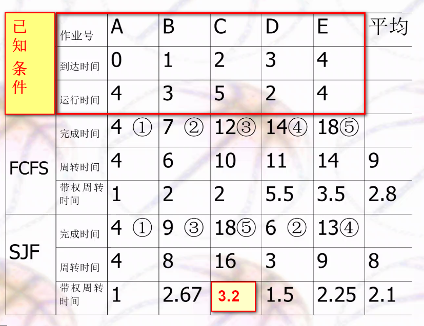
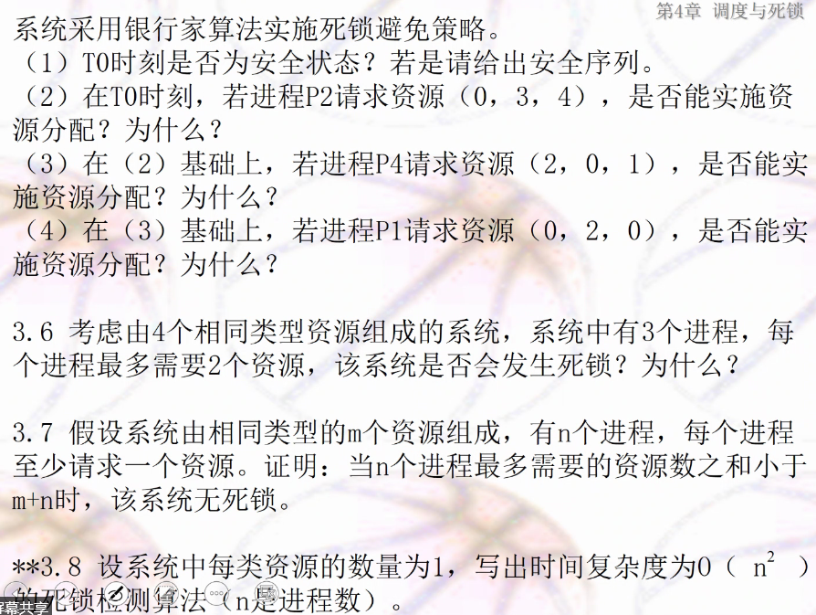
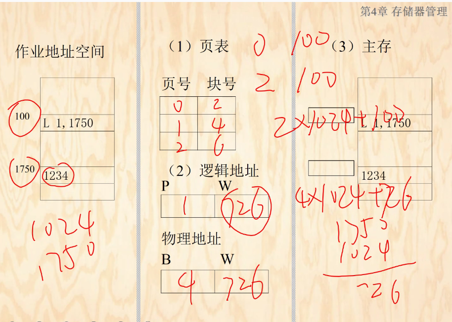
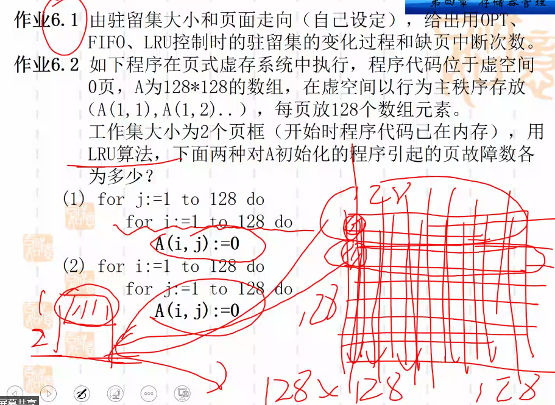

408历年真题2009-2019 链接: https://pan.baidu.com/s/1dE9ZXptmUoxbKw9WokzJWg  提取码:73s6

# 概述

## 目标定义

为什么要有OS？目标：

+ 屏蔽底层细节，软硬件管理，提高生产力
+ 好用
+ 提高资源利用率

定义：

+ 软硬件资源管理；工作流程组织
+ 提高资源利用率
+ 便于用户使用的程序集合


## 发展过程

+ 发展初期：无OS，手工操作阶段

+ 第二阶段（50年代）：早期批处理系统（**单道批处**理）

+ 第三阶段（60年代）：（真正意义上的OS）

  + **多道批处理**：内存中同时存放多个已开始运行的程序
    + 特点
      + 并发性（并发-**一段时间**；并行-**同一时刻**）
      + 无序性
      + 调度性
    + 优点：大型科学计算，数据处理（吞吐量大，资源利用率高）
    + 缺点：**无交互**
  + **分时系统**：**时间片分配**，服务多个用户，保证响应时间，支持会话
    + 过长：响应时间长
    + 过短：资源利用率小（调度程序要cpu时间）
  + **实时系统**：在**规定时间**内完成处理（**高可靠，安全，完整**）
    + 实时控制系统：军工国防
    + 实时消息处理系统：银行，股票，支付宝

+ 第四阶段：进一步发展

  + 微机应用：MS DOS，Windows，Unix，Linux
  + 随计算机系统结构而发展的OS，出现并行机OS，网络OS，分布式OS
  + 嵌入式OS：Vxworks

  

## 四个特征(考)

并发和共享是相辅相成的两个特点，无并发就无共享，更好的共享可促进并发。

+ **并发**：并发（**一段时间**内），并行（**同一时刻**）
+ **共享**：资源共享
  + **互斥**共享：**一段时间**仅**一个**进程使用（打印机）
  + **同时**访问：**一段时间**可**多个**进程访问（磁盘，访问码）
+ 虚拟：**一个物理实体**分为**多个逻辑实体**（资源虚拟-功能扩展）
  + 多道程序设计：cpu虚拟
  + 虚拟内存：内存虚拟
  + Spooling技术：I/O设备虚拟
+ 不确定性（异步性）：过程不确定，环境相同时，结果必确定


## 五大功能

+ 处理机管理：处理机的**分配运行**，本质为**进程管理**
  + 进程控制：建立，分配资源，运行，回收资源，撤销
  + 进程同步：进程协调
  + 进程通信
  + 进程调度
+ 存储器管理
  + 内存分配：分配，回收，移动
  + 内存保护
  + 地址映射
  + 内存扩充
+ 设备管理
  + 任务
    + 为用户程序分配I/O设备
    + 处理用户请求的I/O操作
    + 提高I/O设备利用率
  + 缓冲管理：缓和cpu和IO设备速度不匹配矛盾
  + 设备管理：分配设备
  + 虚拟设备
+ 文件管理
  + 存储空间
  + 目录管理
  + 文件读写
+ 用户接口
  + 命令接口：cmd中的命令（终端）
  + 程序接口：系统调用
  + 图像接口：

### 结构设计

+ OS构件：**内核**，进程，线程，管程
+ 内核
  + 单内核：各部件混居（unix/linux，window）（如今主体）
  + 微内核：结构性与功能性部件分离（学术，效率低）
  + 混合内核：折中单微内核，较多组件在核心态中运行
  + 外内核：减少软件抽象和消息传递机制，专注于硬件抽象（部分嵌入式使用）
+ 设计思想：模块化，层次式，虚拟化

### 内核实现--层次式结构

# 进程管理

> 计算机如何快速判断两条语句可并发执行？

计算出读集，写集，当两个程序不同时读时，它们集合为空


## 基本概念

### 定义（三句话）

+ 进程是程序的一次**执行**。
+ 进程是程序在数据集合上的运行过程，是资源分配和调度的基本单位。
+ 程序及数据在处理机上的顺序执行所发生的活动。

### 5特征（进程vs程序--考）

+ 动态性：程序的一次执行过程是进程（过程性）
+ 并发性
+ 独立性：资源分配，调度的基本单位（资源+任务）
+ 异步性：何时执行不知道
+ 结构特征：Unix的进程映像=**程序段+数据段+进程控制块**

### 3状态

+ 就绪态Ready：仅缺少CPU资源，一旦获得CPU时间，立即执行。就绪队列。
+ 运行态Running：已获得CPU时间，正在执行。
+ 阻塞/等待/睡眠Block：等待某事件而暂停，如等待IO操作结束，等待通信，等待申请缓存空间。分级阻塞队列。
+ **一句话总结：万事俱备-Running；仅缺CPU--Ready；缺少CPU+其它资源--Block**
+ 挂起状态：资源吃紧，负荷较重，资源查看时将一些进程挂起，处于静止状态，即无视状态转换

3状态转换图

+ 为何Ready不可转换为Block？
  + 只有跑起来才能知道缺什么（Ready没有检测缺少什么资源，比如开始就直接加入就绪队列）

### 进程控制块PCB

管理进程的数据结构，包含进程的所有信息。

PCB是系统感知进程的唯一标志。

#### 组成结构

+ 标识：外部（用户标记），内部
+ 处理机状态：寄存器，栈指针，PSW，指令计数器
+ 进程调度信息：进程状态，优先级，事件（需要的资源），其它信息
+ 进程控制信息：程序和数据地址；同步和通信；资源清单（需要的资源和已有资源）

#### 组织方式

**时间，空间，稳定性**三个角度比较

+ **链接**：增删多，查找慢，内存节约，不稳定（电磁环境下一个断开后面都找不到）
+ **索引**：较稳定，查找快，内存浪费（索引表--空间换时间）

## 进程控制

> 内核：提供核心常用功能，使用原语操作实现
>
> 原语操作：原子操作，即操作集合要么同时执行，要么都不执行。（关中断，执行，开中断）

创建进程的事件：

+ 用户登录
+ 作业调度
+ 提供服务
+ 应用请求

创建步骤：

+ 申请PCB
+ 分配资源
+ 初始化PCB
+ 加入就绪队列

结束条件：

+ 正常结束
+ 异常
  + 越界溢出
  + 保护错：无权限访问某个资源或文件
  + 特权指令错：用户执行仅允许OS执行的指令
  + 非法指令错：执行不存在的指令，电磁干扰导致eip错误
+ 外界干预

结束步骤：

+ 释放资源
+ 销毁PCB

## 进程同步（考重点）

任务：进程间共享资源和合作

生产者-消费者问题：counter+1和counter-1可拆成3句机器语言

临界资源：一次仅允许一个进程访问

临界区：包含访问临界资源的代码块

**进程同步4特征（评价标准）：**

+ 基本要求
  + 空闲让进：临界区无进程，可允许进程进入
  + 忙则等待：临界区有进程，不允许其它进程进入
+ 优化要求
  + 有限等待：进程等待进入临界区时间有限，避免“死等”
  + 让权等待：进程等待进入临界区时，交出cpu资源，避免“忙等"(一直占用cpu等待，效率低)

同步控制尝试

#### **软件控制**

+ 增加开关变量turn，两个进程交替进行；满足基本要求，但是会死等。
+ 增加全局共享变量flag[2]，给门上锁，先判断对方状态，再改变自身状态。有问题-可能两个进程同时访问临界资源。
+ 增加全局共享变量flag[2]，给门上锁，先改变自身状态，再判断对方状态。有问题-可能两个进程死锁（都进不去）。

**硬件控制**

+ 关中断：关中断-测试锁-（锁开则关锁）-开中断。
+ 硬件指令Test-and-Set：测试并建立指令是一个原语，执行具有不可分割性（可看成一个不可打断的函数）。

**信号量**

+ 整型信号量

以上所有的同步实现方式均存在一个问题：**忙等**

+ **记录型信号量（考**）

解决问题：通过增加阻塞队列，实现**主动让权**，**避免忙等**

定义一个信号量结构体，以及最简单的两个操作：申请和释放资源

应用场景：多个并发进程共享**一个资源**

```cpp
struct Semaphore { // 信号量结构体
	int value; // >0：表示可用资源个数；<0：绝对值表示阻塞进程的个数
    struct process_control_block* list; // 阻塞的进程链表
};
Semaphore s; // 初始化，若val初值为1，则是互斥访问变量，实现进程互斥访问
void wait(Semaphore* s) { // 申请资源操作，简写成P也行（PV是荷兰语）
	s->value--;
    if (s->value<0) block(s->list); // 资源不足，进程主动加入等待/阻塞队列 
}
void signal(Semaphore* s) { // 释放资源操作，简写成V也行
    s->value ++;
    if (s->value<=0) wakeup(s->list); // 唤醒阻塞队列第一个进程
}
```

+ AND信号量：共享多个资源。避免死锁（用简单信号量连续申请多次则会导致死锁）

+ 信号量集：每个资源每次可以+/-d；资源低于某下限就不再分配

  Swait阻塞后需要被唤醒时需要重新执行swait（普通wait可以直接继续执行）。因为共享多个资源，需重新判断是否全部满足。

  Ssignal释放后，将所有有关的进程唤醒加入ready队列（普通signal只唤醒第一个）。因为共享多个资源，不一定第一个就会满足，因此遍历所有，分配给有可能全部资源都满足的进程。

功能：互斥，前驱，同步问题

PV解决生产者和消费者问题：

+ 互斥：互斥变量mutex
+ 自身特性：缓冲区未满生产者可生产，缓冲区非空消费者可取用
+ P互换位置会导致死锁；V互换不会死锁，但是效率低下

```cpp
item buf[N]; // 缓冲池大小（N个缓冲区）
int in=0, out=0; // 指示生产者存放物品和消费者取物品的缓冲区下标（循环数组模拟）
semaphore mutex=0; // 互斥变量，0表示临界区无人，不可进入；1表示临界区有人，可以进入
semaphore empty=N,full=0; // empty表示空缓冲区个数；full表示满的缓冲区个数（假设一个缓冲区存一个物品）
void producer() { // 生产者
	while (true) {
        // P(mutex)若在P(empty)前，在全空和全满情况下，会发生死锁
        P(empty); // 申请空缓冲区资源，申请失败则Block
        P(mutex); // 申请互斥访问；mutex=0则可以继续访问
        // 临界区
        buf[in] = 生成的物品
        in = (in+1)%N; // 后移
        // PV必成对出现
        V(mutex); // 释放互斥访问变量，置mutex=0
        V(full); // 释放full资源，表示满缓冲区多1个
    }
}
void consumer() { // 消费者
	while (true) {
        P(full); // 申请满缓冲区资源，申请失败则Block
        P(mutex);
        // 临界区
        取出buf[out];
        out = (out+1)%N;
        V(mutex);
        V(empty); // 释放empty资源，表示空缓冲区多1个
    }
}
void main() {
	producer();
    consumer();
}
```

and信号量解决生产者-消费者问题

```cpp

```

哲学家进餐

```cpp
pi表示进程，S[i],S[(i+1)%n]
// 互斥访问S[i]，mutex[i]
void producer() {

}
```

读者-写者问题

+ 可同时读
+ 不可同时读写
+ 不可同时写

```cpp
// 写-互斥mutex
// 读-不用互斥，记录可用最大变量S
P(mutex)
P(S)
V(mutex)
    
P(mutex)
P(S)
V(S)
V(mutex)
```

第一个读需要加锁，最后一个离开需解锁；读写共用一把锁

## 管程机制

过桥问题：南北方向有座独木桥，桥上同一方向最多容纳N个人，两侧人群如何过桥？

类似读者-写者问题，两侧均变成读者。

```cpp
// 错误案例：第一次执行P1后，if（count==1）前出现中断，再执行一次P1，导致if条件失效
wmutex = 1
count = 0
rmutex = 1
p1 {
	p(rmutex);
	count++;
	v(rmutex);
    
	if(count == 1) p(wmutex);
	
    done();
	
    p(rmutex);
	count--;
	v(rmutex);
	
    if(count == 0) v(wmutex);
}
// 正确参考1
NtoS = 1, StoN = 1, bridge = 1;
int NtoS_count = 0, StoN_count = 0;
void northToSouth(){
	wait(NtoS);
	if(NtoS_count == 0) wait(bridge);
	NtoS_count++;
	signal(NtoS);
	过桥
	wait(NtoS);
	NtoS_count--;
	if(NtoS_count == 0) signal(bridge);
	signal(NtoS);
}
void southToNorth(){
	wait(StoN);
	if(StoN_count == 0) wait(bridge);
	StoN_count++;
	signal(StoN);
	过桥
	wait(StoN);
	StoN_count--;
	if(StoN_count-- == 0) signal(bridge);
	signal(StoN);
}
// 正确参考2：待证明？
south=1;//南方向信号量 
north=1;//北方向信号量 
mutex=1;//桥 
count_south=0;//从北往南的人数 
count_north=0;//从南往北的人数 
north_to_south(){
	P(south);
	count_north++;
	if(count_north==1){
		P(mutex);
	}
	V(south);
    
	过桥；
	
    P(south);
	count_north--;
	if(count_north==0){
		v(mutex);
	} 
	V(south);
}
```

考试写标准写法

一家四口橘子和苹果问题：母亲买橘子，女儿吃橘子；父亲买苹果，儿子吃苹果，仅一张桌子，一次仅放一个水果。

```cpp
// 错误案例
pmutex=1, cmutex=1; // 父母，孩子互斥访问果盘变量
isEmpty=1; // 果盘是否为空
fruitType=1; // 果盘水果类型:1苹果，2橘子
father() {
    P(pmutex);
    if (isEmpty == 1) fruitType = 1;
    V(pmutex);
}
son() {
    P(cmutex);
    if (isEmpty==0 && fruitType==1) isEmpty=1;
    V(cmutex);
}
// 正确参考：信号量，定义，初值，循环，写全
Semophere empty=1,fullA=0,fullO=0; // 信号量类型+初值！！！
Semophere mutex=1;
father() {
    while (true) { // 循环！！！
        P(empty);
        p(mutex);
        放苹果
        V(mutex);
        V(fullA);
    }
}
son() {
    while (true) {
        P(fullA);
        P(mutex);
        拿苹果
        V(mutex);
        V(empty);
    }
}
mother() {
    while (true) {
        P(empty);
        P(mutex);
        放橘子
        V(mutex);
        V(fullO);
    }
}
daughter() {
	while (true) {
        P(fullO);
        P(mutex);
        那橘子
        V(mutex);
        V(empty);
    }
}

```


## 进程通信

共享存储器系统

+ 共享数据结构
+ 共享存储区

消息传递系统

+ 直接通信：A直接给B
+ 间接通信：A给C，C给B。信箱缓冲

管道：读写进程共享Pipe文件，常用与Unix。互斥和同步问题。

send和receive原语

定长和变长消息：各有优劣（开销vs处理）

> 如果消息缓冲队列里消息个数最多为L，如何改写通信机制？

**本质是生产者-消费者问题，即长度最大为L的缓冲区**（代码稍微改改就行）。send在wait(mutex)前增加wait(empty)，receive在signal(mutex)后增加signal(empty)

```cpp
Semaphore empty=L; // 消息队列有剩余的空间；类似P-S中的empty变量
Semaphore mutex=1; // 互斥访问消息缓冲队列
Semaphore sm=0; // 消息缓冲队列中已有的大小（可用资源量）类似P-S中的full变量

// 发送者代码；先申请足够大的消息缓冲区，然后将首地址为a的消息发送区拷贝于消息缓冲区；获取接受者的标识，插入其消息队列中。
// receiver-接受者进程标识符，a：发送区首地址
send(receiver, a) {
    getbuff(a.size,i); // 申请a.size大小的缓冲区，存于i
    // 将三个属性拷贝到消息缓冲区i中
    i.sender = a.sender;
    i.size = a.size;
    i.text = a.text; // 应该有消息内容的拷贝的，可省略
    i.next = 0; // 看成队尾
    // 从PCB集合中，根据receiver获得接受进程的标识符j
    getid(PCBset, receiver, j);
    // 消息队列长度上限为L，转换为生产者-消费者问题，仅需增加下面一句
    // 注意和互斥变量不可交换先后位置，否则在全满/全空情况下导致死锁
    wait(empty); // 消息队列有空位才能发送
    
    // 以下为原有的原语操作
    wait(j.mutex); // 互斥访问消息队列
    insert(j.mq,i); // 将缓冲区i插入j的消息缓冲队列
    signal(j.mutex); // 释放互斥变量
    signal(j.sm); // 消息缓冲队列大小+1（可用资源+1）
}
// 接受者代码；摘下消息队列的第一个缓冲区i，并插入首地址为b的消息接收区
receiver(b) {
	j = internal name; // j为接收进程内部标识
	wait(j.sm); // 申请消息队列资源（-1）
	wait(j.mutex); // 互斥访问
	remove(j.mq, i); // 取下消息队列的第一个消息
	signal(j.mutex); // 释放互斥变量
    // 消息队列长度上限为L，转换为生产者-消费者问题，仅需增加下面一句
    signal(empty); // 释放空变量
    
	// 从i中拷贝有效信息到b
	b.sender=i.sender;
	b.size = i.size;
	b.text=i.text;
	
	releasebuf(i); // 释放消息缓冲区i
}
```

## 线程

资源分配依旧是进程，而线程是任务分配

特征

+ 调度：轻量级的任务调度单位，提高并发程度

+ 并发：进程并发，线程并发
+ 资源：无资源，共享其所在进程的资源
+ 开销
  + 创建和撤销：进程需要分配和回收系统资源，开销大；线程不带资源，比进程快。
  + 切换：进程需要保存很多内容，线程保存内容少。
  + 同步和通信：**同一进程的线程**有同一地址空间，通信简单。

分类：

+ 内核级线程：依赖内核，由内核创建，撤销，切换。靠线程控制块感知。
+ 用户级线程：不依赖于内核。

区别：

+ 调度：进行系统调用时，内核线程把线程为单位进行阻塞，仅该线程被阻塞；用户级线程被内核当成进程，该线程所在的整个进程被阻塞。
+ 线程执行时间：用户级的线程无法被内核感知，只会被当成一个进程。以进程/线程为单位进行分配，均不公平。

**线程资源**：局部变量，栈，状态字

**进程资源**：全局变量，打开的文件，子进程，地址空间

# 考试！信号量，定义，初值，循环，写全

# 处理机调度和死锁

调度本质是资源的分配

## 调度层次

| 类型\对比项目  | 对象            | 功能                                                         | 常见问题             | 用途                                               | 时间特点                       |
| -------------- | --------------- | ------------------------------------------------------------ | -------------------- | -------------------------------------------------- | ------------------------------ |
| 高级/长程/作业 | 作业            | 将外存后备队列的作业调入内存，创建进程，分配资源，放入就绪队列 | 一次调几个；调哪几个 | 多道批处理系统常见；分时和实时不用                 | 几分钟一次，可设计复杂调度算法 |
| 中级/中程/内存 | 进程/内存？     | 挂起状态：将某些进程调至外存，再适时调入内存                 |                      | 提高内存利用率和系统吞吐量。存储器管理中的对换功能 | 处于短程-长程之间              |
| 低级/短程/进程 | 进程/内核级线程 | 选择就绪队列中的进程，分配处理机                             | 抢占式/非抢占式      | 多道批处理，分时，实时均必备                       | 10~100ms一次，仅可用简单算法   |

+ 命名角度
  + 消耗时间：耗时最长的称长程，最短的称短程，介于二者之间的称中程调度。
  + 操作对象：作业，内存，进程
+ 存储结构
  + 外存有后备队列，挂起进程的存储；
  + 内存中有就绪队列，阻塞队列
+ 为何把进程和内核级线程作为短程调度对象？
  + 内核级线程可直接被内核直接感知；而用户级线程无法被内核感知，所以无法调度。


作业调度？进程调度？

## 调度算法评价

### 面向用户

+ **周转时间**：从提交给系统，到完成作业的时间
  + 等待时间
    + 外存后备队列等待
    + 就绪队列等待
    + 阻塞队列等待（等待IO事件）
    + 挂起到外存（**也算**）
+ CPU执行时间
  
+ 响应时间
+ 截止时间（必须开始的最迟时间，必须完成的最迟时间）

平均周转时间：$T=\cfrac{1}{n}\mathop{\Sigma}\limits_{i=1}^{n}T_i$，其中$T_i$为第i个作业/进程的周转时间。

加权周转时间：$T=\cfrac{1}{n}\mathop{\Sigma}\limits_{i=1}^{n}\cfrac{T_i}{T_s}$,其中$T_s$为第i个作业的实际执行时间（占用CPU的时间）。**增加用户体验**，公平一些。

### 面向系统

+ 系统吞吐量：单位时间完成的任务数
+ CPU利用率
+ 各类资源利用率：内存，外存， IO设备

## 调度算法

### 先来先服务

适用于作业，进程

实例演示：短作业C待遇明显不如长作业D

| 进程名 | 到达时间 | 服务时间 | 开始时间 | 结束时间（开始+服务） | 周转时间（结束-到达） | 带权周转时间（周转/服务） |
| ------ | -------- | -------- | -------- | --------------------- | --------------------- | ------------------------- |
| A      | 0        | 1        | 0        | 1                     | 1                     | 1                         |
| B      | 1        | 100      | 1        | 101                   | 100                   | 1                         |
| C      | 2        | 1        | 101      | 102                   | 100                   | 100                       |
| D      | 3        | 100      | 102      | 202                   | 199                   | 1.99                      |

+ 有利于长作业/进程；不利于短作业/进程

+ 有利于CPU繁忙；不利于I/O繁忙

### 短作业优先SJF

适用于作业，进程

计算实例



容易出现饥饿状态，即长作业一直无法执行

优先级

静态：一开始确定，后续不变

动态：动态改变

### 高响应比优先调度

适用作业调度，融合长短调度
$$
优先级=\cfrac{等待时间+要求服务时间}{要求服务时间}
$$

+ 等待时间相同时，要求服务时间越小，优先级越高，即短作业优先（工作时间段优先）。
+ 要求服务时间相同时，等待时间越大，优先级越高，即先来先服务（等待时间长优先）。
+ 这里的优先级取值越大表示级别越高！它是动态优先级，随着等待时间的变化而变化

### 时间片轮转调度

按照FCFS将进程排序，确定一个时间片长度，执行队首，存在两种状态：

+ 时间片没用完，进程执行完毕，结束，调用下一个队首
+ 时间片用完，进程为执行完毕，插入就绪队列队尾

时间片选取值得考虑：

+ 时间片太长：退化为FCFS，响应时间长。
+ 时间片太短：退化成SJF，切换效率低，资源消耗大。

例题如下：

**注意开始时间为0，这时只有A到达**，有些题目会指明开始时间为0，但所有进程已达到。

以下为时间片取1s和4s的对比过程

|          | A    | B    | C    | D    | E    | 平均时间 |
| -------- | ---- | ---- | ---- | ---- | ---- | -------- |
| **到达时间** | **0** | **1** | **2** | **3** | **4** |          |
| **服务时间** | **4** | **3** | **4** | **2** | **4** |          |
| **时间片1s** ；0s第一轮 | 1 | 1 | 1 | 1 | 1 |          |
| 5s第二轮 | 1 | 1 | 1 | 1 | 1 |          |
| 10s第三轮 | 1 | 1 | 1 |      | 1 |          |
| 14s第四轮 | 1 |  | 1 |      | 1 |          |
| 周转时间（结束-开始） | 15-0=15 | 12-1=11 | 16-2=14 | 9-3=6 | 17-4=13 | 11.8 |
| 带权周转（周转/服务） | 15/4=3.75 | 11/3=3.67 | 14/4=3.5 | 6/2=3 | 13/4=3.25 | 3.434 |
| **时间片4s**；0s第一轮 | 4 | 3 | 4 | 2 | 4 |  |
| 周转时间（结束-开始） | 4-0=4 | 7-1=6 | 11-2=9 | 13-3=10 | 17-4=13 | 8.4 |
| 带权周转（周转/服务） | 4/4=1 | 6/3=2 | 9/4=2.25 | 10/2=5 | 13/4=3.25 | 2.7 |

可以看出，时间片取4s优于2s，周转时间短。

### 多级反馈队列

存在多个优先级递减的队列，优先级越高，对应时间片越短。队列内部按照FCFS排序。第i个队列队首时间片用完，但进程未执行完，则将其放入第i+1个队列尾部。满足各类需求。


> 3.1 给定一组作业J1,J2,...,Jn，它们的运行时间分别为T1,T2,...,Tn。假设它们同时到达，并在同一台处理机上单道按单道方式运行。试证明：按短作业优先调度，平均周转时间最短。

本质是**前缀和的累加和**

思路一：计算每个值的出现次数

假设按照J1,J2,...,Jn的顺序进行调度。

假设第i个进程被执行的结束时间为$T_i^{'}=\mathop{\Sigma} \limits_{j=1}^{i}T_i$

那么总的周转时间为：$T_{sum}=\mathop{\Sigma}_\limits{i=1}^{n}T_i^{'}=n\times T_1+(n-1)\times T_2+...+1\times T_n$

由展开式可知，按照作业运行时间的非降序顺序来计算可得到$T_{sum}$的最小值。


> 3.2 假设单处理机上有5个进程（1,2,3,4,5）争夺运行，运行时间分别为10,1,2,1,5秒，优先级分别为3,1,3，4,2（1最高），到达次序1，2,3,4,5（**开始时已全部到达**）。
>
> （1）用轮转法，SJF和**非剥夺优先权/非抢占式**调度法调度时的运行进度表。其中时间片取值为2。
>
> （2）给出上述算法调度下，每个进程的周转时间和等待时间。

+ **轮转法**：将进程按照FCFS排好序，放入队列。确定时间片长度。循环分配时间执行。

| 进程号                    | p1     | p2    | p3    | p4    | p5    |
| ------------------------- | ------ | ----- | ----- | ----- | ----- |
| **运行时间**              | **10** | **1** | **2** | **1** | **5** |
| 0s开始第一轮              | 2      | 1     | 2     | 1     | 2     |
| 8s开始第二轮              | 2      |       |       |       | 2     |
| 12s第三轮                 | 2      |       |       |       | 1     |
| 15s第四轮                 | 2      |       |       |       |       |
| 17s第五轮                 | 2      |       |       |       |       |
| **周转时间（结束-开始）** | 19     | 3     | 5     | 6     | 15    |
| **等待时间（周转-运行）** | 9      | 2     | 3     | 5     | 10    |

+ **短作业优先SJF**：时间短的优先被选择执行。时间一样短，选择先到的进程。

| 进程号       | p1      | p2     | p3     | p4     | p5     |
| ------------ | ------- | ------ | ------ | ------ | ------ |
| **运行时间** | **10**  | **1**  | **2**  | **1**  | **5**  |
| 结束时间     | 19（5） | 1（1） | 4（3） | 2（2） | 9（4） |
| 周转时间     | 19      | 1      | 4      | 2      | 9      |
| 等待时间     | 9       | 0      | 2      | 1      | 4      |

+ **非剥夺优先权/非抢占式**：优先级高者先执行，执行过程中不可被打断。

| 进程号              | p1     | p2    | p3    | p4    | p5    |
| ------------------- | ------ | ----- | ----- | ----- | ----- |
| **优先级（1最高）** | **3**  | **1** | **3** | **4** | **2** |
| **运行时间**        | **10** | **1** | **2** | **1** | **5** |
| 结束时间            | 16(3)  | 1(1)  | 18(4) | 19(5) | 6(2)  |
| 周转时间            | 16     | 1     | 18    | 19    | 6     |
| 等待时间            | 6      | 0     | 16    | 18    | 1     |


> 3.3 某**非多道程序设计（非抢占）**系统中，有五道作业，他们提交和运行时间如下：
>
> | 作业号 | 提交时刻 | 运行时间（min） |
> | ------ | -------- | --------------- |
> | 1      | 8:00     | 25              |
> | 2      | 8:20     | 10              |
> | 3      | 8:20     | 20              |
> | 4      | 8:30     | 20              |
> | 5      | 8:35     | 15              |
>
> 若采用以下调度算法
>
> （1）FCFS
>
> （2）SJF
>
> （3）响应比高者优先
>
> 问：作业执行顺序和平均周转时间分别是什么？

假设8:00为0，之后时间均用分钟表示。

（1）FCFS

|          | 1    | 2    | 3    | 4    | 5    | 平均周转 |
| -------- | ---- | ---- | ---- | ---- | ---- | -------- |
| 结束时间 | 25   | 35   | 55   | 75   | 90   |          |
| 周转时间 | 25   | 15   | 35   | 45   | 55   | 35       |

（2）SJF

|          | 1    | 2    | 5    | 3    | 4    | 平均周转 |
| -------- | ---- | ---- | ---- | ---- | ---- | -------- |
| 结束时间 | 25   | 35   | 50   | 70   | 90   |          |
| 周转时间 | 25   | 15   | 15   | 50   | 60   | 33       |

（3）响应比高者优先（手算只需计算（等待时间/服务时间）即可，当心平均周转的计算）

|          | 1    | 2    | 3    | 5    | 4    | 平均周转 |
| -------- | ---- | ---- | ---- | ---- | ---- | -------- |
| 结束时间 | 25   | 35   | 55   | 70   | 90   |          |
| 周转时间 | 25   | 15   | 35   | 35   | 60   | 34       |

SJF和响应比高者优先均可用优先队列实现。设置一个优先队列存储就绪队列（即已经到达且在等待CPU），每次取队首即可。

**请多练习抢占式下的分配算法**

> 将3.3改为**抢占式**，仅考虑两个进程，如下
>
> | 作业号 | 提交时刻 | 运行时间（min） |
> | ------ | -------- | --------------- |
> | 1      | 8:00     | 50              |
> | 2      | 8:20     | 10              |
>
> 此时仅考虑SJF（有更短作业（和当前运行的进程的剩余执行时间比较）到达，可以抢占当前CPU）

绘制甘特图：横坐标为时间，纵坐标为进程号。

|                  | 1    | 2    | 平均周转 |
| ---------------- | ---- | ---- | -------- |
| 本次分配结束时间 | 20   | 30   |          |
|                  | 60   |      |          |
| 周转时间         | 60   | 10   | 35       |

## 死锁

条件

+ **互斥性**：一个资源排他性使用，一个资源每个时刻只能被一个进程访问
+ **请求和保持**：进程已占有一个资源，现在请求新资源未成功，请求进程阻塞，同时保持占有已获得的资源
+ **不可剥夺**：进程已获得的资源，未使用完，不能被强行剥夺，只能等它主动释放。
+ **环路等待**：存在进程-资源循环链，p1等待p2占有的资源，P2等待p3占有的资源,...,pn等待p1占有的资源。


处理死锁

+ 预防死锁：通过设置某些限制条件，破坏四个必要条件。实现简单，资源利用率低。
+ 避免死锁：四个必要条件有可能成立，在资源动态分配过程中，用某种方法避免系统进入不安全状态。实现复杂，资源利用率高。
+ 检测和解除死锁：允许死锁发生，通过检测机构及时检测和消除死锁，如挂起或撤销进程。

死锁预防（破坏条件）

+ 摒弃请求和保持：
+ 摒弃不剥夺条件：打印机这种难以恢复的很麻烦
+ 摒弃环路条件：资源按类型编号，递增排序。每个进程记录当前已获得的最大资源编号maxid，进程只能申请比当maxid大的资源。

避免死锁：限制条件弱，是系统处于安全状态

+ 安全状态：存在一种分配资源的**安全序列**
+ 不安全状态：**并非所有的不安全状态都会进入死锁状态？**
  + 资源R1:0；R2:0（**并发执行**）为什么会出现这种状态？
  + 进程P1：rel(R1),req(R2)
  + 进程P2：rel(R2),req(R1)
+ 银行家算法

死锁检测：资源分配图绘制

死锁解除：

+ 剥夺资源
+ 撤销进程
  + 直接杀死所有进程
  + 按照某种顺序逐个撤销，直到无死锁
  + 采用最小代价撤销进程

### 练习题





3.5

分配需**同时**满足三个条件

+ Request <= Need
+ Request <= 资源剩余量
+ 分配后存在安全序列

（1）是

（2）不行，C的剩余资源为3<4

（3）可以，need和剩余量均满足，且存在一个安全序列，系统资源剩余量为（0,3,2）

（4）不行，因为分配后不存在一个安全序列

3.6

鸽巢原理，每个人都分配1个，至少有一个人会占有两个，即会有进程执行完毕。

3.7

假设n个进程请求资源数总和为sum<m+n

+ m<n

因为sum<m+n，每个进程至少请求1个，那么有<=m-1个人请求大于1个资源，>=n-m+1个人只请求1个资源。

假设存在死锁，即m个资源分配完，没有进程得到满足。最极端情况下是m-1个资源均先得到一个资源，还剩最后一个资源，假设被分配到的进程需求不止2个，那么m-1个中一定存在一个只需要一个资源，则产生矛盾。

+ m>=n和上面类似


？？？**此处存疑**

假设n个进程中，第i个进程的请求资源数为$x_i$。

考虑极端情况：假设产生死锁时，系统**已分配的最大资源**为$\mathop{\Sigma}_\limits{i=1}^n x_i -n$(每个进程均分配$x_i-1$)

因此$\mathop{\Sigma}_\limits{i=1}^n x_i -n<m\rightarrow \mathop{\Sigma}_\limits{i=1}^n x_i<m+n $


（1）按描述画图即可，资源和进程作为结点。仅资源和进程存在边，资源的出边表示已分配的资源；进程的出边表示申请资源。

（2）主要查看每个点的申请边。化简：把结点P4，P5和它们相关的边全部删除；P1,P2,P3死锁

# 存储器管理

## 装入链接

### 装入基础

可执行代码被载入内存的过程，存在三种演进方式：

- **绝对装入**：可执行代码中地址已知，只能装载到指定的指定空间中。单道批处理系统常用。
- **可重定位装入**：载入时可执行代码会重新计算每个地址的偏移量，解决绝对地址的问题。可以装到任何地址。多道处理系统。但是移动程序时必须重新计算代码中每个地址的位置。
- **动态运行时装入**：无需更改，直接载入。代码中地址中保存相对地址，寻址时需加上基地址。软硬件相配合，移动程序时仅需改变基地址即可。

### 链接方式

链接也存在三种方式，各有优缺点。

- **静态链接**：单纯将不同.o文件的相应段合并，构成 exe 文件。简单，速度快；缺点在于一个.c文件更新，必须重新编译链接所有文件，才能形成 exe 文件，效率太低，消耗过高。
- **装入时动态链接**：exe只保存库的头文件，运行时会**加载所有的库**，合并代码（和静态链接效果一致）。升级时无需重新链接，**速度快，但浪费内存。**
- **运行时动态链接**：和装入时动态链接类型，只不过优点在于运行时**只加载用到的库**，没用到不加载。容易升级修改，**占用内存小；速度慢**，兼容性不好，需要考虑版本问题。

## 连续内存分配算法

动态内存分配算法：数量和每块大小可不同

**分配流程**：若可用分区大小为M，申请大小为N

+ 若N=M：全部分配M，在链表中删除该结点
+ 若N<M：分配N，剩余的M-N继续保留在链中进行分配（直接改变当前结点的首地址和大小）
+ 若N>M：找下一个链表结点。

以下为三种分配算法

### 首次适应法FF

空闲分区以**地址递增**链接。从头开始遍历空闲分区，找到第一个满足的即可返回

- 按地址递增排序
- 从头开始找第一个满足条件的区

简单易实现；浪费内存

+ 优点：优先利用低地址内存，高地址留下大空闲区

+ 缺点：低地址留下许多无用碎片，每次又从低地址开始查找，增加查找时间

### 循环首次适应法

FF的改进，每次从上一次选用的分区的下一个开始找（而不是从低地址开始找）

- 按地址递增排序
- 从上一次被分配的结点的下一个结点开始查找

优点：分布均匀，提升查找速度；

缺点：缺少大分区

### 最佳适应算法

空闲分区以**大小递增**链接，每次从头开始查找第一个满足的分区（一般分配多次后才重新排序）

- 按分区大小递增排序
- 每次从头开始查找第一个满足条件的分区

优点：加速查找，找到第一个满足条件的即为最佳的

缺点：会留下许多难以利用的小碎片

### 习题

> 一个分区存储管理系统中，按地址从低到高排序的空闲分区长度如下：
>
> 10，4,20,18,7,9,12,15（单位为KB）。
>
> 对下列顺序的段请求：12,10，15，18（单位KB）
>
> 分别使用首次适应，首次循环适应，最佳适应算法分配，请说明空间分配情况

**注意：一个分区加入20KB，分配完15KB，剩余5KB还能继续提供给其它申请。**

**首次适应**

+ 按地址递增排序
+ 从头开始找第一个满足条件的区

**首次循环适应**

+ 按地址递增排序
+ 从上一次被分配的结点的下一个结点开始查找

**最佳适应算法**（假设分配过程中不再排序）

+ 按分区大小递增排序
+ 每次从头开始查找第一个满足条件的分区


## 垃圾回收

### 拼接和紧凑

当内存中存在多个不连续的小分区，可进行内存移动完成空闲分区的拼接，形成更大的空闲分区。

+ 优点：充分利用碎片空间
+ 缺点：开销大，速度慢：内存移动时需重定位，消耗系统资源

## 离散内存分配

**连续分配**会产生许多**碎片**，**紧凑**带来过大开销，因此出现离散内存分配方式

+ 分页：逻辑分页，物理分块，块页大小相同，可任意映射
+ 分段
+ 段页式

### 分页存储管理

逻辑分为页，物理分为物理块

页和块的大小设置

+ 越大：转换次数少，效率高，页表小；页内碎片多
+ 越小：转换次数多，效率低，页表大；页内碎片少

逻辑地址组成

+ 高20位：页号（页的个数为2^20）
+ 第12位：偏移（页的大小为2^12）

不同进程能否使用不同的页号大小？

+ 物理块大小不好分配，比较低效

进程要访问某个逻辑地址的数据时，需访问内存两次：

+ 分页地址变换机构自动将逻辑地址分为页号和页内地址两部分
+ CR0存放页表首地址，根据页号索引到对应的物理块号
+ 组合物理块号和页内地址，访问真正的内存


快表优化：把经常访问的物理块号直接缓存起来，成为快表，以后每次查询均先查快表，不存在再查找页表。

**局部性原理**：10%能达到90%命中率


多级页表：外部页表找内部页表，再找对应物理块。3次访问内存。

习题：


答案：



### 分段存储

分页缺点：

+ 本质是一维空间，不利于模块化编程

+ 不利于分段共享/保护
+ 不利于动态链接/增长

长度：

+ 页固定长度
+ 段可变长度

访问内存两次：

+ 访问段表：得到物理地址
+ 物理内存：得到具体数据

地址转换过程


分段和分页比较：

+ 页是物理单位：由系统控制，对用户透明；大小固定；一维（系统自动处理）；信息共享困难（每个页都要映射）
+ 段是逻辑单位：由用户控制；大小可变；二维（段号：偏移）；信息共享简单（只要映射对应段即可，开销小）


**注意检查是否偏移是否越界**：


### 段页式

程序总体分段，段内分页

3次访问内存：

+ 段表：得到对应页表基址
+ 页表：得到对应物理地址
+ 物理：得到对应内存数据

注意：**块大小为 2^12**


## 虚拟存储器

离散-连续-虚拟

> 内存仅剩512MB，进程大小为2G，如何处理？
>
> 许多作业要运行，内存无法一次性容纳？

从逻辑上扩容：虚拟存储器

常规存储器特征：

+ **一次性**：作业必须一次性读入内存后才能运行
+ **驻留性**：装入内存后，整个内存都一直在内存中，不会被换入换出

**程序局部性原理**：

+ **时间局部性**：某条指令被执行后，不久会被再次执行。如循环
+ **空间局部性**：某个存储单元被访问，其附近的存储单元也会被访问。如顺序执行

虚拟存储器特征：

+ 多次性：

+ 虚拟性：
+ 对换性：

**连续分配无法使用，只能建立在离散分配上**

### 页面置换算法

抖动：刚被换出的页面又很快被访问

**设计原则**：

+ 换出的页面距再次访问越久越好

+ 修改的页面代价大于未修改的页面（写回外存，IO耗时）

**最佳置换算法**：无空闲块时，踢出**下一次被访问最迟**的物理块

**FIFO置换算法**：先进入的块先被踢出

+ 适用于顺序性程序
+ 不利于循环，重复访问的程序

**最近最久未使用**（Least Recently Used）


**最近最少使用 LFU**：统计一段时间内每个页的访问次数，踢出访问次数最少的

**以上四种算法的做法（考试）**

假设2,3秒前访问1#，1秒前访问2#

+ LRU：淘汰1#（1#虽然访问次数多，但最近访问的是2#）一旦被访问，时间置0
+ LFU：淘汰2#

以下题目注意点：工作集2个叶框，程序代码占用第一个叶框




# IO

**主机通道**

**单通道瓶颈问题（考）**

IO控制4阶段

+ 程序控制：CPU反复查IO状态
+ 中断控制：IO完成通知CPU
+ DMA：内存和外设直接交互，CPU仅在开始和结束进行干预。每次交换一块

+ 通道控制


缓冲管理

+ 缓解 IO 和 CPU 速度差异大的矛盾
+ 提高 IO 和 CPU 的并行性
+ 减少对 CPU 的**中断频率**，放宽对**中断响应时间**的限制

例子：9.6Kb/s 速度放 1 位缓冲和 8 位缓冲

+ 1位缓冲：中断频率=9.6K，响应时间：1/9.6K
+ 8位缓冲：中断频率=1.2K，响应时间：**1/9.6K**（下个数据来立刻就要处理完）
+ 两个8位缓冲：中断频率=1.2K，响应时间：**1/1.2K**

单缓冲：磁盘-缓冲-内存-处理时间依次为T,M，C，总时间为 max(T,C)+M，因为T，C可并行，但TM不可并行

双缓冲：适用于读写速度匹配，max(T,C)，TMC均可并行（一个读一个写）

循环缓冲：双指针，一个指向当前可用，一个指向已满（解决读写速度不匹配）

+ 空
+ 满
+ 当前可用的缓冲区

缓冲池：提高共享效率，解决循环缓冲中空闲缓冲区过多问题（读写速度匹配时）

+ 收容输入
+ 收容输出
+ 同步信号量

设备独立性：不指定具体的**物理设备号**，仅指定**逻辑设备类型**（比如只请求**打印机**，而不请求**打印机1**）

+ 输出重定向，打印到打印机-屏幕
+ 分配灵活

逻辑设备名映射到物理设备名

+ 逻辑设备表


SPOOLing技术

将独占的设备改造成共享虚拟设备

脱机：外围控制机（输入+输出）

假脱机：两个进程模拟外围控制机

特点

+ 提高IO速度
+ 独占变共享
+ 虚拟设备功能


**设备驱动程序**

是IO系统高层与设备控制器间的通信程序（接口-上传下达）

特点

+ 中间程序：在与设备无关的软件和设备控制器之间
+ 硬件相关：与设备控制器和硬件紧密相关
+ IO控制方式相关：通常为中断和 DMA 方式
+ 固化ROM：有些必须用汇编书写，因此已经固化在ROM中
+ 可重入：正在运行的程序会在一次调用结束前再次被调用

**处理过程**

+ 抽象转换为具体要求
+ 校验服务请求
+ 检查设备的状态
+ 传送必要的参数
+ 启动IO设备

磁盘

固定磁头

移动磁头