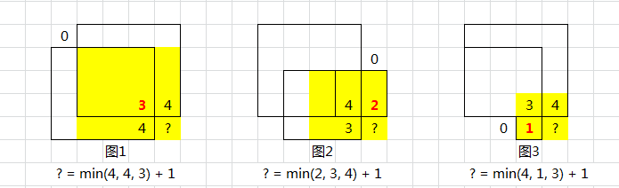
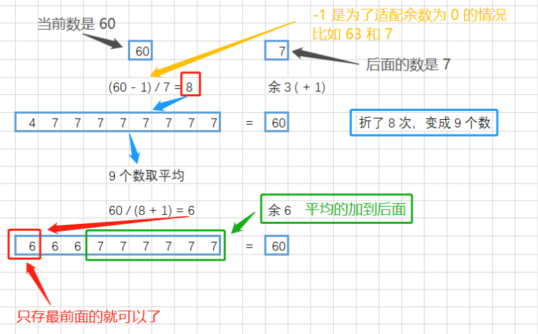

> [c可视化网站](https://visualgo.net/en)
>
> [LeetCode分类刷题-基本知识总结](https://github.com/azl397985856/leetcode)：全面性+多图直观
>
> [图解算法类型|LeetCode刷题](https://github.com/MisterBooo/LeetCodeAnimation)：动图和图解的想法值得学习！

# 动态规划

### 问题描述和状态定义

> **数字三角形问题**
>
> 有一个由非负数组成的三角形，第一行只有一个数，除了最下一行之外每个数的左下方和右下方各有一个数。
>
> 从第一行的数开始，每次可以往左下或右下走一格，直到走到最下一行，把沿途经过的数累加，如何才能使这个和最大？

将数字三角形整体向左靠拢抽象为二维数组

+ **定义状态**：有两种思路
  + 思路1：dp(i,j)表示从格子a(i,j)出发到达底部的最大路径和
  + 思路2：dp(i,j)表示从顶点开始到达格子a(i,j)的最大路径和
+ **状态转移**（对应两种思路）
  + 思路1：a(i,j)每次有两种选择，所以：dp(i,j)=a(i,j)+max{dp(i+1,j),dp(i+1,j+1)}
  + 思路2：第二种思路需考虑到达格子a(i,j)的来源，该来源存在多种情况，如最左侧仅有上方，最右侧仅有左上方，中间二者均有，较为复杂，所以不用

+ **实现方式--思路1**（**自顶向下--递归；自底向上--递推**）
  + 直接递归：重叠子问题导致重复计算，效率低下
  + **记忆化搜索**：在直接递归中增加一个记录状态的数组，每次计算状态先查表，若已计算，直接取用；否则计算后再保存状态。关键在于记录每个状态是否已计算过。
  + **递推计算**：从边界开始，设计合理的计算顺序（每个状态必须要在被使用前计算出来）

| 题目名称   | 模型             | 状态定义                                                     | 类型     |
| ---------- | ---------------- | ------------------------------------------------------------ | -------- |
| 单词拆分   | **单串**空格分割 | dp(i)：**以s[i]为结尾的子串（起点固定为首字符）**能否被成功拆分 | 判定问题 |
| 单词拆分II | 单串空格分割     | path存储路径                                                 | 打印问题 |
|            |                  |                                                              |          |
|            |                  |                                                              |          |

## 单词拆分

> leetcode139单词拆分：给定一个字符串s和一个单词列表wordDict，判定s能否被空格分割成一个或若干个出现在wordDict中的单词（分割的单词可重复）。

+ 状态定义：`dp(i)=true`表示**以s[i]为结尾的子串（起点固定为首字符）**能被空格拆分成一个或若干个出现在wordDict的单词。
+ 状态转移：$dp(i)=\bigcup_{j=1}^{i-1} (dp(j) \&\&wordDict.has(s[j+1...i]))$；$dp(0)=true$。
+ 实现方式：从左到右遍历i，递推计算即可。
+ 复杂度分析：时间复杂度T(n)=O(n^2)，空间复杂度S(n)=O(n)

> leetcode140单词拆分II：在139问题基础上，要求打印出所有可能的拆分情况。

+ 在上题的基础上，增加`vector<vector<int>>path`，`path[i]`表示字符串`s[0...i]`内部存在的所有合法分割点。dp递推完成后，用dfs计算出所有路径。

> leetcode472 连接词：给定一个单词列表，求出其中所有的连接词。连接词是至少能被拆分成2个出现在单词列表中的单词。

+ 在用dp单词拆分基础上，增加一个判断，即当前词是否至少能被拆分成2分单词。T(n)=O(n*m^2)，n为单词总个数，m为单词平均长度。

对于单词的查询，可用`unordered_set`，也可用**前缀树Trie**，加速查询。

#### 启发

+ dp问题特征
  + 暴力求解复杂度极高
  + 可以分成独立子问题
+ 单串模型-状态定义
  + 单指针：以...为开始/结尾，对应的头/尾固定/浮动
  + 双指针：以i，j分别为首尾
+ 求解思路
  + 简化问题，**先转换为判定性问题**，再使用标记，打印路径

## 子串子序列

### 判定类问题

#### 子序列判定

> 判定字符串s1是否为字符串s2的子序列。（假设s1和s2长度分别为m,n）

+ 暴力枚举：枚举s2所有的子集，O(2^n)
+ 双指针：指针i和j分别指向字符串s1和s2，若s1[i]=s2[j]，i++,j++;否则j++。T(n)=O(m+n)

> 变体：当有k个字符串s1需要判定时，可用二分查找优化

+ 双指针：若用双指针，每个子序列判定均需O(n)，所以T(n)=O(mn)
+ **二分查找**：先预处理O(n)，之后每次判定仅需logn，所以T(n)=O(mlogn)
  + 预处理：设置哈希表，按**顺序记录**每个字符的出现位置
  + 判定：对于每个字符，可用左侧边界二分查找（upper_bound)

#### 子串判定

> 判定字符串s1是否为字符串s2的子串。（假设s1和s2长度分别为m,n）

+ 暴力枚举：枚举s2所有可能开头，再遍历s1。T(n)=O(m*n)
+ [线性时间](https://blog.csdn.net/v_july_v/article/details/7041827#)：通过巧妙移动，避免重复计算
  + KMP（next数组）[参考](https://blog.csdn.net/starstar1992/article/details/54913261)
  + BM
  + **Sunday**（简单效率高）
    + 若当前字符不匹配，查看s2匹配文本中最后一个字符后的第一个字符ch
      + 若ch不出现在s1中，将s1向后移动`s1长度+1`位
      + 否则，移动位数=s1末尾字符到最近的ch的距离+1

> [Leetcode28. 实现 strStr()](https://leetcode-cn.com/problems/implement-strstr/)：给定子串text，pat，找出text中第一个pat匹配位置，若不匹配则放回-1，若pat为空返回0。

+ 调库：直接用STL的find函数
+ 手动实现
  + KMP：思路复杂，代码简单
  + Sunday：实现简单，高效T(N)=O(N)

> [Leetcode459. 重复的子字符串](https://leetcode-cn.com/problems/repeated-substring-pattern/):判断一个字符串是由子串重复构成（至少重复2次）

+ 暴力解法：枚举所有可能前缀，判断是否能构成字符串。T(n)=O(n^2)
+ **拼接查找**：将两个字符串s拼接，形成ss，去掉首尾字符，即在ss[2,...,n-1]中存在字符串s，说明s能由子串重复构成；否则不行。T(n)=O(n)

简单证明如下

```
假设s的重复子串为t（重复次数>=2）

命题1：若字符串s可由重复子串构成，那么ss[1,...,n-1]必定存在字符串s
证明1：
1.1 假设s由奇数个重复子串构成，即3,5,7,...,2n+1(n>=1)
ss包括4n+2个重复子串，去掉首尾后还存在4n个重复子串，因为s由2n+1个重复子串构成，4n>2n+1，因此满足命题1.
1.2 假设s有偶数个重复子串构成，即2,4,6,...,2n(n>=1)
ss包括4n个重复子串，去掉首尾还存在4n-2个重复子串，s有2n个重复子串构成，4n-2>=2n，因此满足命题2.

命题2：若ss[1,...,n-1]存在字符串s，那么字符串s可由重复子串构成
证明2：反证法较容易
```

> [Leetcode686. 重复叠加字符串匹配](https://leetcode-cn.com/problems/repeated-string-match/):给定字符串A和B，A重叠k次得到S（S=k个A连接），B是S的子串，求最小的k；若k不存在，输出-1。

S长度必须大于等于B的长度，B才有可能是S子串，同时，S最多比B长(A.len+B.len%A.len)。因此，分以下情况：

+ 1、初次拼接个数k=ceil(B.len/A.len)，若k个s相连包含B，直接返回k；否则进入下一步
+ 2、若k+1个s相连包含B，直接返回k+1；否则返回-1。

时间复杂度T(N)=O(N)，N为B的长度

### 多串问题

#### 最长公共子串

> [718. 最长重复子数组](https://leetcode-cn.com/problems/maximum-length-of-repeated-subarray/)：找最长公共子数组。

+ 状态定义：dp(i)(j)表示以`A[i]和A[j]`为结尾的公共子数组的最大长度。结果为`max{dp(i)(j)}`
+ 状态转移：
  + `A[i]=A[j]`:`dp(i)(j)=dp(i-1)(j-1)+1`
  + `A[i]!=A[j]`:`dp(i)(j)=0`
+ 初始值：`dp(i)(0)=dp(0)(j)=0`

### 递增序列问题

#### 最长递增子序列LIS

> [LeetCode300. 最长递增子序列](https://leetcode-cn.com/problems/longest-increasing-subsequence/)：求出数组中的最长递增子序列的长度，即t[i]<t[i+1]

+ 暴力枚举：2^n

+ 动态规划：`T(n)=O(n^2)，S(n)=O(n)`
  + 状态定义：dp(i)为A[0...i]的最长递增子序列的长度（开头固定）
  + 状态转移
  
  $$
  dp(i) =max(dp(j)+1),   \text{A[j]<A[i]&&j<i}\\dp初始化为1
  $$
  
  + 实现方式：从0...i依次遍历，dp(n-1)即是答案
  
+ 贪心+二分查找：`T(n)=O(nlogn),S(n)=O(n)`

  + 定义`tail(k)`表示**长度为k+1**的**递增子序列**的**最小结尾元素**
  + 用反证法容易证明，`tail(k)`是递增函数，有序便于二分查找
  + 算法流程：枚举数组nums元素t，若t大于tail(k)最大值，则将t插入tail尾部；否则，二分查找到第一个大于t的值，用t更新它（若t已经在tail则不操作）。

> [LeetCode673. 最长递增子序列的个数](https://leetcode-cn.com/problems/number-of-longest-increasing-subsequence/)：在leet300基础上增加最长递增子序列的**个数求解**

+ 解法一：增加哈希表cnt[i]表示长度为i的递增子序列的个数。
+ 解法二：用二维数组path记录路径，dfs求解路径个数。（比较适合**打印所有**递增子序列）

> [Leetcode334. 递增的三元子序列](https://leetcode-cn.com/problems/increasing-triplet-subsequence/)：给定数组，问是否存在递增的三元子序列，要求时空复杂度O(n)，O(1)

在LIS递归解法上优化，递归解法瓶颈在于每次需要线性扫描之前的元素，若可以将扫描过程优化为O(1)，类似哈希表，即可达到O(n)复杂度。因此引入min1，min2分别表示目前为止长度为1和2的递增子序列的末尾最小值，一旦遍历过程中出现比min2大的元素，说明存在三元序列。

> [LeetCode128. 最长连续序列](https://leetcode-cn.com/problems/longest-consecutive-sequence/)：给定一个无序数组，求最长的连续序列（排好序之后的连续序列）。比如[100,2,4,200,3,3]，最长连续序列为[2,3,4]。要求时间复杂度O(n)

+ 排序+LCIS：排序后连续的数都排在一起，问题转换为最长递增子串，可在O(n)内用双指针实现。可基于选择的排序最快也要O(nlogn)，可用桶排序/基数排序等非选择排序，时间复杂度可达O(n)
+ 哈希优化：若想不借助排序，优化到O(n)，必须空间换时间，那么哈希表必用
  + 并查集：本质是哈希表，通过路径压缩后查询时间复杂度达O(1)。由于两个元素相邻是一种等价关系，定义cnt记录每个集合的个数，所以枚举nums元素p，若p-1在nums中且p-1和p当前还不在同一个集合，那么合并二者，并累加cnt；同样处理p+1和p。在枚举期间保存最大值。
  + 哈希表：总体思想和并查集相似，均是朝左右看看，能不能相连。定义hash[i]表示**以nums[i]为左/右端点**的连续序列的**长度**，枚举nums中的元素p，若p-1存在，则连接p-1和p。同理可处理p+1和p。

#### 最长递增子串LCIS（最长连续递增子序列）

> leetcode674：求一个数组的最长递增子串，即元素间是相邻的

+ 暴力枚举：O(n^2)

+ 动态规划：`T(n)=O(n)，S(n)=O(n)`

  + 状态定义：dp(i)表示以A[i]为结尾的最长递增子串的长度（**开头可变**）
  + 状态转移：

  $$
dp(i) =
  \begin{cases} 
  dp(i-1)+1,  & \text{A[i-1]<A[i]} \\
  1, & \text{A[i-1]}\ge A[i]
  \end{cases}
  $$

  + base case：dp(0)=1

+ 双指针：T(n)=O(n)，**S(n)=O(1)**
  + 定义i和j分别指向LCIS的起止元素，ans记录最大值
  + 若A[j-1]>=A[j]，出现断层，令i=j，ans=max(ans,i-j)。
  + 指针j++

> [Leetcode3. 无重复字符的最长子串](https://leetcode-cn.com/problems/longest-substring-without-repeating-characters/):求一个数组的子串，要求子串**最长且无重复**元素。

+ 暴力法：枚举所有子串，再判重，T(n)=O(n^2)
+ 双指针+哈希表：定义指针i和j指向窗口的首尾，用哈希表标记每个元素是否在窗口中出现。若j在在窗口出现，用j-i去更新最大长度，同时移动i，直到j不出现在窗口中。`T(n)=O(n),S(O)=O(n)`
+ 动态规划思路本质与双指针类似，写起来甚至不那么直观

> LeetCode3扩展：求无重复字符的最长**子序列**

+ 该题用双指针无法实现，用动态规划比较合适
+ 状态定义：dp(i)表示**以A[i]为结尾**的**无重复字符的最长子序列**，同时增加`vector<unordered_set<int>> st`，`st(i)`表示**以A[i]为结尾的无重复字符的最长子序列**所包含的字符，用来判重使用。
+ 状态转移：和最长递增子序列类似，只需更换判断条件即可

$$
dp初始化为1\\dp(i) =max(dp(j)+1),   \text{A[i]不在st中&&j<i}
$$

> [Leetcode647. 回文子串](https://leetcode-cn.com/problems/palindromic-substrings/)：求给定字符串的回文子串个数。

+ 暴力枚举：二重循环枚举任意长度的子串，一重循环判断是否为回文串，T(n)=O(n^3),S(n)=O(n)
+ 动态规划：T(n)=O(n^2)，S(n)=O(n^2)（优化后S(n)=O(n)）
  + 状态定义：dp(i,j)=true表示s[i...j]是回文子串
  + 状态转移：对回文串长度分奇偶讨论。假设回文串s长度为偶数，那么dp(i,j)有三种可能来源，即dp(i+1,j)，dp(i+1,j-1),dp(i,j-1)，然而仅增加一位的转移方式是不存在的，例如给回文串`abba`增加一位字符，使它成为奇数回文串，是不存在的。但是存在一种特例，即回文串所有字符均相同，例如`aaa`，可以通过增加一位完成状态转移。因此存在以下两种情况
    + 子串长度为2&&s[i]=s[j]：dp(i,j)=true
    + 子串长度大于2&&dp(i+1,j-1)=true&&s[i]=s[j]:dp(i,j)=true
  + 遍历方式：二维数组行必须从下往上，列从左到右
  + 空间优化：用一位dp数组，遍历方式框架与未优化相同，但是需要**逆序遍历列**，正序的话会覆盖下一个状态所需的值。
+ [manacher马拉车算法](https://ethsonliu.com/2018/04/manacher.html)：T(n)=O(n)

> [Leetcode5. 最长回文子串](https://leetcode-cn.com/problems/longest-palindromic-substring/):输出最长的回文子串。

在回文子串的DP解法上稍做修改，将状态dp(i,j)定义为s[i...j]的最长回文子串长度。转移方程如下
$$
dp(i,j) =\begin{cases} 
	1,  & \text{i=j} 
	\\2, & \text{i+1=j&&s[i]=s[j]}
	\\ dp(i+1,j-1)+2, &i<j 且 s[i]=s[j]且dp(i+1,j-1)!=0
	\end{cases}
$$
时空复杂度分别为O(n^2),O(n)

> [Leetcode516. 最长回文子序列](https://leetcode-cn.com/problems/longest-palindromic-subsequence/):求最长的回文子序列长度。

+ 状态定义：dp(i,j)表示s[i...j]的最长回文子序列长度。
+ 转移方程：

$$
dp(i,j) =\begin{cases}     1,  & \text{i=j}         
\\ dp(i+1,j-1)+2, &\text{i<j 且 s[i]=s[j]}    
\\max\{dp(i+1,j),dp(i,j-1)\}, & \text{i<j且s[i]!=s[j]}\end{cases}
$$

+ 遍历方式：保证计算当前位置时，它的左，下，左下方均已计算出。因此可按行逆序，按列正序遍历。dp(1,n)为最大值。

> [Leetcode730. 统计不同回文子序列](https://leetcode-cn.com/problems/count-different-palindromic-subsequences/)：计算不同的回文子序列个数，不可重复计算相同回文子序列

+ dp+哈希：用最长回文子序列的dp算法计算出所有的回文子序列，用哈希表unordered_set去重，但是空间复杂度过高。
+ 重新定义dp状态：T(n)=O(n^2),S(n)=O(n^2)，空间可用滚动数组优化到O(n)
  + 状态定义：dp(i,j)表示s[i...j]的不同回文子序列个数。
  + 状态转移：
    + if s[i]=s[j] ：dp(i,j)=dp(i+1,j)+dp(i,j-1)-dp(i+1,j-1)，即求并集后减去交集
    + else 定义left[i]为s[i+1...j-1]中从左到右的第一个s[i]下标，right[j]表示s[i+1,j-1]中从右到左的第一个s[j]下标。
      + left[i]>right[j]：即s[i+1...j-1]中不存在s[i]，那么dp(i,j)=2*dp(i+1,j-1)+2（×2表示dp(i+1,j-1)任何一个子序列都可以和最外层的s[i]组合成新序列，+2表示单个s[i]和一对s[i]）
      + left[i]=right[j]：即s[i+1...j-1]中仅存在一个s[i]，所以dp(i,j)=2*dp(i+1,j-1)+1（+1表示仅增加了一对s[i]的情况）
      + left[i]<right[j]：即s[i+1...j-1]中存在一个被s[i]包裹的子序列，因此可用做差法，dp(i,j)=2*dp(i+1,j-1)-dp(left[i]+1,right[j]-1)（需要扣除被s[i]包裹的内部的重复子序列）
  + 实现方式：逆序遍历行，正序遍历列
  + 空间优化：滚动数组实现

+ **注意点**：**具体实现时会出现负数？？？**

## 背包九讲

> + 01背包问题（选/不选）
> + 完全背包问题（选无限次）
> + 多重背包问题（每个物品有特定选择上限）
> + 混合背包问题
> + 二维费用背包问题（体积+重量）
> + 分组背包问题
> + 背包问题求方案数（最大/最小）
> + 背包问题的方案
> + 有依赖的背包问题（拓扑）

### 01背包问题

+ 状态定义：dp(i,j)表示前i件物品，总体积是j的情况下，最大值是多少。
+ 状态转移：每种物品选或不选

### 完全背包问题

> [面试题 08.11. 硬币](https://leetcode-cn.com/problems/coin-lcci/):4中面值1,5,10,25，无限个数，求和为n的组合种数。

+ 完全背包问题，通过公式转换，变成类似01背包问题

> [LeetCode322. 零钱兑换](https://leetcode-cn.com/problems/coin-change/)：给定若干个面值，每个面值可选无限次，求组合为n的最少硬币数

本质是完全背包问题，经过时间优化后，再通过写成一维数组的降低时间复杂度，变成如下的动规

```cpp
// 完全背包
状态定义：dp(i,n)表示前i个面值恰好组合成总和为n时，所需硬币的最少个数
转移方程：dp(i,n)=min{dp(i-1,n-k*c[i])+k},0<=k<floor(n/c[i])
初始化：dp(0,0)=0
时间复杂度：T(n)=O(n*v*(n/c[i]))
// 带入优化
将n=n-c[i]带入原方程，消去两个方程相同部分，得到如下式子
dp(i,n)=min(dp(i-1,n)+1,dp(i,n-c[i])+1)
时间复杂度:T(n)=O(n*v)
// 空间优化-一维数组
n从小到大枚举:dp(n)=min{dp(n)+1,dp(n-c[i])+1}
// 完全背包经过时间和空间优化过后得结果，等价于如下定义的状态及转移方程
dp(i)表示总和为i，需要的最少硬币数
dp(i)=min{dp(i-coins[j])+1}
dp(0)=0
```

+ BFS：初始结点为N，终止结点为0，每个结点均有`-c[i]`的边，找到起点到终点的最短路即满足要求。

> [LeetCode983. 最低票价](https://leetcode-cn.com/problems/minimum-cost-for-tickets/)：可连续旅行{1,7,30}天的票价格为costs[3]，days[n]中存放n个必须旅游的天数，求满足要求的最小花费。

本题难点在于**如何处理离散的日期时间，可用1填充中间空白。**

+ 状态定义：dp(i)表示第i天为最后的旅游日期，对应的最小花费。
+ 状态转移：对于第i天，分两种情况讨论
  + 不旅行：`dp(i)=dp(i-1)`，直接用前一天的最小化费，毕竟不需要旅游，带着就行，不用买票
  + 旅行：`dp(i)=min{dp[i-1]+costs[0],dp[i-7]+costs[1],dp[i-30]+costs[2]}`，分别考虑哪天买最省钱，因为第i天是最后需要旅行的一天，避免之后还能旅行造成浪费，因此，假设第i天恰好用完买的票。如第i天恰好用完当天买的1天票；恰好用完6天前买的7天票；恰好用完29天前买的30天票
+ 初始值：`dp[0]=0`，第0天不用买票

### 多重背包问题

使用二进制方法拆分物品个数，转换为01背包问题

求模分组+单调队列维护长度为k区间内的最大值

### 四个易混计数问题-排列组合

[LeetCode377. 组合总和 Ⅳ](https://leetcode-cn.com/problems/combination-sum-iv/)：组合结果为**排列数**，比如(1,2)和(2,1)算两个。

[LeetCode518. 零钱兑换 II](https://leetcode-cn.com/problems/coin-change-2/)|[面试题 08.11. 硬币](https://leetcode-cn.com/problems/coin-lcci/)|[LeetCode70. 爬楼梯](https://leetcode-cn.com/problems/climbing-stairs/)：本质一样，组合结果为**组合数**，比如（1,2）和（2,1）算1个。

考虑动规解法的两个问题，可从物理意义角度考虑：

+ 采用二维dp时，状态定义是什么？对换内外层循环是否影响结果？
+ 采用一维dp时，状态定义是什么？对换内外层循环是否影响结果？

[参考1-零钱兑换II和爬楼梯问题到底有什么不同？](https://leetcode-cn.com/problems/coin-change-2/solution/ling-qian-dui-huan-iihe-pa-lou-ti-wen-ti-dao-di-yo/)；

## 打家劫舍系列

>  [198. 打家劫舍](https://leetcode-cn.com/problems/house-robber/)

# 贪心算法

如何区分贪心和动态规划？

贪心问题特点:

+ 通常和**排序**相关
+ 写起来简单，想起来难，难以证明正确性

> [Leetcode1403. 非递增顺序的最小子序列](https://leetcode-cn.com/problems/minimum-subsequence-in-non-increasing-order/):将数组分为两个序列A和B，要求A满足以下约束：
>
> sum(A)>sum(B)
>
> len(A)最小（多个最小时取sum(A)最大者）

**排序+贪心**：假设数组元素总和为sum。将数组按非递增顺序排列，从头开始累加元素到t，一旦出现t>sum-t，当前累加到的元素即为所求A序列最后一个元素。

**策略证明**：因为每次都取剩余序列最大值，因此，会以最快速度满足sum(A)>sum(B)且len(A)最短。又因为数组非递增排序，所以相同长度下，sum(A)大者一定先被选择。

> [1405. 最长快乐字符串](https://leetcode-cn.com/problems/longest-happy-string/):指定a，b，c三种字符的最大个数，用这些字符构造一个最长的字符串，要求字符串不能有连续的aaa、bbb、ccc。

**排序+贪心**：建立二元组（字符，可用次数），按照**可用次数**非递增排序，若字符串s最后两个字符不等，则将可用次数最多的字符加入s末尾；若s末尾相同，则选择时需排除末尾字符（避免三个相同字符相连）

> [头条笔试题-折木棍](https://leetcode-cn.com/circle/discuss/eXOcnD/)：n个长度已知的木棍排列你面前，每次可将任意一个木棍折成两部分，然后一左一右地放在原地（原来左侧有木棍，折断后必须也在它左侧；右侧同理）。现要求木棍长度单调不减，求最少折断次数。（同一根木棍可反复折断）

**单调栈+贪心**：

+ 逆序遍历数组，维护一个**单调递增栈**。
+ 在原本要出栈的时刻，将即将入栈的用最少次数将木棍折成尽可能平均的小木棍。（**平均折法**）
+ 将最小木棍长度入栈即可。

> [LeeCode55. 跳跃游戏](https://leetcode-cn.com/problems/jump-game/):给定一个数组，a[i]表示从第i个位置能向右跳的最大长度，问能否从起点到达终点？

+ DFS：暴力搜索所有可能性，超时
+ DP优化：给DFS加上备忘录，进行优化，但正序遍历会超时，逆序才能勉强通过测试，`T(n)=O(n^2)，S(n)=O(n)`
+ **贪心算法**：`T(n)=O(n),S(n)=O(1)`
  + 如果一个**起跳点i**最远到达距离为3，那么他后面三个点都可以作为起跳点（因为第i个点可选择跳跃距离1,2,3）。
  + 维护一个当前能达到的最远距离，遍历所有可能的**起跳点**，不断更新最远距离。
  + 若最远距离超过终点，就成功了。

> [LeetCode45. 跳跃游戏 II](https://leetcode-cn.com/problems/jump-game-ii/)：求出最少的跳跃次数

+ BFS：当成最短路来做，在当前点可到达的距离内点都是相邻点。O(n)=元素值总和
+ DP：dp(i)的从起点到第i个点的最少跳跃次数。T(n)=O(n^2)，S(n)=O(n)
+ **贪心算法**：从头枚举每个点，维护当前可达的最远距离d，若枚举到d，那么更新最远距离，同时计数+1

> [LeetCode11. 盛最多水的容器](https://leetcode-cn.com/problems/container-with-most-water/)：给定n个元素的数组，任意两个元素作为高，距离作为宽，可构成一个盛水容器，求容器最大值？

+ **贪心法+双指针夹逼-小者先行**：定义双指针i和j分别指向首尾，元素小者先移动，记录面积最大值。当i和j相等时结束遍历。

**贪心证明**

```pascal
假设S(i,j)表示i和j构成的面积，则S(i,j)=min(A[i],A[j])*(j-i)
假设A[i]<=A[j]，只需证明i向右移动后不会错过最大面积。
若i向右移动1位，等价于丢失j-i-1个状态，即S(i,i+1),S(i,i+2),...,S(i,j-1)。用S(i,k)表示这j-i-1个状态
只需证明以上j-i+1个状态的面积均小于等于S(i,j)即可（丢的都是不可能成为最大值的状态）
+ 宽度：W(S(i,k))<W(S(i,j)),可看成j向内移动
+ 高度：H(S(i,k))<=H(S(i,j)),因为A[i]是较短的高度，因此S(i,k)中高度必然<=A[i]
综上，S(i,k)<=S(i,j)，因此将小者移动后，必定只会丢弃无用状态（不可能成为最大的面积）
```

> [LeecCode5373. 和为 K 的最少斐波那契数字数目](https://leetcode-cn.com/problems/find-the-minimum-number-of-fibonacci-numbers-whose-sum-is-k/)：用最少的斐波那契数字的和表示整数K。

+ 贪心策略：打表计算出<=K的所有斐波那契数，从大到小每次选取<=K的数，再用K减去被选的数，当K=0时停止循环。

**贪心证明**

+ **判定性**：保证K一定能由斐波那契数组成，数据归纳法可证明

+ **最小性**：什么样的组合能最短？

  + **相邻合并**：2个相邻的数可合并为二者的和，长度-1，因为`f(n)=f(n-1)+f(n-2)`。满足该条件的组合必定是间隔出现，但是又可能重现重复的值，这对于编程很不利。
  + **重值转换**：两个相同的值一定可以转换为两个不同的值，因为`f(n)+f(n)=f(n)+f(n-1)+f(n-2)=f(n+1)+f(n-2)`，一个比f(n)大，一个更小，这是等价转换，不会减小组合长度，但是会带来一个很好的性质，即单调递增性质。

  因此，重复使用以上两个操作后的组合数列，必定是一个**无相邻值的递增数列**，由于**数列均为正数且和为K**，因此值越大个数自然越小。

# 数据结构

## 数组

### 二维数组遍历方法

通常思路

+ 直接模拟：按照要求直接模拟（复杂，效率低，边界多，易错）
+ 图遍历BFS/DFS：不容易想到，如【对角线遍历】可看成旋转45度的树；【螺旋遍历】看成dfs图（实现简单）
+ 拆分组合：不容易想到，如把【螺旋矩阵】拆分为按圈打印（实现复杂度中等，注意边界）

题型：

+ 对角线遍历
+ 螺旋遍历
+ N型打印；[6. Z 字形变换](https://leetcode-cn.com/problems/zigzag-conversion/)：找到规律最重要

> [LeetCode5394. 对角线遍历 II](https://leetcode-cn.com/problems/diagonal-traverse-ii/)：沿着二维数组的对角线进行遍历。每一行长度不一定相同。

把数组看成由【二维笛卡尔坐标系】的x轴沿着原点旋转90°得到，那么题目要求的对角线对应方程为$y=-x+b$，将`x=i,y=j`带入得到$i+j=b$，这是位于同一斜线的点坐标关系。若是换一个角度的斜线，那么关系变为`j-i=b`。

+ 暴力模拟：直接模拟遍历`[1,m+n]`条斜线，时间复杂度为`O(n^2)`，很遗憾超时了。

关键在于如何快速利用已知条件跳过空白的元素。于是开发出如下思路

+ **排序**：定义结构体存储每个点的横纵坐标和对应的值，进行分级排序，排序规则如下：
  + i+j越小，排越前面，因为从左上角到右下角的斜线的b是递增的。
  + 若i+j相同，则取i较大者，因为更靠近左下角。
+ **聚类**：利用每条线上的点的i+j相同，遍历所有元素，同过聚类将同一条线上的点聚合一起。然后保证内部有序性（从最后一行开始遍历即可保证内部有序性），最后依次拼接所有线即可。
+ **BFS**：该数组可看成一颗绕着根结点逆时针旋转45°的普通树，因此对其进行层次遍历，即可实现。

> [54. 螺旋矩阵](https://leetcode-cn.com/problems/spiral-matrix/)：从外向里顺时针遍历

+ 思路1：**DFS+方向向量**（简单易操作）
+ 思路2：按圈打印，每个圈都是一个矩形，从最外层到最内层（边界条件多）

## 链表

[LeetCode链表总结](https://xiaoneng.blog.csdn.net/article/details/104007259)

> [LeetCode206. 反转链表](https://leetcode-cn.com/problems/reverse-linked-list/):用迭代法和递归法反转单链表

+ **迭代法**：定义三个指针`p1,p2,p3	`，其中p2表示当前结点，p1为p2前驱（反转需要），p3为p2后继（避免断链），他们初始值依次为`NULL,head,p2->next`，遍历链表，不断更新三个指针，p2为NULL时停止遍历。p1为反转链表头结点。时空复杂度为`O(n),O(1)`。
+ **递归法**：`ListNode* rev(ListNode* head)`表示反转头结点为head的链表，并返回反转后的头结点。递归关键问题在于如何将已反转的链表和当前结点连接起来，可以直接从头遍历到尾部，然后连接当前结点，不过这里需要多余的O(n)查找尾部时间。
+ **递归优化**：可以注意到，`head->next`就是已反转链表的尾节点，因此`head->next->next=head`就可实现尾部与新节点的连接，无需查找时间。因此时空复杂度为`O(n),O(1)`

> [LeetCode92. 反转链表 II](https://leetcode-cn.com/problems/reverse-linked-list-ii/)：迭代法和递归法反转链表区间[l,r]

本题是反转链表的通用形式，存在以下特例

+ `l=1,r=n`就是反转整个结点
+ `1=1,r=k`就是反转前k个结点
+ `l=n-k+1,r=n`就是反转后k个结点

思路比较简单，可从反转整个链表推导而来，只需记录`第l-1，l和r，r+1`这4个结点即可轻松反转拼接。`l和r`之间的节点正常反转即可，然后把反转后的头接到`l-1`后，把`r+1`接到r后。

若想用递归也可从整个链表反转开始层层推导而来，需要用全局变量记录尾结点。

> [25. K 个一组翻转链表](https://leetcode-cn.com/problems/reverse-nodes-in-k-group/)：K个一组翻转链表，最后一组若不足K个，则不翻转。

先写框架，自上而下的分解问题。

+ 大框架：链表分组，翻转链表
+ 具体实现：翻转链表，返回头结点和尾节点

简化题：[24. 两两交换链表中的节点](https://leetcode-cn.com/problems/swap-nodes-in-pairs/)

## 栈和队列

### 普通栈

普通栈是一种后入先出的结构。

**有关逆序必用栈，链表中头插法也是逆序的思路**

> [155. 最小栈](https://leetcode-cn.com/problems/min-stack/)：实现栈的push，pop，top，外加最小值getMin操作。

关键在于如何在常数时间内实现获取最小值操作。可定义一个辅助栈，栈顶存储当前最小值。操作如下：

+ 入栈时：若x大于栈顶，舍弃不操作；否则直接压栈。
+ 出栈时：若x等于栈顶，弹栈；否则不操作。

括号匹配：[20. 有效的括号](https://leetcode-cn.com/problems/valid-parentheses/)：多类型括号同时匹配

> [22. 括号生成](https://leetcode-cn.com/problems/generate-parentheses/)：给定n对括号，生成所有合法的括号排列。

+ 一开始用编译原理的递归文法

```
S->空|(S)|()S|S()
```

+ 但是漏了类似`(())(())`的情况，于是改进如下：

```
S->空|SS|(S)
```

官方题解中利用`(A)B`的方式进行推导，其实和这个异曲同工，只是无法推出空罢了，但不会重复，类似动态规划。

也可以直接使用回溯法，每次增加一个左括号/右括号，注意剪枝条件：

+ 左括号个数-右括号个数>剩余可用括号个数
+ 右括号个数>左括号个数

计算器相关

> [224. 基本计算器](https://leetcode-cn.com/problems/basic-calculator/):+-()空格

设置符号栈，数值栈

符号：

+  (，+，- 直接于压入符号栈

+ ) 弹栈，将弹出的符号与数值栈两个顶部数据进行运算，结果压入数值栈中。符号栈弹出第一个(结束

+ **若（弹出后，符号栈顶为+/-，需再次运算**（优先级处理，如 `(1)-(9)+(10)`

+ \# 作为末尾标志，弹出所有值两两运算

  数值：

+ 符号栈顶为 (，直接压入数值

+ 栈顶为 +, -, 弹出栈顶与当前数值计算后再压入数值栈

### 普通队列

普通队列是一种先入先出的结构。

### 单调栈

栈中元素保持有序性，根据出栈的顺序分为两类：

+ 递增栈：出栈为递增顺序
+ 递减栈：出栈为递减顺序

#### 实现模板

比如**递增栈**的**通用思路**如下：

```cpp
// 假设给定数组A[1...n]，stk为普通栈
令A[n+1]=maxn // 给栈尾部增加一个超大值，保证任何数都可以弹出来
for (i : 1~n-1) { // 遍历数组（遍历顺序可灵活选用）
	if (栈空 || stk.top()>A[i]) stk.push(A[i]); // 这里的>可根据需要改为>=；同时，压入的元素也不一定为数组元素，也可以为其它数据，如下标i。
	else { // 将小于A[i]的元素依次弹出，并增加操作
		while (stk.top() <= A[i]) {
			stk.pop();
			// 这里进行需要的业务操作
		}
		stk.push(A[i]); // 将当前数据压入
	}
}
```

**简化模板如下**

```cpp
// 假设给定数组A[1...n]，stk为普通栈
令A[n+1]=maxn // 给栈尾部增加一个超大值，保证任何数都可以弹出来
for (i : 1~n-1) { // 遍历数组（遍历顺序可灵活选用）
    while (!stk.empty() && stk.top()<A[i]) {// 这里的>可根据需要改为>=；同时，压入的元素也不一定为数组元素，也可以为其它数据，如下标i。
        stk.pop();
		// 这里进行需要的业务操作
    }
    stk.push(A[i]); // 根据需求选择相应压入数据
}
```

注意有几个必须考虑的点（这几个点是可变的，因此不同题目需要改变以下三个值）：

+ **数组遍历顺序**：正序还是逆序？
+ **压栈的判断条件**：`>,<,=,>=,<=`？

+ **压栈的数据类型**：把什么数据压入栈中？数组元素？下标？或是其它？

#### 常见题型

+ 在序列a中，求**a[i]之后/之前**第一个**大于/小于**a[i]的元素。也可求他们之间距离。

> 字节跳动笔试-站得高看得远：给定n个给定高度的房子排成一排，第i个房子能看到的房子总数=左侧高度不大于a[i]的房子直到出现比a[i]高的房子+右侧高度不大于a[i]的房子，直到出现比a[i]高的房子。求出每个房子所能看到的房子总数？

- 暴力枚举：二重循环枚举出每个房子的可见房子总数，时间复杂度O(n^2)
- 单调栈：用两个单调栈分别实现到右侧和左侧的最远距离，累加二者对应位置值即是答案。时间复杂度O(n)，空间复杂度O(n)
  - 左侧最远：逆序遍历数组；压栈条件为`栈空或栈顶>=A[i]`；压栈数据为**元素下标**
  - 右侧最远：正序遍历数组；压栈条件为`栈空或栈顶>=A[i]`；压栈数据为**元素下标**
- 也可以用一个单调栈实现，其实是两个单调栈的优化合并版本。T(n)=O(n)，S(n)=O(1)

> [Leetcode84. 柱状图中最大的矩形](https://leetcode-cn.com/problems/largest-rectangle-in-histogram/)：给定一序列矩形高度（宽度均为1），问能构成最大的矩形面积。

+ **暴力枚举**：用O(n^2)的时间枚举所有长度，再用O(n)时间找到区间最小高度，因此T(n)=O(n^3)
+ **暴力优化**：区间最小高度可用一个递推变量不断更新，`mh=min(mh,h[i])，mh为1~i-1区间最小值，h[i]为当前高度`，时间复杂度O(1)。因此总体时间复杂度为O(n^2)
+ **单调栈**：假设f(i)表示以h[i]为矩形的高（区间内最低点），它能构成的最大面积。从图形上解释，即以i为中心，向两边能延展的最大距离为宽，a[i]为高的矩形面积。那么整体最大矩形面积为`max{f(i)},0<i<n`，那么问题就在于如何求解`f(i)`，因此**定义`l(i)和r(i)`分别表示从i开始向左侧/右侧找到的第一个小于a[i]的元素下标**。这是单调栈的标准应用。有两种实现方式，注意其中均用到**哨兵**技巧，简化边界处理。
  + 两个单调栈：这是最直观的解法，分别使用单调栈求解l，r数组，然后利用二者求解面积。T(n)=O(n)，S(n)=O(n)
  + 一个单调栈：不容易想到，实则为两个单调栈的一种逻辑合并写法，只需改变出栈处理部分，左边界即为紧邻栈顶的第一个元素。T(n)=O(n),**S(n)=O(1)**

> [Leetcode85. 最大矩形](https://leetcode-cn.com/problems/maximal-rectangle/)：给定M*N的二维矩阵，由0和1构成，求由1构成的最大矩形面积。

+ 暴力法：用O(MN)时间枚举所有矩形左上角顶点，用O(MN)时间枚举矩形的所有的长宽，用O(MN)时间枚举给定左上顶点和长宽的矩形的所有点。总的时间复杂度为O(M^3N^3)。
+ **单调栈**：对于每一行，计算在当前列中，以当前行的元素为结尾的连续1的个数，因此问题转换为**LC84柱状图最大矩形**问题。也就是将底边不固定转换为底边固定的直方图，时间复杂度为O(MN)，空间复杂度为O(M)。

> [Leetcode221. 最大正方形](https://leetcode-cn.com/problems/maximal-square/)：在**LC85最大矩形**基础上，要求矩形为正方形。

+ **单调栈**：在**LC85最大矩形**的求解基础上，增加正方形的约束，即计算面积时取长宽中较短的一边作为边长。时间复杂度为O(MN)，空间复杂度O(M)

+ **动态规划**

  + 状态定义：dp(i,j)表示**正方形右下角是a(i,j)**的**最大边长**。
  + 状态转移：`if (a[i,j]=='1') dp(i,j)=min(dp(i-1,j),dp(i,j-1),dp(i-1,j-1))+1`。看起来有些奇妙，实则遵从短板效应，取最小者，见下图三种情况。

  

  
  + 实现方式：行从左到右遍历，列从上到下遍历；可采用滚动数组优化。

> [**Leetcode42. 接雨水**](https://leetcode-cn.com/problems/trapping-rain-water/)：可看成给定一个直方图，问能装的水总和？

+ **单调栈**：顺序遍历数组，维护一个单调递减栈，出栈时的处理比较特别，运用分解的思想（类似**分层求和累加**），依次累加面积。时间复杂度为O(n)，空间复杂度O(n)
+ 双指针+面积做差
+ 找到最大高度，分左右按列求和

> [739. 每日温度](https://leetcode-cn.com/problems/daily-temperatures/)

枚举数组所有元素，找到第一个比当前值大的元素下标

单调递减栈（栈底到栈顶），压入 `(下标，元素)`

### 单调队列

主要用于优化，能在O(n)时间内求出所有长度为K的区间最值。

**模板**

```cpp
// 假设原数组A[1...n]，维护长度为k的区间最值，以下为最大值模板
deque<int> q; // 双端队列；队首始终为区间最值
for (i : 1~n) {
    if (i > k && q.front() == A[i-k]) q.pop_front(); // 长度大于k&&队首元素=被淘汰元素
    while (!q.empty() && q.back() < A[i]) q.pop_back(); // 当前值大于队尾，反复弹出队尾
    q.push_back(A[i]); // 将元素压入队尾
}
```

#### 应用题

> [LeetCode5180. 带限制的子序列和](https://leetcode-cn.com/problems/constrained-subset-sum/)：在原有子序列和最大基础上，要求任意两个相邻的元素下标差值不大于k。

+ 直接用动态规划需O(n^2)导致超时，因此用单调队列维护区间最小值，时间复杂度降为O(n)。

> [239. 滑动窗口最大值](https://leetcode-cn.com/problems/sliding-window-maximum/)：找出长度为K的区间最大值。

+ 双端队列维护单调队列经典题目。

### 队列和栈互相实现


## 树

### 二/N叉树遍历

+ 前中后三种递归和迭代实现（dfs/栈）
  + 根到每个叶子结点的路径
  + 中序遍历为升序排列：[98. 验证二叉搜索树](https://leetcode-cn.com/problems/validate-binary-search-tree/)；[230. 二叉搜索树中第K小的元素](https://leetcode-cn.com/problems/kth-smallest-element-in-a-bst/);[783. 二叉搜索树节点最小距离](https://leetcode-cn.com/problems/minimum-distance-between-bst-nodes/)
  + 迭代实现中序遍历：[94. 二叉树的中序遍历](https://leetcode-cn.com/problems/binary-tree-inorder-traversal/)；[173. 二叉搜索树迭代器](https://leetcode-cn.com/problems/binary-search-tree-iterator/)：**中序迭代拆分步骤**
  + 迭代实现前序遍历：[144. 二叉树的前序遍历](https://leetcode-cn.com/problems/binary-tree-preorder-traversal/)：和中序迭代用一个模板，均借用递归思想编写
  + 迭代实现后序遍历：[145. 二叉树的后序遍历](https://leetcode-cn.com/problems/binary-tree-postorder-traversal/)：【根右左】与【左右根】结果逆序，于是转为求解【根右左】，类似前序迭代法。因此可以统一三种迭代遍历方式。
  + 后序遍历变种：
    + [5406. 收集树上所有苹果的最少时间](https://leetcode-cn.com/problems/minimum-time-to-collect-all-apples-in-a-tree/)：计算根到所有苹果结点的最小步数，后序遍历，统计相应结点步数即可。
    + [236. 二叉树的最近公共祖先](https://leetcode-cn.com/problems/lowest-common-ancestor-of-a-binary-tree/)：根据每个结点rt的左右子树返回值判断，左右均为空，说明该结点子树中不存在p和q；左右均不空，说明rt即为最近公共祖先；左空右不空，可能pq均在右子树，进入右子树查找，或者rt是其中p和q的一个点，rt即为所找结点。左不空右空，情况类似第三种。还可以找到根节点到两点的路径，转换为链表/数组的第一个交点问题。
  + 中序+前序/后序建树
    + [105. 从前序与中序遍历序列构造二叉树](https://leetcode-cn.com/problems/construct-binary-tree-from-preorder-and-inorder-traversal/)：前后序确定根，中序划分左右子树个数。注意结点值是否无重复，若重复，可用map存储结点指针。（**本质还是后序遍历处理**）
    + [106. 从中序与后序遍历序列构造二叉树](https://leetcode-cn.com/problems/construct-binary-tree-from-inorder-and-postorder-traversal/):前序和中序改改即可。
+ 层次遍历（bfs）
  + 分层遍历保存结果：
    + [102. 二叉树的层序遍历](https://leetcode-cn.com/problems/binary-tree-level-order-traversal/)；标记层次或利用队列大小均可。
    + [107. 二叉树的层次遍历 II](https://leetcode-cn.com/problems/binary-tree-level-order-traversal-ii/)：倒着分层遍历（从上到下的分层遍历结果逆序）。
    + [429. N叉树的层序遍历](https://leetcode-cn.com/problems/n-ary-tree-level-order-traversal/)：二叉树访问孩子部分改动即可。
    + [637. 二叉树的层平均值](https://leetcode-cn.com/problems/average-of-levels-in-binary-tree/)：分层累加和。
    + [993. 二叉树的堂兄弟节点](https://leetcode-cn.com/problems/cousins-in-binary-tree/)：层次遍历判断层次是否相同；设置标记tx和ty，判断两点父结点是否相同
  + 最大最小深度：
    + [111. 二叉树的最小深度](https://leetcode-cn.com/problems/minimum-depth-of-binary-tree/)：分层遍历，找到第一个叶子节点返回即可。
    + [104. 二叉树的最大深度](https://leetcode-cn.com/problems/maximum-depth-of-binary-tree/):层次遍历记录层高，返回最后的层高。
    + [559. N叉树的最大深度](https://leetcode-cn.com/problems/maximum-depth-of-n-ary-tree/)：将二叉树最大深度中的子结点访问方式改为for循环即可。
+ 蛇形遍历（双端队列）：[103. 二叉树的锯齿形层次遍历](https://leetcode-cn.com/problems/binary-tree-zigzag-level-order-traversal/)；
  + 关键问题：每层结点的访问顺序；每个结点的子结点的访问顺序
  + 奇数层：从左到右（pop_front)；左子树，右子树（push_back）
  + 偶数层：从右到左（pop_back)；右子树，左子树（push_front）
+ 利用额外的next指针实现O(1)的队列层次遍历功能。（本质是两个单链表操作）
+ 二叉树周长：`无叶子结点层数*2+叶子结点个数`。分层遍历即可。
+ 视图问题
  + 左/右视图：从左向右/从右向左层次遍历，队首即为对应的结点。
  + 仰视图：叶子结点
  + 俯视图：分别计算左右到根的水平距离，左子树后序；右子树先序。
+ 最近公共祖先问题：两个结点最近的公共祖先，可计算出从根节点到两点的路径，然后问题转换为两个单向链表的第一个交点问题。
+ 兄弟问题？？
+ 子树问题
  + 子树遍历[508. 出现次数最多的子树元素和](https://leetcode-cn.com/problems/most-frequent-subtree-sum/)：遍历每棵子树，求各自和，统计和出现频率。
  + 子树判断/两棵相同树判定：[572. 另一个树的子树](https://leetcode-cn.com/problems/subtree-of-another-tree/)：判断t是否为s的一颗子树。类似问题，判断t是否为s的一个部分。
  + **镜像树**：[101. 对称二叉树](https://leetcode-cn.com/problems/symmetric-tree/)：**BFS**和序列化解法值得思考
+ 序列化问题：
  + [297. 二叉树的序列化与反序列化](https://leetcode-cn.com/problems/serialize-and-deserialize-binary-tree/)：前序括号/null标记；层次遍历

> [LeetCode199. 二叉树的右视图](https://leetcode-cn.com/problems/binary-tree-right-side-view/)：打印一个二叉树的右视图

+ **dfs/栈**：以【根->右子树->左子树】的顺序访问二叉树，定义`maxd=0`记录当前已访问过的最大深度，深度遍历过程中发现当前深度大于`maxd`时，将结点保存并更新maxd为当前深度。
+ **bfs**：从左往右层次遍历，当前层最后一个结点必定是最右侧结点。或者**从右往左遍历**，当前层第一个结点必为最右侧结点。

> [LeetCode116. 填充每个节点的下一个右侧节点指针](https://leetcode-cn.com/problems/populating-next-right-pointers-in-each-node/)：给定完美二叉树，填充每个结点的next为右侧兄弟结点，若无，则为NULL

+ **层次遍历**：从右往左层次遍历可轻松实现next连接。`T(n)=O(n),S(n)=O(n)`。（有点像B+tree，结点均在一层，有next指针）
+ **利用next指针**：迭代的使用以连接的next指针，每一行用单向链表代替队列遍历，因此`S(n)=O(1)`。结点共分两种，一是同一个父结点；二是不同父结点。根结点直接就可以连接它的左右子树，然后切换到第二层，遇到不同父结点的子树，可用`cur->right->next=cur->next->left`实现连接。
+ **递归法**：定义接口`void dfs(root,bro)`，表示连接root和其右侧兄弟bro。`T(n)=O(n),S(n)=O(logn)`
  + `dfs(root->left,root->right)`：root左子树必定连接其右子树。
  + `dfs(root->right,bro==NULL?NULL:bro->left)`：bro为空是处理右侧边界；bro->left与用来连接不同的父结点的子树。

> [LeetCode117. 填充每个节点的下一个右侧节点指针 II](https://leetcode-cn.com/problems/populating-next-right-pointers-in-each-node-ii/)：将【LC116】的完美二叉树变成普通二叉树。

+ **利用next指针**：本质是已知如下两个链表，根据上方连接好的单链表，将下侧的结点连接成单链表`4-5-6-7`。因此定义`p1和p2`分别指向上下链表的当前结点，定义`head`记录下侧链表的首节点。对于每个p2，通过遍历p1，找到右侧距离p2最近的结点，将他们连接后，后移p2。

```
 1-->2-->3-->4-->NULL
 \  /\       /
 4  5 6      7
```


## 图

### 有向图判环

+ dfs+路径标记
+ Bellman-Ford算法
+ **拓扑排序**：BFS实现；
  + [207. 课程表](https://leetcode-cn.com/problems/course-schedule/)：BFS有向图判环
  + [210. 课程表 II](https://leetcode-cn.com/problems/course-schedule-ii/)：BFS拓扑排序，再判环--入队个数小于结点个数，说明存在环。

### 连通块

**常见问题**

网格搜索

+ 求连通块的个数
+ 求每个连通块所含有的结点数
+ 求被/不被连通块包围的区域
+ 求连通块周长

**常见技巧**

+ Floodfill：BFS/DFS
+ 并查集（注意压缩路径，通常可增加虚拟结点，二维坐标转为一维/map实现映射）

+ 二维遍历可用方向向量，有三种定义方式

```cpp
//========== 上下左右4个方向
//1.写成两个一维数组
dx[4]={0,0,1,1};
dy[4]={1,-1,0,-1};
//2.写成一个二维数组
dict[4][2]={{0,1},{0,-1},{1,0},{-1,0}};
//3.写成一个一维数组（推荐写法）
dict[5]={0,1,0,-1,0}; // dict[i]和dict[i+1]构成一组分量
//========== 上下左右+4个夹角8个方向
dict[8][2]={{0,1},{1,0},{0,-1},{-1,0},{1,1},{1,-1},{-1,1},{-1,-1}}; // 推荐使用
dict[9]={1,1,0,-1,0,1,-1,-1,1}; // 不推荐使用，容易记错
```

+ 对于移动后的边界一定要检查是否越界！
+ 看是否需要额外开辟访问数组，有时可直接修改原数组标记！

> [LeetCode200. 岛屿数量](https://leetcode-cn.com/problems/number-of-islands/):给定0和1构成的二维数组，0表示水，1表示陆地，求岛屿数量

+ **BFS/DFS**：标准模板做法，设置访问数组（若可改变原数组，可直接修改原数组），遍历每个结点，若为1，累加岛屿个数，且进入BFS/DFS。时间复杂度O(mn)
+ **并查集**：二维转换为一位或者用map存储方块坐标，存储到父结点的映射。对于每个陆地结点，仅需遍历它的右方和下方即可（4个方向会重复），对于水结点，设置一个虚拟结点，所有点均与它相连，最后结果-1即可。

> [LeetCode130. 被围绕的区域](https://leetcode-cn.com/problems/surrounded-regions/)：给定X和O组成的二维数组，将未被X完全包围的O改为X。

+ **BFS/DFS/并查集**：逆向思维，遍历4个边界，遇到O点就开始**BFS/DFS/并查集**，并且将连通的O点置为Y点。遍历结束后，所有未被X完全包围的O全部变成Y，而被X完全包围的O依旧是O，X保存不变。因此，遍历二维数组，将Y改成O，将O改成X。时间复杂度O(mn)。注意并查集和【LC200 岛屿数量】一样，增加一个虚拟结点。

> [LeetCode695. 岛屿的最大面积](https://leetcode-cn.com/problems/max-area-of-island/):给定1和0构成的二维数组，求由1构成的最大连通块大小。

+ **BFS/DFS/并查集**：遍历二维数组，对于每个1结点，进行**BFS/DFS/并查集**，统计该连通块结点个数，不断更新最大值。访问数组可用grid替代，置0则表示已访问。时间复杂度为O(mn)。

> [LeetCode463. 岛屿的周长](https://leetcode-cn.com/problems/island-perimeter/)：给定1和0构成的二维数组，求由1构成的连通块的周长。

+ **BFS/DFS**：含1结点某个方向是水或者边界，则边+1。因此可遍历二维数组，对于第一个1结点，进行BFS，将访问到的1结点全部标记为2，表示已访问的结点，同时可以与原本为1的区分开来，避免后续重复计数。时间复杂度为O(MN)
+ **直接遍历+做差法**：直接遍历二维数组，统计**结点1**的个数，同时累计**相邻结点的对数**，比如对于每个点，计算它的左侧和上侧是否和1结点相邻，若相邻，则计数。最后答案为`4*结点1的总个数-2*相邻结点的对数`。

# 技巧篇

方法--应用问题

## 并查集

存在**等价关系**的问题即可应用，等价即同时满足自反性，对称性，传递性。适用于**分类聚合**场景。

常见等价关系如下：

+ 连通性：两点间连通（存在无向边）是一种等价关系，可用于图中连通块求解。
  + 社交网络可分为几个子网络，朋友圈划分
  + 网络划分子网
+ `=`：具有等价性的运算符，如`a==b`，给定一系列`==,!=`等式，可将相等的变量连在一块，用来判定是否合法
+ [990. 等式方程的可满足性](https://leetcode-cn.com/problems/satisfiability-of-equality-equations/)：仅含 `==` 和 `!=`，判断赋值成立与否；第一遍扫描等号，建立并查集，第二遍扫描不等号，判断是否已在同一个集合，若是，则直接返回 `false`
+ 相邻：连续的可在一个集合[128. 最长连续序列](https://leetcode-cn.com/problems/longest-consecutive-sequence/)。

## 双指针

### 快慢指针

[题目小结](https://leetcode-cn.com/problems/find-the-duplicate-number/solution/qian-duan-ling-hun-hua-shi-tu-jie-kuai-man-zhi-z-3/)；

+ 链表找环/入环的起点
  + [202. 快乐数](https://leetcode-cn.com/problems/happy-number/)：关键在于循环节的判断！可通过隐式链表的环查找实现。
  + [141. 环形链表](https://leetcode-cn.com/problems/linked-list-cycle/)：快慢指针找判链表环的典型实例。
  + [142. 环形链表 II](https://leetcode-cn.com/problems/linked-list-cycle-ii/)：快慢指针找链表入环的起点。
  + [287. 寻找重复数](https://leetcode-cn.com/problems/find-the-duplicate-number/)：转换为虚拟链表入环结点问题。将起点作为链表头，A[i]->A[A[i]]来构建链表，因为存在重复数，那么重复数指向的下标相同，因此会存在环。链表环入口结点前一个结点即为重复值。
+ 链表找中点：快指针一次走2步，慢指针一次走1步。

### 首尾指针

数组用得多

夹逼：接雨水

### 滑动窗口

定长：长度为k，左右指针同时移动

变长：长度可变，左右指针移动不同步

> [76. 最小覆盖子串](https://leetcode-cn.com/problems/minimum-window-substring/):给定字符串s和t，求s中包含t所有字符的最短字符串。

普通的双指针维护一个滑动窗口，关键在于如何判断当前窗口是否包含t所有字符。可以用两个`map<char,int>`存储t所有字符和当前窗口的字符出现次数，然后每次通过他们来判断是否满足条件。

或者可以用cnt记录当前窗口的字符满足个数。

**类似题目--很有趣的题目（实际无法用滑动窗口）**

+ [567.字符串的排列](https://leetcode-cn.com/problems/permutation-in-string/):字符顺序不重要，用map统计字符出现次数，问题转换为滑动窗口。
+ [438. 找到字符串中所有字母异位词](https://leetcode-cn.com/problems/find-all-anagrams-in-a-string/):和上一题一模一样，把合法下标存储即可。
+ [560. 和为K的子数组](https://leetcode-cn.com/problems/subarray-sum-equals-k/)：这题咋一看好像是滑动窗口，可惜不是，因为数组元素可为负数，无法保证累加和递增。若能保证元素非负，就可以用滑动窗口，此时可以判断走哪一步更接近目标。
+ [974. 和可被 K 整除的子数组](https://leetcode-cn.com/problems/subarray-sums-divisible-by-k/)：和【LC523】类似，不过**元素可能为负数，求模后需要加上K**；没有长度限制
+ [523. 连续的子数组和](https://leetcode-cn.com/problems/continuous-subarray-sum/):该题和560类似，均无法用滑动窗口，多一个技巧，假设`sum(i)=A[0]+A[1]+....+A[i]`，若A[i~j]的和为n\*k，那么`n*k=sum(j)-sum(i)+nums[i]`，整理后得到`sum(j)=sum(i)-nums[i]+n*k=sum(i-1)+n*k`，**对等式左右两侧取模**，得到`(sum(i-1)+n*k)%k=sum(i-1)%k=sum(j)%k`，因此，**第i-1个前缀和与第j个前缀和相等是[i,j]和为n*k的充分必要条件**。
  + 注意判断题目要求子数组长度至少为2
  + k=0需特殊判断
+ [1371. 每个元音包含偶数次的最长子字符串](https://leetcode-cn.com/problems/find-the-longest-substring-containing-vowels-in-even-counts/):也是看起来像滑动窗口，可实际并用不了，因为无法根据当前状态确定下一个方向往哪里走。所以如何根据题目特征要求来设计极为重要。常用手段为前缀和，哈希表。这里还可以使用编码技巧-状态压缩，**前缀和不是存储元音个数，而是存储奇偶状态**。

> [30. 串联所有单词的子串](https://leetcode-cn.com/problems/substring-with-concatenation-of-all-words/)：给定字符串s和单词列表words，其中**每个单词长度一样**。求包含words所有字符的子串起点下标。

+ 暴力：枚举所有定长子串，用来两个map统计单词的出现频率。
+ 滑动窗口：以单词长度为基本单位，滑动窗口实现统计。

> [209. 长度最小的子数组](https://leetcode-cn.com/problems/minimum-size-subarray-sum/):找到一个子数组，要求其和>=s，且长度最小。

+ 滑动窗口：定义i和j分别指向窗口的左右侧，初值均为0。若子数组和sum>=s，反复向右移动i，更新最短长度，直到sum<s，向右移动j。（注意编程的写法，i要写成循环移动比较简单）


## 二分查找

### 模板思考

+ **区间及初值**：`[l,r]`表示区间，二者初值视区间而定，但必须包括目标值在内。
+ **循环条件及返回值**：`while(l<r)`作为结束条件，结束时`l==r`，若需要，仅需判断其中一个是否满足条件即可。**（后处理）**
+ **收缩处理及中位数取法**：收缩时，用排除法，去除那些一定不是答案的结果。出现以下两种情况，需采用不同的中位数取法：
  + `l=mid`：mid必须上取整，即`mid=l+(r-l+1)/2`。
  + `r=mid`：mid必须下取整，即`mid=l+(r-l)/2`。
  + 当区间仅存在两个元素时，以上情况有可能出现死循环，即l或r一直不变。

[参考博文-附有许多例题](https://leetcode-cn.com/problems/search-insert-position/solution/te-bie-hao-yong-de-er-fen-cha-fa-fa-mo-ban-python-/)

### 实现方式

前提：**数据有序**

+ 数组：常规做法
+ 单链表：必须找到中间元素，因此必须知道当前链表长度，然后依次遍历查找，复杂度为O(nlogn)
+ 链表+跳表：跳表就是对有序链表的多级索引，牺牲O(n)空间换取O(logn)的查询时间
+ 链表->BST：从链表构建二叉查找树有些类似于跳表，都是空间换时间的典范

### 应用场景

+ 简单有序表
+ 轮转有序表：**剑指offer-旋转数组的最小值**，如`[3,4,5,1,2]`求最小值。
+ lower_bound（找到第一个大于等于x的元素）；upper_bound（找到第一个大于x的元素）
  + 出现次数/区间：快速查找一个有序表中x所在区间位置/x的出现次数。如`[1,2,2,3,3,3,5]`，可快速找到3的起点和终点/出现次数。
+ 数学应用
  + [69. x 的平方根](https://leetcode-cn.com/problems/sqrtx/)：二分查找|牛顿迭代法。问题等价于**寻找第一个小于等于x的值**
  + [50. Pow(x, n)](https://leetcode-cn.com/problems/powx-n/)：快速幂主要采用二分的思想

### 边界二分查找

| 边界要求\增减性 | 非递减 | 非递增 |
| --------------- | ------ | ------ |
| 第一个<=x       |        |        |
| 第一个>=x       |        |        |
| 第一个<x        |        |        |
| 第一个>x        |        |        |

### 一序列多个元素二分查找

> [LCP 08. 剧情触发时间](https://leetcode-cn.com/problems/ju-qing-hong-fa-shi-jian/):三组元素，一个是每个时刻的递增值，另一个是情景出发的累计值。

+ **前缀和+三数二分查找**：先通过前缀和，构造出3组递增序列；然后对三组元素同时进行二分查找，即找到第一组三个条件同时满足的下标。（就是二分判断条件变成3个了）。`T(n)=O(nlogn)`。

### 多个序列二分查找

#### 增减性相同

> [LeetCode33. 搜索旋转排序数组](https://leetcode-cn.com/problems/search-in-rotated-sorted-array/)：两个递增序列拼接为一个新序列，二分查找任意一个值是否存在？

在二分查找的基础上多一步判断，即中点和目标值是否在同一个递增序列上，分两种情况讨论。

假设搜索区间为`[l,r),m=(l+r)/2`（无重复值）

```cpp
while (l < r) { // 这里和左闭右开有关系
	m = l + (r-l)/2; // 避免加法溢出
    if (A[m] == target) return m;
    if (A[m] > target) {
		if (A[m] > A.back() && target <= A.back()) l = m+1; // A[m]和target不在同一条曲线
        else r = m; // 注意左闭右开，=m即表示取不到m
    }
    else {
        if (A[m] < A.back() && target > A.back()) r = m;
        else l = m+1;
    }
}
return l!=A.size()&&A[m]=target ? m : -1; // 找到值返回下标，没有则返回-1
```

> [LeetCode81. 搜索旋转排序数组 II](https://leetcode-cn.com/problems/search-in-rotated-sorted-array-ii/)：在【LC31】的基础上，增加有重复元素的约束。

用之前的方法会存在一类bug，即`A[m]=A[l]=A[r-1]`是不知道走左边还是右边，可在之前基础上，碰到该情况时，令`l++,r--`，继续二分查找，做这个判断之前需要确定两端的点不是目标元素才行，否则会找不到一些点，如在序列`[1]`中找1。

最坏的时间复杂度为O(n)，平均还是为O(logn)。

> [LeetCode153. 寻找旋转排序数组中的最小值](https://leetcode-cn.com/problems/find-minimum-in-rotated-sorted-array/)：无重复元素

先考虑最普通的情况，两个递增区间，写出代码框架。然后验证其在一个递增区间的正确性。

> [LeetCode154. 寻找旋转排序数组中的最小值 II](https://leetcode-cn.com/problems/find-minimum-in-rotated-sorted-array-ii/)：有重复元素。

选取最后一个元素和中间元素进行比较，当二者相等时，可将r--。

**注意**：**左闭右开区间实现会出问题，左闭右闭正常**，[参考总结博文](https://leetcode-cn.com/problems/search-insert-position/solution/te-bie-hao-yong-de-er-fen-cha-fa-fa-mo-ban-python-/)；

+ [1300. 转变数组后最接近目标值的数组和](https://leetcode-cn.com/problems/sum-of-mutated-array-closest-to-target/)：总体和为升序序列，二分找到第一个大于target的x，在x和x-1取最优值。

#### 启发总结

+ 问题简化思路
  + 有重复-->无重复元素
  + 多序列-->单序列
+ 分类算法：并非所有问题均可用一个算法解决，如本题的特例存在，出现无法判断的情况必须用线性搜索。但是总体的平均时间复杂度还是对数级别的。类似思想还有快排。

#### 增减性不同

> [LeetCode1095. 山脉数组中查找目标值](https://leetcode-cn.com/problems/find-in-mountain-array/)：一升一降无重复值。

+ 先二分查找得到峰顶下标，然后对左右分别二分查找。

### 特殊应用

+ 重复数查找：[287. 寻找重复数](https://leetcode-cn.com/problems/find-the-duplicate-number/)：每次猜一个中位数，即`m=(l+r)/2`，然后遍历统计整个区间不大于m的个数cnt，若cnt大于m，说明左侧区间存在重复数；否则右侧区间。`T(n)=O(nlogn)`。

## 排序

### 链表排序

快速排序，堆排序，归并排序可达O(nlogn)，但是快速排序需要前置指针，堆排序利用数据连续性，均不适合单链表排序，因此，采用归并排序：

+ 利用**快慢指针**找到中点
+ 分别对链表前半部分和后半部分进行归并排序
+ **合并两个有序链表**

### 外部排序

**应用场景**：待排序数据量大于可用内存，涉及外部存储器和内存数据交换。

**核心思想**：**归并排序**，即将外部数据分块读入内存，在内存中排好序后输出到硬盘。对已排好的分块数据进行两两合并排序，这是**2路归并**，若是每次合并k个数据串，就叫**k路归并**

### 归并应用

> [面试题51. 数组中的逆序对](https://leetcode-cn.com/problems/shu-zu-zhong-de-ni-xu-dui-lcof/)：找出序列中逆序对总数

+ 在归并排序中利用合并过程，确定逆序对个数。`T(n)=O(nlogn),S(n)=O(n)`。

## 数字技巧

> 尽可能均分数值：给定整数N和M，将N分成k个数a(1...k)，a(i)<=M，k尽可能小。

+ `t=(N-1)/M`，至少要t+1个值才能满足被分成的任何一个数均不大于M，-1是为适配余数为0情况。
+ `a=N/(t+1),b=N%(t+1)`，结果为**b个a+1，t+1-b个a**。




## 逆向思维

> [LeetCode5393. 可获得的最大点数](https://leetcode-cn.com/problems/maximum-points-you-can-obtain-from-cards/)：给定一个数组，每次仅从最左或最右取一个数，求拿K个数的最大和。

+ **逆向思维**：看起来复杂，实则简单（一开始在两侧的dp摸了好久）。由于每次仅在最左和最右侧那元素，因此等价于找出长度为`a.size-k`的连续子数组和的最小值，最后用总和减去它即为答案。
+ **前缀和**：正向思维，开头和结尾最多仅k个元素会被选取，可以把数组看成首尾相连的环，要求在头部和尾部选取的k个数总和最大，可用后缀和计算出尾部的和，然后遍历头部前k个值，求出最大值。

## 位运算

> [面试题56 - I. 数组中数字出现的次数](https://leetcode-cn.com/problems/shu-zu-zhong-shu-zi-chu-xian-de-ci-shu-lcof/):数组中仅两个数出现1次，其余均出现2次，O(n)时间，O(1)空间解决。

+ 哈希打表是用不了了，空间过大
+ **分组异或**：假设出现一次的两个数为`a,b`，所有值异或后得到的结果为`a^b`。因为`a!=b`，所以a和b的二进制表示中至少有1位不同，利用这一位就可以将所有的数分为两组，一组属于a，另一组属于b，此时对组内进行异或，就可得到a和b的值。`a&(a-1)`是将最右侧的1变成0.

它的简化版本[LeetCode136. 只出现一次的数字](https://leetcode-cn.com/problems/single-number/)，仅一个数字出现一次，其余均两次。

[268. 缺失数字](https://leetcode-cn.com/problems/missing-number/)：将数组和[0,n]全部进行异或运算，结果即为缺失值。

> [5405. 形成两个异或相等数组的三元组数目](https://leetcode-cn.com/problems/count-triplets-that-can-form-two-arrays-of-equal-xor/)

用前缀异或处理后，再用三重循环枚举i、j、k。`T(n)=O(N^3)`。

寻找规律，题目要求`a=b`，那么`a^b=0`是其充分必要条件，因此只需二重循环枚举i和k，确定两端后，中间的j有`k-i`种取法。直接将`T(n)=O(n^2)`。

## 快速幂

+ 二分思想的运用
+ 二进制转换思想

> [50. Pow(x, n)](https://leetcode-cn.com/problems/powx-n/)

+ 分治递归：分奇数和偶数讨论
+ 二进制：利用二进制关系迭代计算。将n转为二进制，然后类似x进制计算；类似于把$(n)_{10}->(n)_{2}$再把二进制转换为以x为基数的x进制。

> [69. x 的平方根](https://leetcode-cn.com/problems/sqrtx/)

+ 二分法逼近。
+ 牛顿迭代法：利用切点的切线不断逼近零点。

> [372. 超级次方](https://leetcode-cn.com/problems/super-pow/):求x^b，其中b是高精度正整数

+ 难点在于处理高精度正整数b，可将其转换为递归计算。伪代码如下：

```cpp
superPow(int x, vector<int>&b) {
    if (b.empty()) return 1;
    int part1 = pow(x,b.back()); // 末尾先计算
    b.pop_back(); // 删除末尾，降低规模
    int part2 = pow(superPow(x, b),10);
    return part1 * part2;
}
```

+ 如何避免溢出？$(x\times y)\%k=((x\%k) \times (y\%k))\%k$。可得到规律，任意两个相乘均对因子先取模，再对结果取模，这样可以保证不会溢出。

+ pow可手动用快速幂实现，也要取模运算，避免溢出。

## 溢出处理

运算结果的溢出较容易被注意，但**运算过程中产生的溢出往往被疏忽**。

+ 乘法加法尽量写成除法减法：如二分法常用`m=l+(r-l)/2`
+ 采用更大范围的数据类型：int的运算可用`long long`来承接结果。
+ **高精度运算**：字符串表示大整数运算。如[372. 超级次方](https://leetcode-cn.com/problems/super-pow/)；
+ 取模运算：结果值很大，通常会要求取模，常见取模公式如下

$$
加法：(x+y)\%k = ((x\%k)+(y\%k))\%k\\
乘法：(x\times y)\%k = ((x\%k)\times (y \%k))\%k\\
以上两个公式可以扩展到n个数连加或连乘，注意任意一次运算均需取模
$$


# 字符串处理

**异常处理**，**边界测试**

字符串分割

模拟正则表达式实现：（以下两题均可用DP实现）

+ [10. 正则表达式匹配](https://leetcode-cn.com/problems/regular-expression-matching/):模拟`. *`的实现，`*`需要回溯法才能实现。注意从最简单框架一步步思考。最简单的两个字符串匹配=》增加`.`=》增加`*`=》备忘录优化（**好题**）
+ [44. 通配符匹配](https://leetcode-cn.com/problems/wildcard-matching/)：`*`表示匹配任意长度的字符串（包括空串），可在【LC10】基础上修改边界条件和选择01次条件得到结果。不过必须要用记忆化搜索，否则超时。记忆化不能直接用字符串记录，而要用两个字符串起点下标。

格式转换

嵌套括号处理

+ [394. 字符串解码](https://leetcode-cn.com/problems/decode-string/)：难点在于存在嵌套关系，同时要处理没有 K 的字符串。
  + 递归实现较容易。
  + 栈实现需要很扎实的基本功，思路必须十分清晰。（**用递归的方式去思考**，类似树的前中后序遍历的迭代实现，每次只处理一个字符），精髓在于`(num,ans)`设置，num为括号外面的k，ans为括号外面的字符串，遇到`(`就把二者压入栈中，遇到`)`就弹栈拼接字符串，遇到数字就转为10进制，遇到字符就直接拼接在ans。精妙之处在于ans可表示不同状态，可在当前局部括号内和目前已处理字符串中切换。
  + 和 CSP 某次第三题很像，[化学方程式配平是否正确](http://118.190.20.162/view.page?gpid=T98)，

+ [726. 原子的数量](https://leetcode-cn.com/problems/number-of-atoms/)：就是CSP化学方程式配平的简化版本；**适合作为算法模板**
  + 不适合使用【LC394】的巧妙解法，本题解法是迭代的从头开始扫描，词法分析过程增加语义处理
  + 算法思路：用数组 `vector<pair<string,int>>` 模拟栈，表示对应元素出现次数，从头读入字符，分以下四种情况
    + `(`：压入数组
    + `)`：压入数组，若其为**字符串末尾**或**后面无数字**，需插入一个数字 `1`（有的括号后无数字）
    + 大写字母：读取一个原子字符串
    + 数字：读取一个数字字符串，转换为数值 `num`。根据 `arr` 末尾元素分情况处理：
      + 末尾为 `)`：找到第一个和 `)` 匹配的 `(`，将它们之间的所有元素的次数乘以 `num`。并删除这两个左右括号（**可用标记 `#` 来表示删除**）。
      + 末尾为元素：直接将末尾元素的次数乘以 `num`
  + **注意点**
    + `string.insert(int pos, string "")`

# 概率算法

> (rand_x-1)\*y+rand_y 均匀生成[1,x\*y] **等价于**二维数组`a[i][j]=(i-1)*col+j`,col为列号
>
> 拒绝采样很好用

## 随机数问题

> [Leetcode470. 用 Rand7() 实现 Rand10()](https://leetcode-cn.com/problems/implement-rand10-using-rand7/)：rand7()均匀生成[1,7]的数，要求利用rand7实现rand10的功能

+ 若用rand10实现rand7，只需重复调用rand10，直到值小于7为止
+ **拒绝采样**：用rand7实现rand10，如何构造一个概率均匀的映射十分重要，比较简单的是先对rand7进行“乘运算”，可类比二维数组，给二维数组从左到右，从上到下依次编号，那么每个编号必定唯一，如下所示，若取1~40，那么每个数字出现概率相同，对10取模+1后就转换为1-10出现概率相同。如下映射可以笨一点直接构造一个二维数组，然后通过`i=rand7()，j=rand7()，a[i][j]`即为答案。其中若取到大于40的数就舍弃，这叫做**拒绝取样法**，根据需要选择性丢弃数字。当然，也可以利用二维数组性质来构造映射，即`a[i][j]=(i-1)*col+j`,col是列数。

```cpp
1 ,2 ,3 ,4 ,5 ,6 ,7
8 ,9 ,10,11,12,13,14
15,16,.....
...
...
...
...
```

+ **特征优化**：若想进一步优化，可从丢弃的41-49着手，重复利用他们，因为从[41,49]可均匀得到[1,9]，因此和rand7又可以均匀生成[1,63]，此时仅需丢弃3个数[61,63]。类似的，还能在利用[61,63]得到[1,3]，在与rand7均匀生成[1,21]，此时仅需丢弃1个数21

# 搜索算法

## BFS

+ 权重为1的最短距离
+ 单源点/多源点最短距离
+ 连通块

> [542. 01 矩阵](https://leetcode-cn.com/problems/01-matrix/):给定一个二维矩阵，全有0和1构成，对于每个1，求到他最近的0的距离

+ **多源点BFS**：将所有的0都先入队，看成一个整体0，然后从整体0开始BFS，同时记录遍历的层次（即为距离）。因此，队列中存放三元组`(i,j,level)`，分别表示点的横纵坐标和到整体0的层次/距离，同时维护访问数组vis，避免重复入队。时间复杂度O(nm),空间复杂度O(nm)。
+ **4方向DP**：这个很好理解，对于一个1点，分别计算它从上下左右走能碰见0的最小距离，再取4者最小值。

> [LCP 09. 最小跳跃次数](https://leetcode-cn.com/problems/zui-xiao-tiao-yue-ci-shu/)：可向前右跳jump[i]步，向左跳[1,i]步，求跳过终点的最小步数。

+ BFS：在vis数组上，增加idx记录[0,idx-1]均已访问过，优化向左跳的情况。

> [301. 删除无效的括号](https://leetcode-cn.com/problems/remove-invalid-parentheses/)

一般用DFS回溯剪枝，结果一直超时，利用BFS，巧妙解决最小删除问题，即分层遍历，每次删除1个字符，2个字符，...,n个字符，找到第一个满足的即可。

具体实现时每层都只任意删除一个，然后将字符串插入队列中，下一次再删除1个，就可实现以上功能。

为避免超时，必需增加访问数组，入队时标记元素。

结果需要去重。

## DFS&回溯

+ 穷举排列组合
  + [17. 电话号码的字母组合](https://leetcode-cn.com/problems/letter-combinations-of-a-phone-number/):每个数字映射3/4个字母，dfs 依次枚举选择即可
  + [面试题46. 把数字翻译成字符串](https://leetcode-cn.com/problems/ba-shu-zi-fan-yi-cheng-zi-fu-chuan-lcof/)：回溯搜索，每次可选 1 个 或 2 个进行组合，选两个选满足一定条件，注意**前导零**失效判断
+ 经典回溯
  + [面试题 08.12. 八皇后](https://leetcode-cn.com/problems/eight-queens-lcci/)：不在同一行，同一列，同一斜线上，其实是全排列的回溯剪枝
  + [679. 24 点游戏](https://leetcode-cn.com/problems/24-game/)：无需处理括号匹配，表达式求值。括号只是改变运算优先级，每次只取出两个值计算，然后返回新列表中，依次反复。注意加法和乘法可以交换，减法和除法不可交换，注意顺序。除法除数不为0

# 常见问题

## 合并

以下时空复杂度均为`O(n),S(1)`

> 1、合并两个升序的单向链表[LeetCode21. 合并两个有序链表](https://leetcode-cn.com/problems/merge-two-sorted-lists/)：双指针正序遍历串联。
>
> 2、合并两个升序的单向数组，其中A剩余空间足够容纳B[ LeetCode88合并两个有序数组](https://leetcode-cn.com/problems/merge-sorted-array/)：双指针逆序比较赋值。
>
> 3、合并两个升序的单向链表，其中两个链表在同一个链表中
>
> 4、合并两个升序的单向数组，其中两个数组在同一个数组中（**暂时找不到解决方式？？？**）
>
> 5、合并一个升序，一个降序数组，其中两个数组在同一个数组中[LeetCode977. 有序数组的平方](https://leetcode-cn.com/problems/squares-of-a-sorted-array/)：平方后变成递减和递增两部分，用双指针从两侧向中间逼近即可。
>
> 6、合并K个有序链表：[LeetCode23. 合并K个排序链表](https://leetcode-cn.com/problems/merge-k-sorted-lists/)：归并或有限队列优化皆可，T(n)=O(nlogk)，n为结点总数

| 数值趋势\存储结构 | 同一数组 | 同一链表 | 两个数组 | 两个链表 | K个数组 |      |
| ----------------- | -------- | -------- | -------- | -------- | ------- | ---- |
| 双增/双减         |          |          |          |          |         |      |
| 一增一减          |          |          |          |          |         |      |

+ 链表所有操作最优均可达到`T(n)=O(n),S(n)=O(1)`。即原地完成操作，因为链表插入/移动无需移动其它元素
+ 数组恰恰相反，想达到最优时间复杂度O(n)，必须付出O(n)的空间代价。

## 区间

+ 前缀和/后缀和
+ 双指针（中间扩展法）
+ 减法

> [LeetCode986. 区间列表的交集](https://leetcode-cn.com/problems/interval-list-intersections/):给定两个区间，**区间内成对间无交集**，**且有序**。求两个区间的交集。

+ **双指针**：定义i和j分别指向区间A和B，根据有无交集分情况讨论。`T(n)=O(n),S(n)=O(1)`。
+ **tips**：可用`l=max(A.l,B.l),r=max(A.r,B.r)`来简化判断有无交集，若l>r，表示无交集；否则有。

**启发**：**遇见区间内有交集的情况，都先合并交集，转为本题情况。**

> [LeetCode56. 合并区间/相交区间的并集](https://leetcode-cn.com/problems/merge-intervals/)：给定一个区间列表，合并n个区间。区间可用[l,r]表示。T(n)=O(nlgn),S(n)==O(n)

+ **排序**：排序规则为l小者优先，若l相等，则r小者优先。开辟一个ans数组存储合并结果，遍历排序后的区间
  + 若ans为空或`ans.back.r<a[i].l`:直接将a[i]插入ans末尾。（空或无交集）
  + 否则，更新`ans.back.r=max(ans.back.r,a[i].r)`，看能够走得更远。

> 给定两个无序区间列表A和B，求二者交集列表？

直接分解为以上两个步骤：`T(n)=O(nlgn),S(n)=O(n)`

+ 排序+合并：分别对A和B进行排序，然后合并区间（**LC56**)，转换为**有序区间列表求交集**（**LC986**）
+ **双指针**：双指针实现**有序且成对间无交集的区间**A和B的交集

> [LeetCode57. 插入区间](https://leetcode-cn.com/problems/insert-interval/)：给定两个区间列表，合并所有区间。

+ 和**LC56**思路一样，逐渐扩展尾部能到达最远距离。

## 指定和问题

+ 有序：可用双指针
+ 无序：可用哈希表

> [LeetCode1. 两数之和](https://leetcode-cn.com/problems/two-sum/):给定一个数组A和整数K，求出**Ai+Aj=K**的**(i,j)**

+ 暴力循环：二重循环枚举所有的序对(i,j)，**T(n)=O(n),S(n)=O(1)**
+ 排序+遍历：排序后，一次遍历两两相邻元素，时间复杂度O(n^2logn)，空间复杂度O(1)
+ **排序+双指针**：排序后，不直接遍历相邻元素，而是定义双指针i和j分别指向头尾元素，逐渐夹逼。**T(n)=O(nlogn)，S(n)=O(1)**
  + `A[i]+A[j]=K`：找到/累计个数（统计所有可能性时）
  + `A[i]+A[j]<K`：i++
  + `A[i]+A[j]>K`：j--

+ 两次哈希：第一次哈希遍历记录每个元素A[i]出现的位置；第二次哈希枚举每个元素，在哈希表中查询是否存在**K-A[i]**。**T(n)=O(n),S(n)=O(n)**。
+ **一次哈希**：定义哈希表mp，mp[i]表示数组A中存在元素i。遍历原数组，先查询`K-A[i]`是否存在于mp中，若存在，则找到；然后将A[i]登记与mp中。`T(n)=O(n),S(n)=O(1)`。

> [LeetCode167. 两数之和 II - 输入有序数组](https://leetcode-cn.com/problems/two-sum-ii-input-array-is-sorted/):输入的数组是升序排列。

+ **双指针**：定义指针i和j指向首尾，夹逼。

> [LeetCode653. 两数之和 IV - 输入 BST](https://leetcode-cn.com/problems/two-sum-iv-input-is-a-bst/)：从BST找出和为K的两个结点

+ **任意遍历+哈希表**：bfs/dfs获得数结点序列，然后用哈希表实现查找。`T(n)=O(n),S(n)=O(n)`。
+ **中序遍历+双指针**：中序遍历为升序排列，利用双指针夹逼寻找结果。`T(n)=O(n),S(n)=O(n)`。

> [LeetCode15. 三数之和](https://leetcode-cn.com/problems/3sum/)：求出三个数之和为0的总个数。重复组合不计算！

怎么去除重复组合？一共只有三个数，可以升序排列，然后用转换为10进制，作为唯一标识，哈希表存储，这样查询的时间复杂度为O(1)。

+ 暴力枚举：三重循环枚举所有组合，用O(1)的时间判重。`T(n)=O(n^3),S(n)=O(1)`。
+ 排序+遍历：排序后，一次遍历三个相邻的数，用O(1)的时间判重。`T(n)=O(n^2logn),S(n)=O(1)`。
+ **降为两数之和**：枚举每个元素A[i]，用O(n)时间找到两数之和为`-A[i]`的组合，O(1)时间判重。`T(n)=O(n^2),S(n)=O(n)`。
+ **排序+双指针**：排序后，枚举每个元素A[i]，然后对A[i+1...n-1]使用双指针求解。`T(n)=O(n^2),S(n)=O(1)`。
  + 若 `A[i]=A[i-1]`，表明重复，直接跳过，即 i++。
  + 若 `A[L]+A[R]=-A[i]`，cnt++。
  + 若 `A[L]+A[R]<-A[i]||A[L]=A[L-1]`，L++。
  + 若`A[L]+A[R]>-A[i]||A[R]=A[R+1]`，R--。

相似题

+ [16. 最接近的三数之和](https://leetcode-cn.com/problems/3sum-closest/):排序+双指针，即固定一个点，对剩余的序列使用双指针求2-sum，过程中维护最优值

> [LeetCode18. 四数之和](https://leetcode-cn.com/problems/4sum/)

+ 降为两对两数之和，时间复杂度为O(n^3)，难点在于去重，可用`set<vector<int>>`实现，对于下标去重，必须也用set判重。
+ 固定一个元素，降为3数之和，再用排序+双指针。

> [LeetCode454. 四数相加 II](https://leetcode-cn.com/problems/4sum-ii/):给定长度一致的A、B、C、D四个数组，从4个数组各取出一个元素，要求和为0，求这种组合有多少个？

+ 由于不用去重（因为下标不一样就计数），可进行降维打击，把A+B所有组合计算出来，并且保存对应和出现次数。然后遍历C+D所有组合，取查表，若存在，累加对应出现次数。`T(N)=O(N^2)，S(N)=O(N)`。

> 类似问题：4平方和，ABCD四个数组各出一个数，平方和为定值

## 子数组

+ **two-sum：一遍哈希思想：即求解满足条件的有序对`(i,j)`的个数。**
  + `ai+aj=k`，加号可换成其它运算符

以下两道题均可利用**前缀和转化为two-sum问题**，寻找满足条件的有序对个数。

> [LeetCode560. 和为K的子数组](https://leetcode-cn.com/problems/subarray-sum-equals-k/)

+ **前缀和+哈希表**：前缀和统计每个元素出现次数，`cnt[i]`表示前i个元素中a[i]出现的次数，`cnt[i]-cnt[j]=K => cnt[i]-K=cnt[j]`，转换为two-sum，可用一次哈希表实现。`T(n)=O(n),S(n)=O(n)`。

> [LeetCode1248. 统计「优美子数组」](https://leetcode-cn.com/problems/count-number-of-nice-subarrays/)：包含k个奇数的连续子数组个数。

+ **前缀和+哈希表**：`pre[i]`表示原数组前i个元素中奇数个数。问题转换为求满足`pre[i]-pre[j]=k`的有序对`(j,i)`的个数，典型two-sum问题，可用一次哈希表实现。`T(n)=O(n),S(n)=O(n)`。
+ **打表+数学计数**：**`cnt[i]`表示第i个奇数出现的位置**，那`[i,i+k-1]`存在k个奇数，可知`(i-1,i)和(i+k-1,i+k)`都是偶数，因此这k个奇数和两侧偶数组合的总个数为`(cnt[i]-cnt[i-1])*(cnt[i+k]-cnt[i+k-1])`。
+ 双指针：和【数学计数】思想一致，只不过空间复杂度为O(1)罢了。

# 排列组合

## 排列

+ 生成**无重复**元素的全排列：`DFS`或stl的`next_permutation/pre_permutation`，记得先排序
+ 生成**有重复**元素的全排列：`dfs`或STL，是无重复元素全排列的泛化问题，只需保证在某个结点时，其子树结点不重复即可，可用`unordered_set`记录当前结点访问过的子树结点。（要求返回不重复的排列结果）
+ **注意点**
  + STL方法要生成所有全排序，必须数组有序。不灵活
  + DFS可进行剪枝，所有用途较广！
+ **例题**
  + 全排列：无重复元素全排列[LeetCode46. 全排列](https://leetcode-cn.com/problems/permutations/)；有重复元素的全排列[LeetCode47. 全排列 II](https://leetcode-cn.com/problems/permutations-ii/)；
  + 下一个排列：[LeetCode31. 下一个排列](https://leetcode-cn.com/problems/next-permutation/)；推荐手动实现，T(n)=O(1),S(n)=O(1)
  + 第K个排列：[LeetCode60. 第k个排列](https://leetcode-cn.com/problems/permutation-sequence/)；反复调用next_permutation/DFS/**康托展开**
  + 有重复元素全排列+回溯剪枝：[LeetCode996. 正方形数组的数目](https://leetcode-cn.com/problems/number-of-squareful-arrays/)；
+ **应用**：八皇后问题；排列也是回溯法的典型应用；

### next_permutaion手动实现

**功能描述**：输入序列A，若将A的所有全排列按照字典序升序排列，返回A后的第一个序列B。若A是最后一个，则返回第一个序列/非降序排列。

**算法设计**：`时间复杂度O(n),空间复杂度O(1)`

+ 从后往前找到第一个【**相邻升序对**】，即A[i]<A[i+1]。此时A[i+1,end)为降序。（找不到就是最后一个）
+ 在区间[i+1,end)中，从后往前找到第一个大于A[i]的元素A[j]
+ 交换A[i]和A[j]，此时A[i+1,end)一定还是降序，因为A[j]是从右侧起第一个大于A[i]的值
+ 反转A[i+1,end)，变成升序

**应用场景**：可兼容处理含有重复元素的全排列问题

```cpp
void nextPermutation(vector<int>& nums) {
    int i=0;
    for (i=nums.size()-2; i >= 0; -- i) { // 从后往前找到第一个相邻升序对
        if (nums[i] < nums[i+1]) break;
    }
    if (i == -1) reverse(nums.begin(),nums.end()); // 无相邻升序对，必定为非递减序列
    else {
        for (int j=nums.size()-1; j >= i+1; -- j) { //从后往前[i+1,end)找第一个大于a[i+1]的值
            if (nums[i] < nums[j]) {
                swap(nums[i],nums[j]); // 交换二者
                reverse(nums.begin()+i+1,nums.end()); // 反转[i+1,end)，变成升序
                break;
            }
        }
    }
}
```

## 组合

+ 无重复数的所有组合；有重复数的所有组合（和全排列一样，避免搜索树的同一层重复访问相同结点）
  
  + dfs/二进制法
+ 长度为K的所有组合：[LeetCode77. 组合](https://leetcode-cn.com/problems/combinations/):可增加剪枝提速。

+ [LeetCode39. 组合总和](https://leetcode-cn.com/problems/combination-sum/):DFS+剪枝，因为每个点可重复使用，访问第i个点时，递归时可访问`[i,end)`。（若是普通组合，递归时访问`[i+1,end)`，避免重复访问）。

  + **完全背包问题**：如果本题只求方案总数，那么动态就是完全背包计数问题。
  + **图+DFS求路径数**：可看成图来求解，起点为总和N，终点为0，转移边为`-costs[i]`。（**BFS通常用来求最优的组合方案**）

+ [LeetCode40. 组合总和 II](https://leetcode-cn.com/problems/combination-sum-ii/):每个点最多仅使用一次，且答案不重复。

  + 每个点用一次：增加`vis`访问标记数组，`vis[i]=true`表示下标为i的元素已被访问。
  + **答案不重复**：无论是组合还是排序，对于序列中存在重复元素，而答案不允许有重复元素的要求，都必须想办法避免情况1，保留情况2。有两种常见解决方法
    + 无序/有序：用`unordered_set`存储当前层已访问过的元素，出现重复则不访问。
    + 必须有序：想办法让第一个要重复的元素进入下一层递归，而之后重复的值全截断，本层不再访问。具体实现如`cur>begin`，因为`cur==begin`表示他是第一个元素。

  ```cpp
  // 情况1
        1
       / \
      2   2 // 同一层出现两个相同元素要避免
     /
     3
  // 情况2
        1
       / \
      2   3 //  不同层可出现两个相同元素
     /
    2
  ```

  + [LeetCode216. 组合总和 III](https://leetcode-cn.com/problems/combination-sum-iii/)：输入序列无重复值，每个值最多用1次，输入结果要求无重复。简单组合dfs剪枝即可。

# 排序问题

[图解排序](https://www.cxyxiaowu.com/725.html)

# 设计模拟

> [284. 顶端迭代器](https://leetcode-cn.com/problems/peeking-iterator/):仅适用Iterator的next和hasnext接口，实现next，hasnext，peek接口。

定义两个变量，top记录当前数组首部元素，isEnd标记是否到达尾部。

next时保存top旧值，作为后续返回值，然后记录下一个next为top新值。若无下一个，则置isEnd=true。

hasNext只需判断isEnd取值即可。

# 奇淫巧技

> [32. 最长有效括号](https://leetcode-cn.com/problems/longest-valid-parentheses/)：给定仅有(和)构成的字符串，求左右括号匹配的最长子串长度。

+ 暴力：双重循环枚举所有子串，用一重循环判断是否括号匹配。T(n)=O(n^3)
+ **前缀和**+栈：用栈查找每个括号对应匹配的字符下标，若不存在匹配下标则标记为-1。最后遍历标记，找出最长的不含-1的子串，即为答案。T(n)=S(n)=O(n)
+ 动态规划：单串模型（**转移函数定义很特别**）
  + 状态定义：`dp(i)`表示以`s[i]`为结尾的最长有效括号的长度。
  + 状态转移（核心）：若s[i]=(，dp(i)=0；因此只需考虑s[i]=)：
    + `s[i-1]=(`：那么新增两个单位长度`dp(i)=dp(i-2)+2`，形如`()`
    + `s[i-1-dp(i-1)]=(`：那么`dp(i)=dp(i-2-dp(i-1))+2+dp(i-1)`。形如`...))`
  + 边界条件：`dp(0)=0`
  + 遍历方式：从左到右
  + 时空复杂度：`T(n)==S(n)=O(n)`
+ 栈：设计一套策略，在过程中计算最优值，针对即将要压入的值进行分类讨论：
  + `(`：直接压入当前的下标。
  + `)`:只要栈顶非空，先弹出栈顶。然后计算**当前下标-栈顶下标**，更新最大值。
  + 思路本质：该想法本质和动态规划一致，都是计算以当前符号为合法字符串的末尾的最大长度。
  + `T(n)=O(n)=S(n)`
+ 双指针：设置l和r指针，从左到右遍历，遇到`(`，l++；否则r++。若`l==r`，用`l+r`去更新最大值。若`r>l`，二者均清0。做完以后再从有往左计算一遍。（处理左括号/有括号多余情况）。`T(n)=O(n);S(n)=O(1)`

> [面试题64. 求1+2+…+n](https://leetcode-cn.com/problems/qiu-12n-lcof/)：只能用逻辑和为运算符，赋值语句

用逻辑运算符来模拟条件语句，`&& ||`

```cpp
int sumNums(int n) {
    n && (n += sumNums(n - 1)); 
    return n;
}
```

> [1482. 制作 m 束花所需的最少天数](https://leetcode-cn.com/problems/minimum-number-of-days-to-make-m-bouquets/)

+ 二分查找
+ 滑动窗口，中间向左右的窗口，利用 `left[i-1]%k + right[i+1]%k + 1 >= k` 来迭代更新，十分巧妙

> [1014. 最佳观光组合](https://leetcode-cn.com/problems/best-sightseeing-pair/)：给定序列A，求 `A[i]+A[j]+j-i, (i<j)` 的最值

+ 暴力解法：二重循环
+ 拆分组合：目标可以拆分为 `(A[i]+i)+(A[j]-j)` 两个部分，可从头开始枚举元素，维护 `mx` 记录到目前为止最大的 `A[i]+i`，`ans` 记录目前总体最大值。这里 i 和 j 具有先后顺序，因此可一次遍历，若没有顺序，则要做两次遍历，取优者（核心在于 mx 记录过去最优值，减少重复访问）

```cpp
int ans = 0, mx = 0;
for (int i = 0; i < A.size(); ++ i) {
    ans = max(ans, mx + A[i] - i);
    mx = max(mx, A[i] + i);
}
```


# 常用API

**负数求模，还是负数，记得再加上mod**

## 优先级定义

**优先队列**的优先级定义：

+ 原子元素：`less<T>,greater<T>`，与sort恰恰相反，less是大顶堆

+ 结构体

  + 只需对存储元素定义排序顺序：定义结构体`cmp`，重载操作符`()`；定义时需要`priority_queue<T,vector<T>,cmp> pq`。

  ```cpp
  struct cmp { // cmp结构体（空结构体）
      bool operator () (const ListNode* a, const ListNode* b) { // 重载()
          return a->val > b->val;
      }
  };
  priority_queue<ListNode*, vector<ListNode*>, cmp> pq;
  ```

  + 本来就需要结构体：定义结构体`structName`，以友元函数重载`<`；定义时仅需`priority_queue<T>pq`。

  ```cpp
  struct Node {
       int val; // 其它属性
      friend bool operator < (const Node& a, const Node& b) { // 友元函数重载<
          return a.val > b.val;
      }
  };
  priority_queue<Node> pq; // 定义方便些
  ```

| 容器\操作         | 获取                     | 压入                             | 弹出                           |
| ----------------- | ------------------------ | -------------------------------- | ------------------------------ |
| **栈/优先队列**   | `s.top()`                | `s.push()`                       | `s.pop()`                      |
| 队列              | `q.front()`              | `q.push()`                       | `q.pop()`                      |
| **双端队列**      | `dq.front()` `dq.back()` | `dq.push_front() dq.push_back()` | `dq.pop_front() dq.pop_back()` |
| **vector/string** | `v.back()` `v[i]`        | `v.push_back()`                  | `v.pop_back()`                 |

string的find和erase接口

## vector构造方式

从vector构造一个子数组

```cpp
vector<int> a{1,2,3}; // 构造数组{1,2,3}
vector<int> a(size,default_val); // 构造含size个元素的数组，初值为default_val
vector<int> b(a.begin()+1,a.end()); // 利用a的迭代器构造子数组
```

## IO

### 输入

字符串按行读入

+ `fgets(char *buf, int max_size, FILE *stream)`：**碰见换行停止**并**存储换行**
+ `scanf("%s", buf)` ：碰见**空格/tab/换行停止**，跳过它们，**不存储**


# 心得体会

## 需求分析

无论做什么，需求分析至关重要，直接决定你后续的努力是否有效。请仔细读题，抽取关键词，用自己的话去表述问题，手动跑样例，来验证存在是否理解偏差。

从需求中抽象出模型，步骤，方法。

## 框架思维

> **自顶向下，逐层分解**
>
> **面向API编程**

不要试图一下子把整个程序想明白，写出来。代码就是一个辅助思考的工具，应该在写代码过程中主键完善思路。

框架思维是一个极好的写代码方式，先把整个问题进行抽象，自顶向下写出框架（需要的函数先写API），确定框架没问题后再动手写具体函数。

好处在于便于验证总体思路是否正确，快速完善边界情况，分解任务从而降低复杂度，提升做题信心和效率。

比如字符串处理题，我可以先写好数据读入的框架，然后逐个实现具体处理。

## 测试先行

> 代码未动，测试先行

在需求分析时，理解题目给的测试用例，就可以自己着手设计样例。对于不同情况，有几种常见手段设计：

+ **边界测试**：最容易出错的地方，多考虑输入的边界问题，考虑程序最薄弱之处。
+ 正确性测试：这部分无需太多样例。
+ **更改题目样例**：通过更改题目所给的样例，来快速生成更多的测试用例。
+ **随机生成用例**：避免思维定势。
+ **对拍**：对于优化要求很高的算法，可以写一套常规算法，一套优化算法，然后生成小规模数据去测试优化算法。
+ **白盒测试**：在大脑中去调试代码，每次写完，先检查两遍，查看逻辑是否正确。
+ **文件读入**：尽量使用文件读入，节省手动输入的时间：`freopen`，进行重定向，提交时务必关闭它。


有个需要改变的想法：**某些问题，单纯用一种算法无法解决**。因此要分情况讨论，不同的情况下（测试数据）使用不同的算法。有很多例子：

+ STL中sort的实现就是根据不同的数据规模选择不同的排序算法，以此提高效率。
+ 有时一个O(n)的算法对于某些特例无法处理，这时必须设计其它算法来处理这类特例。
+ **启发**：考试时，对于不同数据规模，可设计使用不同的算法处理。

## 熟用API

对常用的库函数做到了如指掌，避免考试时忘记API用法，dev甚至没有语法提示。vim是一个很好的API记忆练习。

常用常总结API

+ 使用场景，前提
+ 传入参数
+ 返回参数

常见STL必须熟练使用

+ vector
+ list：注意删除是返回下一个节点地址
+ stack/queue
+ priority_queue：注意优先级定义方式
+ set/map：设置set的优先级方式
+ sort：排序算法，优先级与set和优先队列定义相反

## 熟悉环境

存在多种编程环境，大多是IDE。请熟练掌握以下IDE的项目创建，配置，调试，运行方式和编辑快捷键。

+ Visual Studio 2010
+ Dev
+ CodeBlock

