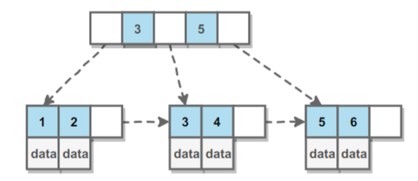

# 索引

**索引类似一个特殊目录，可加快数据查询速度。**比如字典或书籍前的目录就是一种索引，一页页的翻显然不如查目录来得快。

## 索引优点

**核心：索引有序**

+ 减少服务器扫描数据的行数（类比二分查找）
+ 避免**排序和分组**，从而避免创建**临时表**（B+tree索引有序，可用order by,group by指令实现，不分组排序也就不会创建临时表）
+ 随机IO变成**顺序IO**（B+tree索引有序，涉及缓存页表的替换机制）

## 索引应用条件

+ 小型表：**直接扫描**比索引高效
+ 中大型表：**索引**十分高效
+ 特大型表：建立和维护索引代价高，可用**分区技术**

## 索引分类

数据库索引是在**存储引擎**层面实现的，而**非服务器层**，所以不同的引擎有不同的索引类型和实现。

### B+tree索引

+ 是大多数MySQL存储引擎的默认索引类型
+ 数据库索引3个优点它都有（扫描行数少，直接排序和分组，顺序IO）
+ 指定**多个列作为索引列**，多个索引共同组成键
+ **适用于全键值、键值范围和键前缀查找，其中键前缀查找只适合最左前缀查找。如果不是按照索引列的顺序查找，则无法使用索引**
+ **InnoDB的B+tree索引分为主索引和辅助索引**。
  + 主索引：其叶子结点中存放完整的数据记录，也称**聚簇索引**。因为无法将数据行存放在两个不同的地方，所以一个表只有一个聚簇索引。
  + 辅助索引：叶子结点存放主键的值，在用辅助索引查找时，需先查到主键值，再到主索引进行查找。

### 哈希索引

哈希索引能以O(1)时间进行查找，但失去了有序性。

+ 无法用于排序和分组
+ 只支持**精确查找（全键值）**，无法进行**部分查找（前缀/后缀）**和**范围查找（键值范围）**

InnnoDB存储引擎有个特殊功能叫**”自适应哈希索引“**，当某个索引被频繁使用，它会在B+tree基础上再建立一个哈希索引，以此加快查询速度。

### 全文索引

MyISAM存储引擎支持全文索引，用于查找文本中的**关键词**，而非直接比较是否相等。（**文本关键词匹配**）

+ 查找条件使用`MATCH AGAINST`，而非普通的`WHERE`。
+ 全文索引使用**倒排序**，它记录着关键词到所在文档的映射。
+ InnoDB存储引擎在MySQL5.6.4版本也开始支持全文索引。

全文索引使用倒排索引实现，它记录着关键词到其所在文档的映射。

### 空间数据索引

MyISAM存储引擎支持空间数据索引（R-Tree），可用于地理数据存储。

+ 空间数据索引会从**所有维度**来索引数据，可以有效使用任意维度来进行组合查询。
+ 必须使用GIS相关函数来维护数据。

## 索引优化

### 独立的列

查询时，**索引使用**必须同时满足以下两个条件：

+ **索引列**不可为**表达式一部分**
+ **索引列**不可为**函数参数**

```sql
SELECT pid FROM table.tabs WHERE pid+1 = 5; // pid索引列时表达式一部分，不行
```

### 多列索引

在需要多列条件进行查询时，使用多列索引比单列索引性能好。

### 索引列的顺序

选择性最强的索引放在前面。

**索引选择性=不重复的索引条数/记录总数**，此时每个记录均有唯一的索引与其对应，选择性越高，记录的区分度越高，查询效率也越高。

### 前缀索引

对于**BLOB，TEXT，VARCHAR**类型的列，**必须使用前缀索引**，只索引开始的部分字符。

**前缀长度的选取根据索引的选择性来确定**。

### 覆盖索引

索引包含所有需要查询的字段的值。（索引包括了你要查询的字段）

优点如下：

+ 索引通常远小于数据行的大小，只读取索引能大大减少数据访问量。
+ 一些存储引擎（如MyISAM）在内存只缓存索引，而数据依赖于操作系统来缓存。因此，只访问索引可以不使用系统调用（通常费时）
+ 对于InnoDB引擎，若辅助索引能覆盖查询，则无需访问主索引。

## B+tree原理

> [参考](http://blog.codinglabs.org/articles/theory-of-mysql-index.html)

### 数据结构

+ **B Tree**指得是Balance Tree，也就是平衡树。平衡树是一颗查找树，并且**所有叶子结点位于同一层**。
+ **B+ Tree**是基于**B Tree和叶子节点顺序访问指针**实现的。它具有B Tree的**平衡性**，又可通过顺序访问指针来提高**区间查询性能**。



### 操作

+ **查找**：首先在根节点进行二分查找，找到一个key所在指针，然后递归地在指针所指向的节点进行查找。直到查找到叶子结点，然后在叶子结点进行二分查找，找出key对应的data。
+ **插入删除**：插入删除会破坏平衡树的平衡性，因此在插入删除操作后，需要对树进行一个**分裂、合并、旋转**等操作来维护平衡性。

### B+Tree vs. 红黑树

红黑树等平衡树也可以用来实现索引，但文件系统和数据库系统普遍采用B+ Tree作为索引结构，主要有以下两个原因：

+ **查找次数少**：**红黑树出度为2，树高**，平衡树查找操作时间复杂度与树高h相关，$T(N)=O(h)=O(log_dN)$，其中d为每个结点的出度。而**红黑树出度为2**，而B+Tree出度一般非常大。
+ **磁盘预读特性/IO次数少**：每次访问结点均需要调用**磁盘IO**，B+Tree的高度小，所有访问次数少，IO次数少，其次，它的**结点大小等于一个页**，因此，每次访问仅需一次IO访问。而红黑树入度为2，高度很大，因此磁盘IO次数多。

# 查询性能优化

## 使用Explain分析

Explain用来分析SELECT查询语句，开发人员可通过分析Explain结果来优化查询语句。

比较重要的字段如下：

+ select_type:查询类型，包含简单查询、联合查询、子查询等
+ key：使用的索引
+ rows：扫描的行数

## 优化数据访问

+ **减少请求的数据量**
  + 只返回**必要的列**：最好不要使用SELECT*语句。
  + 只返回**必要的行**：使用**LIMIT**语句来限制返回的数据。
  + **缓存**重复查询的数据：使用缓存可避免在数据库中查询，特别在要查询的数据经常并被重复查询时，可有效提高查询性能。
+ **减少服务器端扫描行数**：使用**索引来覆盖查询**最有效。

## 重构查询方式

+ **切分大查询**：一个大查询如果一次性执行的话，会锁住很多数据，占满整事务日志，耗尽系统资源，阻塞很多小但重要的查询。
+ **分解大连接查询**：将一个大连接查询分解成对每一个表进行一次单表查询，然后在应用程序进行关联，其优点如下：
  + **缓存更高效**：对于连接查询，一个表发生变化，那么整个查询缓存就无法使用。而分解后的多个查询，即是一个表发生变化，对其它表的查询缓存依旧有效。
  + **减少冗余记录查询**：单表查询的缓存结果更有可能被其它查询使用到。
  + **减少锁竞争**。
  + **高性能和可伸缩**：应用层连接，更容易拆分数据库
  + **查询效率提升**：比如用`IN()`代替连接查询，可让Mysql安装ID顺序查询，可能比随机连接更高效。

# 存储引擎

## InnoDB

是MySQL默认的**事务型存储引擎**，只有在需要它不支持的特性时，才考虑使用其它存储引擎。

+ **四个标准隔离级别**：默认级别是**可重复读**（Repeatable Read）。在可重复读隔离级别下，通过**多版本并发控制（MVCC）**+**间隙锁（Next-Key Locking）**防止**幻影读**。
+ 主索引是**聚簇索引**：在索引中保存数据，从而避免直接读取磁盘，大大提升查询性能。
+ **内部优化**：**磁盘预读特性**可加快读操作；**自适应哈希索引**；加快插入操作的**插入缓冲区**等。
+ **在线热备份**：其它存储引擎不支持在线热备份，要获取一致性视图需停止对所有表的写入，而在读写混合场景中，停止写入也意味着停止读取。

## MyISAM

设计简单，数据以紧密格式存储。对于只读数据，或表比较小，可以容忍修复操作，则依然可使用它。

+ **大量特性**：**压缩表**、**空间数据索引**
+ **不支持事务**
+ **不支持行级锁**：只能对整张表加锁，读取时会对需要读到的所有表加共享锁，写入时则对表加排它锁。但在表有读取操作时，也可以同时往表中插入新记录，这称为并发插入（Concurrent Insert）
+ 手动/自动执行检查和修复操作：和事务恢复及崩溃恢复不同，可能导致一些数据丢失，而且修复操作非常慢。
+ 指定`DELAY_KEY_WRITE`：每次**修改执行完成**时，不会立即将修改的索引写入磁盘，而是会写到**内存的键缓冲区**，仅当**清理键缓冲区**或**关闭表**时才会将对应索引块写入磁盘。
  + 优点：提升写入性能
  + 缺点：数据库/主机崩溃时会造成索引损坏，需执行恢复操作。

## 比较

| 对比项目\引擎类型 | InnoDB                             | MyISAM                       |
| ----------------- | ---------------------------------- | ---------------------------- |
| 事务              | **事务型**（Commit，Rollback语句） | 非事务型                     |
| 并发              | 表级锁+**行级锁**                  | 表级锁                       |
| 外键              | 支持                               | 不支持                       |
| 备份              | **在线热备份**                     | 不支持                       |
| 崩溃恢复          | 崩溃后损坏概率低，恢复快           | 崩溃后**损坏概率高，恢复慢** |
| 其它              |                                    | **压缩表和空间数据索引**     |

# 数据类型

## 整型（5种）

**TINYINT,SMALLINT,MEDIUMINT,INT,BIGINT分别使用8,16,24,32,64位**存储空间，一般情况下越小的列越好。

INT(11)中的数字只是规定交互工具**显示字符的个数**，对于存储和计算无意义。

## 浮点数（3种）

**FLOAT和DOUBLE**为**浮点类型**，**DECIMAL为高精度小数类型**。CPU**原生支持浮点**运算，但**不支持DECIMAL**类型计算，因此DECIMAL计算比浮点类型需更高代价。

三中类型都可以**指定列宽**，例如`DECIMAL(18,9)`表示总共18位，取9位存储小数，剩下9位存整数部分。

## 字符串（2种）

主要有**定长的CHAR**和**变长的VARCHAR**。

VARCHAR这种变长类型能**节省空间**，因为只需存储必要的内容。但执行UPDATE时可能会使行变得比原来长，当超出一个页所能容纳的大小时，需执行额外操作，具体如下：

+ MyISAM会将行拆成不同片段存储
+ InnoDB会分裂页来使行存放进页内

## 日期时间（2种）

MySQL提供了两种相似的日期时间类型：DATETIME和TIMESTAMP。

+ **DATATIME**
  + 保存从**1000年到9999年**的日期和时间，**精度为秒**，占**8字节**存储空间。
  + 与**时区无关**。
  + 默认情况下，MySQL以一种可排序，无歧义的格式显示DATETIME值，例如`2020-04-12 13:52:10`，这是ANSI标准定义的日期和时间表示法。
+ **TIMESTAMP**
  + 和UNIX时间戳相同，保存从**1970-01-01午夜（格林威治时间**）以来的秒数，使用**4字节**，只能表示从**1970到2038年**。
  + 与**时区相关**，即一个时间戳在不同时区代表不同的具体时间。
  + MySQL提供`FROM_UNIXTIME()`函数把UNIX时间戳转换为日期，提供`UNIX_TIMESTAMP`函数把日期转换为UNIX时间戳。
  + 默认情况下，若插入时没指定TIMESTAMP值，会将其设置为当前时间。
  + 尽量使用TIMESTAMP，因为它空间占用小。

> [两种类型的表示范围](https://www.jianshu.com/p/83ffccc5215e)

# 切分

## 水平切分

水平切分又称Sharding，它是将同一个表中的**记录拆分**到多个结构相同的表中。

当一个表的数据不断增多时，Sharding是必然选择，他可以将数据分布到集群的不同节点上，从而缓存多个数据库压力。

## 垂直切分

垂直切分是将一张表按列分成多个表，通常按列的关系密集程度进行切分，也可利用垂直切分将经常使用的列和不经常被使用的列切分到不同的表。

在数据库层面使用垂直切分将按数据库中表的密集程度部署到不同的库中，例如将原来的电商数据库垂直切分成商品数据库，用户数据库等。

## Sharding策略

+ 哈希取模：hash(key)%N。
+ 范围：可以是ID范围也可以是时间范围。
+ 映射表：使用单独的一个数据库来存储映射关系。

## sharding存在的问题

+ 事务问题：使用分布式事务来解决，比如XA接口。
+ 跨节点连接：可将原来的连接分解成多个单表查询，然后在用户程序进行连接。
+ ID唯一性
  + 使用全局唯一ID（GUID）
  + 为每个分片指定一个ID范围
  + 分布式ID生成器（如Twitter的snowflake算法）

# 复制

## 主从复制

主要涉及三个线程：binlog线程，I/O线程，SQL线程。

+ **binlog线程**：负责将主服务器上的数据更改写入二进制日志（Binary log）。
+ **I/O线程**：负责从主服务器上读取二进制日志，并写入从服务器的中继日志（Relay log）。
+ **SQL线程**：负责读取中继日志，解析出主服务器已经执行的数据更改并在从服务器重放（Replay）。


## 读写分离

**主服务器**处理**写操作以及实时性要求比较高的读操作**，而**从服务器处理读操作**。

读写分离能提高性能的原因在于：

+ 主从服务器负责各自的读和写，极大程度**缓解锁的争用**。
+ 从服务器可用**MyISAM**，**提升查询性能以及节约系统开销**。
+ 减少冗余，提高可用性？

读写分离常用**代理方式**来实现，代理服务器接收应用层传来的读写请求，然后决定转发到哪个服务器。

