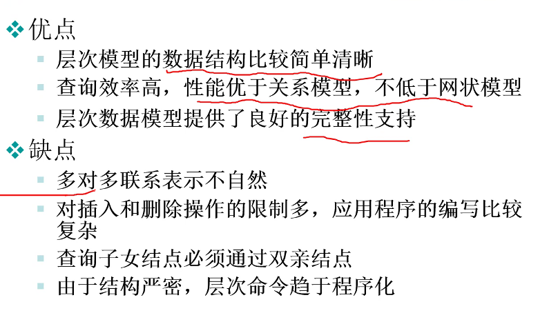
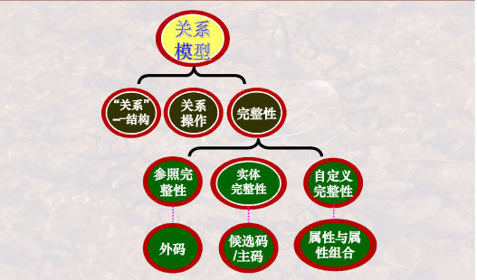
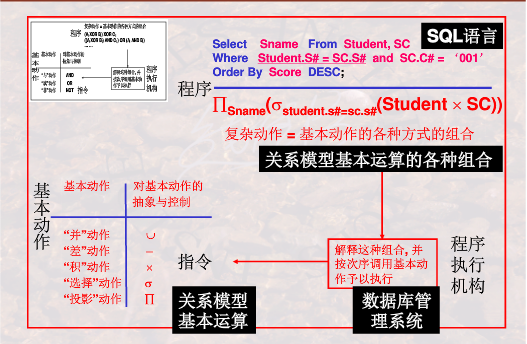
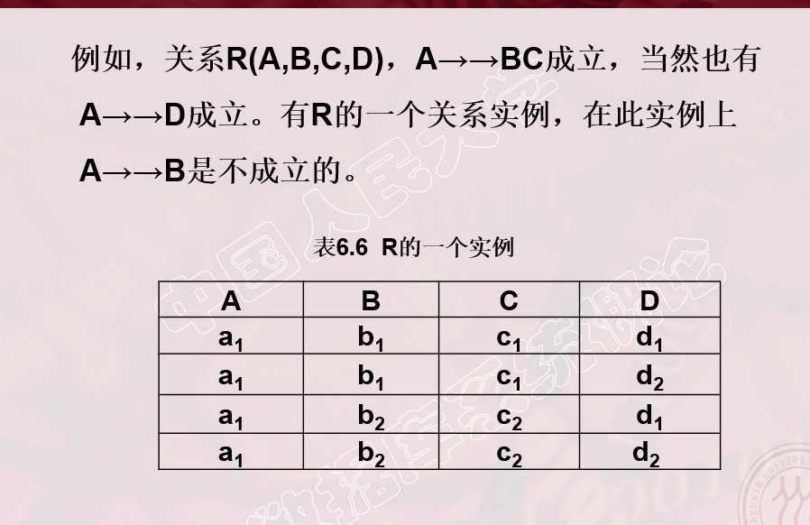

# 概论

**为什么学数据库系统**？

>+ 万物基础
>  + Everything Over DB
>  + 信息积累与运用基础
>+ 应用价值
>  - 基于数据库的应用--大数据分析
>  - 数据自有黄金屋--数据隐含价值

**数据，表，数据库，数据库系统，数据库管理系统联系区别**

> 数据：描述事物的符号记录
>
> 数据库是表的集合
>
> 数据库管理系统管理数据库（DBMS：解析语言并执行的系统）
>
> 数据库系统（工作环境）包含数据库DB，数据库管理系统DBMS，数据库应用DBAP，数据库管理员DBA，计算机基本系统

**数据库管理系统功能：用户角度，系统角度**

> 用户角度（**3语言1维护**--SQL）
>
> + 数据**定义 **DDL（Data Definition Language）
>
> + 数据**操作** DML（Data Manipulation Language）
> + **控制**权限 DCL（Data Control Language）
> + 数据库**维护**：转储，恢复，重组，性能检测，分析
>
> 系统角度（组织、存储、管理）
>
> + 形式-构造-自动化：语言-编译器-引擎
> + 运行的后台程序
>   + 编译器
>   + 查询优化和实现
>   + **数据存取和索引**
>   + 通信控制（分布式）
>   + **事务管理**/故障/安全/完整性

直接存取设备：磁盘，U盘（随机存储，直接定位）

非直接存取设备：磁带（顺序存储，从头开始找）

# 数据库系统的结构抽象和演变


## 数据库系统的标准结构？

### 三级模式两层映像；物理独立性和逻辑独立性（考）

> 物理世界-概念模型-数据库
>
> 概念模型：物理世界的抽象，类似 UML，便于交流表达（E-R模型必须要会画）
>
> 模式：外/子模式，概念/全局模式，内部/存储模式（对应三层抽象：外部，逻辑，物理）
>
> 映像：外部-概念 E-C Mapping；概念-内部 C-I Mapping
>
> 
>
> C 模式：全体数据的特征和结构（表）
>
> E 外模式：局部数据的特征和结构（与应用相关，是模式的子集；保证安全性-只能看部分数据；SQL 视图）
>
> I 内模式：存储模式，即物理结构和存储方式
>
> 
>
> **标准结构抽象的目的--复用性**
>
> + 逻辑独立性：C 改变时，改变 E-C Maping 即可重用 E
>
> + 物理独立性：I 改变时，改变 C-I Mapping 即可重用 C

## 数据模型？

### 视图/数据--模式--数据模型（抽象程度递增）

> 视图/数据：表现具体的数据
>
> 模式：数据结构抽象（解释数据字段含义）
>
> 数据模型：模式结构抽象


### 数据模型差异：网状/层次模型-关系模型-OO数据模型

> 层次/网状：树/图；用户需主动维护指针
>
> 关系：表；用户无需主动维护指针，但数据项不可分
>
> OO 数据模型：数据项可有结构，支持数据聚合和结构，面向对象思想

## 数据库系统演变和发展？

### 文件系统到数据库？

> | 对比项目\系统类型                            | 文件系统 | 数据库 |
> | -------------------------------------------- | -------- | ------ |
> | 数据组织是否依赖于具体的应用程序             | 是       | 否     |
> | 数据存取是否能以记录或记录集合为单位进行操作 | 不能     | 能     |
> | 不同文件即不同记录间是否有联系               | 无联系   | 有联系 |

### 层次模型，网状模型到关系模型数据库？

关系模型三要素

+ 数据结构
+ 数据操作
+ 完整性约束

> 层次模型：树形结构，IBM 的 IMS；只能一对多
>
> + 出现多对多需分解为两个一对多：冗余结点（学生S，课程C-》选课SC）；虚拟结点（一个存数据，其它均指针指向它）
> + 操作
>   + 查询：必须从根开始查找才有意义
>   + 更新：数据更新+关系更新
>   + 改删
> + 完整性约束
>   + 无双亲
> + 存储结构
>   + 邻接法：前序遍历树的顺序，存储与连续顺序空间。（数组），易查改，难插删。
>   + 链接法：左孩子，右兄弟（指针链表），难查改，易插删。
>   + 层次链接：邻接法改为指针链接。
>
> 
>
> 网状模型：网状/图结构，典型代表**DBTG**（数据库任务组提出）
>
> + 多对多关系也转换为一对多
>
> 关系模型数据库的改进：
>
> + 消除由用户建立指针的弊端
> + 将逐一记录的操作改进为支持记录集合的操作
> + 数据检索操作不依赖于路径信息或过程信息，即非过程化操作

### 关系数据库到对象关系，面向对象数据库？

> OO数据库的优点：
>
> + 突破**关系模型第一范式**-数据项不可再分
>
> + 允许复杂数据类型存在--**对象封装数据项**
> + 同时支持**记录集合**和**面向对象**操作

# 关系模型

## 基本概念

总体结构：



关系小结：


### 关系模型（考）处理table

+ **基本结构**（数据结构）：描述table/关系
+ **基本操作**：关系运算（并，差。。。）
+ **完整性约束**：运算时约束条件

什么是关系？

为什么把表称作关系？

怎样严格定义一个表？

### 表格关系的异同？

> 关系：严格数学定义，不可有重复元组
>
> 表：实际模型，可有重复元组。
>
> 其余基本相同

关系模型中的完整性约束？

以下为重点概念区分

### 域，笛卡尔积，关系，关系模式

+ 域：相同类型的一组集合（取值范围）,抽象的集合名字，相当于表的列名。
+ 域值：集合中具体的值，相当于表的每一列的具体取值。例如：域-`男人集合`，域值-`{张三，李四，王五}`
+ 笛卡尔积：n个域的组合的集合，每个元素为n-元组
+ 关系：一组域的笛卡尔积的子集（有意义的元组集合）。以下为三种关系
  + 基本关系：表，有存储的数据
  + 查询：对应的查询结果
  + 视图：虚表，不存放具体数据。
+ 关系模式：是关系的结构；关系是某一时刻关系模式的数据（类-实例）。`R(A1:D1,A2:D2,...,An:Dn)，其中Ai是属性，Di是取值范围，可省略`。

### 候选码，外码/外键，主码/主键，主属性/非主属性

+ **候选码**：能够**唯一标识**一个元组的**一组属性**（**集合**），且其子集不能唯一标识，一张表可存在多个候选码。例如选课数据中`{学号，课程号}`唯一标识一条选课记录；或者个人信息中`{学号}`唯一确定一个学生信息。（主键/外键/主属性等定义皆从这里引申）。

+ 主码/主键：从关系的**候选码**中选一个。一张表可存在多个候选码，被DBMS选中作为索引的一个成为主码。
+ 主属性：**属性P**包含于关系R的**任意一个候选码**。
+ 非主属性：属性P不包含于关系R的任意一个候选码。

+ 外码/外键：属性组不是关系R的主键，而是其他关系的主键（候选键），称为R的外键。常用于**连接**两个关系。

### 三个完整性

+ 实体完整性：主码属性值不为空（不知道/无意义）。主码是实体的唯一标识。

+ 参照完整性：外码为空值或者是另一个表主键的有效值。
  + 空值：表示当前记录尚未与其它关系建立连接。
  + 非空值：必须为相应关系的主码取值，否则报错。

+ 用户自定义：用户针对具体应用环境对相应属性的完整性约束条件。例如属性`年龄`必须在`[12,45]`

### 实体联系

#### 概念模型

用E-R模型表示

+ 实体间：一对一，一对多，多对多
+ 实体内部：比如员工的领导关系，职位是经理领导其它员工。

#### E-R图素（考-要求会做题）

+ 点：矩形-实体；菱形-关系实体
+ 线：连接实体，标明对应关系（1对多，多对一，多对多）

## 关系代数

> 集合思维的操作语言，输入输出均为关系


关系代数与SQL：



### 五个基本操作

关系代数基本操作：并、差、积、选择、投影、（更名）$\Pi \$

+ **相容性**：属性个数相同；一一对应的属性域相同、
+ **并差积均满足相容性**
+ 积（广义笛卡尔积）：两个关系中的元组任意拼接形成新的集合。用于联合查询，比如学生表和课程表。（**不去重**）
+ 选择（行）：将关系中满足条件的筛选出来（条件查询select）**注意次序**；$\delta_{Sage!=20}(Student)$
+ 投影（列）：将关系中的列进行重组，**注意重组后的去重**

### 扩展操作

关系代数扩展操作：交，$\theta-$连接，自然连接

可以用五个基本操作组合实现，DBMS直接使用连接效率更高

+ 交：差实现

+ 连接：关系先做积，再保留满足条件的元组。自身连接时需要用**更名**操作。**逻辑是先积后选择，物理操作没有中间过程？**

  + $\theta-$连接：无需去重（可指定列名）

  + 等值连接：指定相等的列，进行连接（可指定列名）
  + 自然连接：公共数据均相同才可连接，**需去重复属性**

### 复杂扩展操作

复杂扩展操作（选学）：除，外连接

+ 除：$Res=R\div S$，S的属性为R的属性子集。Res的属性为列(R-S)的属性，Res的元组和任意R-S的元组组合均为R的元组。用于**全部**等关键字的查询
  + image set：ims[x]表示关系R中某个属性值为x的元组集合
  + $R(X,Y),S(Y,Z)=>R\div S=\pi_{X}(R)-\pi_{X}(\pi_{X}(R)\times  \pi_{Y}(S)-R)$
+ 外连接：自然连接+空补全；避免自然连接中无匹配项的丢失**（左/右/全外三者每次只能用其一）**
  + **左外**连接：**左侧保留**，右侧补全
  + 右外连接：右侧保留
  + 全外连接：两侧均保留

### 解题思路

组合与应用训练：基本思维--一个集合+操作=一个集合--->以集合为中心

+ 单表：直接用并、差、交、选择、投影
+ 多表
  + 自然连接
  + 等值或不等值连接
  + 广义笛卡尔积（条件）
+ 连接后，继续用**选投连**等操作

### 易错点

+ 仅**自然连接需去重**，theat-连接，广义笛卡尔积均不用去重
+ **条件**表达式用$\and或\or$连接；**关系**用$\cap \bigcap或 \cup \bigcup$连接。
+ **并差积**使用前需满足**相容性**

## 关系演算


关系演算是基于逻辑查询，而关系代数是基于集合查询。

基于数理逻辑的谓词演算，根据**谓词对象**分类如下：

+ 元组变量（行）：关系元组演算
+ 域变量（列）：关系域演算

### 关系元组演算

常用语言：ALPHA。这是一个假象抽象的语言（数学语言）

GET语法格式

```
GET 工作空间名 [(定额)] (表达式1) [:操作条件] [down/up 表达式2]
```

+ `[]`表示可选参数（可有可无）
+ 工作空间名：类似C++的命名空间`namespace`，这里随便写个字符就行，比如`W`。
+ 定额：指明显示的元组个数（就是要展示多少条数据，SQL可用类似`ROWNUM<3`实现）
+ 表达式1：你要显示的内容，类似SELECT后面的属性
+ 操作条件：类比WHERE条件，区别在于这里的条件可以用谓词逻辑，比如全称和存在量词。
+ down/up 表达式2：对显示进行排序使用，down降序，up升序。表达式2指明需排序的属性。

**元组变量（SQL别名）**

+ 作用：简化关系名；操作条件中的量词必须用元组变量
+ 约束变量必须用元组变量，比如**存在和全称量词**的变量（操作条件出现）
+ 其余自由变量可不用（比如表达式1中的属性）

核心掌握：查询表示GET的使用

#### 简单检索实例

> 查询**信息系IS**中年龄小于20岁的学生的学号和年龄。

$GET\ W \ (Student.Sno,Student.Sage)\ : Student.Sdept='IS'\land Student.Sage<20 $

+ GET等价于SQL中的 SELECT
+ W是工作空间，可自己命名

> 查询**信息系IS**中年龄小于20岁的学生的学号和年龄，按年龄升序排列，取出前三名。

$GET\ W \ (3) \ (Student.Sno,Student.Sage)\ : Student.Sdept='IS'\land Student.Sage<20  \  UP \ Student.Sage$

+ `(3)`表示取前三个
+ `UP Student.Sage`表示按年龄升序排列

#### 元组变量检索实例（重难点）

> 查询选修2号课程的学生名字。

$RANGE\  SC\  X\\ GET\  W \ (Student.Sname)\ : \exists X(X.Sno=Student.Sno\land X.Cno='2')$

+ `Range SC X`是定义X为SC的
+ `X`表示关系`SC`中的元组变量，取值范围是`SC`中的所有元组。
+ 注意存在量词的变量，必须用元组变量，因此必须用给SC取一个变量，而Student就不用，因为它不作为量词的变量。

```sql
-- 正确实现1：SQL用exists实现
SELECT sname
FROM Student
WHERE exists (SELECT * FROM SC x WHERE x.sno=student.sno and x.cno=2);

-- 正确实现2：SQL用exists实现：若把x.sno改为sno，没问题
SELECT sname
FROM Student
WHERE exists (SELECT * FROM SC x WHERE sno=student.sno and x.cno=2);

-- 错误实现：SQL用exists实现：若把student.sno改为sno，则会出现错误，主要是不同系统对空值处理不同
SELECT sname
FROM Student
WHERE exists (SELECT * FROM SC x WHERE x.sno=sno and x.cno=2);
```


> 查询选修了这样课程的学生学号，其直接先修课程为6号。

$RANGE\ Course\ X\\GET\ W\ (SC.Sno)\ :\ \exists X(X.Cno=SC.Cno \land X.Cpno='6')$

> 查询至少选修一门**其先修课为6号**的课程的学生学号。

$RANGE\ Course\ CX\\ \ \ \ \ \ \ \ \ \ \ \ \ \ \ \ \ SC\ SCX\\GET\ W\ (Student.Sname)\ :\ \exists SCX(SCX.Sno=Student.Sno\land \exists CX(CX.Cno=SCX.Cno\land CX.Cpno='6'))$

> 查询成绩为90分以上的学生名字和课程名字。

$RANGE\ SC\ SCX\\GET\ W\ (Student.Sname,Course.Cname)\ :\ \exists SCX(SCX.grade\geq 90\land Student.Sno=SCX.Sno\land Course.Cno=SCX.Cno)$

> 查询不选1号课程的学生名字。

$RANGE\ SC\ SCX\\GET\ W\ (Studnet.Sname)\ :\ \forall SCX(SCX.Sno\neq Student.Sno\lor SCX.Cno\neq '1')$

+ **全称改写成存在量词，才能用SQL实现**

$RANGE\ SC\ SCX\\GET\ W\ (Studnet.Sname)\ :\ \lnot \exists SCX(SCX.Sno= Student.Sno\land SCX.Cno= '1')$

```sql
SELECT sname
FROM Student
WHERE not exists (
	SELECT * 
    FROM SC 
    WHERE SC.sno=Student.sno and sc.cno='1' 
);
```

> 查询选修了全部课程的学生姓名。

$RANGE\ Course\ CX\\ \ \ \ \ \ \ \ \ \ \ \ \ \ \ \ \ SC\ SCX\\GET\ W\ (Student.Sname)\ :\ \forall CX(\exists SCX(CX.Cno=SCX.Cno\land SCX.Sno=Student.Sno))$

> 查询最少选修了201215122学生所选课程的学生学号。

$RANGE\ Course\ CX\\ \ \ \ \ \ \ \ \ \ \ \ \ \ \ \ \ SC\ SCX\\ \ \ \ \ \ \ \ \ \ \ \ \ \ \ \ \ SC\ SCY\\GET\ W\ (Student.Sno)\ :\ \forall CX(\exists SCX( SCX.Sno='201215122'\land SCX.Cno=CX.cno)\Rightarrow  \exists SCY(SCY.Sno=Student.Sno\land SCY.Cno=CX.Cno))$

关系元组演算公式的递归定义

与或非，存在量词，全称量词$\and \or \neg  \exist \forall$

查询表达：元组-属性-谓词逻辑

关系元组表示关系代数

### 关系域演算

关系域演算公式的递归定义

**示例查询QBE**（Query By Example）Access就是典型

+ 无需书写复杂公式，仅需在表格中填写条件
+ 高度非过程化语言
+ 四个组成部分：关系名，字段名，操作区，条件区
+ 示例元素（类似变量）实现复杂关系

### 安全性

安全：不产生**无限关系**（集合）和**无穷验证**（存在量词和全称量词）的运算

### 三种关系运算的观点

关系代数，关系元组演算，关系域演算对比

+ 关系代数是安全的；演算不安全

+ 关系代数与**安全演算**等价
+ 关系域演算，关系元组演算，关系代数三者**过程性**依次降低（黑盒性降低/越底层）

# SQL语言

理论基础是关系代数和关系演算

SQL语言是集DDL，DML和DCL与一体的数据库语言。

> [在线练习](https://sqlzoo.net/wiki/SQL_Tutorial)

## 概述

SQL语言分类：

+ 交互式
+ 嵌入式
+ 动态

SQL特点：

+ **综合统一**：DDL，DML，DCL，接口一致，符号统一
+ **高度非过程化**：第四代语言，类似prolog，只说做什么，不说怎么做
+ **面向集合的操作**：插入，删除，更新均可为集合操作
+ **简单易用**：9个核心动词完成大多数功能

期望目标：理解查询需求，用SQL精确表达（语法+语义）

DDL

+ **模式**：是表，视图和索引的集合，可看成**目录/域名**
  + 创建：`Create Schema 模式名`
  + 删除：`Delete Schema ...`
    + `CASCADE`：级联删除，删除与该模式下的表，视图（Oracle保留视图定义），索引等
    + `RESTRICT`：无依赖才能删除
+ **表**：创建Create，删除Drop，修改Alter
  + 表名，列名
  + 列级完整性约束：数据范围，唯一性
  + 表级完整性约束：外键，联合主键，放在最后
  + 数据
+ **视图**
+ **索引**

数据库/表结构的定义创建，修改，删除

Create，Alter（修改），Drop（撤销）

DML

元组（数据记录）的增删改查

INSERT（单/批处理）,DELETE,UPDATE,**SELECT**（DISTINCT去重，order by排序，模糊查询Like，联合查询）

DCL

Grant，Revoke

# 数据安全

安全性：防止数据泄露，修改，删除

非法使用数据库

+ 编写程序绕过验证系统
+ 直接操作非授权命令
+ 多次合法查询，推导出私密数据

用户身份鉴别

+ 静态口令
+ 动态口令
+ 生物特征：指纹，虹膜，掌纹
+ 智能卡

存取控制

+ 用户权限：定义对数据对象的操作权利--用户权限，放在数据字典中
+ 合法权限检查：检查用户是否具有该权限

存取控制方法

+ **自主访问控制** DAC（C2级）
  + 用户对不同数据有不同权限
  + 不同用户对同一数据有不同权限
  + 别授权的用户可转让授予权限
  + `GRANT` 和 `REVOKE`
    + 数据对象+数据操作
+ **强制访问控制** MAC（B1级）
  + 每个数据有密级；每个用户有密级（类似 OS 分级管理）
  + 向下读，向上写
+ 视图机制
+ 审计功能：启用一个专门的审计日志（**Audit** log），记录所有数据操作；费时，提供灵活开闭开关
  + 打开和关闭审计功能：`AUDIT` , `NOAUDIT`

+ 数据加密

**完整性约束被破坏**

主键完整性：非空

外键完整性：

+ 拒绝
+ 级联删除
+ 置空

用户定义完整性：检查数据

完整性约束子句：给约束起名字，直接操作约束名即可

断言：复杂完整性检查

触发器：事件-条件-触发操作

+ 行级触发器：针对数据，每行操作都要执行
+ 语句级触发器：针对语句，就算有1000条数据，也只触发一次

# 关系数据理论

问题提出：针对一个具体问题，如何构造一个适合它的数据模式

数据依赖：属性间的关系

+ 函数依赖
  + 平凡：`X->Y,Y是X子集`
  + 非平凡：`X->Y,Y不是X子集`
  + 完全函数依赖：X的真子集都无法作为Y的依赖（最大概念）
  + 部分函数依赖：X的真子集可作为Y的依赖
  + 传递函数依赖：`X->Y,Y->Z => X->Z`

不分表：

+ 数据冗余

+ 更新异常：更新代价大
+ 插入异常：完整性约束
+ 删除异常：

范式

是符合某些条件的关系模式的集合


2NF：每一个非主属性都完全函数依赖于任何一个候选码

**考：给定模式判断是哪个范式**

**给出实例，判断存在哪些多值依赖**


Amstrong公理系统：要求会推导

+ 自反
+ 增广
+ 传递


可靠性

完备性


最小依赖集或最小覆盖：用来简化函数依赖集

+ 右侧：右侧仅1个属性
+ 左侧：左侧尽可能少属性
+ 整体：消除重复等价的依赖


**分解不需要掌握**


# 优化

选择操作实现：

+ 全表扫描（table scan）：从头到尾顺序扫描整张表
+ 索引扫描（index scan）：B+ 树索引或 hash 索引，先找到对应元组的指针，再去表中取出对应元组

连接操作实现：

+ 嵌套循环算法（nested loop join）：二重循环遍历两张表。具体实现时是读入数据块，而不是一个元组
+ 排序-合并算法（sort-merge join/merge join）：本质也是二重循环，只不过由于排序，内层循环次数可减少
  + 将两张表按照连接属性进行排序
  + 枚举表1，在表2中进行顺序查找，找到第一个属性相同的元组，连接二者；
  + 当找到第一个属性不同的元组时，枚举表1的下一个元组
+ 索引连接算法（index join）：本质是二重循环，通过索引来匹配表2
+ hash join 算法：两张表均用根据连接属性来创建哈希表，连接哈希表值相同的元组

查询优化

+ 基于规则
+ 基于语义
+ 基于代价

代数优化：选择先做，连接后做

+ 连接和笛卡尔积：交换律，结合律
+ 串接：选择，投影（先后顺序不重要）

各种代数恒等式

等价变化算法：选择和投影运算

启发式规则：

+ 投影选择先做
+ 选择与前面的笛卡尔转换为连接
+ 投影要和它前面或后面的双目运算符结合起来：例如$\pi_{sno}(A)-\pi_{sno}(B)=>\pi_{sno}(A-B)$
+ 公共子表达式

给出 SQL 查询

+ 根据 SQL 画出语法树
+ 转换为关系代数表示的语法树
+ 对语法树进行优化（启发式规则）

物理优化：

+ 基于规则的启发式
  + 选择操作
    + 小关系：全表顺序扫描
    + 大关系
+ **代价估算**
+ 两者结合


# 数据库恢复技术

事务：用户定义的一个数据库的操作序列，要么全做，要么全不做（类似OS的原语）

事务是一句，多句SQL或整个程序，一个程序包含若干个事务

恢复和并发的基本单位

+ COMMIT：显示提交，将更新写回磁盘
+ ROLLBACK：撤销已做操作，回到最初状态

事务特性ACID：

+ 原子性A：要么全做，要么全不做
+ 一致性C：保证执行后结果和预期的逻辑一致（算法正确）
+ 隔离性I：并发不会互相干扰
+ 持续性D：

数据冗余来恢复

+ 增删改写入日志
+ 数据库镜像（关键数据+日志文件）

## 检查点

无检查点的日志可转换为检查点在最前面的特殊情况。

先画出甘特图(P303)，再找出检查点和**故障点**，按如下结论判断：

+ **不操作**：检查点之前已结束（commit/rollback）
+ **重做**：在**检查点**和**故障点**的之间结束
+ **撤销/回滚**：故障点之后还没结束
+ **注意点**：若**重做**的操作为**回滚**，则直接将该任务并入**撤销**

**例题**：课后习题10.2的第4、5题

# 并发控制

并发影响**隔离性和一致性**

多用户数据库系统：可多个用户同时使用同一个数据库

+ 串行：效率低
+ 交叉并发：单处理机，分时占用 CPU
+ 同时并发方式：多处理机，真正的并行计算

事务是并发控制的基本单位，需保证事务

+ 隔离性
+ 一致性


## 数据不一致性

事务隔离性被破坏

### 丢失修改（lost update）

+ 事务T1和T2读入同一数据并修改
+ 后提交数据的T2覆盖了T1结果

### 不可重复读（non-repeatable read）

+ T1 读数据，T2 **更新**数据，T1无法重现前一次数据
+ T1 读数据，T2 **删除**某些记录，T1再读发现某些记录消失
+ T1 读数据，T2 **插入**某些记录，T1再读发现某些记录增加

### 读脏数据（dirty read）

+ T1读数据，修改后写回磁盘
+ T2读同一数据，T1由于某种原因被**撤销（rollback）**
+ T2读到的数据与实际数据不一致

## 主要技术

封锁

时间戳

悲观控制法：先锁后做（认为冲突多）

乐观控制法：先做后控制（认为冲突少）

多版本并发控制（MVCC）

### 封锁

排它锁/写锁/X锁：**仅**加锁X的事务T可以**读和写**

共享锁/读锁/S锁：**多用户**均可以**读**，但**不可写**

一级封锁协议：写数据前必须加X锁，**事务结束**（commit/rollback）才释放。防止丢失修改

二级封锁协议：一级基础上，读数据加S锁，**读完**即可释放。防止丢失修改+防止读脏数据

三级封锁协议：一级基础上，读数据加S锁，**事务结束**才释放。防止重复读

### 死锁&活锁

封锁带来的问题

活锁：有的事务永远处于等待，可采用先来先服务，否则优先级低的事务永远得不到服务

死锁：互相等待，陷入死循环等待

#### 死锁预防

+ 一次封锁法：对每个事务一次性将所用的数据全部加锁
  + 难以确定每个事务需要的所用数据
  + 降低并发度
+ 顺序封锁法：规定一个封锁顺序，所用事务按照该顺序实施封锁
  + 维护顺序成本高
  + 封锁请求随着事务执行而动态变化，难以确定事务要封锁哪些对象

以上两种效果均不理想，于是主要使用死锁的诊断与解除方法

#### 死锁的诊断与解除

+ 超时法：超过一定时间认为超时
+ 等待图法：找有向环

### 并发调度的串行性（重点）

如何判断调度正确性？（冲突可串行化是充分条件）

+ 串行调度一定正确
+ 执行结果等价于串行结果的调度也正确（可串行化调度）
+ 若调度是冲突可串行化，那么该调度一定是可串行化调度（一定正确）

可串行化：结果等价于**某次串行**执行的结果

调度是冲突可串行化，则一定是可串行化调度。

+ 冲突操作：不同事务对同一数据的**读写/写写**操作（**可读读操作**）
+ **不可交换**：**不同事务的冲突操作**；**同一事务的两个操作**
+ **判断方法**：通过**合法的交换**得到对应的串行调度，说明该调度时冲突可串行化调度

两段锁：先一次性申请所有锁，在一次性释放所有锁

**遵守两段锁也可能发生死锁**


## 封锁粒度

封锁对象的选择

+ 对象太大，并发度小，系统开销小
+ 对象太小，并发度高，系统开销大

多级锁：粒度树

意向锁：表示其下层已加锁，避免反复查找

+ IS锁：后裔结点存在S锁
+ IX锁：后裔结点存在X锁
+ SIX锁：后裔结点存在S和IX锁

# 数据库设计

概念结构设计：给文字描述，画出 E-R 图

+ chen 方法
+ UML
+ crow's foot

逻辑结构设计：将 E-R 图转为逻辑结构（表结构）

物理结构设计和优化：


# 考点分布

第1、8章不考

**不考概念考做题**

关系代数计算（5题）10

+ 投影
+ 连接

关系代数&演算（alpha 3题）12

+ 学生选课表

SQL（6题） 18

+ 多表查询

数据库理论 20

+ 范式依赖判断：**函数依赖**，**多值依赖**（概念理清，题目形式例如给张表求出多值依赖）



+ 候选码（属性闭包），属于哪个范式
+ 最小依赖集优化
  + 右边化成一个的属性
  + 删除传递依赖

```
// 1.右侧处理
A->BC

A->B
A->C

// 2. 删除传递依赖

// 3.左侧处理
```

+ 证明题：实验指导手册有

+ 最小覆盖

查询优化 10

+ 语法树-启发式规则-较优的语法树（最初语法树、关系代数语法树、优化后的语法树）
+ 计算例子-代价评估-计算代价-IO块数

并发控制数据库恢复 15

+ 冲突可串行化判断
+ 可串行化调度概念
+ 并发概念
+ 恢复：给出检查点，问如何恢复（重做，撤销，不操作）
+ 恢复的概念

数据库设计15

+ E-R图
+ 转换为逻辑结构（关系模型）
+ 优化

