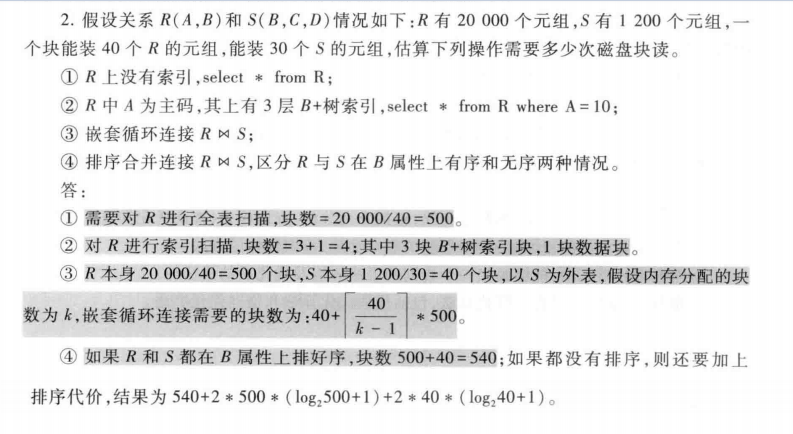
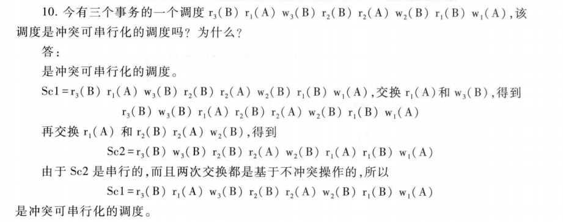
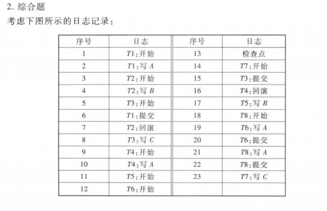

maoyuguang@nuaa.edu.cn

# 环境配置

+ 数据库：Oracle 11g
+ 账号：scott；密码：8423535（默认数据库用户）
+ 操作系统：Windows10

# 书写规范

+ 命令关键词大写，表名字段名小写

# 常见命令

## oracle特殊命令

### COMMIT

+ **功能定义**：插入，修改或删除数据时，只有当事务提交到数据库才算完成，在Oracle中，在提交之前，只有操作数据库的人才能看到所做的事，其它人看不到，只有提交后，其它人才能看到。
+ **一句话，若想保存变化的数据，必须commit**。

+ **类型**

## 关系代数符号

[参考1](https://blog.csdn.net/garfielder007/article/details/51646604)|[参考2](https://www.zybuluo.com/codeep/note/163962#6%E9%80%BB%E8%BE%91%E8%BF%90%E7%AE%97%E7%AC%A6)

| 中文名   | 希腊符号                     | Letax语法                  |
| -------- | ---------------------------- | -------------------------- |
| 并       | $\cup \bigcup$               | `\cup \bigcup`             |
| 交       | $\cap \bigcap$               | `\cap \bigcap`             |
| 笛卡尔积 | $\times$                     | `\times`                   |
| 选择     | $\sigma$ $ \Sigma$(都用小写) | `\sigma \Sigma`            |
| 投影     | $\pi $  $\Pi$（用小写）      | `\pi \Pi`                  |
| 除       | $\div $                      | `\div`                     |
| 连接     | $\bowtie$                    | `\bowtie`                  |
| 逻辑符   | $\lor   \land \lnot  $       | `\lor \land \lnot`         |
| 关系符   | $\leq \geq \neq$             | `\leq \geq \neq`           |
| 函数依赖 | $\overset{P}{\rightarrow}$   | `\overset{P}{\rightarrow}` |

上标：`^{}`，例如`a^{i+2}`,$a^{i+2}$

下标：`_{}`，例如`a_{i+2}`,$a_{i+2}$

正下标：

+ **前面是特定的数学操作符**：`operator_name \limits_{}`，例如`\prod \limits_{i=1}`，$\prod \limits_{i=1}$
+ **不是特定数学操作符**：用`\mathop{}`先包装一下，再用`\limits_{}`，例如`\mathop{\bowtie} \limits_{a}`，$\mathop{\bowtie} \limits_{a<x<b}\{f(x)\}$

正上标：和正下标类似，只需把`\limits^{}`改为上角标即可。`\prod \limits^{i=1}`，$\prod \limits^{i=1}$

+ 求和`\sum`$\sum\limits_{i=1}^n$和`\Sigma`$\Sigma$大小不同
+ 空格：单quad空格`\quad`$A\quad B$；双quad空格`\qquad`$A\qquad B$；紧贴`A\!B`$A\!B \ AB$

## 退出命令

+ `exit/quit`会自动保存数据；
+ 直接点×不会commit，被看成异常退出

## 常用查询、条件、排序

```SQL
SELECT (DISTINCT)fieldname1, ...,fieldnameN // DISTINCT去重
FROM tablename1,...,tablenameN
WHERE cond1 conn cond2 ... condN
ORDER BY fieldnamei DESC|(ASC) // 排序选项，默认ASC升序;ascend,descend
```

## 集合运算命令

+ `union`：并
+ `intersect`：交
+ `minus`：差

## 连接查询

**去重问题**：（计算题**必考**）

仅自然连接会**合并相同列（列），并对元组去重**（行）。

其余笛卡尔积，条件连接，三种外连接均不会。

**投影会去重**。

除法不会产生重复元组。

+ `inner join/join`：左右表均匹配才返回对应行
+ `natural join`：自然连接，相等的列主动连接，无需写on或where条件。（**相同列会被合并**）
+ `left join`：左连接，以左侧为主表，无论右侧有没匹配字段，左侧所有行均保留。
+ `right join`：右连接，以右侧为主表，无论左侧有没匹配字段，右侧行均保留。
+ `full join`：全连接，左连接+右连接（左右表的行均保留）。

```SQL
FROM t1 join t2
on t1.pid = t2.pid
// 多个连接可嵌套
FROM (t1 join t2 on t1.pid=t2.pid) join t3 on t2.kid=t3.kid;
// 也可使用别名：表别名，列别名会改变输出的列名
FROM table1 AS t1 join table2 AS t2....
// 直接用,分隔默认是先笛卡尔积
FROM table1,table2,... WHERE 条件
```

实例演示

```sql
-- 左外连接
select * from student left join sc on sc.sno=student.sno;
-- 输出如下
       SNO SNAME      SS       SAGE SDEPT        SNO        CNO      GRADE
---------- ---------- -- ---------- ----- ---------- ---------- ----------
 201215121 李勇       男         20 CS     201215121          1         92
 201215121 李勇       男         20 CS     201215121          2         85
 201215121 李勇       男         20 CS     201215121          3         88
 201215122 刘晨       女         19 CS     201215122          2         90
 201215122 刘晨       女         19 CS     201215122          3         80
 201215125 张立       男         19 IS
 201215123 王敏       女         18 MA
 
-- 右外连接
select * from sc right join student on sc.sno=student.sno;
-- 输出如下
       SNO        CNO      GRADE        SNO SNAME      SS       SAGE SDEPT
---------- ---------- ---------- ---------- ---------- -- ---------- -----
 201215121          1         92  201215121 李勇       男         20 CS
 201215121          2         85  201215121 李勇       男         20 CS
 201215121          3         88  201215121 李勇       男         20 CS
 201215122          2         90  201215122 刘晨       女         19 CS
 201215122          3         80  201215122 刘晨       女         19 CS
                                  201215125 张立       男         19 IS
                                  201215123 王敏       女         18 MA

-- 全外连接
select * from sc full join student on sc.sno=student.sno;
-- 输出如下

-- 三种外连接都可以加上自然连接，变成自然左外连接，自然右外连接，自然全外连接
```

连接四种实现方式

+ 嵌套循环：低效，适合小表
+ 排序归并：nlogn
+ 索引连接
+ hash连接：效率最高（类似桶排序）

## 子/内部查询

WHERE 或者 HAVING 后面的条件可跟着查询子句。

求解顺序：

+ **不相关查询**：由内而外逐层求解（内部不依赖与外部）
+ **相关查询**：由外而内逐层求解（内部依赖外部）

```sql
-- 查询每个学生的选修课程大于该学生选修课成绩平均数的学号和课程号
SELECT scx.sno,scx.cno
FROM SC scx
WHERE scx.grade > (
	SELECT AVG(scy.grade)
    FROM SC scy
    WHERE scy.sno=scx.sno
);
```

IN 谓词：后跟集合，类似存在量词

ANY/SOME 或 ALL

+ `<ANY`：小于某个
+ `<ALL`：小于所有
+ 其它所有关系符都可以和`ANY ALL`进行组合，完成类似**存在和全称量词功能**。下表为ANY，ALL和IN，聚合函数的等价关系

|          | =    | != / <> | <    | <=    | >     | \>=    |
| -------- | ---- | ------- | ---- | ----- | ----- | ------ |
| ANY/SOME | IN   | --      | <MAX | <=MAX | \>MIN | \>=MIN |
| ALL      | --   | NOT IN  | <MIN | <=MIN | \>MAX | \>=MAX |

EXISTS 谓词：若有全称量词，必须转换为存在量词；它只返回真假，查询结果为空返回家；非空返回真

+ 量词表达能力>连接查询

集合命令：`UNION INTERSECT MINUS`

派生表：作为`FROM`的子句，相当于一个临时表

## 空值处理

不知道的，不存在的，无意义的

空值判断：内嵌谓词 `IS NULL` 或 `IS NOT NULL`

空值运算

+ 算术运算：与空值的算法运算结果为空

+ 比较运算：与空值的比较结果为`UNKNOWN`，从二值逻辑扩展为**三值逻辑**`(TRUE,UNKNOWN,FALSE)`,因此出现很多反直觉的问题

## 视图

视图是虚表，仅存放定义，不存放数据，基本表数据发生变化，视图对应数据也变化

创建视图

```
CREATE VIEW
view_name [可选列名]
as 子查询
[check with option]
```

数据库创建视图时，只将视图定义放入数据字典，不执行选择语句，等到查询视图时，才去执行视图定义中的SELECT语句。

作用

+ **简化操作**：数据不是直接来自基本表，如多张表连接查询
+ **多角度看待同一数据（外模式）**：不同用户以不同方式观察数据
+ **重构数据逻辑独立性**：如垂直分表（使用频率高低）
+ **安全保护**：不同用户看不同视图，可权限控制
+ **表达清晰**：先构建需要的视图，然后进行查询

## 统计函数

+ `aggregation`：聚合类函数，对于一个字段仅返回一个值。如求和sum,频率统计count，min，max，平均avg。
  
  + `count`：不会去重
  
  ```sql
  -- distinct 去除重复
  select count(distinct sdept) from student;
  ```
  
+ 分组运算：group by（where条件后不可包含group by，只能用having）

  ```sql
  -- 选每个学生的最高分
  select sno,max(grade) from sc group by sno;
  ```

+ `scalar`：标量运算，每个值都返回一个值。如转大写ucase,转小写lcase，截取字符串mid

+ where 和 having 的区别：对象不同

  + where 针对于整体表，视图
  + having 针对子句

# Homework01

简单查询：条件类型如下

+ 单条件：比较运算符（=、!=、>、>=、<、<=）
+ 多条件：逻辑连接词（AND、OR、NOT）
+ 区间条件：between A and B
+ 日期转换：`to_date('1981-02-20','yyyy-mm-dd')`

> **(1) Write a query in SQL to list the name and salary of employees of the department 20.** 

```sql
select ename, sal from emp where deptno=20;
```

> **(2) Write a query in SQL to list the employees who are either 'CLERK' or 'ANALYST'.** 

```sql
select ename,job, deptno from emp where job='CLERK' or job='ANALYST';
```

> **(3) Show the structure of the DEPT table. Select all data from the DEPT table.**

```sql
 desc dept;
 select * from dept;
```

> **(4) Write a query in SQL to display the name and salary of employees earning more than $2850.** 

```sql
 select ename, sal from emp where sal>2850;
```

> **(5) Write a query in SQL to display the name and salary for all employees whose salary is not in the range of 1500 and ​2850.** 

```sql
 select ename, sal from emp where sal>2850 or sal<1500;
```

> **(6) Write a query in SQL to display the employee name, job and start date of employees hired between February 20. 1981, and May 1. 1981.**

```sql
select ename, job, hiredate 
from emp 
where hiredate between to_date('1981-02-20','yyyy-mm-dd') and to_date('1981-05-01','yyyy-mm-dd');
```

> **(7) Write a query in SQL to list the job title and the salary of those employees whose manager has the number 7698 or 7566 and who earn more than 1500.**

```sql
select job, sal from emp where  (mgr=7698 or mgr=7566) and sal>1500;
```

# Homework02

复杂查询

+ 连接查询
+ 子查询

> **(1)Write a query in SQL to list the name and salary of employees who are working in RESEARCH department. **

```SQL
--写法(1) 
SELECT ename,sal FROM emp,dept WHERE emp.deptno=dept.deptno and dname='RESEARCH';
--写法(2) JOIN关键字
SELECT ename,sal FROM emp JOIN dept ON emp.deptno=dept.deptno WHERE dname='RESEARCH';
```

> **(2)Write a query in SQL to list the name and salary of employees who are not working in SALES department.**

```SQL
SELECT ename,sal FROM emp JOIN dept ON emp.deptno=dept.deptno WHERE dname!='SALES';
```

> **(3)Write a query in SQL to list the name, salary and department name of employees who are working in New York.** 

```SQL
SELECT ename,sal,dname FROM emp JOIN dept ON emp.deptno=dept.deptno WHERE loc='NEW YORK';
```

> **(4)Write a query in SQL to list the details of the employees whose salary is  same as  salary of FORD.**

```sql
-- 包括FORD的信息
SELECT * FROM emp WHERE sal=(SELECT sal FROM emp WHERE ename='FORD');
-- 不包括FORD的信息
 SELECT * FROM emp WHERE ename!='FORD' AND sal=(SELECT sal FROM emp WHERE ename='FORD');
```

# 建表插数据

## 表结构和数据

三张表结构和对应数据如下：


### **Student**

| 学号（Sno） | 姓名（Sname） | 性别（Ssex） | 年龄（Sage） | 所在系（Sdept） |
| ----------- | ------------- | ------------ | ------------ | --------------- |
| 201215121   | 李勇          | 男           | 20           | CS              |
| 201215122   | 刘晨          | 女           | 19           | CS              |
| 201215123   | 王敏          | 女           | 18           | MA              |
| 201215125   | 张立          | 男           | 19           | IS              |

### **Course**

| 课程号（Cno） | 课程名（Cname） | 先行课（Cpno） | 学分（Ccredit） |
| ------------- | --------------- | -------------- | --------------- |
| 1             | 数据库          | 5              | 4               |
| 2             | 数学            |                | 2               |
| 3             | 信息系统        | 1              | 4               |
| 4             | 操作系统        | 6              | 3               |
| 5             | 数据结构        | 7              | 4               |
| 6             | 数据处理        |                | 2               |
| 7             | PASCAL语言      | 6              | 4               |

### SC

| 学号（Sno） | 课程号（Cno） | 成绩（Grade） |
| ----------- | ------------- | ------------- |
| 201215121   | 1             | 92            |
| 201215121   | 2             | 85            |
| 201215121   | 3             | 88            |
| 201215122   | 2             | 90            |
| 201215122   | 3             | 80            |

## Oracle建表和插入数据

```SQL
-- 创建学生数据表
CREATE TABLE Student (
	Sno NUMBER(9) NOT NULL, -- 主键，学号，9位数字
	Sname VARCHAR(10), -- 姓名，用变长类型
	Ssex CHAR(2), -- 性别，仅男和女两种，用定长类型
	Sage NUMBER(3), -- 年龄，最多三位数
	Sdept VARCHAR(5) -- 所在系名称
);
-- 插入学生数据
INSERT INTO Student values(201215121,'李勇','男',20,'CS'); 
INSERT INTO Student values(201215122,'刘晨','女',19,'CS');
INSERT INTO Student values(201215123,'王敏','女',18,'MA');
INSERT INTO Student values(201215125,'张立','男',19,'IS');

-- 创建课程数据表
CREATE TABLE Course (
	Cno NUMBER(9) NOT NULL, -- 主键，课程号
    Cname VARCHAR(10), -- 课程名
    Cpno NUMBER(9), -- 先行课-课程号
    Ccredit NUMBER(9) -- 学分
);

-- 插入课程数据
INSERT INTO Course values(1,'数据库',5,4);
INSERT INTO Course values(2,'数学',null,2);
INSERT INTO Course values(3,'信息系统',1,4);
INSERT INTO Course values(4,'操作系统',6,3);
INSERT INTO Course values(5,'数据结构',7,4);
INSERT INTO Course values(6,'数据处理',null,2);
INSERT INTO Course values(7,'PASCAL语言',6,4);

-- 创建课程数据表
CREATE TABLE C (
	Cno NUMBER(9) NOT NULL, -- 主键，课程号
    Cname VARCHAR(10), -- 课程名
    Cpno NUMBER(9), -- 先行课-课程号
    Ccredit NUMBER(9) -- 学分
);

-- 创建选课数据表
CREATE TABLE SC (
	Sno NUMBER(9) NOT NULL, -- 学号（学号和课程号共同为主键）
    Cno NUMBER(9) NOT NULL, -- 课程号
    Grade NUMBER(9) -- 成绩
);
-- 插入选课数据
INSERT INTO SC values(201215121,1,92);
INSERT INTO SC values(201215121,2,85);
INSERT INTO SC values(201215121,3,88);
INSERT INTO SC values(201215122,2,90);
INSERT INTO SC values(201215122,3,80);
```

```
// 集合的三种操作
union // 并
intersect // 交
minus // 差
```

# 关系代数&SQL

以下问题针对`Student,Course,SC`三张表进行关系代数和SQL练习。请熟练掌握二者的写法和转换。

其中关系代数的逻辑和平常有些不同，注意易错点，请仔细推敲。

## 单表查询

> **1)	查询年龄不等于20岁的学生信息。**   

$\sigma_{sage\neq20}(Student)$

```SQL
SELECT * FROM Student WHERE sage!=20;
```

> **2)	查询选修1号课程的学生学号。**

$ \pi_{Sno}(\sigma_{Cno=1}(SC))$

```sql
SELECT sno FROM SC WHERE cno=1;
```

计算机中用`!= `或`<>`表示不等关系

> ***3)	查询既选修1号课程又选修2号课程的学生学号。**

错误示例1：$\pi_{Sno}(\sigma_{Cno=1}(SC) \cap (\sigma_{Cno=2}(SC))$：这是永假式，没有课程号能同时为1和2。

错误示例2：$\pi_{Sno}(\sigma_{Cno=1}(SC) \cup (\sigma_{Cno=2}(SC))$：只选择1或只选择2都会被选中。

正确答案：$\pi_{Sno}(\sigma_{Cno=1}(SC)) \cap \pi_{Sno}(\sigma_{Cno=2}(SC))$

```SQL
// 错误示例
SELECT sno FROM (SELECT * FROM SC WHERE cno=1) WHERE cno=2;
// 正确参考
SELECT sno FROM SC WHERE cno=1
intersect
SELECT sno FROM SC WHERE cno=2;
```

> ***4)	查询不选1号课程的学生学号。**

错误示例：$  \pi_{Sno}(SC)-\pi_{Sno}(\sigma_{Cno=1}(SC))$：Student才是所有学生，有的学生可能没选课

正确示例：$  \pi_{Sno}(Student)-\pi_{Sno}(\sigma_{Cno=1}(SC))$

```SQL
SELECT sno FROM Student
MINUS
SELECT sno FROM SC WHERE Cno=1;
```

> 类似问题：**查询所有的选课的成绩均大于等于85分的学号**（没选的不算）

$  \pi_{Sno}(SC)-\pi_{Sno}(\sigma_{grade<85}(SC))$

```sql
SELECT sno FROM SC
MINUS
SELECT sno FROM SC WHERE grade<85;
```

## 多表查询

5)	查询选修1号课程的学生学号和姓名。

自然连接：特殊等值连接，将同名的列自动连接，去重，且无法使用on条件和其它限定条件。

$  \pi_{Sno,Sname}(\sigma_{Student.sno=SC.sno \land Cno=1  }(Student \times SC))$

```SQL
-- 多表连接的本质都是先笛卡尔积，再筛选

-- 法1：FROM后用逗号分隔不同表，默认做笛卡尔积，然后用WHERE条件筛选
SELECT Student.sno, sname FROM Student,SC WHERE Student.sno=SC.sno and SC.cno=1;

-- 法2：join on：本质和上面一样，仅仅把连接条件放在on后面，其余条件不变
SELECT Student.sno, sname FROM Student join SC on Student.sno=SC.sno WHERE SC.cno=1;

-- 法3：natural join:无法使用on等条件，也不可用限定词，如下Student限定词报错
-- SELECT Student.sno, sname FROM Student natural join SC WHERE SC.cno=1;
SELECT sno, sname FROM Student natural join SC WHERE SC.cno=1;
```

6)	查询所有选课成绩均及格的学生学号和姓名。

+ 思路一：**笛卡尔积**：先计算两张表的笛卡尔积，然后用全集-不及格分数集合

$  \pi_{Sno,Sname}(\sigma_{Student.sno=SC.sno}(Student\times SC))-\pi_{Sno,Sname}(\sigma_{Student.sno=SC.sno \land grade<60}(Student\times SC))$

+ 思路二：**等值连接**：笛卡尔积的简化写法，无需写连接条件罢了。

$  \pi_{Sno,Sname}(Student\bowtie SC)-\pi_{Sno,Sname}(\sigma_{grade<60}(Student\bowtie SC))$

+ 思路三：**等值连接+单表过滤**：先在SC单表中找出所有符合条件的学号，再与Student进行等值连接。少做一次连接，应该效率更高。

$ (\pi_{Sno,Sname}(Student))\bowtie( \pi_{Sno}(SC)-\pi_{Sno}(\sigma_{grade<60}(SC)))$

```sql
-- 思路一：笛卡尔积
SELECT Student.Sno,Sname
FROM Student join SC on Student.sno=SC.sno
MINUS
SELECT Student.Sno,Sname
FROM Student join SC on Student.sno=SC.sno
WHERE grade<60;
-- 思路二：等值连接
SELECT sno,sname
FROM Student natural join SC
MINUS
SELECT sno,sname
FROM Student natural join SC
WHERE grade<60;
-- 思路三实现1：SQL特有：先在SC单表查询符合条件的学号，然后用来过滤Student
SELECT sno,sname 
FROM Student
WHERE sno in (SELECT sno FROM SC MINUS SELECT sno FROM SC WHERE grade<60);
-- 思路三实现2：先在SC单表查询符合条件的学号，再与Student做自然连接;
SELECT sno,sname 
FROM Student natural join (SELECT sno FROM SC MINUS SELECT sno FROM SC WHERE grade<60);
```

7)	查询选修了全部课程的学生学号和姓名。

8)	查询至少选修2门不同课程的学生学号。

$\sigma_{SC.sno=SC.sno \land SC.cno\neq SC.cno}SC\times SC$

9)	查询选课成绩最高的学生学号和成绩。


# Homework03

**关系代数的计算题必考！**

**投影和自然连接自动去重**

关系代数必须用数学语言书写

+ 集合并交差$\cup \cap -$，逻辑关系连接符与或非$\land \lor \lnot$
+ 比较关系符：$\neq \leq \geq$

试用关系代数完成如下查询：

> **1)	查询所有男同学的信息。**   

$\sigma_{Ssex='男'}(Student)$

> **2)	查询选修1号或2号课程的学生选课信息。**

$\sigma_{Cno=1 \lor Cno=2}(SC)$

> **3)	查询计算机系（CS）的男同学的学号和姓名。**

$\pi_{Sno,Sname}(\sigma_{Sdept='CS'\land Ssex='男'}(Student))$

> **4)	查询选修“数据库”课程的学生学号。**

$\pi_{Sno}(\sigma_{cname='数据库'}(Course\bowtie SC))$

> **5)	查询选修“数据库”课程的学生学号和姓名。**

$\pi_{Sno,Sname}(\sigma_{cname='数据库'}(Course\bowtie SC \bowtie Student))$

> ***6)	查询没有选修全部课程的学生学号。**

+ 除法运算

$\pi_{Sno}(Student)-(\pi_{Sno,Cno}(SC)\div \pi_{Cno}{Course})$

+ Student与Course做笛卡尔积得到S1，其中每个人都选修所有课程，再减去选课集合SC，那么在S1中选修所有课的同学会被扣除，剩下的即为未选所有课的学号。注意**投影会去重**。

$\pi_{Sno,Sname}(Student\bowtie (\pi_{Sno,Cno}(Student\times Course)-\pi_{Sno,Cno}(SC)))$

> ***7)	查询没有选修全部课程的学生学号和姓名。**

$\pi_{Sno,Sname}(Student\bowtie (\pi_{Sno}(Student)-(\pi_{Sno,Cno}(SC)\div \pi_{Cno}{Course})))$

#  Homework04

**元组演算想转换为SQL，必须消去全程为存在，消去蕴含。**

**注意**：**元组演算**和**关系代数**对于**属性的表示**有所不同

+ 元组演算语言：用`关系名.属性名`表示，如$Student.Sname$；
+ 关系代数：用`关系名{属性名}下标`，如$Student_{Sname}$。

试用元组关系演算语言ALPHA完成如下查询：

> **（1）查询计算机系（CS）的男同学的学号和姓名。**

​    $GET\ W\ (Student.Sno,Student.Sname)\ :\ Student.Sdept='CS'\land Student.Sage='男' $                                               

> **（2）查询选修“数据库”课程的学生学号。**

+ **复杂写法**

$RANGE\ SC\ SCX\\\ \ \ \ \ \ \ \ \ \ \ \ \ \ \ \ Course\ CX\\GET\ W\ (Student.Sno)\ :\ \exists SCX(SCX.Sno=Student.Sno\land \exists CX(CX.Cno=SCX.Cno\land CX.Cname='数据库'))$

+ **简化写法**

$RANGE\ Course\ CX\\GET\ W\ (SC.Sno)\ :\ \exists CX(CX.Cno=SC.Cno \land CX.Cname='数据库')$

> **（3）查询所有选课成绩均及格的学生学号和姓名。**

+ **包含**没选课学生

$RANGE\ SC\ SCX\\GET\ W\ (Student.Sno,Student.Sname)\ :\ \forall SCX(SCX.Sno\neq Student.Sno\lor SCX.grade\geq 60)$

+ **不包含**没选课学生

**错误写法**：谓词演算中CX被多少个量词使用，就要定义多少个。而不像数理逻辑，量词的变元就是新的局部变量。

$RANGE\ SC\ SCX\\GET\ W\ (Student.Sno,Student.Sname)\ :\ \exists SCX(SCX.Sno=Student.Sno)\land \forall SCX(SCX.Sno\neq Student.Sno\lor SCX.grade\geq 60)$

**这里仅99分，为何出错？**

**正确写法**:定义两个SC变量

$RANGE\ SC\ SCX\\\ \ \ \ \ \ \ \ \ \ \ \ \ \ \ \ SC\ SCY\\GET\ W\ (Student.Sno,Student.Sname)\ :\ \exists SCX(SCX.Sno=Student.Sno\land \forall SCY(SCY.Sno\neq Student.Sno\lor SCY.Grade\geq 60))$

```sql
-- 正确写法
SELECT sno, sname
FROM Student
WHERE exists (
	SELECT *
    FROM SC scx
    WHERE scx.sno=Student.sno and not exists (
    	SELECT *
        FROM SC scy
        WHERE scy.sno=Student.sno and scy.grade<60
    )
);
-- 这种写法结果虽然是对的，但对应到谓词演算中却是错误的，只能说明SQL表达能力强
SELECT sno, sname
FROM Student
WHERE 
	exists (
        SELECT *
        FROM SC
        WHERE sc.sno=student.sno    
	)
and
    not exists(
    	SELECT *
    	FROM SC
        WHERE SC.sno=student.sno and sc.grade<60
    );
```


> **（4）查询有两个人以上选修的课程号和课程名。** 

$RANGE\ SC\ SCX\\\ \ \ \ \ \ \ \ \ \ \ \ \ \ \ \ SC\ SCY\\GET\ W\ (Course.Cno,Course.Cname)\ :\ \exists SCX(SCX.Cno=Course.Cno\land \exists SCY(SCY.Cno=Course.Cno\land SCY.Sno\neq SCX.Sno))$

# 课堂练习

> 将全程量词转为存在量词

$\forall xP(x)<=>\lnot \exists x\lnot P(x)$

> 蕴含词转换为基本连接词

$A\rightarrow B=\lnot A\lor B<=> A\land \lnot B$

> 2.27 查询最少选修了201215122学生所选课程的学生学号。

$RANGE\ Course\ CX\\ \ \ \ \ \ \ \ \ \ \ \ \ \ \ \ \ SC\ SCX\\ \ \ \ \ \ \ \ \ \ \ \ \ \ \ \ \ SC\ SCY\\GET\ W\ (Student.Sno)\ :\ \forall CX(\exists SCX( SCX.Sno='201215122'\land SCX.Cno=CX.cno)\Rightarrow  \exists SCY(SCY.Sno=Student.Sno\land SCY.Cno=CX.Cno))$

> 试简化例2.27的表达（提示：不用Course表）。

+ 蕴含词

$RANGE\ SC\ SCX\\ \ \ \ \ \ \ \ \ \ \ \ \ \ \ \ \ SC\ SCY\\GET\ W\ (Student.Sno)\ :\ \forall SCX(SCX.Sno='201215122'\Rightarrow \exists SCY(SCY.Sno= Student.Sno\land SCY.Cno=SCX.Cno)))$

+ 消去蕴含词

$RANGE\ SC\ SCX\\ \ \ \ \ \ \ \ \ \ \ \ \ \ \ \ \ SC\ SCY\\GET\ W\ (Student.Sno)\ :\ \forall SCX(SCX.Sno\neq'201215122'\lor \exists SCY(SCY.Sno= Student.Sno\land SCY.Cno=SCX.Cno)))$

> 转换例2.27的表达，要求没有全称量词和蕴含词

$RANGE\ SC\ SCX\\ \ \ \ \ \ \ \ \ \ \ \ \ \ \ \ \ SC\ SCY\\GET\ W\ (Student.Sno)\ :\ \lnot \exists  SCX\lnot (SCX.Sno\neq'201215122'\lor \exists SCY(SCY.Sno= Student.Sno\land SCY.Cno=SCX.Cno)))$

**简化到最简如下**：

$RANGE\ SC\ SCX\\ \ \ \ \ \ \ \ \ \ \ \ \ \ \ \ \ SC\ SCY\\GET\ W\ (Student.Sno)\ :\ \lnot \exists  SCX (SCX.Sno='201215122'\land \lnot \exists SCY(SCY.Sno= Student.Sno\land SCY.Cno=SCX.Cno)))$

```sql
SELECT sno
FROM Student
WHERE not exists (
	SELECT * 
    FROM SC scx
    WHERE (
    	scx.sno = '201215122' and
        not exists (
        	SELECT * 
            FROM SC scy
            WHERE scy.sno=Student.sno and scy.cno=scx.cno
        )
    )
);
```

# DML练习

## 表结构

+ 创建：

```sql
-- 创建学生数据表
CREATE TABLE Stu (
	Sno NUMBER(9) NOT NULL, -- 主键，学号，9位数字
	Sname VARCHAR(10), -- 姓名，用变长类型
	Ssex CHAR(2), -- 性别，仅男和女两种，用定长类型
	Sage NUMBER(3), -- 年龄，最多三位数
	Sdept VARCHAR(5) -- 所在系名称
);
```

+ 增加

  + 增加一个属性：`ALTER TABLE 表名 ADD 新增列名 数据类型 约束 `

  ```sql
  -- 增加一个地址属性
  ALTER TABLE Stu ADD Saddr VARCHAR(10); 
  ```

  + 增加多个属性：`ALTER TABLE 表名 ADD (新增列名1 数据类型1 约束1,新增列名2 数据列名2 约束2...) `

  ```sql
  -- 增加入学时间和籍贯
  ALTER TABLE Stu ADD (Sentry VARCHAR(10),Snative VARCHAR(10)); 
  ```

  + 增加属性约束：`alter table 表名 add constraint 约束名称 约束类型（列名）`

  ```sql
  -- 增加非空约束  错误写法
  ALTER TABLE Stu ADD CONSTRAINT Sentry_not_null NOTNULL (Sentry); 
  -- 增加非空约束  正确写法  用modify
  ALTER TABLE stu MODIFY (Sentry NOT NULL);
  
  -- 增加唯一约束: UNIQUE关键字
  ALTER TABLE Stu ADD CONSTRAINT Sentry_unique UNIQUE (Sentry); 
  
  -- 增加检查约束：CHECK后加上检查条件
  ALTER TABLE stu ADD CONSTRAINT Sage_check CHECK(sage>0 and sage<150); 
  
  -- 增加默认约束（地址）：DEAFAULT表示字段的默认初始值
  -- 错误写法：ALTER TABLE Stu ADD CONSTRAINT saddr_default DEFAULT (saddr); 
  ALTER TABLE stu modify saddr DEFAULT '地址不详';
  
  -- 外键约束（主表grade和从表student建立引用关系）
  -- 这个没法执行，只是示例
  ALTER TABLE student ADD CONSTRAINT FK_student_grade_GradeId FOREIGN KEY (gradeid) REFERENCES Grade (gradeid);
  ```

+ 修改：

  + **属性名**：`ALTER TABLE 表名 RENAME COLUMN 旧列名 TO 新列名 `

  ```sql
  -- 修改列名Sname为Sname2
  ALTER TABLE Stu RENAME COLUMN Sname TO Sname2;
  ```

  + 属性的**数据类型/约束**：`ALTER TABLE 表名 MODIFY 属性名 数据类型 约束 `

  ```sql
  -- 修改Snative的数据类型和非空约束（增加非空约束）
  ALTER TABLE Stu MODIFY Snative VARCHAR(40) NOT NULL;
  ```

+ 删除

  + 表：`DROP TABLE 表名`
  + 列：`ALTER TABLE 表名 DROP (列名)`

  ```sql
  -- 删除属性saddr
  ALTER TABLE Stu DROP (saddr);
  ```

  + 约束：`ALTER TABLE 表名 DROP CONSTRAINT 约束名`

  ```sql
  -- 删除CHECK
  ALTER TABLE stu DROP CONSTRAINT sage_check;
  ```

  + **查看约束**

  ```sql
  -- 查看所有的属性约束（包括系统设置）
  select * from all_constraints  where table_name = 'STU';
  -- 查看用户设置的属性约束
  select * from User_Cons_Columns  where table_name = 'STU';
  ```

## 索引

+ 创建：`CREATE INDEX 索引名 ON 表名(属性名1,属性名2...)`

```SQL
CREATE INDEX SC_SNO_I ON SC(SNO);
```

+ 删除：`DROP INDEX 索引名`

```SQL
DROP INDEX SC_SNO_I;
```

## 数据操作

输出列的别名

```sql
SELECT column_name,column_name
FROM table_name
WHERE ...;
```

+ 插入

```SQL
INSERT INTO table_name
VALUES (value1,value2,value3,...);

INSERT INTO table_name (column1,column2,column3,...)
VALUES (value1,value2,value3,...);
```

+ 修改

```SQL
UPDATE table_name
SET column1=value1,column2=value2,...
WHERE some_column=some_value;
```

+ 删除

```SQL
DELETE FROM table_name
WHERE some_column=some_value;
```

# SQL查询课堂练习

> 既选1号又选2号课程的学生学号。

```sql
SELECT sc1.sno 
FROM SC sc1 join SC sc2 on sc1.sno=sc2.sno 
WHERE sc1.cno=1 and sc2.cno=2;
-- 使用 intersect 也行
```

> 查询不选1号课程的学生学号。

```sql
SELECT sno
FROM student
WHERE student.sno not in (SELECT sc.sno FROM sc WHERE cno=1);
```

> 查询选修课程的课程号和选课人数。

```sql
SELECT course.cno,count(sno)
FROM course left join sc on course.cno=sc.cno
GROUP BY course.cno;
```

> 查询与李勇在同一个系学习的学生学号和姓名（不包括李勇）

```sql
SELECT s2.sno,s2.sname
FROM student s1 join student s2
on s1.sdept=s2.sdept WHERE s1.sname='李勇' and s2.sname!='李勇';
```

> 查询选修数据库课程的学生学号和姓名

```sql
-- 自然连接查询（涉及3张表）
SELECT sno,sname
FROM student natural join 
	(SELECT sc.sno FROM course natural join sc WHERE course.cname='数据库');

-- 子查询
SELECT sno,sname 
FROM student WHERE sno in 
	(SELECT sc.sno FROM course natural join sc WHERE course.cname='数据库');
```

> 查询没有选修数据库课程的学生学号和姓名

```sql
-- 子查询
SELECT sno,sname 
FROM student WHERE sno not in 
	(SELECT sc.sno FROM course natural join sc WHERE course.cname='数据库');
```

> 查询所有选课成绩均及格的学生学号和姓名（包括没选课的学生）

```sql
-- 子查询
SELECT sno,sname
FROM student
WHERE sno not in (SELECT sno FROM sc WHERE grade<60);
```

> 查询选课成绩最高的学生学号和成绩

+ 统计函数均不可直接在 WHERE 子句中使用！！！

```sql
-- 子查询+MAX统计
SELECT sno,grade
FROM sc
WHERE grade=(SELECT MAX(grade) FROM sc);
```

**自连接**练习：表`PC`包含两个字段`parent,child`

> Find Bart's grandparents

```sql
SELECT pc1.parent 
FROM PC pc1,PC pc2
WHERE pc2.child='Bart' and pc1.child=pc2.parent;
```

> Find Bart's great grandparents

```sql
SELECT pc1.parent 
FROM PC pc1, PC pc2, PC pc3 
WHERE pc3.child='Bart' and pc2.child=pc3.parent and pc1.child=pc2.parent;
```

# Homework5-关系理论

## 函数依赖&码

### 函数依赖

$A\rightarrow B$ 表示 $B$ 函数依赖于 $A$ 或 A 函数确定 B，它们存在一种关系，不同的 $a\in A$ 通过映射函数后一定可得到不同的 $b\in B$。例如每个人有许多属性`(身份证，年龄，身高，收入)`，其中身份证能够唯一的确定这个人的所有属性。

+ 完全函数依赖：$A\rightarrow B$ 并且不存在 B 也函数依赖于 A 的子集，即 $\lnot \exists A'\subseteq A,(A'\rightarrow B)$ 

+ 非完全函数依赖：$A\rightarrow B$ 并且存在 B 也函数依赖于 A 的子集，即 $\exists A'\subseteq A,(A'\rightarrow B)$ 

+ 传递依赖：$A\rightarrow B, B\rightarrow C$,二者均为非平凡函数依赖，且 $B \not \rightarrow A$，则称 $A\rightarrow C$ 为传递依赖

### 码

码也称键，主码。

超码：能够唯一确定元组的一个集合

候选码：最小的超码，即集合 A 的子集无法作为超码

主属性：存在于任意候选码中的属性

非主属性：不存在于任意候选码中的属性

比如关系模式在 `S(sno,sdept,sage)` 中

+ 超码：`{sno}`,`{sno,sdept}`，`{sno,sage}`，`{sno,sdept,sage}`
+ 候选码：`{sno}`
+ 主属性：`{sno}`
+ 非主属性：`{sdpet,sage}`

## 四种异常

+ 冗余数据：数据重复出现
+ 插入异常：如学生未选课，就无法插入该学生
+ 修改异常：必修同步修改所有对应信息，若只改一个会导致不同步
+ 删除异常：可能丢失其它信息，比如删除左右课程，可能把学生也删了

## 关系范式

[一二三+BCNF范式解释](https://www.zhihu.com/question/24696366/answer/29189700)

关系范式就是为了解决以上四个问题而提出的。它们之间层层递进，高级别依赖于低级别的范式。

低级别的范式通过模式分解可转换为高级别的范式。

### 1NF

属性不可再分。

### 2NF

每个**非主属性**完全依赖于任意的**候选码**

对于每个非主属性

+ 和候选码存在直接函数关系
  + 完全函数依赖：判断下一个非主属性
  + 部分依赖：直接退出，不是2NF
+ 和候选码不存在直接函数关系，继续判断下一个非主属性
+ 和候选码不存在直接函数关系，

可通过分解来满足

### 3NF

非主属性**不传递依赖**于候选码

### BCNF

3NF+任意一个决定因素均包含码（候选键）

### 4NF

多值依赖，一个A->多个B，至少三个属性


R最高满足第几范式？为什么？

> **1、R(A,B,C,D),  FD={B→D,AB→C}**

1NF

码：AB；非主属性：{C,D}

D部分函数依赖于AB

> **2、R(A,B,C,D,E),  FD={AB→CE,E→AB,C→D }**

2NF

码：AB，E；非主属性：{C,D}

非主属性无部分函数依赖，D传递函数依赖与码AB

> **3、R(A,B,C,D),  FD={B→D, D→B, AB→C}**

3NF

码：AB，AD；非主属性：{C}

C完全函数依赖于AB或AD，不存在传递函数依赖

> **4、R(A,B,C,), FD={A→B,B→A, C→A}**

2NF

码：C；非主属性：{A,B}

B函数传递函数依赖于码C

> **5、R(S,D,I,M),  FD={SI→D, SD→M}**

2NF

码：SI；非主属性：{D,M}

M传递函数依赖于码SI

# 考试相关

关系代数，关系演算，SQL 看上面的五次作业就行。

## 关系代数计算（5题）10分

- 投影和自然连接会**去重**
- 连接：条件连接，等值连接，外连接（左；右）
- 除法

## 关系代数&演算（alpha 3题）12分

全部基于 S-SC-C 表（学生选课表）

关系代数

- 除法：**全部**、**至少**等字眼
- 连接：涉及多张表

元组演算ALPHA

+ 用量词必须使用元组变量
+ 括号内可放表或者属性

## SQL（6题） 18分

- 多表查询
- 常见函数

## 数据库理论 20分

全码一定是 BCNF

+ 无候选码，所以必定为 3NF
+ 反证法打破全码条件：若存在其它函数依赖 $A_1...A_i\rightarrow B_1...B_i$，必定存在比全码更小的候选码

### 范式判断

- 范式依赖判断：**函数依赖**，**多值依赖**（概念理清，题目形式例如给张表求出多值依赖）
- [多值依赖](http://blog.sina.com.cn/s/blog_60e201350100ip4f.html)

#### 范式理论判别

先求出候选码，得到非主属性，来判断 2NF 和 3NF，再看看是否所有函数依赖左侧均包含候选码，若包含，则为 BCNF。

+ 1NF：属性不可再分

+ 1NF：属性不可再分
+ 2NF：不存在非主属性对码的部分函数依赖
+ 3NF：不存在非主属性对码的传递函数依赖
+ BCNF：每个决定因素均包含码

#### 多值依赖

多值依赖是**一对多**的关系；函数依赖是**一对一**的关系

多值依赖的判断：

+ 证明一个依赖不是多值依赖：仅需根据数据举出反例即可
+ 证明一个依赖是多值依赖：必须根据函数依赖来判断

**形式化判断方法**：对于关系中所有 `t[X]=s[X]` 的两个元组，交换二者的 `Y` 属性后得到的两个新元组依旧在关系中

找出表中所有的多值依赖：依次判断，利用对称性可减少判断次数。

### 闭包练习

#### 题型一

> 设有函数依赖集F={AB→CE, A→C, GP→B, EP→A, CDE→P, HB→P, D→HG, ABC→PG}，求属性D关于F的闭包$D^+$。

```
令X={D}, 
X(0)=D -----1分
X(1)=DHG -----1分
X(2)=DHG -----1分
故D+=DHG -----1分
```

> 设有函数依赖集F={AC→PE, PG→A, B→CE, A→P, GA→B, GC→A, PAB→G, AE→GB, ABCP→H}，求属性集BG关于F的闭包$(BG)^+$。

```
令X={BG},
X(0)=BG, -----1分
X(1)=BGCE, -----1分
X(2)=BGCEA, -----1分
X(3)=BGCEAP, -----1分
X(4)=BGCEAPH=U, -----1分
故(BG)+= BGCEAPH -----1分
```

#### 题型二

> 已知关系模式R(A,B,C,D,E)和函数依赖集F={AB→C, B→D, C→E, EC→B, AC→B, D→BE}。试问AC→BE能否从F导出？请分别用两种方法进行计算：
>
> 1.运用推理规则推导；（4分）
>
> 2.求属性集AC关于函数依赖集F的闭包 $(AC)^+_F$（7分）

```
1、对已知的AC→B和B→D，根据传递规则，AC→D成立。------2分
对已证的AC→D和已知的D→BE，根据传递规则，AC→BE成立，即AC→BE能从F中导出。------2分
```

```
2、令X={AC},
X(0)=AC, -----1分
X(1)=ACEB, -----1分
X(2)=ACEBD, -----1分
X(3)=ACEBD=U, -----1分
故(AC)+= ACEBD。-----1分

因为 BE 是 (AC)+ 的子集 ，所以AC→BE能从F中导出。-----2分
```

###  极小依赖集/最小覆盖集

**判定**或者**构造优化**都用以下三步 【P193 定理 6.3】

- **右侧最小化**：检查所有函数依赖，右侧不止一个属性的，分解为多个函数依赖。如 $A\rightarrow BC$ 分解为 $A\rightarrow B$ 和 $A\rightarrow C$。
- **除本闭包**：检查所有函数依赖，对于函数依赖 $A\rightarrow B$，求 A 在**排除了自身**($A \rightarrow B$)之后的函数依赖集中的闭包。
- **左侧最小化**：检查所有**左侧存在多个属性**的函数依赖，判断左侧的某个属性能否由剩余属性推出，能则删除。例如 $ABC\rightarrow D$，若 $BC$ 的闭包能推出 A，则将左侧属性 A 删除，以此类推，检查每个属性。

#### 最小依赖集练习

> 设F={C→A, CG→D, CG→B, CE→A, ACD→B}， 求最小函数依赖集。（11分）

```
（1）函数依赖集F满足右部最小化；

（2）对F进行规则最小化：CE→A可去掉，CG→B可去掉，所以可得F1={C→A, CG→D, ACD→B}；

（3）对F进行左部最小化：可将ACD→B用CD→B取代。

所以F的最小函数依赖集为{C→A, CG→D, CD→B}
```

### 证明题

主要是关系理论部分：实验指导手册有

+ Armstrong 公里系统的有效性和完备性证明【教材 P192】

+ 根据 Armstrong 公理系统的三个推理规则：自反；增广；传递


> 1、如果R是BCNF，则R是3NF，反之则不然
>
> 2、如果R是3NF，则R一定是2NF


## 查询优化 10分

- 语法树-启发式规则-较优的语法树（最初语法树、关系代数语法树、优化后的语法树）
- 计算例子-代价评估-计算代价-IO块数

### 语法树优化

#### 方法步骤

三步走如下：

（1）根据 SQL 绘制原始语法树

+ 三类结点：`project`（映射）；`select`（选择）；`join`（连接）；表
+ 构建顺序：按照如下顺序自底向上构建语法树
  + 找出表（FROM 后的表）
  + 找出连接操作
  + 找出选择操作
  + 找出映射操作

（2）根据**原始语法树**绘制**关系代数语法树**

+ 将三类结点直接转换为关系代数符号即可
+ 其中 `join(cond_expr)` 需要转换为**笛卡尔积**与**选择条件**（看看例子就明白）

（3）关系代数语法树优化：最有用的有两条

+ 选择投影先做：把它们尽可能的往下移
+ 笛卡尔积与条件转换为连接操作

#### 例题分析


+ 绘图时连接顺序无所谓，也可以 `department` 和 `work` 先连接


+ 优化步骤不一定要最优，考试时只要找出一个优化的点就行

### 代价估算

+ 根据教材 P288 的公式算就行
+ 注意区分读和写的公式：如下题只要计算读，因此只能用读的计算公式



## 并发控制&数据库恢复 15分

- 冲突可串行化判断
- 可串行化调度概念
- 并发概念
- 恢复：给出检查点，问如何恢复（重做，撤销，不操作）
- 恢复的概念

### 冲突可串行化判定

可串行化：调度结果等价于**某种串行**执行的结果

**调度是冲突可串行化的，则一定是可串行化调度。**

- **冲突操作**：不同事务对同一数据的**读写/写写**操作（**可读读操作**）
- **不可交换**：**不同事务的冲突操作**；**同一事务的两个操作**
- **判定方法**：通过**合法的交换**得到对应的串行调度，说明该调度时冲突可串行化调度



+ $r_i$ 和 $w_i$ 分别表示事务 $T_i$ 对应的读写操作
+ 判断调度是否为可串化调度**等价于**判断该调度是否能转换为一种序列：把同一事务要做的读写操作**按先后顺序**排在一块（即一个事务内部的读写顺序和初始的相对顺序保持一致）
+ 转换的方式就是通过不断进行**合法交换**（即非法交换的对立面）
+ **非法交换**
  + 不同事务的冲突操作：如 $w_1(A)r_2(A)$（读写），$w_1(A)w_2(A)$（写写）
  + 同一事务的两个操作：如 $w_1(A)w_1(B)$
+ 这题先交换 $r_1(A)和w_3(B)$，合法操作
+ 第二步可能有人想直接交换 $r_1(A)和w_2(B)$，虽然该交换合法，但是交换后事务 2 内部的顺序变成 $w_2(B)r_2(B)r_2(A)$，与初始的相对顺序 $r_2(B)r_2(A)w_2(B)$ 不同
+ 因此必须把 $r_1(A)$ 和 $r_2(B)r_2(A)w_2(B)$ 进行交换，类似于事务 2 整体向前平移

[参考](https://blog.csdn.net/J080624/article/details/84946940)：介绍了交换法和前驱图判断是否冲突可串行化

### 检查点日志恢复

无检查点的日志可转换为检查点在最前面的特殊情况。

**步骤**：先画出甘特图(P303)，再找出**检查点**和**故障点**，最后按**判定规则**判断操作类型。

**判定规则**如下：

- **不操作**：检查点之前已结束（commit/rollback）
- **重做**：在**检查点**和**故障点**的之间结束
- **撤销/回滚**：故障点之后还没结束
- **注意点**：若**重做**的操作为**回滚**，则直接将该任务并入**撤销**

**例题**




+ 故障发生在 23 后，如何恢复？
  + 步骤：画出甘特图；故障点为 23，最近检查点为 13；根据规则进行判定
  + 重做：T3、T6、T8；撤销：T4、T5、T7；不操作：T1、T2（T4为重做撤销，直接并入撤销）
+ 故障发生在 19 后，如何恢复？
  + 步骤：画出甘特图；故障点为 19，最近检查点为 13；根据规则进行判定
  + 重做：T3；撤销：T4、T5、T7、T6、T8；不操作：T1、T2

## 数据库设计 15分

- E-R 图
- 转换为逻辑结构（关系模型）
- 优化

### E-R 图绘制

+ 结点
  + 矩形：实体
  + 菱形：关系
  + 椭圆形：属性
+ 边：注明数量关系（1:1；1:n；n:m）

### 转为逻辑结构

+ 实体：直接新建表
+ 关系：
  + 1-1：并入任何一方的实体表中
  + 1-n：并入 n 方的实体表中
  + n-m：将关系新建一张表，将关系分解为 1-n 和 1-m

# 参考

[Oracle SQL实例手册](https://www.modb.pro/doc/562)

[Oracel基本概念-中英对照](http://zw1840.com/oracle/translation/concepts/index.htm)

[Oracle OCCI 文档](https://docs.oracle.com/en/database/oracle/oracle-database/19/lncpp/loe.html)

[Oracle 问答社区](https://asktom.oracle.com/pls/apex/f?p=100:1000::::::)

Oracle[管理员连接无权限](https://blog.csdn.net/baidu_39637503/article/details/79475427)

打开 sqlplus 后，输入 ` conn / as sysdba` 即可有超级管理员登录

`grant create view to scott` 授权