10大题，重理解，理解每个重点的概念+细节（arq/arp，出错重传协议）

网桥交换机

1.三种信号传输方式算时间 2.出错重传举例 3.网络连接过程用例图 4.arp协议时序图 5.路由分配 6.隐蔽站暴露站问题解决方法  7.OSPF最短路径 8.拥塞控制画图 9.nat协议 

[习题](http://book.chaoxing.com/ebook/detail_81367717911314d8a314a5a4cfd6226664f92bbb3.html)

[wireshark-TCP教程](https://www.cnblogs.com/linyfeng/p/9496126.html)

+ 网桥可连接不同局域网：如连接以太网，令牌环，令牌总线
+ 交换机（多接口网桥）只能连接不同速率以太网

# 概述

## 核心概念

+ 计算机网络（网络）：连接多个计算机
+ 互联网：连接多个网络，是**网络的网络**
  + internet：泛指计算机网络互联而成的网络，通信协议任意
  + Internet：特指当前全球最大的、开放的、由众多网络互联而成的网络，采用**TCP/IP协议族**为通信协议

+ 互联网现在采用**存储转发**的**分组交换**技术，以及三层ISP结构（主干、地区、本地）
  + 电路交换
  + 报文交换
  + 分组交换
+ 互联网组成
  + 边缘部分：主机，用户直接使用，提供计算能力
  + 核心部分：路由及它们连接的网络，存储转发，分组交换
+ 计算机通信：计算机间的进程通信。通信方式有两种
  + 客户-服务器（C/S）：客户发送服务请求，服务器提供服务
  + 对等连接方式（P2P）：不区分客户端和服务端
+ 计算机网络分类
  + 作用范围
    + 广域网 WAN
    + 城域网 MAN
    + 局域网 LAN
    + 个域网 PAN
  + 拓扑结构
    + 总线
    + 环形
    + 星型
    + 树形
    + 网状
+ 计算机网络性能指标
  + 带宽	
    + 信号具有的频带宽度=最大频率-最小频率
    + **单位时间内**网络某**信道**能通过的**最高数据率**，单位 bit/s（1000倍数转换）（**发送速率=传输速率=注入信道的速率**）
  + 时延：数据从网络的一端到达另一端所需总时间
    + 发送：数据长度/发送速率
    + 传播：信道长度/信号的传播速率
    + 处理：收到分组，进行处理（分析首部，提取数据）
    + **排队**：排队等待处理（取决于网络当时的通信量）**主要地位，耗时最多**
  + 时延带宽积：**传播时延***带宽，表示最多能容纳的比特数，也是以比特为单位的链路长度
+ 网络体系结构：每层协议的集合
  + OSI 七层协议（理论模型）
  + 五层协议（教学使用）
  + TCP/IP 四层协议（工业界采用） 

## 辨析简答题

协议和服务区别：

+ 协议：水平（对等实体间的通信规则）
+ 服务：垂直（下层为是上层提供服务）

协议三要素：

+ 语法：数据与控制信息的结构或**格式**
+ 语义：需发出何种控制信息，做出何种**响应**或动作
+ 同步：事件实现**顺序**的详细说明

## 计算题

1-10,1-11：计算电路交换，分组交换的延时

1-17：发送和传播时延计算

1-28略难

# 物理层

### 重点

+ 物理层任务
+ 码元，编码计算
+ 奈氏准则，香农公式
+ 码分多址信道复用技术

## 核心概念&问题驱动

> 2-01 物理层解决的问题？主要特点是什么？

主要任务：**如何透明传输比特流**，即如何在连接各种计算机的传输媒体上传输数据比特流，而不是具体的传输媒体

+ 机械特性：连接电缆的插头的引脚个数及连接方式
+ 电气特性：接口电缆的各条线出现的电压范围（电压取值范围）
+ 功能特性：某条线上出现的某一电平的电压含义，如**红线0.5V**表示比特
+ 过程特性：指明不同功能的各种可能事件的出现顺序

> 2-02 给出数据通信系统的模型，并说明其主要组成构件的作用

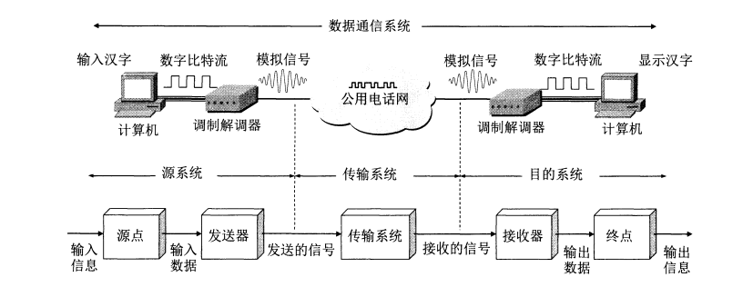

+ 源系统
  + 源点：产生数据，如输入汉字，计算机产生对应数字比特流
  + 发送器（调制器）：将数字比特流转换为模拟信号
+ 传输系统
+ 目的系统
  + 接受器（解调器）：模拟信号转为数字信号
  + 终点：接受数字信号，输出信息

> 2-03 解释名词：数据，信号，模拟数据，模拟信号，基带信号，带通信号，数字数据，数字信号，码元，单工/半双工/全双工通信，串行/并行传输

+ **通信的目的是传输消息**

+ 数据是运送消息的实体

  + 模拟数据：**连续**数据，即数据变化是连续的。如人们说话的声音数据是连续变化的
  + 数字数据：**离散**数据，即数据变化是离散的。如键盘输出的数字数据

+ 信号是**数据**电气或电磁的表现

  + 模拟信号（代表消息的参数取值连续）；离散信号（离散）
  + 基带信号：来自信源的信号，即基本频带信号。如计算机输出的代表各种文字或图像文件的数据信号

  + 带通信号：基带信号的频率范围搬移到较高的频段以便在信道传输。经过载波调制后的信号成为带通信号

+ 码元（code）：码的组成元素
  + 码是信号元素和字符间约定好的转换。如字符 A 的 ASCII 码为 1000001，其中每个二进制数字 0 或 1 均可称为码元（code element）
+ 通信交互方式
  + 单工通信：单向通信。如无线电广播，有线电广播，电视广播
  + 半双工通信：双向交替通信。对讲机
  + 全双工通信：双向同时交替。QQ 聊天

> 2-04 
>
> （1） 信道传输速率的影响因素
>
> （2）信噪比可否任意提高？
>
> （3）香农公式的含义
>
> （4）“比特/s”和”码元/秒“区别？

（1）信道传输速率的影响因素

+ **可通频率范围有限**：信道能通过的频率范围有限。**高频分量**往往无法通过信道，导致高频分量在传输时收到衰减，那么接受端收到的波形前沿和后沿变得不那么陡峭，码元间的**界限不再清晰**，这种现象叫做**码间串扰**
+ **存在噪声**：噪声随机产生，瞬时值有时很大，会对接收端对码元的判断产生错误

（2）信噪比可否任意提高？

+ 信噪比=信号传输功率/噪声功率
+ 信号传输功率不可能无限大，收到经济，材料，器件问题的限制
+ 噪声不可能完全消除，每个电子设备均有其固有噪声

（3）香农公式的含义

+ 只要信息传输速率低于信道的**极限信息传输速率**，就可实现无差错的传输。
+ 如何实现无差错传输，需自己探究

（4）“比特/s”和”码元/秒“区别？

+ 二进制编码时，二者的数值相同
+ 编码不同时，一个码元可对应多个比特（8进制中，1码元=3bit），或者多个码元对应一个比特

> 2-05 常用的传输媒体有几种，各有什么特点？

+ 导向传输媒体：电磁波沿着固体媒体传播
  + 双绞线：两根绝缘的铜线规则的绞合在一起
    + 特点：价格便宜；通信距离几到十几公里；
    + 无屏蔽和屏蔽双绞线：前者便宜，但传输距离和抗干扰性不如后者
  + 同轴电缆：内导体铜质芯线，绝缘层，网状编织的**外导体屏蔽层**，保护塑料外层
    + 良好抗干扰性（屏蔽层），
    + 有线电视网的居民小区
  + 光纤：利用光的全反射原理。低损耗，高带宽
  + 架空明线：电线杆上架设互相绝缘的明线。由于受天气影响大，现已很少使用
+ 非导向传输媒体：电磁波沿着自由空间传播，常叫做无线传输
  + 短波波段：通信距离远，但质量差
  + 微波波段：微波在空间是直线传播，因此传播距离受限，可通过接力方式延长。例如卫星通信

> 2-05 常见复用技术

+ 频分复用 FDM：独占一个频带
+ 时分复用 TDM：划分为等长的TDM帧，用户分时占用相同的频带宽度
+ 统计时分复用 STDM：动态分配时隙，通过集中器缓存实现
+ 波分复用 WDM：光的频分复用
+ 码分复用 CDM/码分多址CDMA：同一时间同一频带通信，但选用不同码避免互相干扰

> 常见有线宽带接入技术

+ 非对称数字用户线ADSL：用数字技术对现有的模拟电话用户线进行改造
+ 光纤同轴混合网HFC：有线电视网基础上开发
+ FTTx：例如光纤到户FTTH


## 计算题

### 奈氏准则&香农公式

自同步：从波形本身直接提取信号时钟频率

调制：

+ 基带调制（编码）
  + 不归零
  + 归零
  + 曼彻斯特编码
  + 差分曼彻斯特编码

+ 带通调制：调幅、调频、调相

**码元表示的比特数计算**

**奈氏准则**（规定码元传输速率上限）

（1）**低通**：B=2Wlog2 M （W：带宽Hz；M：**码元可表示的状态数，比如kbit，M=2^k**）

（2）**带通**：B=Wlog2 M （考试未说明优先使用）（B表示信息传输速率）

**香农公式**-**信噪比**：C=Wlog2(1+**S/N**) (bit/s) 


### CDMA码分多址

+ 码片序列：m bit码片序列，如4bit码片序列 `{-1,1,1,-1}`,其中 `-1` 表示比特0，1表示比特1
+ 码片序列与其它站的所有码片序列正交：即内积为0
+ 码片序列自身内积为1，与自身反码内积为-1

给定码片序列S={-1,1,1}，假设要传输 `1011`

+ 要发送的信号为 `-111 1-1-1 -111 -111`，0就用码片序列的反码表示
+ 若有多个站，直接把结果累加
+ 然后用码片与结果做内积，内积结果有三种情况
  + 0：没参与发送
  + 1：发送比特1
  + -1：发送比特0

**参考例题：2-16**

### CRC循环检验&奇偶校验？

# 数据链路层

## 重点

+ 协议基本问题
  + 封装成帧：给数据报加上首尾，定界符选择（特殊控制符/转义字符）
  + 透明传输：内容正确传输
  + 差错检测：奇偶校验；CRC 循环检测（模2运算，加法无进位，减法无借位）

+ 两种常用协议：点对点通信协议PPP， CSMA/CD
+ 重要问题：暴露站和隐蔽站问题
+ 广播域和冲突域
+ 适配器，转发器，集线器，网桥，以太网交换机的作用及使用场合，能自主设计网络

## 奇偶校验

奇校验：1比特个数为奇数

偶校验：1比特个数为偶数

一维只可检错

二维检错，纠错

## CRC计算

假设除数B=1010，其位数为n，要发送的数据为A=1111。计算步骤如下：

+ A后面加上n-1个0，成为S=1111000
+ 将S除以B（二进制除法，不考虑加法进位，减法借位），得到余数FCS
+ 将余数加到S末尾，变为最终发送的数据

如何验证：将受到的序列除以B（二进制除法）

+ 结果为0：正确接收
+ 非0：报错

**例题3-07**：要发送的数据为 `A=1101011011`，CRC生成多项式为 `P(X)=X^4+X+1`(1除数B=10011)

+ 求添加在后面的余数：1110
+ 数据传输中最后一个1变成0，接收端能否发现：能，余数为**011（注意3位）**，非0
+ 数据传输中最后两个1变成0，接收端能否发现：能，余数为101，非0
+ 使用CRC后，数据链路层是否为可靠传输：否，发现差错后仅简单丢弃，不保证发送方和接收方数据完全一样

**例题3-08**：要发送数据 `101110`，生成多项式为 `P(X)=X^3+1`（1001），求余数

+ 余数为 `011`（注意**前导0不能省略**，必须保证3位）

## PPP 协议

#### 帧定界问题

+ **异步-字节填充**
  + `0x7E` 转为 `0x7D,0x5E`
  + `0x7D` 转为 `0x7D,0x5D`
  + `x<0x20`, 转为 `0x7D,x`

例题3-09：PPP数据部分为 `7D 5E FE 27 7D 5D 7D 5D 65 7D 5E`

答案：`7E FE 27 7D 7D 65 7E`

+ **同步-零比特填充**
  + 连续 5 个比特 1 插入一个比特 0

例题3-10：原串为 `0110111111111100`，零比特填充后变成什么？若接受到PPP数据部分为 `0001110111110111110110`,删除加入的零比特

+ `011011111011111000`（连续5个1插入0）
+ `00011101111111111110`（连续5个1删除0）

## CSMA/CD协议

广播协议，以争用方式接入共享信道

+ 多点接入：总线型网络
+ 载波监听：检测信道，发送前或者发送中均需检测信道
+ 碰撞检测：边发送，边监听

虽然有监听，依旧会发生碰撞：传播需要时间

+ 争用期/碰撞窗口：2*（两端最远距离/传播速率）
+ 最小帧间间隔9.6us：保证接收端来得及清理缓存
+ 最小帧长：带宽*2\*信道长度/电磁波传播速度

**最短帧长例题3-20**：1 km 长，数据率为 1 Gbit/s，传播速率为 200 000 km/s，求最短帧长

+ 1 Gbit/s * 2 \* 1 km / 200 000 km/s=100 00 bit

比特时间：发送 1 比特所需时间

**集线器**

+ 物理星形网，**逻辑总线网**
+ 构成星形拓扑
+ 工作在**物理层**
+ 工作原理：仅简单转发比特，不进行碰撞检测

信道利用率=发送时间/（发送时间+传播时间）

### 二进制退避算法

+ k=Min(重传次数，10)

+ 从[0,2^k-1)随机选择一个数r

+ 等待时间= r*争用期时间（$2\sigma$，一般规定为 **512比特时间**）
+ 重传16次还不成功，报错

**例题3-22、3-24（略难）、3-25（略难）、3-34（综合题）**

## 局域网

局域网特点

+ 地理范围小，为一个单位所有
+ 广播十分方便

局域网的拓扑结构（以太网）

+ 总线
+ 环形网（令牌环）
+ 星形网（现在最流行，工艺进步-器件稳定）

以太网使用的信号编码：**曼彻斯特编码**（1：低-高；0：高-低）

+ 若数据发送速率为 10Mbit/s
+ 那么码元传输速率为 20Mbit/s（2个码元表示1个bit）

**10BASE-T**表示含义

+ 10：数据率为 10Mbit/s
+ BASE：基带信号
+ T：双绞线（Twisted-pair）

信道共享技术

+ 静态划分信道：如频分复用，时分复用，波分复用，码分复用。代价高，不利于局域网使用
+ 动态媒体接入控制
  + 随机接入：用户可随机发送信息，产生碰撞则均发送失败（CSMA/CD）
  + 受控接入：令牌环，集中控制的多点线路探询（轮询）

## 扩展以太网

### 物理层扩展

+ 转发器：收到一个就转发一个
+ 光纤：对集线器进行扩展，形成树形网络，例如使用主干集线器连接3个院系的集线器
  + 带宽降低，处于同一个碰撞域
  + 不可连接不同速率的网络

### 链路层扩展

+ 网桥：根据MAC帧的目的地址进行**转发和过滤**
+ 交换机：多接口网桥（把网桥淘汰）：收到一帧才进行转发
  + 全双工，并行
  + 独占媒体，无碰撞传输
  + **交换表自学习算法**
  + 不使用共享总线，无碰撞问题

#### 交换机自学习算法

#### 算法流程

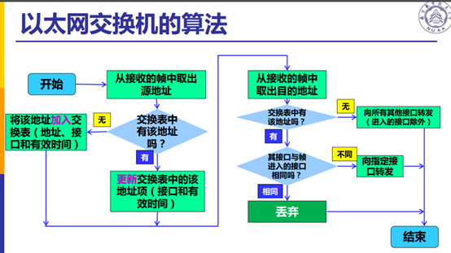

交换机接口收到来自外部的帧（接受到交换机内部的帧不执行以下算法）

+ 源地址
  + 已存在：更新接口和有效时间
  + 不存在：加入
+ 目的地址
  + 已存在，判断与进入的接口是否相同
    + 相同：丢弃
    + 不同：向指定接口转发
  + 不存在：向其它所有接口转发（除了进入的接口）

**交换机自学习存在问题**：存在兜圈子的问题，可用**生成树协议**方式避免

#### 例题


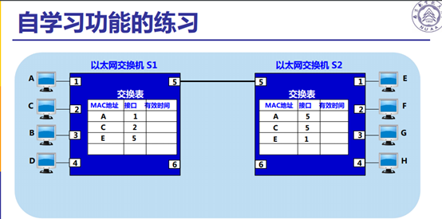

更多例题：3-33，**3-37，3-39**（值得一做的两道题）

## 冲突域/碰撞域 & 广播域

碰撞域：

+ **集线器、总线**连接的局域网处于**同一个碰撞域**（不可连接不同速率的局域网）
+ **网桥、交换机**连接的局域网处于**不同碰撞域**（可连接速率不同的局域网）

广播域：

+ 总线、星形、树形广播和碰撞一致
+ 交换机相连则处于同一广播域
+ （仅路由器能隔离广播域）

## CSMA/CA

无限局域网的协议。不同于有线局域网的 CSMA/CD

+ 难以检测
+ 发送时也要接受数据

**例题9-07**

### 隐蔽站 & 暴露站问题

隐蔽站：A和C同时向B发送数据，发生冲突，AC检查不到对方存在

暴露站：B向A发送数据，C想向D发送数据，可发现信道忙，无法发送，本质不影响

### 解决方案

RTS 和 CTS 帧

+ 发送前：发送 RTS 帧进行预约
+ 收到 CTS 才可发送

**例题9-09**：详细讲解两个问题并提出解决方案

### 整体流程


# 网络层

> 问题集
>
> 网络层作用？为什么？--历史发展
>
> 数据报服务用的协议是什么？--网际协议IP
>
> + 组成？为什么这么设计？如何实现？
>
> 功能是什么？
>
> 怎么用？
>
> 发展？
>
> 理论支撑？
>
> 怎么实现？

### 历史沿革

对于网络层向运输层提供的服务，存在争论：面向连接和无连接（**网络**还是**端系统-主机**负责可靠交付）

+ 面向连接（网络负责）：先模仿电信网络，建立一条**虚电路（逻辑电路**），再使用可靠传输协议
+ 无连接（主机负责）：无需建立通道，提供**无连接，尽最大努力交付的数据报服务**，将差错处理和流量控制留给传输层
  + **尽最大努力交付：不保证不重，不漏，不错，按时，有序**
  + 成本低廉，灵活易用

| 对比项目                   | 虚电路服务                                     | 数据报服务                                       |
| -------------------------- | ---------------------------------------------- | ------------------------------------------------ |
| 思路                       | 可靠通信由网络保证                             | 可靠通信由用户主机保证                           |
| 连接建立                   | 必须有                                         | 无                                               |
| 终点地址                   | 仅在连接建立阶段使用，每个分组使用短的虚电路号 | 每个分组均有终点完整地址                         |
| 分组转发                   | 同一虚电路的分组均按照同一路由进行转发         | 每个分组独立选择路由转发                         |
| 结点故障时                 | 通过故障结点的虚电路均无法工作                 | 出故障结点可能会丢失分组，一些路由可能会发生变化 |
| 分组顺序                   | 顺序到达终点                                   | 接受顺序不定                                     |
| 端到端的差错处理和流量控制 | 网络/用户主机负责                              | 用户主机负责                                     |

### 网际协议 IP

网际协议 IP 是 TCP/IP 最主要的两个协议之一，与其配套使用的还有三个协议

+ 网际控制报文协议 ICMP（Internet Control Message Protocol）
+ 网际组管理协议 IGMP（Internet Group Management Protocol)
+ 地址解析协议 ARP（Address Resolution Protocol）

```
//依赖层次关系，上层使用下层提供的服务
ICMP IGMP
	IP
	ARP
```

#### 虚拟互接网络

解决：如何连接异构网络？(逻辑整体)

##### 互联设备

将网络互相连接需要一些中间设备（中间系统/中继relay系统），具体五种如下

+ 物理层：转发器（repeater），集线器，中继器
+ 数据链路层：网桥/桥接器（bridge），交换机
+ 网络层：路由器（router）
+ 网桥+路由器：桥路器（brouter）
+ 网络层以上：网关（gateway）

##### 网络互连

+ 中继系统为转发器或网桥时，仅仅将网络扩大，依旧是一个网络，所以不称网络互连；

+ 网关复杂，用得少

因此**网络互连指得是用路由器进行网络互连和路由选择**

##### 虚拟互连网络

> + 虚拟互连网络就是逻辑互连网络，利用IP协议可将性能各异的网络在用户看来好像是一个统一的网络
> + IP网=IP协议+虚拟互连网络
> + 互联网=IP网+TCP协议

优点：屏蔽细节

#### IP地址编址方式

> IP地址：给每个互连在互联网上的主机或路由器的每个接口分配一个在全世界范围唯一的32位标识符。

> IP地址分配组织：互联网名字和数字分配机构ICANN（Internet Corporation for Assigned Names and Numbers）

IP地址的编址方式经历三个历史阶段：

+ 分类：最基本编址方法，1981年通过相应标准协议
+ 子网划分：最基本编址方法的改进，1985年通过RFC950标准
+ 构成超网（无分类）：无分类编址，1993年提出后快速推广应用

##### 分类

IP地址由网络号和主机号两部分组成，各自长度固定，5类格式如下：

> 二级IP地址 ::={<网络号>,<主机号>}


一些有趣的结论：

+ 一个局域网内的所有主机网络号相同，主机号不同（桥接）
+ 路由器至少连接两个不同网络，所以至少有两个不同的IP地址

##### 子网划分

在主机号中分出子网号，变成三级IP地址：

> 三级IP地址::={<网络号>,<子网号>,<主机号>}

若要使用子网，必须配置子网掩码，网络号和子网号对应的位均为1，主机号对应的位为0。两级IP地址，三级IP地址和子网掩码关系如下：


特点：

+ 子网对外透明，完全由内部划分
+ 增加灵活性
+ IP地址分类，计算，**最大主机数计算（记得减2，全0全1排除）**

##### 无分类

在**变长子网掩码VLSM**基础上研究出**无分类域间路由选择CIDR**(Classless InterDomain Routing)

重新回到二级IP地址：

> 二级IP地址::={<IP前缀>,<主机号>}

可使用斜线记法（slash notation），在IP地址后增加一个斜线`/`，然后写上前缀所占位数。如`255.255.1.1/20`表示前20位为IP前缀，后12位为主机号。

由于通过地址前缀可以表示很多路由，这种方式也称作**路由聚合**

**最长前缀匹配**

在路由进行选择时，由于目的IP地址不带有前缀长度信息，所以可能存在多种匹配地址，应选择匹配长度最大的路由地址。

##### 如何获取地址

+ Q1:网络如何获知IP地址对应的子网？
+ A1：从ISP地址空间获取分配的部分
+ Q2：ISP怎样得到地址块
+ A2：ICANN

##### 路由表查找算法--二叉线索树

类似哈夫曼前缀编码，用所有地址的唯一前缀构建一棵二叉线索树，左0右1，叶子结点为相应IP地址。

#### IP数据报格式

##### 问题驱动

> IP组成格式，各个字段含义，为何设置该字段？
>
> 首部长度单位4B，分片单位8B
>
> 首部校验和算法：16位二进制反码求和（为何不用CRC？）
>
> 为何分片？怎么分片？

##### 格式详解

> IP数据报=首部+数据部分，其中首部=固定部分（20B）+可变部分（变长）


+ **版本**：有4（IPv4）和6（IPv6）两个值。
+ **首部长度**：占4位，最大值表示15个单位，**每个单位为4B**，因此首部长度最大为4*15=60B。因为固定长度为4\*5=20B，所以首部长度取值范围`[5,15]`，若可选字段长度不是4的整倍数，则用尾部填充部分来填充。
+ **区分服务**：占8位，用来获得更好的服务，一般不用。
+ **总长度**：占16位，首部长度和数据部分长度的总和，**不超过最大传送单元MTU**
+ **标识**：一个计数器，标识当前数据报的唯一ID，便于在接受端重新组装在同一数据报的分片
+ **标志**：占3位，仅前两位有意义。
  + 首位MF（More Fragment)：MF=1表示后面还有分片；MF=0则表示没有
  + 中间位DF(Don't Fragment): DF=0表示可以分片
+ **片偏移**：占13位，较长的报文在分片后，某片在原报文数据部分中相对偏移。**8个字节为偏移单位。**
+ **生存时间**：TTL（Time To Live）指示数据报在网络中能经过的路由器数量的最大值。防止兜圈子。
+ **协议**：指出数据该上交给哪个协议，如网络层的ICMP、IGMP和传输层的UDP、TCP等
+ **首部检验和**：**只校验数据报首部，不校验数据部分**，为了减少工作量，不用复杂的CRC，而用以下简单算法：

> 二进制反码求和：从低位到高位逐列计算，0+0=0；0+1=1；1+1=0，产生进位1加入下一列。若最高位相加后产生进位，则将结果+1得到最终结果（不同于CRC二进制运算）

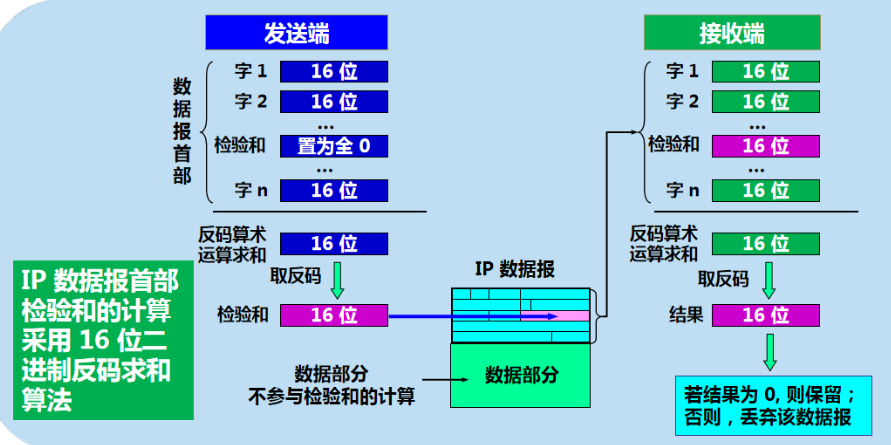

##### 分片举例

> 当数据报长度超过当前网络指定的MTU时，需要进行分片处理，即将原始数据报分成若干个数据报片。

> 数据报片=首部+数据部分，其中每个数据报片的首部是原始数据报的副本，只需改动其中部分的字段，如标志和偏移。

**题目描述**：原始数据报长度3820B，采用固定首部20B，MTU=1420B

+ 因为采用固定首部，所以原始数据报的数据部分长度为3800B
+ MTU=1420B，固定首部长度为20B，所以每个数据报分片的数据部分的最大长度为1400B。因此可将3800B分成1400B,1400B，1000B三个部分

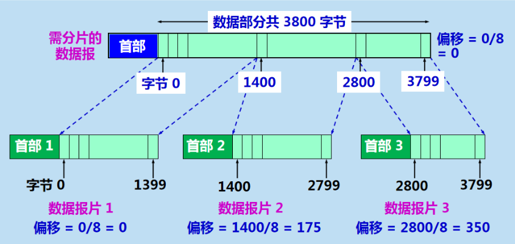

+ **将原始数据报首部复制为各个数据报分片首部，但必须修改相应字段**


### 地址解析协议 ARP

#### 功能

> 功能：将 IP 地址转换为对应的 MAC 物理地址


网络层完成主机间的通信，只保存起点和终点的主机IP地址，二者在传输过程中不变。而链路层连接相邻两点，所以存储的 MAC 地址会随着相邻结点的变化而变化。

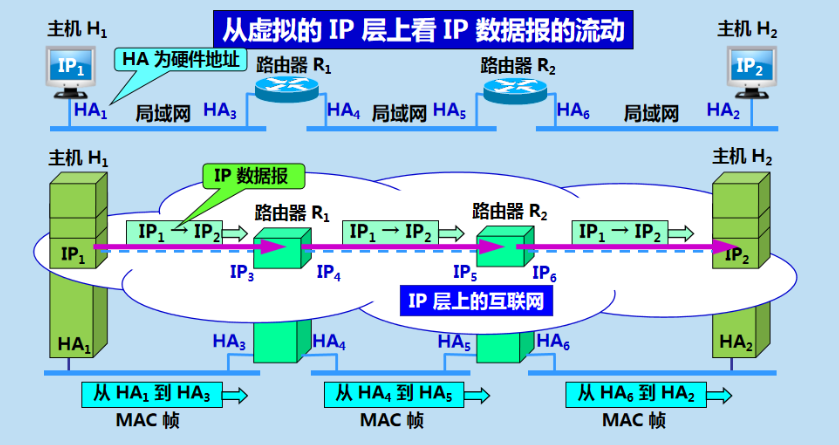

#### 实现ARP

每个主机均有一个ARP高速缓存，保存**所在局域网内**各主机和路由器的IP地址到MAC地址的映射，其算法流程如下：

> 若主机A已知目的主机B的IP地址IPB
> 先查询ARP高速缓存是否存在IPB
>
> + 存在：直接使用相应映射得到主机B的**MAC地址（物理地址**），并写入**MAC帧**，然后通过局域网将MAC帧发往该物理地址。
> + 不存在：主机A以广播方式发送**ARP请求分组**，主机B收到该请求后会发送**ARP响应分组**给主机A并告知MAC地址，随后主机A将主机B的IP地址到MAC地址的映射写入高速缓存

类似以太网交换机的交换表自学习算法，通过哈希表来提高查询效率，典型空间换时间策略

#### 注意点

+ ARP仅能直接解析位于同一个局域网内的地址（路由器卡广播）
+ 若主机A和主机B位于不同网络，则主机A需要先将分组转发给同网络的一个路由器（ARP广播找路由器硬件地址），再由路由器转发给目的网络，由目的网络完成剩下工作

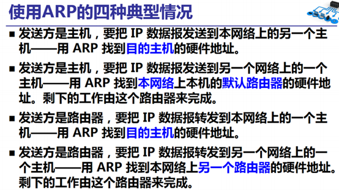

### 网际控制报文协议 ICMP

#### 作用

ICMP是为了更有效的转发IP数据报并提高交付成功的机会。

#### 格式

它封装在IP数据报的数据部分，因此不属于高层协议。

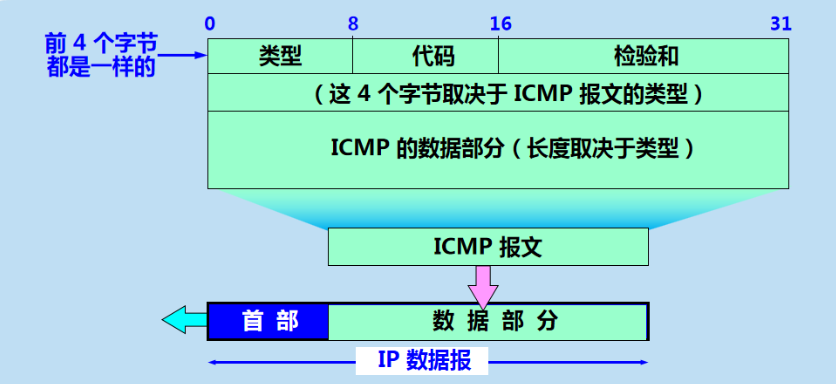

#### 种类

ICMP有两种类型的报文：

+ 差错报告报文
+ 询问报文

对应的取值和含义见下表：


#### 应用

##### （1）PING（Packet InterNet Groper）

+ **作用**：分组网间探测 PING 是用来检测两个主机间的连通性。

+ **原理**：使用ICMP的回送请求和回送回答报文实现
+ **特点**：是应用层直接使用网络层ICMP的例子（不通过运输层的TCP/UDP)

##### （2）TraceRoute

+ **作用**：用来跟踪一个分组从源点到终点的路径
+ **原理**：利用IP数据报中的**TTL字段**，ICMP**时间超过**差错报告报文和ICMP**终点不可达**差错报告报文实现。具体如下：

>从源主机向目的主机发送一系列的IP数据报，IP数据报中封装无法交付的UDP数据报
>
>+ 第一个数据报P1的生存时间TTL设置为1，到达路径上的第一个路由R1时，R1先收下它，再将TTL减1。由于TTL=0，R1把P1丢弃，并向源主机发送一个**ICMP时间超过差错报告报文**。
>+ 第二个数据报P2的生存时间TTL设置为2，先到达路径上的第一个路由R1，R1先收下它，TTL减1，并转发到路径上的第二个路由R2，R2收下P2，将TTL减1，因为TTL=0，所以R2丢弃P2，并向源点发送一个ICMP时间超过差错报告报文。
>+ 反复执行以上步骤，直至终点接受到最后一个报文时，TTL=1，此时既不将TTL减1,也不转发数据报，因为IP数据报中封装的是无法交付的UDP数据报，会向源点发送**ICMP终点不可达差错报告报文**。
>+ **算法结束后可得到路径上每个路由IP地址和到达每个路由器的来回时间**

### 路由器

#### 结构

路由器从实现功能上可划分为两部分：路由选择和分组转发。

分组转发结构可划分为三个部分：交换结构，一组输入和输入端口（物理端口）。

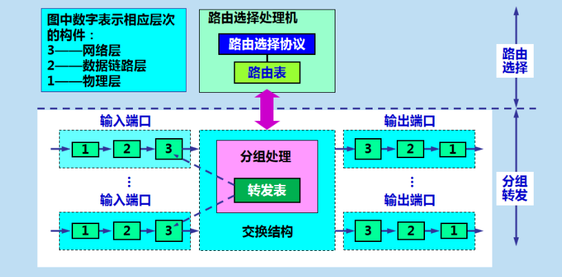

#### 路由选择协议

##### 协议分类（自适应）

> 自治系统AS：一个AS对外表现出单一和一致的路由选择的策略

+ 内部网关协议IGP（AS内部）：RIP，OSPF
+ 外部网关协议EGP（AS间）：BGP-4

**三种算法特点对比：习题解答P121**

##### RIP

RIP是分布式，基于距离向量的路由选择协议。本质Bellman-Ford算法，<目的网络，距离，下一跳>。

+ RIP一条路径最多包含16个路由器，仅适用于小型网络
+ 仅和相邻路由器交换信息
+ 交换的信息是本路由器所知道的全部信息，即路由表
+ 固定时间交换路由信息，一般 30 s

**更多例题：4-41,4-42**

算法流程

> 假设路由器A收到地址为B的相邻路由器发来的RIP报文，路由器A的路由表为RA：
>
> 1. 将RIP报文的距离字段+1，下一条字段全改为B
>
> 2. 对修改后的RIP报文的每个项目（每一条记录）重复以下步骤：
>
>    2.1. 若该项目的目的网络不存在于RA，将该项目插入RA。
>
>    2.1. 若该项目的目的网络存在于RA，设RA中的记录为R1
>
>    ​	2.1.1. 该项目的下一跳等于R1的下一跳，则更新该记录（总是保存最新的）
>
>    ​	2.1.2 .该项目的下一跳不等于R1的下一跳，若距离更小，则更新
>
> 3. 若3分钟还没收到相邻路由器的更新路由表，则将其记为不可达路由器，即将距离置为16
>
> 4. 返回

```cpp
//假设路由器A收到地址为B的相邻路由器发来的RIP报文，路由器A的路由表为RA：
将RIP报文的距离字段+1，下一条字段全改为B
for 记录Ri in 修改后的RIP报文:
	if (Ri.目的网络 不存在于 RA) 将RI插入RA
	else {
		假设RA中Rj.目的网络=Ri.目的网络
		if (Ri.下一跳地址 == Rj.下一跳地址) 用Ri替换Rj
		else if (Ri.距离 < Rj.距离) 用Ri替换Rj
	}
if (3分钟未收到相邻路由的交换报文) 置相邻路由的距离为16，表示不可达
```

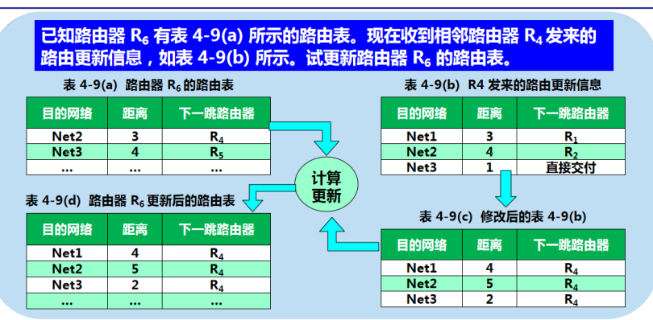


##### OSPF

Dijkstra算法

+ 向本自治系统的所有路由器发送消息，泛洪法
+ 仅发送部分信息，即与本路由器**相邻**的所有路由器的状态，间接可达的都不发
+ 发生变化才发送


##### BGP

#### 分组转发流程

> 特定主机路由：对特定的目的主机指定一个路由，便于控制和测试排错。
>
> 默认主机路由：默认使用的路由，对外连接数少时极为有效。

+ 从数据报首部提取目的主机的IP地址D，得到目的网络地址N（物理地址-ARP转换）
+ 若N就是与此路由器相连的某个网络地址，进行**直接交付**；
+ 若路由表中有目的地址为D的**特定主机路由**，则把数据报传送给表中所指明的下一跳路由器；
+ 若路由表中有到达网路N的路由，则把数据报传送给路由表所指明的下一跳路由器；
+ 若路由表有一个**默认路由**，则把数据报传送给路由表所指明的默认路由器；
+ 报告转发分组出错。

## 网络地址转换

+ 虚拟专用网VPN：两个本地主机通信，隧道技术实现（两层报首）

+ 网络地址转换NAT：本地与网络主机通信（NAT路由器-地址转换，不实用，每次仅支持一个主机通信）

+ 网络地址与端口号转换NAPT：增加端口号，支持多个主机同时通信

### NAT

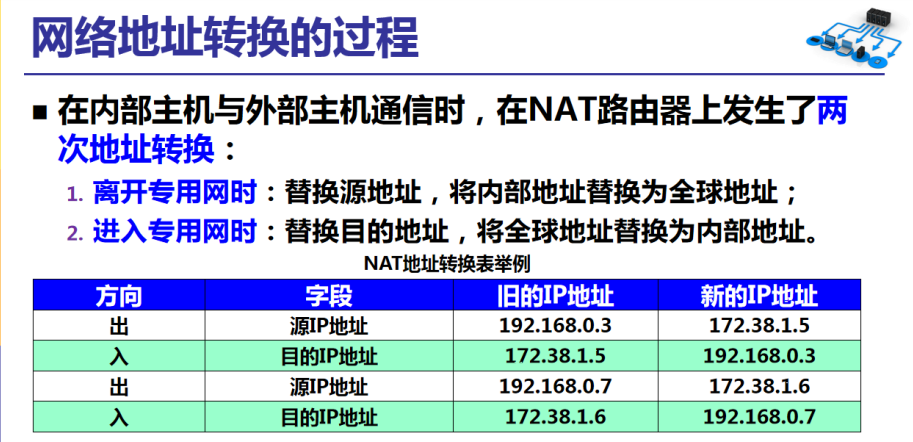

### NAPT


# 传输层

功能：传输层提供**应用进程间**的通信服务，而网络层提供**主机到主机间**的通信服务。


## 滑动窗口

+ 字节滑动：1个发送，1个接受
+ go-back-N：N个发送，1个接受，接收方累计确认，发现出错，发送发送方，然后重新发送已发送的数据
+ 选择重传：N个发送，N个接受，会缓存下来
  + 发送窗口=接收窗口
  + 发送窗口<接受窗口：效率低
  + 发送窗口>接受窗口：无法辨认新旧帧，如n=3，发送窗口=6，接受窗口=3，当发送为012345时，接受为670时，ACK5丢失，重传0，接受会缓存0，发送7缺失，接受7 [参考](https://blog.csdn.net/do_best_/article/details/79771841)
  + 发送窗口+接受窗口>2^n：举例说明错误，n=3，发送=接受=7，接受发送的ACK7丢失，
+ 重要问题
  + 发送端何时前进
  + 接收端何时前进，接收端缓存的必须在接受窗口内嘛？接受端何时发送ACK


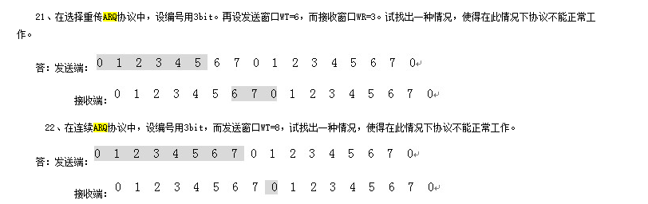

## 重要概念

#### 端口和socket

##### 端口

在OS中每个进程有唯一标识，但网络上OS类型很多，进程标识方法也不尽相同，为了便于不同OS间的进程通信，引入端口概念。

+ 端口是**软件端口**，作为应用进程和运输层的交互接口，而路由器和交换机上的端口是**硬件端口**。
+ 端口是16位的无符号数0~65535，分成两种三类

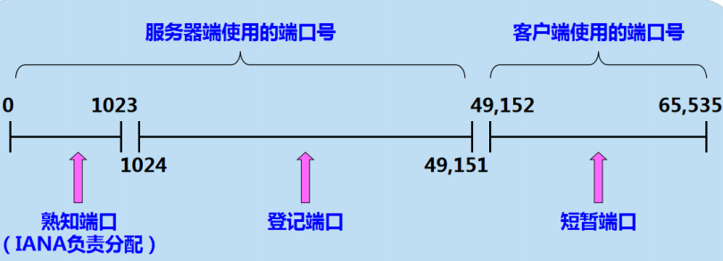

##### socket

不同主机的应用进程间进行通信，不仅要知道标识应用进程的端口号，也必须知道IP地址，二者组合起来就成了套接字，其格式如下：

> **socket ::= IP地址:应用进程端口号**

#### 复用和分用

二者均是一个二元关系，若存在两类端点A和B

+ 复用：多个A向一个B发送消息，即B被多个A复用（多个应用进程向一个传输层发送消息）
+ 分用：一个B向多个A发送消息，即B被分用（一个传输层将信息分发至不同应用进程）

## UDP

#### 特点

**用户数据报协议UDP**仅在IP数据报服务基础上增加两个功能：复用和分用；**差错检测（首部+数据**）

主要特点如下：

+ 无连接；尽最大努力交付，面向报文（IP特点）
+ **无拥塞控制**：网络拥塞不会影响源主机发送速率，适用于实时通信，如视频，音频（相对于TCP）
+ 首部短：仅8B，而TCP首部20B
+ 支持一对一，一对多，多对一，多对多通信

#### 格式

UDP首部占8字节，**源端口，目的端口，UDP用户数据报长度（首部+数据），检验和**四个字段各占2B。

其中伪首部仅用于计算当前的检验和而临时添加，不向上下传递。**IP数据报的检验仅检验其首部，而UDP检验其首部和数据部分。检验算法均采用16位二进制反码运算求和再取反码**


以下为UDP检验和计算实例


## TCP

#### 特点

**传输控制协议TCP**是面向连接的运输层协议，在无连接，不可靠的IP网络服务基础上提供可靠交付。

+ **面向连接；可靠交付**
+ 一对一；全双工通信（设置读写缓存）
+ **面向字节流**：重结果，轻过程（仅保证**发送方应用程序发送的字节流**和**接受方应用程序接受的字节流**完全一致，而不保证发送方发送的数据块和接受方接受数据块大小具有对应关系。比如发送方发送10个数据块，而接受方仅用4个数据块就完成交付，因为TCP具有读写缓存，能够自动控制报文大小）

**注意：虽然TCP面向字节流，但协议数据单位PDU是报文段**

TCP需解决三个重要问题

+ 可靠传输
+ 流量控制
+ 拥塞控制

#### 报首格式


各字段具体含义如下：

+ **源端口和目的端口**：分别填入发送方和接受方的端口号
+ **序号**：**本报文段数据部分的第一个字节的编号**。由于TCP面向字节流，所以字节流中的**每个字节均按顺序编号**（**包括首部**）。例如序号为101，表示当前报文段的第一个字节编号为101，若报文段长度为100，那么下一个报文段序号为101+100=201。
+ **确认号**：**期望收到的下一个报文段的序号**。例如接收方B收到来自发送方A的序号为101，长度为200的报文段，表明B正确接收来自A的200个字节数据，期望下一个数据字节编号是301，因此在B发送给A的确认报文段中将确认号置为301。
+ **数据偏移**：数据部分距离报文段起始位置的偏移地址，实际指首部的长度。
+ **确认ACK**（ACKnowledgement）：ACK=1时表示确认号有效，否则无效。TCP规定在建立连接后所有报文段的ACK均置1。
+ **同步SYN**（SYNchronization）：在连接建立时用来同步序号。
+ **终止FIN**（FINis）：释放一个连接。FIN=1时，表示此报文段的发送方的数据已发送完毕，要求释放运输连接。
+ **窗口**：接受方告诉发送方目前还可接受的最大数据量。因为接受方的缓冲区大小是有限的。比如一个确认报文中，确认号为101，窗口值为1000。这告诉发送方从序号101的字节开始，接受方还能接受1000个字节。
+ 其它可选项

#### 可靠传输

> 解决问题：在不可靠的传输信道上实现可靠传输

理想传输条件：

+ 传输无错：传输信道不产生差错
+ 速度匹配：不论发送方以多快速度发送数据，接收方均来得及处理接受到的数据

由于实际网络均无法满足以上两个条件，所以设计**可靠传输协议**来实现它们

+ 重传机制：出现差错时让发送方重新传输出错数据
+ 降速发送：接收方来不及处理接受的数据时，让发送方降低发送速率

##### 停止等待协议

> 思想：发送方每次发送完一个分组就停止发送，等待接收方确认，在收到确认后再次发送下一分组。

**超时自动重传+分组和确认编号**实现差错处理：即发送端在一定时间内未收到确认报文，自动重新传输报文段。

三种常见传输异常情况：

+ 接收方出现差错（发送端重新传输报文）
  + 数据丢失
  + 数据出错
+ 确认丢失（确认报文丢失，接受端会丢弃收到重复报文，并再次发送确认报文）
+ 确认迟到（接收端重复接受确认报文，简单丢弃即可）

上述这种可靠传输协议称作**自动重传请求ARQ(**Automatic Repeat reQuest)。发送端自动重新传输数据，而不需要请求端发送重传请求。

**流水线改进**

停止等待协议的优点是简单，缺点是**信道利用率太低**，因此可用流水线思想改进，在收到确认前可连续发出多个分组。

##### 连续ARQ-滑动窗口协议实现

| 对比项目\协议类型 | 连续ARQ协议       | 停止等待协议     |
| ----------------- | ----------------- | ---------------- |
| 发送的分组数量    | 一次发送多个分组  | 一次发送一个分组 |
| 传输控制          | 滑动窗口协议      | 停止等待协议     |
| 确认              | 单独+**累积确认** | 单独确认         |
| 超时定时器        | 每个发送分组      | 每个发送分组     |
| 编号              | 每个发送分组      | 每个发送分组     |
| 重传              | 回退N，多个分组   | 一个分组         |

窗口是缓存的一部分，用来暂存字节流。TCP两端均维护一个发送和接收窗口（全双工通信），接收方通过报文段中的确认号和窗口字段告诉发送方窗口的起点和大小，发送方根据这些值和其它信息设置自己的窗口。

发送窗口内的字节都允许被发送，接收窗口内的字节均允许被接收。

+ 若发送窗口左侧的字节已发送并且已收到确认，那么将发送窗口向右滑动一定距离，直到左部第一个字节不是已发送并且已确认状态；
+ 接收窗口的滑动类似，接收窗口左部字节已确认发送并交付主机，就向右滑动接收窗口。

**累积确认**：接收窗口只会对窗口内最后一个按序到达的字节进行确认。例如接收窗口已接收到{30,32,33}，其中{30}按序到达，{32}可能丢失或堵塞，{33,34}因此不是按序到达，所以只对字节30进行确认。发送方得到一个字节的确认后，就知道该字节之前的所有字节均已被接收。

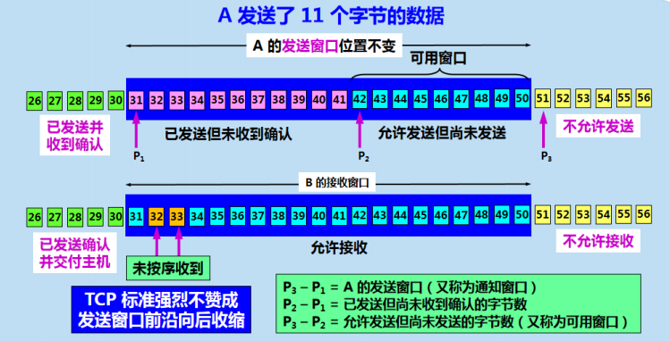

+ **超时重传时间RTO设置**

超时重传时间太长导致网络空闲时间过大，降低传输效率；时间太短则引起许多不必要的重传，增大网络负荷。因此TCP采用一种**自适应算法**，记录一个报文段的发出时间和收到相应确认的时间，两个时间的差值就是报文段的往返时间RTT。

TCP保留RTT的一个**加权平均往返时间RTTs**，其初始值为第一个RTT样本，之后的更新公式如下：

$新的RTT_s=(1-\alpha)\times(旧的RTT_s)+\alpha\times(新的RTT样本),0\leq\alpha<1$

> 若$\alpha$越接近0，表示RTT值更新越慢，若越接近1，则表示RTT值更新越快。
>
> RFC6298推荐的$\alpha$值为1/8

**超时重传时间RTO**(Retransmission Time-out)应略大于上面的加权平均往返时间RTTs，RFC6298推荐以下计算公式：

$RTO=RTT_s+4\times RTT_D$

其中$RTT_D$是RTT的**偏差的加权平均值**，初始值为第一个RTT样本值的一半，之后的更新公式如下：

$新的RTT_D=(1-\beta)\times(旧的RTT_D)+\beta\times |RTT_s-新的RTT样本|$

> RFC6298推荐$\beta$值为1/4

**往返时间RTT测量**

**Karn算法**：在计算平均往返时间RTT时，只要报文段重传，就不采用其往返时间样本。

**修正的Karn算法**：报文段每重传一次，就把RTO增大一些，即$新的RTO=\gamma\times(旧的RTO)$。其余情况按原有公式计算。

+ **选择确认SACK(**Selective ACKnowledge)

若收到的报文段无差错，只是未按序到达，中间还缺少一些报文段，使用SACK即可实现发送端仅重新传输缺少数据。

#### 流量控制

> **解决问题**：令发送方发送速率不要太快，让接受方来得及处理
>
> **原理**：利用滑动窗口机制，通过设置确认报文段中的窗口字段，来影响发送方传输速率。当窗口字段为0，发送端停止发送数据。

##### 死锁问题--持续计时器

**死锁问题描述**：当发送方收到零窗口值的报文段，发送方停止发送；不久，接收方已**成功接受并交付**窗口中**所有**字节，而发送的确认报文段却在传输中丢失。此时发送端等待非零报文通知，而接收方等待接受数据，二者陷入死循环。

**解决方法--持续计时器**：为每个TCP连接设置一个持续计时器（persistence timer），当TCP一方收到零窗口通知时，启动持续计时器，达到一定时间就向另一方发送**零窗口探测报文段(1B数据)**，对方就在确认报文段中给出当前窗口值，若为0，重置持续计时器；若非0，则打破死锁。

##### 传输效率

（1）三种TCP报文发送时机的控制机制

+ **定长**发送：TCP维持一个变量，其值为最大报文长度MSS。只要缓存数据达到**MSS**字节时，就装入报文段发送
+ **按需**发送：按照应用进程的要求发送报文段，即TCP支持的**推送PUSH**操作。
+ **定时**发送：发送方的一个计时器到达期限，将缓冲区字节（不超过MSS）装入报文段发送。

（2）**糊涂窗口综合症**

> 定义：每次仅发送一个或很少字节，导致有效数据传输效率低下的现象
>
> 解决思路：积累一定数据再发送（缓存思想）

+ **发送方糊涂窗口综合症**

当发送方应用进程将要发送数据逐字节送到TCP发送缓存时，可用**Nagle算法**解决，其流程图如下：


+ **接收方糊涂窗口综合症**

接收方缓冲区已满，发送零窗口报文，此时接收方应用进程逐字节读取数据。

**解决思路**：让接收方等待一段时间，当出现以下两种情况时，再发送确认报文段

+ 接受缓存已有足够空间容纳最长的报文段
+ 接受缓存已有一半的空闲空间

#### 拥塞控制

> 拥塞出现原因：资源需求>可用资源
>
> 拥塞控制：当网络出现拥塞，分组将会丢失，发送方会重传数据，进一步加重拥塞。因此需控制发送方的发送速率，这一点与流量控制相似，流量控制是保证接受方来得及接受数据（**端到端**），而拥塞控制是为了降低整个网络的拥塞程度（**全局性**）。

拥塞控制主要通过四个算法组合实现

> 发送方维护一个拥塞窗口（cwnd）状态变量；慢开始门限ssthresh

+ 慢开始：初始令cwnd=1，接收到确认后cwnd将加倍，因此cwnd成2的指数倍增长。当cwnd超过慢开始门限ssthresh时，转入拥塞控制
+ 拥塞避免：cwnd每次增加1
+ 快速重传：接收方每收到一个报文段都应该发送确认报文，当发送方接受到3次相同报文时，进入快速恢复。
+ 快速恢复：ssthress=cwnd/2，cwnd=ssthresh，进入拥塞避免

拥塞控制的算法流程图如下：


##### 主动队列管理AQM

**问题描述**：以上TCP拥塞控制并未和网络层采用的相应策略联系起来，实际上他们关系紧密。路由器通常使用先入先出FIFO策略处理分组，当队列已满时，以后再到达的分组会直接被丢弃，这叫做尾部丢弃策略。这些被丢弃的分组将导致发送端出现超时重传，进入慢开始状态，TCP发送端发送速率降低。

**解决思路**：主动队列管理AQM是在队列长度**达到某个警惕值**时开始**主动丢弃**分组，降低发送端发送速率，以此避免大规模拥塞。其效果能减少20%的拥塞。

**具体实现**：**随机早期检测RED**是路由器维护两个阀值，最小门限THmin，最大门限THmax，对每一个到达的分组计算平均队列长度Lav：

+ Lav<THmin：将新到达的分组加入队列进行排队
+ Lav>THmax：丢弃新到达的分组
+ THmin<=Lav<=THmax：以一定概率P丢弃分组


#### 运输连接管理

TCP面向连接，包含**连接建立，数据传输，连接释放**三个过程，而运输连接管理就是保证连接的建立与释放均可正常进行。

##### 三报文握手（三次握手）

TCP建立连接的过程又称三报文握手，即一次握手交换3次报文。

其中**第三次握手**主要是为了避免**失效连接请求**达到服务器，让服务器错误打开连接，造成资源浪费。


+ 服务器首先建立传输控制块TCB，进入监听LISTEN状态，等待客户端请求。
+ 客户端进程建立传输控制块TCB，发送请求报文段，其中同步SYN=1，选择初始序号seq=x。
+ 服务器若同意接收请求报文段，向A发送确认报文段，其中同步SYN=1，ACK=1，确认号x+1，选择初始序号seq=y。
+ A收到B的确认报文后，需再次向B发送确认报文段，ACK=1，序号seq=x+1，确认号ack=y+1。
+ B收到A的确认报文后，连接建立。

##### 四报文握手（四次握手）

连接释放的过程称作四报文握手。


+ A发送连接释放报文，终止FIN=1
+ B收到后发出确认报文，A接受后TCP处于**半关闭状态**，即B能向A发送数据，而A不能像B发送数据。
+ 当B将剩余数据发送完毕时，向A发送连接释放报文，FIN=1
+ A接收到连接释放报文后再次发送确认报文，进入TIME-WAIT状态，等待2MSL（最大报文段存活时间）后进入释放连接。
+ B收到A的确认后释放连接。

**TIME-WAIT作用**

+ **确保B能够收到A最后的ACK报文段**。A发送给B的最后一个ACK报文段有可能丢失，B会出现超时重传，若A不等待，那么B不会接收到重传ACK报文，因此B无法正常释放连接。
+ **消耗失效连接请求报文段**。等待一段时间，令本连接中所有的失效连接请求报文段均消失在网络中，避免其出现在下一次连接中。若不等待，直接关闭，迟到的连接请求达到服务端后，导致服务端提前接受连接请求，导致错误。

##### TCP有限状态机

+ 粗线表示客户进程正常变迁
+ 虚线表示服务器进程正常变迁
+ 细线表示异常变迁


# 应用层

### 域名系统DNS 

+ 作用：将域名转换为 IP 地址

+ 背景：纯数字难以记忆，名字便于记忆使用和传播

+ 域名分类：顶级，二级，三级....（树状层次关系）
+ 域名格式：...三级.二级.顶级（逆序点分排列），比如`www.baidu.com`，`mail.nuaa.edu.cn`

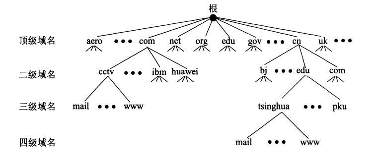

+ 域名分配管理：顶级域名有ICANN分配，其余的域名由其上一层域名管理机构分配。比如二级域名由相应的一级域名管理机构分配。

+ 域名解析原理：可通过 TCP/UDP 向域名服务器发送请求获取 IP 地址，端口为 53。通常使用效率高的 UDP，但需要自己处理超时和重传问题。以下两种情况需用TCP：
  + 返回响应报文超过512B（UDP报文最大容量512B）
  + 区域传送（**主域名服务器**向**辅助域名服务器**传送变化的那部分信息--**备份数据**）

+ 域名服务器分类：根域名服务器，顶级域名服务器，权限域名服务器，本地域名服务器（树状层次结构）

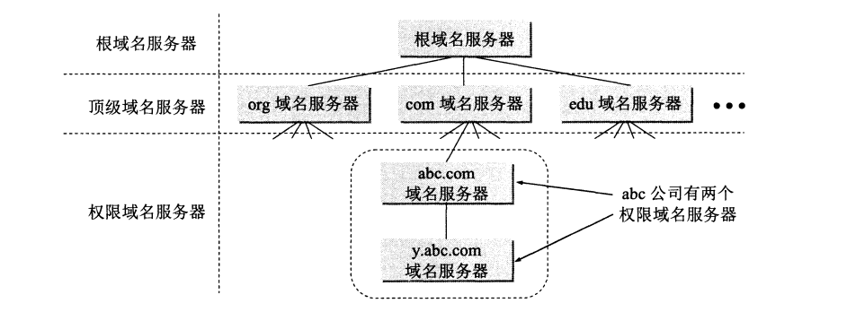

+ **查询原理**：递归查询（A问B，B问C，依次类推），迭代查询（每次都是A发起查询）
  + 递归：友好性，但是扩展性低（每个服务器最多支持4个操作）
  + 迭代：友好性差，但扩展性高（每个服务器最多支持2个操作）
  + 迭代+递归：权衡利弊（软件设计思想）

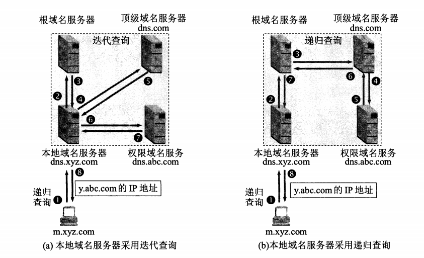

+ 高速缓存：加速解析效率，即将最近访问过的域名及对应的IP保存，在有效时间内查询可直接返回

# socket

> [五种IO模型概述](http://cyc2018.gitee.io/cs-notes/#/notes/Socket)
>
> [五种IO模型详解](https://blog.csdn.net/historyasamirror/article/details/5778378)
>
> [IO复用实现-select/poll/epoll](http://www.ulduzsoft.com/2014/01/select-poll-epoll-practical-difference-for-system-architects/)
>
> [python socket TCP实现](https://www.liaoxuefeng.com/wiki/1016959663602400/1017788916649408)
>
> [网络编程系列教程](https://www.cnblogs.com/DOMLX/p/9663167.html)
>
> [参考实现IO复用](https://segmentfault.com/a/1190000003063859)
>
> 《Unix 网络编程卷1》

### 五种I/O模型及对比

一个输入通常涉及两个步骤：

+ 等待数据准备：等待所需网络分组均到达时，将数据复制到内核缓冲区中。
+ 内核数据拷贝到进程（用户空间）：将数据从内核缓冲区复制到应用进程缓冲区。（**具体I/O操作**）

在Unix系统下有五种I/O模型：

>同步I/O：执行**具体I/O操作**时，**阻塞**请求进程
>
>+ 阻塞I/O
>+ 非阻塞I/O
>+ 信号驱动I/O
>+ 复用I/O
>
>异步I/O：执行具体I/O操作时，**不阻塞**请求进程

#### 阻塞I/O

核心思想：请求应用进程被阻塞，直到数据从内核缓冲区复制到应用进程缓冲区中才返回。

+ **CPU利用率高**：仅仅请求应用进程被阻塞，不影响其它应用进程，因此不消耗CPU时间。
+ 具体编程时，系统调用`recvfrom`用来接收Socket传来的数据，并复制到请求应用进程缓冲区buf中。


#### 非阻塞I/O

轮询思想（polling）：请求应用进程执行系统调用`recvfrom`后，若数据未准备好，内核返回一个错误码，应用进程可以继续执行，但需不断的执行系统调用来获知I/O是否完成。

+ CPU利用率低：轮询带来的重复系统调用消耗更多资源。


#### 信号驱动I/O

思想：应用进程使用`sigaction`系统调用，内核立即返回，应用进程可继续执行。内核在数据到达时向应用进程发送SIGIO信号，应用进程收到SIGIO使用系统调用`recvfrom`将数据从内核赋值到应用进程中。

一句话概括：用信号通知应用进程何时开始I/O操作。

+ 相对于非阻塞I/O的轮询方式，信号驱动I/O利用率高。


#### 复用I/O

思想：使用select/poll/epoll等待数据，并且可以等待多个套接字中的任何一个变为可读。这个过程会被阻塞，当某个套接字可读返回时，再用系统调用`recvfrom`把数据从内核复制到进程中。

+ 优点：开销小，可令单进程有处理多个I/O事件的能力，即**事件驱动I/O**。若一个Web服务器没有I/O复用，每个Socket连接均需创建一个线程去模拟，I/O复用即可省去线程创建，撤销和切换的开销。


#### 异步I/O

思想：应用进程执行`aio_read`系统调用会立即返回，应用程序可继续执行，内核会在所有操作完成后向应用进程发送信号。

**信号驱动I/O和异步I/O对比**

+ 信号驱动：通知应用进程何时开始I/O操作
+ 异步I/O：通知应用进程何时结束I/O操作


#### 五种I/O模型比较

+ 同步I/O：执行**具体I/O操作**时，**会阻塞**请求应用进程。
+ 异步I/O：执行具体I/O操作时，**不会阻塞**请求应用进程。

非阻塞，信号驱动，异步I/O在第一阶段应用进程均不会被阻塞。


### 复用I/O实现

复用I/O有三种常见实现，按照出现顺序罗列如下：

+ select
+ poll
+ epoll

#### select

#### poll

#### epoll

# 超文本传输协议Http

作用：是一个基于TCP的简单的请求-响应协议，规定浏览器和万维网服务器间的通信规则。

特点：无状态

### 基本概念

#### URI

Http本质是向服务器请求资源，那么给资源一个唯一标识就称作**统一资源标识符URI**，可细分为URL和URN。

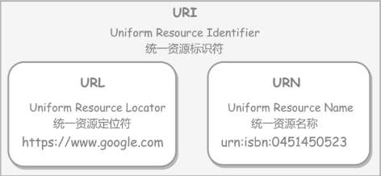

#### 请求和响应报文格式

总体由三部分组成：

+ 开始行：区分该报文是请求还是响应
+ 首部行：key:value格式，设置相应内容
+ 实体主体：消息内容主体

**注意**：编程时可根据空行`CRLF`分割头部和消息体（实体主体）

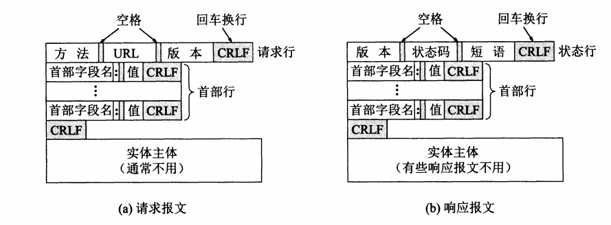

对应实例如下：

+ 请求报文


+ 响应报文


#### http方法

位于http请求报文中的请求行，第一个字段就是方法。

##### 常见方法

| 方法名  | 作用                           | 解释                                                         |
| ------- | ------------------------------ | ------------------------------------------------------------ |
| GET     | 获取资源                       | 网络请求中最常用方法                                         |
| HEAD    | 获取报文首部                   | 类似GET，但不返回报文实体主体部分，用于确认URL有效性和资源更新的日期时间 |
| POST    | 传输实体主体                   | 传输数据，例如表单提交                                       |
| PUT     | 上传文件                       | **自身不带验证机制**，任何人均可上传，不安全，不使用         |
| PATCH   | 修改部分资源                   | PUT仅能完全替代原始资源，不支持部分修改                      |
| DELETE  | 删除文件                       | 与PUT功能相反，且也**不带验证机制**                          |
| OPTIONS | 查询支持方法                   | 查询URL能够支持的方法                                        |
| CONNECT | 与**代理服务器**通信时建立隧道 | 使用**SSL**(Secure Sockets Layer)和**TLS**(Transport Layer Security)协议把通信内容加密后经网络隧道传输 |
| TRACE   | 追踪路径                       | 服务器将通信路径返回客户端，一般不用，容易受到**XST**攻击（Cross-Site Tracing，跨站追踪） |

##### GET和POST对比

| 对比项目\请求方法 | GET                                                          | POST                                         |
| ----------------- | ------------------------------------------------------------ | -------------------------------------------- |
| 作用              | 获取资源                                                     | 传输实体主体                                 |
| 参数位置          | 附加于URL上                                                  | 存储于实体主体                               |
| 安全性            | 安全（不改变服务器状态，仅可读，HEAD/OPTIONS）               | 不安全（改变服务器状态，PUT，DELETE，PATCH） |
| 幂等性            | 是                                                           | 否                                           |
| 响应可缓存        | 满足三个条件：GET/HEAD；响应状态码可缓存；响应报文的Cache-Control指定 | 多数情况不可缓存（PUT，DELETE一定不课缓存）  |
| XMLHttpRequest    | Header和Data一起发送                                         | 先发Header，再发Data                         |

**XMLHttpRequest**：它是一个API，为客户端提供在客户端和服务器之间传输数据的功能。它提供了一个通过URL来获取数据的简单方式，并且不会更新整个页面，使得网页仅更新一部分页面而不会打扰到用户，在AJAX中被大量使用。

#### http状态码

位于http响应报文的状态行，状态码后紧跟原因短语，用来告知客户端请求结果。

| 状态码 | 类别                       | 含义                                 |
| ------ | -------------------------- | ------------------------------------ |
| 1xx    | Informational（信息性）    | 接受的请求正在处理                   |
| 2xx    | Success（成功）            | 请求正常处理完毕                     |
| 3xx    | Redirection（重定向）      | 需要进行附加操作来完成请求           |
| 4xx    | Client Error（客户端错误） | 服务器无法处理请求（客户端请求出错） |
| 5xx    | Server Error（服务器错误） | 服务器处理出错                       |

以下为常见的状态码及其含义

##### 1xx信息

+ 100 Continue：表明到目前为止一切正常，客户端可继续发送请求或忽略该响应

##### 2xx成功

+ 200 OK：请求处理成功
+ 204 No Content：请求已成功处理，但返回的响应报文不包含实体主体（HEAD？）
+ 206 **Partial** Content：表示客户端进行了**范围请求**，响应报文包含由`Content-Range`指定范围的实体内容。

##### 3xx重定向

+ 301 Moved Permanently：永久性重定向
+ 302 Found：临时性重定向
+ 303 See Other：功能与302一样，但**明确要求客户端使用GET**方法。
+ 304 Not Modified：如果请求报文首部包含一些条件，例如`If-Match,If-Modified-Since,If-None-Match,If-Range,If-Unmodified-Since`，若不满足条件，服务器返回304状态码。
+ 307 Temporary Redirect：临时重定向，类似302，但要求浏览器**不会把重定向请求的POST改为GET方法**。
+ **注意：虽然HTTP协议规定301,302状态下重定向不允许把POST改为GET，但大多数浏览器会在301,302状态下把重定向的POST方法改为GET方法。**

##### 4xx客户端错误

+ 400 Bad Request：请求报文存在语法错误。
+ 401 Unauthorized：发送的信息需要有认证信息（BASIC认证，DIGEST认证）。若之前已经发送过一次请求，则表示用户认证失败。

+ 403 Forbidden：请求被拒绝。
+ 404 Not Found：未找到

##### 5xx服务器错误

+ 500 Internal Server Error：服务器正在执行请求时发生错误。
+ 503 Service Unavailable：服务器处于超负荷/停机维护状态，无法处理请求。

#### http首部

存在4中首部字段：通用首部，请求，响应和实体首部字段。

各种首部字段及其含义如下（**不需全记，仅供查阅**）

##### 通用首部字段

| 首部字段名        | 含义                                       |
| ----------------- | ------------------------------------------ |
| Cache-Control     | 控制缓存                                   |
| Connection        | 控制不再转发给代理的首部字段，管理持久连接 |
| Date              | 创建报文的日期时间                         |
| Pragma            | 报文指令（编译注释）                       |
| Trailer           | 报文末端的首部一览                         |
| Transfer-Encoding | 指定报文主体传输编码方式                   |
| Upgrade           | 升级为其它协议                             |
| Via               | 代理服务器相关信息                         |
| Warning           | 错误通知                                   |

##### 请求首部字段

| 首部字段名          | 含义                                          |
| ------------------- | --------------------------------------------- |
| Accept              | 用户代理(浏览器)可处理的媒体类型              |
| Accept-Charset      | 优先的字符集(英文+标点符号)                   |
| Accept-Encoding     | 优先的内容编码(ASCII，GBK...)                 |
| Accept-Language     | 优先的语言（自然语言）                        |
| Authorization       | Web认证信息                                   |
| Expect              | 期待服务器的特定行为                          |
| From                | 用户的电子邮箱地址                            |
| Host                | 请求资源所在服务器                            |
| If-Match            | 比较实体标记（ETag）                          |
| If-Modified-Since   | 比较资源的更新时间                            |
| If-None-Match       | 比较实体标记（与If-Match相反）                |
| If-Range            | 资源未更新时发送实体Byte的范围请求            |
| If-Unmodified-Since | 比较资源的更新时间（与If-Modified-Since相反） |
| Max-Forwards        | 最大传输逐跳数                                |
| Proxy-Authorization | 代理服务器要求客户端的认证信息                |
| Range               | 实体的字节范围请求                            |
| Referer             | 对请求中URI的原始获取方                       |
| TE                  | 传输编码的优先级                              |
| User-Agent          | HTTP客户端程序的信息                          |

##### 响应首部字段

| 首部字段名         | 含义                         |
| ------------------ | ---------------------------- |
| Accept-Ranges      | 是否接受字节范围请求         |
| Age                | 推算资源创建经过时间         |
| ETag               | 资源的匹配信息               |
| Location           | 令客户端重定向值指定URI      |
| Proxy-Authenticate | 代理服务器对客户端的认证机制 |
| Retry-After        | 对再次发起请求的时机要求     |
| Server             | HTTP服务器的安装信息         |
| Vary               | 代理服务器缓存的管理信息     |
| WWW-Authenticate   | 服务器对客户端的认证信息     |

##### 实体首部字段

| 首部字段名       | 含义                             |
| ---------------- | -------------------------------- |
| Allow            | 资源可支持的HTTP方法（HEAD方法） |
| Content-Encoding | 实体主体适用的编码方式           |
| Content-Language | 实体主体的自然语言               |
| Content-Length   | 实体主体的大小                   |
| Content-Location | 替代对应资源的URI                |
| Content-MD5      | 实体主体的报文摘要               |
| Content-Range    | 实体主体的位置范围               |
| Content-Type     | 实体主体的媒体类型               |
| Expires          | 实体主体过期的日期时间           |
| Last-Modified    | 资源最后被修改的日期时间         |

### http连接管理

存在三种逐步改进的连接方式：

+ **短连接**：一次TCP连接仅可进行一次HTTP通信。当浏览器访问的WEB页面存在多类型资源，需要重复建立TCP连接进行请求。
+ **长连接**：一次TCP连接可进行多次HTTP通信。
+ **流水线**：同一条**长连接上连续发出请求，而不用等待响应返回**，可减少迟延。因为默认HTTP请求是按顺序发出，下一个请求只有在当前请求收到响应后才能发出。因为网络延迟和带宽限制，下一个请求被发送之前，需要等待很长时间。

注意点：

+ 从HTTP/1.1开始默认为长连接，若要断开连接，需客户端或服务器端提出端开，使用`Connection: close`
+ 在HTTP/1.1之前默认是短连接，若要使用长连接，需使用`Connection: Keep-Alive`。

### Cookie

**背景**：**HTTP协议无状态**，主要是为了让HTTP协议尽可能简单，使它能够处理大量事务，因此**HTTP/1.1引入Cookie**来保存状态信息。

**思想**：Cookie是服务器发送到用户浏览器并保存在本地的一小块数据，它会在浏览器之后访问同一个服务器时被加入请求中，用于告知服务器两个请求是否来自同一个浏览器。

**缺点**：由于之后每次请求都需要携带Cookie数据，因此会带来额外性能开销（尤其是移动环境下）

**发展**：因为早初没有其它合适的客户端存储方式，Cookie作为唯一的存储方式而流行一时。随着现代浏览器支持各种各样存储方式，Cookie逐渐被淘汰。新的浏览器API已经运行开发者直接将数据存储于本地，如使用`Web storage API`（本地存储和会话存储）或`IndexedDB`。

#### **用途**

+ 会话状态管理（如用户登录状态，购物车，游戏分数）
+ 个性化设置（如用户自定义设置，主题）
+ 浏览器行为跟踪（如跟踪分析用户行为）

#### 创建过程

+ 获取：服务端发送的响应报文中包含`Set-Cookie首部字段`，客户端得到响应报文后将Cookie内容保存于浏览器中。
+ 携带：客户端之后对同一个服务器发送请求时，会从浏览器取出Cookie信息并通过`Cookie请求首部字段`发送给服务器。

```cpp
服务端-响应报文(Set-Cookie)-浏览器(Cookie内容)-客户端-请求报文(Cookie字段)
```

#### 分类

+ 会话期Cookie：仅在会话期有效，浏览器关闭后被自动删除。
+ 持久性Cookie：指定过期时间（Expires）或有效期（max-age）

```cpp
Set-Cookie: id=a3fWa; Expires=Wed, 21 Oct 2015 07:28:00 GMT;
```

#### 作用域

**Domain标识**指定了哪些主机可以接受Cookie。

+ 若不指定：默认为当前文档的主机（不包含子域名）。
+ 若指定：包含子域名。如设置`Domain=baidu.com`，则Cookie也包含在子域名`baike.baidu.com`中。

**Path标识**指定了主机下的哪些路径可以接受Cookie。即URL的路径必须存在于请求的URL中。用字符`%x2F("/")`作为路径分隔符，子路径也会被匹配。例如，设置`Path=home`，则以下地址均会被匹配：

+ `/home`
+ `/home/me`
+ `/home/me/diary`

#### HttpOnly&JavaScript&Secure

+ 标记为`HttpOnly`的Cookie不能被JavaScript调用。
+ 浏览器可通过`document.cookie`API访问非`HttpOnly`标记的Cookie或创建新的Cookie。跨站脚本攻击（XSS）常常用JavaScript的`document.cookie`API窃取用户Cookie信息。

+ 标记为`Secure`的Cookie只能通过**被HTTPS协议加密过的请求**发送给服务端。由于Cookie固有的不安全性，Secure标记也无法保障安全，因此敏感信息最好也不用Cookie传输。

#### Session

Cookie将用户信息存储在用户浏览器中，而Session将其存储在服务器端，更加安全。

存储位置：Session可以存储在服务器上的文件、数据库或内存中。也可以将其存储在Redis这种内存型数据库中，效率更高。

思想步骤(Session维护用户登录状态过程)：

+ 用户进行登录时，发送的请求包含用户名和密码。
+ 服务器验证该用户名和密码，若正确则把用户信息存储到Redis数据库（key-value），Key为服务器生成的Session ID。
+ 服务器返回的响应报文的`Set-Cookie`首部字段包含该Session ID，客户端收到响应报文后将该Cookie值存入浏览器。
+ 客户端之后对同一服务器进行请求时会包含该Cookie值，服务器利用Session ID从Redis取出用户信息，继续之前业务操作。

#### 浏览器禁用Cookie

此时无法使用Cookie来保存用户信息，只能使用Session。因此，无法将Session ID置于Cookie中，只能用URL重写技术，将Session ID作为URL的参数进行传递。

#### Cookie vs. Session

+ Cookie存数据于用户浏览器，不安全；Session存数据于服务器，较安全。

+ Cookie只能存储ASCII码字符串，而Session可存储任意类型数据。
+ Cookie值存于浏览器容易被恶意查看，可将Cookie值加密，然后在服务器解密。
+ 对于大型网站，若用户所有信息均存储于Session中，开销过大。

### 缓存

#### 优点

+ 缓解服务器压力
+ 降低客户端获取资源的延迟
  + 缓存通常存于内存中，读取缓存速度快。
  + 缓存服务器地理位置可能比源服务器近，例如浏览器缓存。

#### 实现方法

+ 让**代理服务器**进行缓存
+ 让**客户端浏览器**进行缓存

#### Cache-Control

HTTP/1.1通过Cache-Control首部字段来控制缓存。

+ 禁止缓存：`no-store`指令规定不能对请求或响应的任何一部分进行缓存。
+ **强制确认**缓存：`no-cache`指令规定缓存服务器必须**先向源服务器验证缓存资源的有效性**，仅当缓存资源有效时才能使用该缓存对客户端的请求进行响应。
+ 私有和公有缓存
  + `private`指令规定资源作为私有缓存，仅被**单独用户**使用，存于**用户浏览器**。
  + `public`指令规定将资源左右公共缓存，可被**多用户**使用，存于**代理服务器**。
+ 缓存过期机制

  + `max-age`指令出现在**请求报文**，若缓存资源的缓存时间小于该指令指定的时间，即可返回该资源。
  + `max-age`指令出现在**响应报文**，表示缓存资源在缓存服务器中保存的时间。

  + `Expires`首部字段也可用于告知缓存服务器该资源什么时候过期。

  + **注意**：HTTP/1.1中，会优先处理`max-age`指令；而在HTTP/1.0中会被忽略。
+ 缓存验证：验证缓存是否有效，`ETag`唯一的表示一个资源，URL无法唯一标识资源，例如`http://www.google.com`有中文和英文两个资源，仅ETag能对两个资源唯一标识。
  + 实现：可将ETag值放入`If-None-Match`首部，若缓存资源的ETag值和资源最新的ETag相同，标识缓存资源有效，返回`304 Not Modified`。
  + `Last-Modified`也能用于缓存验证，包含于源服务器的响应报文中，指示源服务器对资源的最后修改时间。

### 常见应用

#### 内容协商

通过内容协商返回最合适的内容，例如根据浏览器的默认语言返回中文/英文界面。

##### 类型

+ 服务端驱动型：客户端设置特定的HTTP首部字段，如`Accept,Accept-Charset,Accept-Encoding,Accept-Language`,服务器根据这些字段返回特定资源。但存在以下问题：
  + 服务器难以知道客户端浏览器的全部信息。
  + 客户端提供的信息相当冗长（HTTP/2的首部压缩缓解该问题），同时存在隐私风险（HTTP指纹识别技术）
  + 给定的资源需返回不同的展现形式，共享缓存的效率会降低，而服务端实现会越来越复杂。
+ 代理驱动型：服务器返回`300 Multiple Choices`或`406 Not Acceptable`，客户端从中挑选出最合适的那个资源。

##### Vary

再使用内容协商的情况下，仅当缓存服务器中的缓存满足内容协商条件时，才能使用该缓存，否则需向源服务器请求该资源。

内容协商实现--Vary：例如，一个客户端发送了一个包含`Accept-Language`首部字段的请求后，源服务器的响应应包含`Vary: Accept-Language`内容，缓存服务器对这个响应进行缓存后，在客户端下一个访问同一个URL资源，并且Accept-Language与缓存中对应的值相同时才会返回该缓存。

##### 内容编码

内容编码将实体主体进行压缩，从而减少传输的数据量。

常见内容编码有：`gzip、compress、deflate、identity`。

+ 浏览器发送Accept-Encoding首部，其中包含他所支持的压缩算法，以及各自优先级。
+ 服务器从中选择一种，使用该算法对响应消息主体进行压缩，并发送Content-Encoding首部来告知浏览器他所选择的算法。其中Vary字段需包含Content-Encoding。

#### 范围请求

若网络出现中断，服务器仅发送一部分数据，范围请求可以使得客户端只请求服务器为发送的那部分数据，从而避免重新发送所有数据。

+ 发送请求：请求报文的首部字段`Range`指定请求范围
+ 响应报文
  + 状态码
    + 206 Partial Content：请求成功
    + 416 Requested Range Not Satisfiable：请求范围越界。
    + 200 OK：不支持范围请求。
  + Accept-Ranges首部字段：告知客户端能够处理范围请求
    + `bytes`：可以
    + `none`：不行

#### 分块传输编码

`Chunked Transfer Encoding`，可以把数据分割成多快，让浏览器逐步显示页面。

#### 多部分对象集合

一份报文主体内可含有多种类型的实体同时发送，每个部分间用`boundary`字段定义的分隔符进行分隔，每个部分均可以有首部。

例如，上传多个表单可用如下方式：

```cpp
Content-Type: multipart/form-data; boundary=AaB03x

--AaB03x
Content-Disposition: form-data; name="submit-name"

Larry
--AaB03x
Content-Disposition: form-data; name="files"; filename="file1.txt"
Content-Type: text/plain

... contents of file1.txt ...
--AaB03x--

```

#### 虚拟主机

HTTP/1.1使用虚拟主机技术，使得一台服务器拥有多个域名，并在逻辑上可看成多个服务器。

#### 通信数据转发

##### 代理

代理服务器接收客户端的请求，并转发给其它服务器。

使用代理的目的：

+ 缓存
+ 负载均衡
+ 网络访问控制
+ 访问日志记录

代理服务器分为正向和反向代理两种：

+ 用户察觉得到正向代理的存在


+ 用户察觉不到反向代理的存在，因为它一般位于内部网络


##### 网关

与代理服务器不同的是，网关服务器会将HTTP转换为其它协议进行通信，从而请求其它非HTTP服务器的服务。

##### 隧道

使用SSL等加密手段，在客户端和服务器之间建立一条安全的通信线路。

### HTTPS

HTTP有以下安全性问题：

+ 明文**易窃听**：使用明文进行通信，内容可能被窃听。
+ 无验证**易伪装**：不验证通信方的身份，通信方的身份可能遭遇伪装。
+ **易篡改**：无法验证报文的完整性，报文可能遭篡改。

HTTPS本质是先让HTTP和SSL通信，然后再由SSL和TCP通信，也就是说HTTPS使用了隧道进行通信。

因此，通过SSL，HTTPS具有**加密，认证，完整性保护**（分别解决以上三个安全性问题）。

#### 加密

##### 对称密钥加密

对称密钥加密（Symmetric-Key Encryption），**加密和解密用同一密钥**。

+ 优点：运算速度快。
+ 缺点：无法安全的将密钥传输给通信方。


##### 非对称密钥加密

非对称密钥加密，又称公开密钥加密（Public-Key Encryption），加密和解密使用不同的密钥。

和对称加密互补：

+ 优点：可以更安全地将公开密钥传输给通讯方。
+ 缺点：速度慢。


##### HTTPS混合加密

HTTPS采用混合加密机制

+ 先用**非对称密钥加密**方式传输**对称密钥（Session Key)**来保证传输安全。
+ 之后用**对称密钥加密**方式进行通信来**保证通信效率**。

下图很形象的说明了这个过程。


#### 认证

通过使用**证书**来对通信方进行认证。

数字证书认证机构（CA，Certificate Authority）是客户端和服务器双方均认可的第三方机构。

服务器运营人员向CA提出公开密钥的申请，CA在判明提出申请者的身份后，会对已申请的公开密钥做数字签名，然后分配这个已签名的公开密钥，并将该公开密钥放入公开密钥证书后绑定在一起。

进行HTTPS通信时，服务器先把证书发给客户端，客户端取得其中公开密钥后，先使用数字签名进行验证，若验证通过，即可进行通信。


#### 完整性保护

SSL通过提供报文摘要功能来进行完整性保护。

HTTP也提供了MD5报文摘要功能，但不是安全的。例如报文内容被篡改后，同时重新计算MD5的值，通信接收方是无法意识到发生篡改的。

HTTPS的报文摘要功能之所以安全，是因为它结合了加密和认证这两个操作。因为加密后的报文，遭到篡改后，难以获取明文，也就难以重新计算报文摘要。

#### HTTPS的缺点

+ 速度慢：需加密解密过程。
+ 花费高：支付证书授权的高额费用。

### HTTP/2.0

#### HTTP/1.x

1.1新特性：

+ 默认长连接，支持流水线
+ 支持同时打开多个TCP连接
+ 支持虚拟主机
+ 新增状态码100
+ 支持分块传输
+ 新增缓存处理指令max-age

缺点：实现简单是以牺牲性能为代价

+ 客户端需多个连接才能实现并发和缩短延迟。
+ 不会压缩请求和响应首部，从而导致不必要的网络流量。
+ 不支持有效的资源优先级，导致TCP连接利用率低下。

#### 二进制分帧层

HTTP/2.0将报文分成HEADERS帧和DATA帧，它们均为二进制格式的。


在通信过程中，仅有一个TCP连接存在，它承载了任意数量的双向数据流（Stream）。

+ 一个**数据流（Stream）**都有一个**唯一标识符**和**可选的优先级信息**，可承载双向信息。
+ **消息（Message）**是与逻辑请求或响应对应的完整一系列帧。
+ **帧（Frame）**是最小的通信单位，来自不同数据流的帧可交错发送，然后根据每个帧头的数据流标识符重新组装。

#### 服务端推送

HTTP/2.0在客户端请求一个资源时，会把相关资源一块发送给客户端，客户端就不用再次发起请求了。例如客户端请求page.html页面，服务端就把script.js和style.css等与之相关的资源一块发送给客户端。


#### 首部压缩

HTTP/1.1的首部带有大量信息，每次发送均需重复发送。

HTTP/2.0

+ 避免重复传输：要求客户端和服务器维护和更新一个包含之前见过的首部字段表，从而避免重复传输。
+ 压缩编码：采用Huffman编码对首部字段进行压缩。