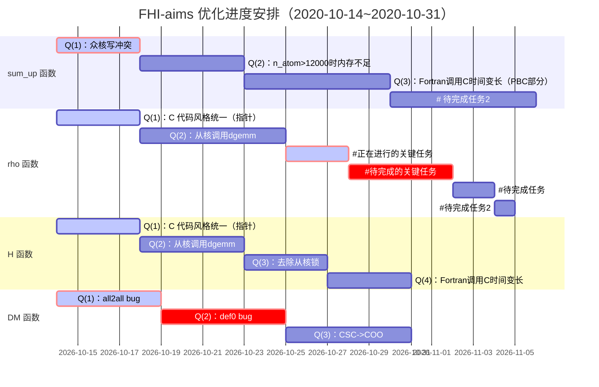

```mermaid
gantt         
       dateFormat  MM-DD   
       title FHI-aims 优化进度安排（2020-10-14~2020-10-31）

       section sum_up 函数
       Q(1)：众核写冲突          :crit,active,    des1-1, 10-14,10-18
       Q(2)：n_atom>12000时内存不足               :  des1-2, after des1-1, 5d
       Q(3)：Fortran调用C时间变长（PBC部分）              :         des1-3, after des1-2, 7d
       # 待完成任务2              :         des1-4, after des1-3, 7d
     
       section rho 函数
       Q(1)：C 代码风格统一（指针） :active, des2-1, 10-14,4d
       Q(2)：从核调用dgemm         : after des2-1, 7d
       #正在进行的关键任务             :crit, active, 3d
       #待完成的关键任务        :crit, 5d
       #待完成任务           :2d
       #待完成任务2                      :1d

       section H 函数
       Q(1)：C 代码风格统一（指针）              :active, des3-1, 10-14,4d
       Q(2)：从核调用dgemm      :des3-2, after des3-1  , 5d
       Q(3)：去除从核锁    :des3-3, after des3-2  , 4d
       Q(4)：Fortran调用C时间变长 : des3-4, after des3-3, 4d
       
       section DM 函数
       Q(1)：all2all bug               :crit,active, des4-1, 10-14,5d
       Q(2)：def0 bug      :crit,des4-2, after des4-1  , 6d
       Q(3)：CSC->COO    :des4-3, after des4-2  , 6d
```