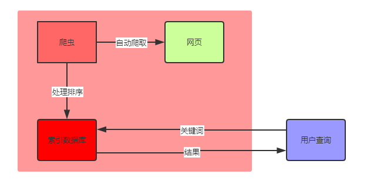

# 简介

定义：能够收集网页信息，并建立数据库提供查询的服务均可成为搜索引擎。

目的：尽可能少的时间内找到最多的有效信息。

## 原理三步走

+ **收集-爬取网页**
+ **分析-建立索引**
+ **查询-提供查询**



+ 设计一个简单搜索引擎？

```cpp
输入：5段英文文本，若干个关键词
输出：每个关键词出现次数及其对应的的段号，行号？
数据结构？
算法？
```

## 基本分类

**原始分类**（工作原理角度）

+ 全文搜索：**自动**收集和分析。速度快，范围广；不准确。百度，谷歌。
+ 目录搜索：**手动**收集和分析。速度慢，范围小；很准确。站内搜索，雅虎，新浪，搜狐。

**新的种类**

+ 垂直搜索：特定知识领域。精准快速，范围小（限制视野）。推荐算法（抖音，淘宝，网易云）/学术搜索
+ 元搜索：聚合搜索，收集多个搜索引擎的结果。全面。
+ 本地搜索：everything

# 工具三问

**工具仅是载体，思维才是核心**

- 过去：出现背景？如何发展？
- 现在：怎么用？对我有何用？
- 未来：发展趋势？有无更好解决方案？

## 过去

为什么会出现？

- 为什么出现图书馆？
- 为什么出现搜索引擎？
- 什么时候，什么背景？驱动力？
- 如果没有已知的搜索引擎公司，会出现其它类似公司嘛？
- 回到20年前，你能创办出google或百度嘛？

需求？

- 克服种种抱怨，消灭需求
- 每一个抱怨后都隐藏着一个未被满足的需求，每一个需求的背后都必然隐藏着一个巨大市场

人们对搜索引擎的评价：

- 世界上最受欢迎/最好的老师
- 搜索框正在重塑世界
- 搜索是最有影响力的学习途径之一
- 搜索是最大，最糟，最具有颠覆性新的创新之一
- 改变了信息获取的方式和学习方式

**发展历史**

- 1994.4 杨致远等创办Yahoo
- 1998.9 Google创立
- 2000.1 李彦宏、徐勇创立百度
- 2009 bing推出
- 2012 360搜索诞生

## 现在

工具使用？

对我有何用？

**解决问题能力=搜索能力+学习能力**

## 将来

目前搜索引擎存在的问题？有何改进之处？

界面为何是一个搜索框而不是高级搜索选项？

发展趋势

- 情景化，智能化
- 交互搜索，无屏幕搜索（智能音箱，语音助手）
- 基于位置和场景（从南航到新街口有什么好玩的地方）
- 导航功能（室内导航、火车站、飞机场、路况）
- 全程旅游规划

# 实操

操作问题？

+ 如何用高级搜索实现站内检索？比如搜南航教务处上关于研究生的问题/开学
  + 快照查询已注销网页
  + site指定网站，filetype指定文件类型（ppt）；inurl指定url出现的关键词；设置时间，新闻
+ 论文检索免费下载？[学术聚合网站](http://www.4243.net/)|[虫部落-细分领域聚合](https://www.chongbuluo.com/)
  + 中文知网：校内图书馆；[支付宝借阅宝免费教程](https://mp.weixin.qq.com/s/flUvRiz2rs_ImGnWzQoCJQ)
  + 外文文章：google/百度学术获取DOI；scihub下载
+ 电子书检索免费下载？鸠摩搜索
+ IDM原理？多线程并发提高下载速度。可配合firefox插件实现百度盘下载加速。

BAT：

百度：找资源文件

搜狗：经验知识（微信/知乎经验文章）

淘宝：找服务

# 小结

+ 搜索引擎原理、分类
+ 工具三问：过去、现在、未来
+ 应用场景-实操