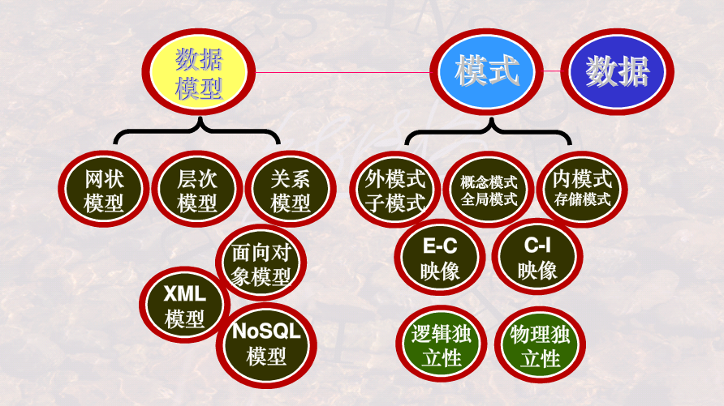
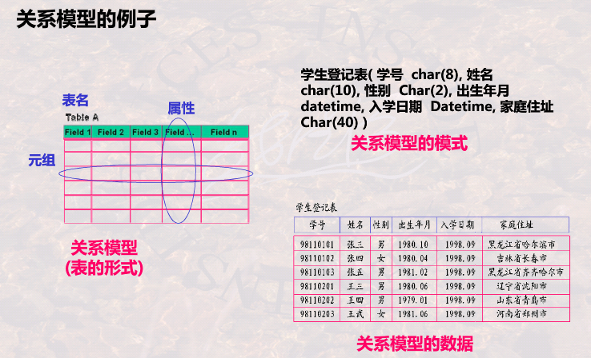
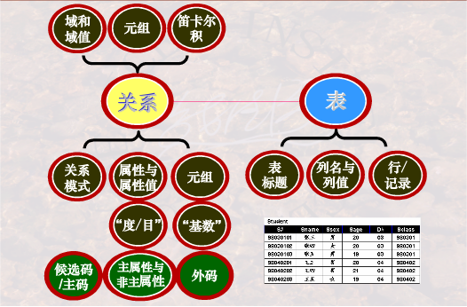
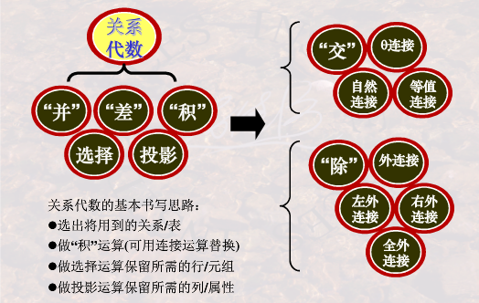
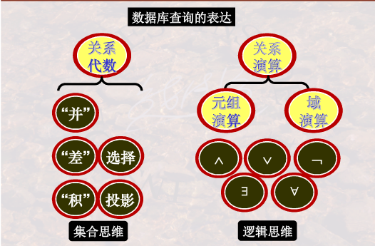

# 概论

**为什么学数据库系统**？

>+ 万物基础
>  + Everything Over DB
>  + 信息积累与运用基础
>+ 应用价值
>  - 基于数据库的应用--大数据分析
>  - 数据自由黄金屋--数据隐含价值

**数据，表，数据库，数据库系统，数据库管理系统联系区别**

> 数据：描述事物的符号记录
>
> 数据库是表的集合
>
> 数据库管理系统管理数据库（DBMS：解析语言并执行的系统）
>
> 数据库系统（工作环境）包含数据库DB，数据库管理系统DBMS，数据库应用DBAP，数据库管理员DBA，计算机基本系统

**数据库管理系统功能：用户角度，系统角度**

> 用户角度（**3语言1维护**--SQL）
>
> + 数据**定义**DDL（Data Definition Language）
>
> + 数据**操作**DML（Data Manipulation Language）
> + **控制**权限DCL（Data Control Language）
> + 数据库**维护**：转储，恢复，重组，性能检测，分析
>
> 系统角度（组织、存储、管理）
>
> + 形式-构造-自动化：语言-编译器-引擎
> + 运行的后台程序
>   + 编译器
>   + 查询优化和实现
>   + **数据存取和索引**
>   + 通信控制（分布式）
>   + **事务管理**/故障/安全/完整性

直接存取设备：磁盘，U盘（随机存储，直接定位）

非直接存取设备：磁带（顺序存储，从头开始找）

# 数据库系统的结构抽象和演变



## 数据库系统的标准结构？

### 三级模式两层映像；物理独立性和逻辑独立性（考）

> 物理世界-概念模型-数据库
>
> 概念模型：物理世界的抽象，类似UML，便于交流表达（E-R模型必须要会画）
>
> 模式：外/子模式，概念/全局模式，内部/存储模式（对应三层抽象：外部，逻辑，物理）
>
> 映像：外部-概念E-C Mapping；概念-内部C-I Mapping
>
> 
>
> C模式：全体数据的特征和结构（表）
>
> E外模式：局部数据的特征和结构（与应用相关，是模式的子集；保证安全性-只能看部分数据；SQL视图）
>
> I内模式：存储模式，即物理结构和存储方式
>
> 
>
> **标准结构抽象的目的--复用性**
>
> + 逻辑独立性：C改变时，改变E-C Maping即可重用E
>
> + 物理独立性：I改变时，改变C-I Mapping即可重用C

## 数据模型？

### 视图/数据--模式--数据模型（抽象程度递增）

> 视图/数据：表现具体的数据
>
> 模式：数据结构抽象（解释数据字段含义）
>
> 数据模型：模式结构抽象



### 数据模型差异：网状/层次模型-关系模型-OO数据模型

> 层次/网状：树/图；用户需主动维护指针
>
> 关系：表；用户无需主动维护指针，但数据项不可分
>
> OO数据模型：数据项可有结构，支持数据聚合和结构，面向对象思想

## 数据库系统演变和发展？

### 文件系统到数据库？

> | 对比项目\系统类型                            | 文件系统 | 数据库 |
> | -------------------------------------------- | -------- | ------ |
> | 数据组织是否依赖于具体的应用程序             | 是       | 否     |
> | 数据存取是否能以记录或记录集合为单位进行操作 | 不能     | 能     |
> | 不同文件即不同记录间是否有联系               | 无联系   | 有联系 |

### 层次模型，网状模型到关系模型数据库？

关系模型三要素

+ 数据结构
+ 数据操作
+ 完整性约束

> 层次模型：树形结构，IBM的IMS；只能一对多
>
> + 出现多对多需分解为两个一对多：冗余结点（学生S，课程C-》选课SC）；虚拟结点（一个存数据，其它均指针指向它）
> + 操作
>   + 查询：必须从根开始查找才有意义
>   + 更新：数据更新+关系更新
>   + 改删
> + 完整性约束
>   + 无双亲
> + 存储结构
>   + 邻接法：前序遍历树的顺序，存储与连续顺序空间。（数组），易查改，难插删。
>   + 链接法：左孩子，右兄弟（指针链表），难查改，易插删。
>   + 层次链接：邻接法改为指针链接。
>
> 
>
> 网状模型：网状/图结构，典型代表**DBTG**（数据库任务组提出）
>
> + 多对多关系也转换为一对多
>
> 关系模型数据库的改进：
>
> + 消除由用户建立指针的弊端
> + 将逐一记录的操作改进为支持记录集合的操作
> + 数据检索操作不依赖于路径信息或过程信息，即非过程化操作

### 关系数据库到对象关系，面向对象数据库？

> OO数据库的优点：
>
> + 突破**关系模型第一范式**-数据项不可再分
>
> + 允许复杂数据类型存在--**对象封装数据项**
> + 同时支持**记录集合**和**面向对象**操作

# 关系模型

## 基本概念

总体结构：


关系小结：



### 关系模型（考）处理table

+ **基本结构**（数据结构）：描述table/关系
+ **基本操作**：关系运算（并，差。。。）
+ **完整性约束**：运算时约束条件

什么是关系？

为什么把表称作关系？

怎样严格定义一个表？

### 表格关系的异同？

> 关系：严格数学定义，不可有重复元组
>
> 表：实际模型，可有重复元组。
>
> 其余基本相同

关系模型中的完整性约束？

以下为重点概念区分

### 域，笛卡尔积，关系，关系模式

+ 域：相同类型的一组集合（取值范围）,抽象的集合名字，相当于表的列名。
+ 域值：集合中具体的值，相当于表的每一列的具体取值。例如：域-`男人集合`，域值-`{张三，李四，王五}`
+ 笛卡尔积：n个域的组合的集合，每个元素为n-元组
+ 关系：一组域的笛卡尔积的子集（有意义的元组集合）。以下为三种关系
  + 基本关系：表，有存储的数据
  + 查询：对应的查询结果
  + 视图：虚表，不存放具体数据。
+ 关系模式：是关系的结构；关系是某一时刻关系模式的数据（类-实例）。`R(A1:D1,A2:D2,...,An:Dn)，其中Ai是属性，Di是取值范围，可省略`。

### 候选码，外码/外键，主码/主键，主属性/非主属性

+ **候选码**：能够**唯一标识**一个元组的**一组属性**（**集合**），且其子集不能唯一标识，一张表可存在多个候选码。例如选课数据中`{学号，课程号}`唯一标识一条选课记录；或者个人信息中`{学号}`唯一确定一个学生信息。（主键/外键/主属性等定义皆从这里引申）。

+ 主码/主键：从关系的**候选码**中选一个。一张表可存在多个候选码，被DBMS选中作为索引的一个成为主码。
+ 主属性：**属性P**包含于关系R的**任意一个候选码**。
+ 非主属性：属性P不包含于关系R的任意一个候选码。

+ 外码/外键：属性组不是关系R的主键，而是其他关系的主键（候选键），称为R的外键。常用于**连接**两个关系。

### 三个完整性

+ 实体完整性：主码属性值不为空（不知道/无意义）。主码是实体的唯一标识。

+ 参照完整性：外码为空值或者是另一个表主键的有效值。
  + 空值：表示当前记录尚未与其它关系建立连接。
  + 非空值：必须为相应关系的主码取值，否则报错。

+ 用户自定义：用户针对具体应用环境对相应属性的完整性约束条件。例如属性`年龄`必须在`[12,45]`

### 实体联系

#### 概念模型

用E-R模型表示

+ 实体间：一对一，一对多，多对多
+ 实体内部：比如员工的领导关系，职位是经理领导其它员工。

#### E-R图素（考-要求会做题）

+ 点：矩形-实体；菱形-关系实体
+ 线：连接实体，标明对应关系（1对多，多对一，多对多）

## 关系代数

> 集合思维的操作语言，输入输出均为关系



关系代数与SQL：


### 五个基本操作

关系代数基本操作：并、差、积、选择、投影、（更名）$\Pi \$

+ **相容性**：属性个数相同；一一对应的属性域相同、
+ **并差积均满足相容性**
+ 积（广义笛卡尔积）：两个关系中的元组任意拼接形成新的集合。用于联合查询，比如学生表和课程表。（**不去重**）
+ 选择（行）：将关系中满足条件的筛选出来（条件查询select）**注意次序**；$\delta_{Sage!=20}(Student)$
+ 投影（列）：将关系中的列进行重组，**注意重组后的去重**

### 扩展操作

关系代数扩展操作：交，$\theta-$连接，自然连接

可以用五个基本操作组合实现，DBMS直接使用连接效率更高

+ 交：差实现

+ 连接：关系先做积，再保留满足条件的元组。自身连接时需要用**更名**操作。**逻辑是先积后选择，物理操作没有中间过程？**

  + $\theta-$连接：无需去重（可指定列名）

  + 等值连接：指定相等的列，进行连接（可指定列名）
  + 自然连接：公共数据均相同才可连接，**需去重复属性**

### 复杂扩展操作

复杂扩展操作（选学）：除，外连接

+ 除：$Res=R\div S$，S的属性为R的属性子集。Res的属性为列(R-S)的属性，Res的元组和任意R-S的元组组合均为R的元组。用于**全部**等关键字的查询
  + image set：ims[x]表示关系R中某个属性值为x的元组集合
  + $R(X,Y),S(Y,Z)=>R\div S=\pi_{X}(R)-\pi_{X}(\pi_{X}(R)\times  \pi_{Y}(S)-R)$
+ 外连接：自然连接+空补全；避免自然连接中无匹配项的丢失**（左/右/全外三者每次只能用其一）**
  + **左外**连接：**左侧保留**，右侧补全
  + 右外连接：右侧保留
  + 全外连接：两侧均保留

### 解题思路

组合与应用训练：基本思维--一个集合+操作=一个集合--->以集合为中心

+ 单表：直接用并、差、交、选择、投影
+ 多表
  + 自然连接
  + 等值或不等值连接
  + 广义笛卡尔积（条件）
+ 连接后，继续用**选投连**等操作

### 易错点

+ 仅**自然连接需去重**，theat-连接，广义笛卡尔积均不用去重
+ **条件**表达式用$\and或\or$连接；**关系**用$\cap \bigcap或 \cup \bigcup$连接。
+ **并差积**使用前需满足**相容性**

## 关系演算



关系演算是基于逻辑查询，而关系代数是基于集合查询。

基于数理逻辑的谓词演算，根据**谓词对象**分类如下：

+ 元组变量（行）：关系元组演算
+ 域变量（列）：关系域演算

### 关系元组演算

常用语言：ALPHA。这是一个假象抽象的语言（数学语言）

GET语法格式

```
GET 工作空间名 [(定额)] (表达式1) [:操作条件] [down/up 表达式2]
```

+ `[]`表示可选参数（可有可无）
+ 工作空间名：类似C++的命名空间`namespace`，这里随便写个字符就行，比如`W`。
+ 定额：指明显示的元组个数（就是要展示多少条数据，SQL可用类似`ROWNUM<3`实现）
+ 表达式1：你要显示的内容，类似SELECT后面的属性
+ 操作条件：类比WHERE条件，区别在于这里的条件可以用谓词逻辑，比如全称和存在量词。
+ down/up 表达式2：对显示进行排序使用，down降序，up升序。表达式2指明需排序的属性。

**元组变量（SQL别名）**

+ 作用：简化关系名；操作条件中的量词必须用元组变量
+ 约束变量必须用元组变量，比如**存在和全称量词**的变量（操作条件出现）
+ 其余自由变量可不用（比如表达式1中的属性）

核心掌握：查询表示GET的使用

#### 简单检索实例

> 查询**信息系IS**中年龄小于20岁的学生的学号和年龄。

$GET\ W \ (Student.Sno,Student.Sage)\ : Student.Sdept='IS'\land Student.Sage<20 $

+ GET等价于SQL中的SELECT
+ W是工作空间，可自己命名

> 查询**信息系IS**中年龄小于20岁的学生的学号和年龄，按年龄升序排列，取出前三名。

$GET\ W \ (3) \ (Student.Sno,Student.Sage)\ : Student.Sdept='IS'\land Student.Sage<20  \  UP \ Student.Sage$

+ `(3)`表示取前三个
+ `UP Student.Sage`表示按年龄升序排列

#### 元组变量检索实例（重难点）

> 查询选修2号课程的学生名字。

$RANGE\  SC\  X\\ GET\  W \ (Student.Sname)\ : \exists X(X.Sno=Student.Sno\land X.Cno='2')$

+ `Range SC X`是定义X为SC的
+ `X`表示关系`SC`中的元组变量，取值范围是`SC`中的所有元组。
+ 注意存在量词的变量，必须用元组变量，因此必须用给SC取一个变量，而Student就不用，因为它不作为量词的变量。

```sql
-- 正确实现1：SQL用exists实现
SELECT sname
FROM Student
WHERE exists (SELECT * FROM SC x WHERE x.sno=student.sno and x.cno=2);

-- 正确实现2：SQL用exists实现：若把x.sno改为sno，没问题
SELECT sname
FROM Student
WHERE exists (SELECT * FROM SC x WHERE sno=student.sno and x.cno=2);

-- 错误实现：SQL用exists实现：若把student.sno改为sno，则会出现错误，主要是不同系统对空值处理不同
SELECT sname
FROM Student
WHERE exists (SELECT * FROM SC x WHERE x.sno=sno and x.cno=2);
```


> 查询选修了这样课程的学生学号，其直接先修课程为6号。

$RANGE\ Course\ X\\GET\ W\ (SC.Sno)\ :\ \exists X(X.Cno=SC.Cno \land X.Cpno='6')$

> 查询至少选修一门**其先修课为6号**的课程的学生学号。

$RANGE\ Course\ CX\\ \ \ \ \ \ \ \ \ \ \ \ \ \ \ \ \ SC\ SCX\\GET\ W\ (Student.Sname)\ :\ \exists SCX(SCX.Sno=Student.Sno\land \exists CX(CX.Cno=SCX.Cno\land CX.Cpno='6'))$

> 查询成绩为90分以上的学生名字和课程名字。

$RANGE\ SC\ SCX\\GET\ W\ (Student.Sname,Course.Cname)\ :\ \exists SCX(SCX.grade\geq 90\land Student.Sno=SCX.Sno\land Course.Cno=SCX.Cno)$

> 查询不选1号课程的学生名字。

$RANGE\ SC\ SCX\\GET\ W\ (Studnet.Sname)\ :\ \forall SCX(SCX.Sno\neq Student.Sno\lor SCX.Cno\neq '1')$

$RANGE\ SC\ SCX\\GET\ W\ (Studnet.Sname)\ :\ \lnot \exists SCX(SCX.Sno= Student.Sno\land SCX.Cno= '1')$

> 查询选修了全部课程的学生姓名。

$RANGE\ Course\ CX\\ \ \ \ \ \ \ \ \ \ \ \ \ \ \ \ \ SC\ SCX\\GET\ W\ (Student.Sname)\ :\ \forall CX(\exists SCX(CX.Cno=SCX.Cno\land SCX.Sno=Student.Sno))$

> 查询最少选修了200215122学生所选课程的学生学号。

$RANGE\ Course\ CX\\ \ \ \ \ \ \ \ \ \ \ \ \ \ \ \ \ SC\ SCX\\ \ \ \ \ \ \ \ \ \ \ \ \ \ \ \ \ SC\ SCY\\GET\ W\ (Student.Sno)\ :\ \forall CX(\exists SCX( SCX.Sno='200215122'\land SCX.Cno=CX.cno)\Rightarrow  \exists SCY(SCY.Sno=Student.Sno\land SCY.Cno=CX.Cno))$

关系元组演算公式的递归定义

与或非，存在量词，全称量词$\and \or \neg  \exist \forall$

查询表达：元组-属性-谓词逻辑

关系元组表示关系代数

### 关系域演算

关系域演算公式的递归定义

**示例查询QBE**（Query By Example）

+ 无需书写复杂公式，仅需在表格中填写条件
+ 高度非过程化语言
+ 四个组成部分：关系名，字段名，操作区，条件区
+ 示例元素（类似变量）实现复杂关系

### 安全性

安全：不产生**无限关系**（集合）和**无穷验证**（存在量词和全称量词）的运算

### 三种关系运算的观点

关系代数，关系元组演算，关系域演算对比

+ 关系代数是安全的；演算不安全

+ 关系代数与**安全演算**等价
+ 关系域演算，关系元组演算，关系代数三者**过程性**依次降低（黑盒性降低/越底层）

# SQL语言

理论基础是关系代数和关系演算

SQL语言是集DDL，DML和DCL与一体的数据库语言。

> [在线练习](https://sqlzoo.net/wiki/SQL_Tutorial)

## 概述

SQL语言分类：

+ 交互式
+ 嵌入式
+ 动态

期望目标：理解查询需求，用SQL精确表达（语法+语义）

DDL

数据库/表结构的定义创建，修改，删除

Create，Alter（修改），Drop（撤销）

DML

元组（数据记录）的增删改查

INSERT（单/批处理）,DELETE,UPDATE,**SELECT**（DISTINCT去重，order by排序，模糊查询Like，联合查询）

DCL

Grant，Revoke

