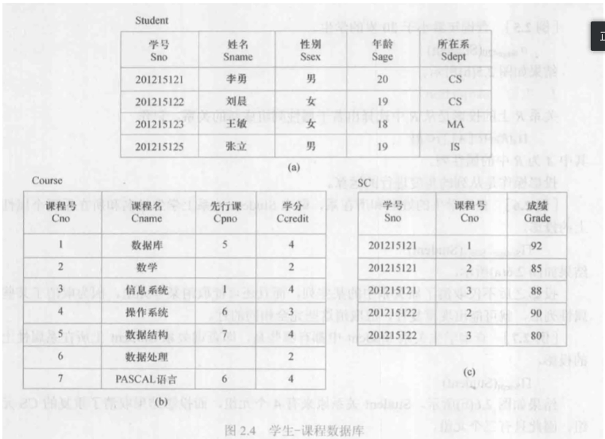

# 环境配置

+ 数据库：Oracle 11g
+ 账号：scott；密码：8423535（默认数据库用户）
+ 操作系统：Windows10

# 书写规范

+ 命令关键词大写，表名字段名小写

# 常见命令

## 关系代数符号

[参考1](https://blog.csdn.net/garfielder007/article/details/51646604)|[参考2](https://www.zybuluo.com/codeep/note/163962#6%E9%80%BB%E8%BE%91%E8%BF%90%E7%AE%97%E7%AC%A6)

| 中文名   | 希腊符号                     | Letax语法          |
| -------- | ---------------------------- | ------------------ |
| 并       | $\cup \bigcup$               | `\cup \bigcup`     |
| 交       | $\cap \bigcap$               | `\cap \bigcap`     |
| 笛卡尔积 | $\times$                     | `\times`           |
| 选择     | $\sigma$ $ \Sigma$(都用小写) | `\sigma \Sigma`    |
| 投影     | $\pi $  $\Pi$（用小写）      | `\pi \Pi`          |
| 除       | $\div $                      | `\div`             |
| 连接     | $\bowtie$                    | `\bowtie`          |
| 逻辑符   | $\lor   \land \lnot  $       | `\lor \land \lnot` |
| 关系符   | $\leq \geq \neq$             | `\leq \geq \neq`   |

上标：`^{}`，例如`a^{i+2}`,$a^{i+2}$

下标：`_{}`，例如`a_{i+2}`,$a_{i+2}$

正下标：

+ **前面是特定的数学操作符**：`operator_name \limits_{}`，例如`\prod \limits_{i=1}`，$\prod \limits_{i=1}$
+ **不是特定数学操作符**：用`\mathop{}`先包装一下，再用`\limits_{}`，例如`\mathop{\bowtie} \limits_{a}`，$\mathop{\bowtie} \limits_{a<x<b}\{f(x)\}$

正上标：和正下标类似，只需把`\limits^{}`改为上角标即可。`\prod \limits^{i=1}`，$\prod \limits^{i=1}$

## 退出命令

+ `exit/quit`会自动保存数据；
+ 直接点×不会commit，被看成异常退出

## 常用查询、条件、排序

```SQL
SELECT (DISTINCT)fieldname1, ...,fieldnameN // DISTINCT去重
FROM tablename1,...,tablenameN
WHERE cond1 conn cond2 ... condN
ORDER BY fieldnamei DESC|(ASC) // 排序选项，默认ASC升序;ascend,descend
```

## 集合运算命令

+ `union`：并
+ `intersect`：交
+ `minus`：差

## 连接查询

**去重问题**：（计算题**必考**）

仅自然连接会**合并相同列（列），并对元组去重**（行）。

其余笛卡尔积，条件连接，三种外连接均不会。

**投影会去重**。

除法不会产生重复元组。

+ `inner join/join`：左右表均匹配才返回对应行
+ `natural join`：自然连接，相等的列主动连接，无需写on或where条件。（**相同列会被合并**）
+ `left join`：左连接，以左侧为主表，无论右侧有没匹配字段，左侧所有行均保留。
+ `right join`：右连接，以右侧为主表，无论左侧有没匹配字段，右侧行均保留。
+ `full join`：全连接，左连接+右连接（左右表的行均保留）。

```SQL
FROM t1 join t2
on t1.pid = t2.pid
// 多个连接可嵌套
FROM (t1 join t2 on t1.pid=t2.pid) join t3 on t2.kid=t3.kid;
// 也可使用别名：表别名，列别名会改变输出的列名
FROM table1 AS t1 join table2 AS t2....
// 直接用,分隔默认是先笛卡尔积
FROM table1,table2,... WHERE 条件
```

实例演示

```sql
-- 左外连接
select * from student left join sc on sc.sno=student.sno;
-- 输出如下
       SNO SNAME      SS       SAGE SDEPT        SNO        CNO      GRADE
---------- ---------- -- ---------- ----- ---------- ---------- ----------
 201215121 李勇       男         20 CS     201215121          1         92
 201215121 李勇       男         20 CS     201215121          2         85
 201215121 李勇       男         20 CS     201215121          3         88
 201215122 刘晨       女         19 CS     201215122          2         90
 201215122 刘晨       女         19 CS     201215122          3         80
 201215125 张立       男         19 IS
 201215123 王敏       女         18 MA
 
-- 右外连接
select * from sc right join student on sc.sno=student.sno;
-- 输出如下
       SNO        CNO      GRADE        SNO SNAME      SS       SAGE SDEPT
---------- ---------- ---------- ---------- ---------- -- ---------- -----
 201215121          1         92  201215121 李勇       男         20 CS
 201215121          2         85  201215121 李勇       男         20 CS
 201215121          3         88  201215121 李勇       男         20 CS
 201215122          2         90  201215122 刘晨       女         19 CS
 201215122          3         80  201215122 刘晨       女         19 CS
                                  201215125 张立       男         19 IS
                                  201215123 王敏       女         18 MA

-- 全外连接
select * from sc full join student on sc.sno=student.sno;
-- 输出如下

-- 三种外连接都可以加上自然连接，变成自然左外连接，自然右外连接，自然全外连接
```


## 统计函数

+ `aggregation`：聚合类函数，对于一个字段仅返回一个值。如求和sum,频率统计count，min，max，平均avg。
+ `scalar`：标量运算，每个值都返回一个值。如转大写ucase,转小写lcase，截取字符串mid

# Homework01

> **(1) Write a query in SQL to list the name and salary of employees of the department 20.** 

```sql
select ename, sal from emp where deptno=20;
```

> **(2) Write a query in SQL to list the employees who are either 'CLERK' or 'ANALYST'.** 

```sql
select ename,job, deptno from emp where job='CLERK' or job='ANALYST';
```

> **(3) Show the structure of the DEPT table. Select all data from the DEPT table.**

```sql
 desc dept;
 select * from dept;
```

> **(4) Write a query in SQL to display the name and salary of employees earning more than $2850.** 

```sql
 select ename, sal from emp where sal>2850;
```

> **(5) Write a query in SQL to display the name and salary for all employees whose salary is not in the range of 1500 and ​2850.** 

```sql
 select ename, sal from emp where sal>2850 or sal<1500;
```

> **(6) Write a query in SQL to display the employee name, job and start date of employees hired between February 20. 1981, and May 1. 1981.**

```sql
select ename, job, hiredate 
from emp 
where hiredate between to_date('1981-02-20','yyyy-mm-dd') and to_date('1981-05-01','yyyy-mm-dd');
```

> **(7) Write a query in SQL to list the job title and the salary of those employees whose manager has the number 7698 or 7566 and who earn more than 1500.**

```sql
select job, sal from emp where  (mgr=7698 or mgr=7566) and sal>1500;
```

# Homework02

> **(1)Write a query in SQL to list the name and salary of employees who are working in RESEARCH department. **

```SQL
--写法(1) 
SELECT ename,sal FROM emp,dept WHERE emp.deptno=dept.deptno and dname='RESEARCH';
--写法(2) JOIN关键字
SELECT ename,sal FROM emp JOIN dept ON emp.deptno=dept.deptno WHERE dname='RESEARCH';
```

> **(2)Write a query in SQL to list the name and salary of employees who are not working in SALES department.**

```SQL
SELECT ename,sal FROM emp JOIN dept ON emp.deptno=dept.deptno WHERE dname!='SALES';
```

> **(3)Write a query in SQL to list the name, salary and department name of employees who are working in New York.** 

```SQL
SELECT ename,sal,dname FROM emp JOIN dept ON emp.deptno=dept.deptno WHERE loc='NEW YORK';
```

> **(4)Write a query in SQL to list the details of the employees whose salary is  same as  salary of FORD.**

```sql
-- 包括FORD的信息
SELECT * FROM emp WHERE sal=(SELECT sal FROM emp WHERE ename='FORD');
-- 不包括FORD的信息
 SELECT * FROM emp WHERE ename!='FORD' AND sal=(SELECT sal FROM emp WHERE ename='FORD');
```

# 建表插数据

## 表结构和数据

三张表结构和对应数据如下：



### **Student**

| 学号（Sno） | 姓名（Sname） | 性别（Ssex） | 年龄（Sage） | 所在系（Sdept） |
| ----------- | ------------- | ------------ | ------------ | --------------- |
| 201215121   | 李勇          | 男           | 20           | CS              |
| 201215122   | 刘晨          | 女           | 19           | CS              |
| 201215123   | 王敏          | 女           | 18           | MA              |
| 201215125   | 张立          | 男           | 19           | IS              |

### **Course**

| 课程号（Cno） | 课程名（Cname） | 先行课（Cpno） | 学分（Ccredit） |
| ------------- | --------------- | -------------- | --------------- |
| 1             | 数据库          | 5              | 4               |
| 2             | 数学            |                | 2               |
| 3             | 信息系统        | 1              | 4               |
| 4             | 操作系统        | 6              | 3               |
| 5             | 数据结构        | 7              | 4               |
| 6             | 数据处理        |                | 2               |
| 7             | PASCAL语言      | 6              | 4               |

### SC

| 学号（Sno） | 课程号（Cno） | 成绩（Grade） |
| ----------- | ------------- | ------------- |
| 201215121   | 1             | 92            |
| 201215121   | 2             | 85            |
| 201215121   | 3             | 88            |
| 201215122   | 2             | 90            |
| 201215122   | 3             | 80            |

## Oracle建表和插入数据

```SQL
-- 创建学生数据表
CREATE TABLE Student (
	Sno NUMBER(9) NOT NULL, -- 主键，学号，9位数字
	Sname VARCHAR(10), -- 姓名，用变长类型
	Ssex CHAR(2), -- 性别，仅男和女两种，用定长类型
	Sage NUMBER(3), -- 年龄，最多三位数
	Sdept VARCHAR(5) -- 所在系名称
);
-- 插入学生数据
INSERT INTO Student values(201215121,'李勇','男',20,'CS'); 
INSERT INTO Student values(201215122,'刘晨','女',19,'CS');
INSERT INTO Student values(201215123,'王敏','女',18,'MA');
INSERT INTO Student values(201215125,'张立','男',19,'IS');

-- 创建课程数据表
CREATE TABLE Course (
	Cno NUMBER(9) NOT NULL, -- 主键，课程号
    Cname VARCHAR(10), -- 课程名
    Cpno NUMBER(9), -- 先行课-课程号
    Ccredit NUMBER(9) -- 学分
);
-- 插入课程数据
INSERT INTO Course values(1,'数据库',5,4);
INSERT INTO Course values(2,'数学',null,2);
INSERT INTO Course values(3,'信息系统',1,4);
INSERT INTO Course values(4,'操作系统',6,3);
INSERT INTO Course values(5,'数据结构',7,4);
INSERT INTO Course values(6,'数据处理',null,2);
INSERT INTO Course values(7,'PASCAL语言',6,4);

-- 创建选课数据表
CREATE TABLE SC (
	Sno NUMBER(9) NOT NULL, -- 学号（学号和课程号共同为主键）
    Cno NUMBER(9) NOT NULL, -- 课程号
    Grade NUMBER(9) -- 成绩
);
-- 插入选课数据
INSERT INTO SC values(201215121,1,92);
INSERT INTO SC values(201215121,2,85);
INSERT INTO SC values(201215121,3,88);
INSERT INTO SC values(201215122,2,90);
INSERT INTO SC values(201215122,3,80);
```

```
union // 并
intersect // 交
minus // 差
```

# 关系代数&SQL

以下问题针对`Student,Course,SC`三张表进行关系代数和SQL练习。请熟练掌握二者的写法和转换。

其中关系代数的逻辑和平常有些不同，注意易错点，请仔细推敲。

## 单表查询

> **1)	查询年龄不等于20岁的学生信息。**   

$\sigma_{sage\neq20}(Student)$

```SQL
SELECT * FROM Student WHERE sage!=20;
```

> **2)	查询选修1号课程的学生学号。**

$ \pi_{Sno}(\sigma_{Cno=1}(SC))$

```sql
SELECT sno FROM SC WHERE cno=1;
```

计算机中用`!= `或`<>`表示不等关系

> ***3)	查询既选修1号课程又选修2号课程的学生学号。**

错误示例1：$\pi_{Sno}(\sigma_{Cno=1}(SC) \cap (\sigma_{Cno=2}(SC))$：这是永假式，没有课程号能同时为1和2。

错误示例2：$\pi_{Sno}(\sigma_{Cno=1}(SC) \cup (\sigma_{Cno=2}(SC))$：只选择1或只选择2都会被选中。

正确答案：$\pi_{Sno}(\sigma_{Cno=1}(SC)) \cap \pi_{Sno}(\sigma_{Cno=2}(SC))$

```SQL
// 错误示例
SELECT sno FROM (SELECT * FROM SC WHERE cno=1) WHERE cno=2;
// 正确参考
SELECT sno FROM SC WHERE cno=1
intersect
SELECT sno FROM SC WHERE cno=2;
```

> ***4)	查询不选1号课程的学生学号。**

错误示例：$  \pi_{Sno}(SC)-\pi_{Sno}(\sigma_{Cno=1}(SC))$：Student才是所有学生，有的学生可能没选课

正确示例：$  \pi_{Sno}(Student)-\pi_{Sno}(\sigma_{Cno=1}(SC))$

```SQL
SELECT sno FROM Student
MINUS
SELECT sno FROM SC WHERE Cno=1;
```

> 类似问题：**查询所有的选课的成绩均大于等于85分的学号**（没选的不算）

$  \pi_{Sno}(SC)-\pi_{Sno}(\sigma_{grade<85}(SC))$

```sql
SELECT sno FROM SC
MINUS
SELECT sno FROM SC WHERE grade<85;
```

## 多表查询

5)	查询选修1号课程的学生学号和姓名。

自然连接：特殊等值连接，将同名的列自动连接，去重，且无法使用on条件和其它限定条件。

$  \pi_{Sno,Sname}(\sigma_{Student.sno=SC.sno \land Cno=1  }(Student \times SC))$

```SQL
-- 多表连接的本质都是先笛卡尔积，再筛选

-- 法1：FROM后用逗号分隔不同表，默认做笛卡尔积，然后用WHERE条件筛选
SELECT Student.sno, sname FROM Student,SC WHERE Student.sno=SC.sno and SC.cno=1;

-- 法2：join on：本质和上面一样，仅仅把连接条件放在on后面，其余条件不变
SELECT Student.sno, sname FROM Student join SC on Student.sno=SC.sno WHERE SC.cno=1;

-- 法3：natural join:无法使用on等条件，也不可用限定词，如下Student限定词报错
-- SELECT Student.sno, sname FROM Student natural join SC WHERE SC.cno=1;
SELECT sno, sname FROM Student natural join SC WHERE SC.cno=1;
```

6)	查询所有选课成绩均及格的学生学号和姓名。

+ 思路一：**笛卡尔积**：先计算两张表的笛卡尔积，然后用全集-不及格分数集合

$  \pi_{Sno,Sname}(\sigma_{Student.sno=SC.sno}(Student\times SC))-\pi_{Sno,Sname}(\sigma_{Student.sno=SC.sno \land grade<60}(Student\times SC))$

+ 思路二：**等值连接**：笛卡尔积的简化写法，无需写连接条件罢了。

$  \pi_{Sno,Sname}(Student\bowtie SC)-\pi_{Sno,Sname}(\sigma_{grade<60}(Student\bowtie SC))$

+ 思路三：**等值连接+单表过滤**：先在SC单表中找出所有符合条件的学号，再与Student进行等值连接。少做一次连接，应该效率更高。

$ (\pi_{Sno,Sname}(Student))\bowtie( \pi_{Sno}(SC)-\pi_{Sno}(\sigma_{grade<60}(SC)))$

```sql
-- 思路一：笛卡尔积
SELECT Student.Sno,Sname
FROM Student join SC on Student.sno=SC.sno
MINUS
SELECT Student.Sno,Sname
FROM Student join SC on Student.sno=SC.sno
WHERE grade<60;
-- 思路二：等值连接
SELECT sno,sname
FROM Student natural join SC
MINUS
SELECT sno,sname
FROM Student natural join SC
WHERE grade<60;
-- 思路三实现1：SQL特有：先在SC单表查询符合条件的学号，然后用来过滤Student
SELECT sno,sname 
FROM Student
WHERE sno in (SELECT sno FROM SC MINUS SELECT sno FROM SC WHERE grade<60);
-- 思路三实现2：先在SC单表查询符合条件的学号，再与Student做自然连接;
SELECT sno,sname 
FROM Student natural join (SELECT sno FROM SC MINUS SELECT sno FROM SC WHERE grade<60);
```

7)	查询选修了全部课程的学生学号和姓名。

8)	查询至少选修2门不同课程的学生学号。

$\sigma_{SC.sno=SC.sno \land SC.cno\neq SC.cno}SC\times SC$

9)	查询选课成绩最高的学生学号和成绩。


# Homework03

**关系代数的计算题必考！**

**投影和自然连接自动去重**

关系代数必须用数学语言书写

+ 集合并交差$\cup \cap -$，逻辑关系连接符与或非$\land \lor \lnot$
+ 比较关系符：$\neq \leq \geq$

试用关系代数完成如下查询：

> **1)	查询所有男同学的信息。**   

$\sigma_{Ssex='男'}(Student)$

> **2)	查询选修1号或2号课程的学生选课信息。**

$\sigma_{Cno=1 \lor Cno=2}(SC)$

> **3)	查询计算机系（CS）的男同学的学号和姓名。**

$\pi_{Sno,Sname}(\sigma_{Sdept='CS'\land Ssex='男'}(Student))$

> **4)	查询选修“数据库”课程的学生学号。**

$\pi_{Sno}(\sigma_{cname='数据库'}(Course\bowtie SC))$

> **5)	查询选修“数据库”课程的学生学号和姓名。**

$\pi_{Sno,Sname}(\sigma_{cname='数据库'}(Course\bowtie SC \bowtie Student))$

> ***6)	查询没有选修全部课程的学生学号。**

+ 除法运算

$\pi_{Sno}(Student)-(\pi_{Sno,Cno}(SC)\div \pi_{Cno}{Course})$

+ Student与Course做笛卡尔积得到S1，其中每个人都选修所有课程，再减去选课集合SC，那么在S1中选修所有课的同学会被扣除，剩下的即为未选所有课的学号。注意**投影会去重**。

$\pi_{Sno,Sname}(Student\bowtie (\pi_{Sno,Cno}(Student\times Course)-\pi_{Sno,Cno}(SC)))$

> ***7)	查询没有选修全部课程的学生学号和姓名。**

$\pi_{Sno,Sname}(Student\bowtie (\pi_{Sno}(Student)-(\pi_{Sno,Cno}(SC)\div \pi_{Cno}{Course})))$

