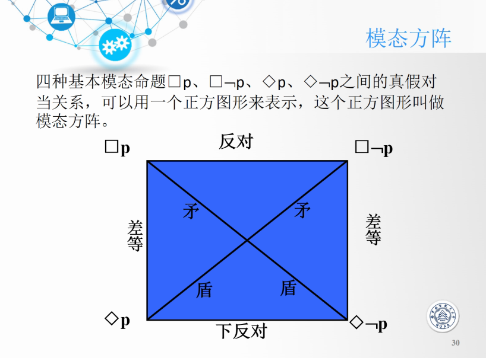

# 心得总结

+ 软件形式化，可靠性，软件质量相关均可
+ 论文+联系
+ 课程内容+心得
+ 软件发展

| 对比角度 | 软件测试                       | 形式化验证                  |
| -------- | ------------------------------ | --------------------------- |
| 功能     | 只能找到bug，无法证明程序无bug | 通过数学逻辑可证明程序无bug |
| 环境     | 真实环境                       | 虚拟环境                    |
| 人员要求 | 入门门槛低                     | 数学要求很高                |

怎么把需求用数学形式表示出来

形式化：描述做什么，而不是怎么做

应用形式化方法的考虑：

+ 应用领域：看看项目特点，是否适合使用形式化方法
+ 规模结构：大规模分解，良好结构定义
+ 类型选择：确定应用形式化方法的目标
+ 形式化级别：非形式化，半形式化，高度形式化
+ 使用范围：软件开发的那个阶段使用（主要用于需求设计阶段）
+ 工具：合适工具的选择

软件缺陷

+ Fault：**静态存在**于软件的缺陷
+ Error：运行到Fault，引发的错误
+ Failure: Error传播到软件外部，**用户可观测**的失效行为

**bug/fault：测试用例判断**

+ 定义：根据fixing来判断（与测试用例相关）。每个bug有多种修复方式，原则上选择**最小修复（Minimal Fixing）**。
+ bug个数：发现错误的测试用例个数。尽可能使用发现错误能力强的测试用例。
+ 发生条件：
  + E：fault所在代码可执行
  + I：必须感染
  + P：传播到外面，被观察到

# 逻辑学基础

+ 如何把问题用符号表示？
+ 如何进行推理？

哥德尔定理

+ 完备性：一个命题真假是确定的
+ 一致性：无矛盾命题

例如：本句话是假的


命题逻辑：仅分解到原子命题，无法再细分

+ 存在问题：无法表现命题间的内部联系
+ 问题例子：苏格拉底三段论推理？

一阶逻辑（谓词逻辑）：克服命题逻辑的问题，能进一步拆分简单命题，找到内部联系和数量

个体词：主体或客体

+ 个体常项：a、b、c（具体常量）
+ 个体变项：x，y，z（抽象变量）

谓词：个体词的性质；多个个体词间关系

+ 常项
+ 变项：P(x1,x2,...,xn)为n元谓词，有时顺序是会影响结果的，除非满足对称性。最好保证顺序一致性。

量词

只有2是素数，5才是素数

F(x)：x是素数，x=2,5

F(5)->F(2)

三段论用一阶谓词表示

```
H(x):x是人
M(x):x会死
P: H(x)->M(x)
Q: H(苏格拉底)
R: M(苏格拉底)
命题判定：P & Q -> R
否命题!p反证法
```

引出量词（对个体词的取值范围进行限定）

+ 全称量词：真假判断类似于&&；所有人的共性-用推导
+ 存在量词：真假判断类似于||；部分人的特征-用交

谓词，个体词，要划分到什么程度，根据使用情况决定，够用就行。

注意每个量词的控制范围（作用域）

> 天下乌鸦一般黑（所有的乌鸦黑色程度一样）

P(x):x是乌鸦

Q(x):x是深黑色（RGB(0,0,0)）

$\forall x(P(x)\rightarrow  Q(x))$

> 没有人登上过木星

P(x)：x是人

Q(x)：x没有登上过木星

$\forall x(P(x)\rightarrow \lnot Q(x) )$

> 在美国留学的

## 一阶逻辑的分类

三种类型：

+ 永真：任何解释下均为真
+ 永假：任何解释下均为加
+ 可满足式：至少存在一个解释为真

**前提为假，结论必真**

变量可以代入值，保证前后一致性

**等价代换验证标准：前后的真假值必定相同**。（这是一个模态逻辑命题）

举例：$p\rightarrow q$的实例代换：三段论：假设$F(x):x是人$，$G(x):x会死$。

+ 合法：$F(x)\rightarrow G(x)$，$\forall xF(x)\rightarrow \exists y G(y)$（**合法并不意味着正确，只是它们的真假值与$p\rightarrow q$一致**）
+ 非法：$\forall x(F(x)\rightarrow G(x) )$，此处有两种理解方式
  + p和q可看成单独的变量，替换只能替换单独的变量，不可对整体进行替换。
  + 三段论的正确表达形式，它能够正确表达意思，所以与$p\rightarrow q$真假值不同，因此不是等价替换。

## 模态逻辑

断定事物的**可能性和必然性**的判断是模态命题。

模态种类：

狭义：必然；可能

+ 客观
  + 逻辑
  + 非逻辑（物理/生物/哲学...）
+ 主观

广义：必然/禁止；可能/应当


可能世界：当前世界能到达的世界的连通块

必须限定可能世界的范围，讨论模态逻辑的真假才有意义

模态方阵

当一件事很难判断时，用矩阵来转换判断。




矛盾：不可同时为真/假

差等：具有从属关系（部分关系推导）

反对：不同时为真，但可同时为假

下反对：可同时为真，不可同时为假


+ **形式化表示**：自然语言-数学语言
+ **验证**
  + 定理证明
  + 模型检验


# 定理证明

根据系统的公理和推理规则，进行推导，证明系统具有某些性质

证明类型

+ 自动
+ 手动

# 逻辑编程Programming in Logic（Prolog）

## 概述

+ 逻辑：描述问题是什么
+ 控制：求解问题

命令式编程：Java，C

声明式编程：做什么，当前事实是什么？推理规则是什么？

Prolog特点

+ 基于一阶谓词逻辑，可自动推理
+ 仅需指明对象间关系和决策规则，推理由Prolog实现
+ Prolog应用程序=数据库+规则库
+ 运行顺序不定：由电脑随机确定，因此没有流程控制语句
+ 智能数据库：事实和规则是输入的数据，问题是提问（类似SQL）
+ 强大的递归
+ 三步走：
  + **说明事实**：已知事实，对象，存储数据，**不多不少**
  + **定义规则**：对象间关系，人为主动定义，**不多不少**
  + **提出问题**：

## 数据类型

字符串首字母

+ 小写：确定事实，如确定的关系，常量
+ 大写：不确定的事实，如不确定的关系，变量（大写字母/下划线开头）

原子（常量）：

+ 小写开头
+ 单引号内部：可将大写/下划线/数字开头的字符串看成原子，例如`'dinning room','Hall','_wd','12'`

变量：

+ 大写/下划线开头

## 入门实例

### 寻找Nani

```prolog
    %寻找Nani
    room(kitchen).  %%知识表达---原子
    room(office).
    room(hall).
    room('dining room').
    room(cellar).

    location(desk,office).                %%对象：关系；知识表达---结构
    location(apple,kitchen).
    location(flashlight,desk).
    location('washing machine',cellar).
    location(nani,'washing machine').
    location(broccoli,kitchen).
    location(crackers,kitchen).
    location(computer,office).


    door(office,hall).
    door(kitchen,office).
    door(hall,'dinning room').
    door(kitchen,cellar).
    door('dinning room',kitchen).


    edible(apple).
    edible(crackers).
    tastes_yucky(broccoli).


    turned_off(flashlight).
    here(kitchen).
    where_food(X,Y):-location(X,Y),edible(X).              %%规则：知识表达----谓词（重点）
    list_things(Place):-location(X,Place),tab(2),write(X),nl,fail.

%以上为知识库的内容用NotePad以 XX.pl 的形式保存起来，运行 swi-prolog 里的 File->Consult，然后就可以对知识库进行提问了。
%原文链接：https://blog.csdn.net/JingwenCai/article/details/71128929
```

### 地图着色方案

给定5个地点，要求两两相邻的区域不能同色。


```prolog
% 事实，定义颜色
color(red).
color(green).
color(blue).
% \+ 表示非
% 推导规则
colorify(A,B,C,D,E) :-
    color(A), color(B), color(C), color(D), color(E),
    \+ A=B, \+ A=C, \+ A=D, \+ A=E,
    \+ B=C, \+ C=D, \+ D=E.
```

点击`File->consult->.pl`

输入查询命令` colorify(A,B,C,D,E).`，得到如下结果

```
A = red,
B = D, D = green,
C = E, E = blue ;
A = red,
B = D, D = blue,
C = E, E = green ;
A = green,
B = D, D = red,
C = E, E = blue ;
A = green,
B = D, D = blue,
C = E, E = red ;
A = blue,
B = D, D = red,
C = E, E = green ;
A = blue,
B = D, D = green,
C = E, E = red ;
```


## 常见命令

+ `halt.`：退出程序
+ 查询时，输入`;`会出现下一个结果
+ `%`作为注释
+ `\+`作为逻辑非
+ `,`表示与，`.`表示或
+ `A :- B`表示推理规则

## 安装与配置

+ 安装：[swi-prolog](https://www.swi-prolog.org/)
+ 环境：window10
+ 启动：
  + 双击图标启动
  + 点击`File->Consult->.pl文件`（.pl文件是先写好的事实和规则）
  + 交互命令行输入查询语句

## 思考

prolog采用DFS策略进行搜索：

+ 如何保证效率？
+ 若用递归实现，如何暂停递归，返回值，然后接受`;`，再继续搜索？
+ 若用启发式搜索，怎么保证能搜索完全部结果？
+ SQL相比较？

查询的返回值为NO，并不代表查询的结果不对，而是数据库中没有该数据

查询四端口（**DEBUG很有用**）

+ 调用call：进入目标，搜索子句（深入过程）
+ 退出exit：匹配成功进入exit，**标记匹配成功子句**，**并绑定变量**
+ 重做redo：输入分号进入redo，**释放变量的绑定**，重新搜索（同一层搜索）
+ 失败fail：匹配失败进入(回溯过程)

一开始通过call进入目标，搜索子句。匹配成功，进入exit。输入redo，找下一个。匹配失败，进入fail。


+ 查询语句书写：混合查询语句的**顺序不同**，可能导致**效率**的巨大差异。因此**常量个数多**的尽可能**放前面**。

+ 数据和结构混合一体

## 参考资料

[99个问题](https://sites.google.com/site/prologsite/prolog-problems/)

[入门教程](http://www.ruanyifeng.com/blog/2019/01/prolog.html)

[国外教程](https://www.metalevel.at/prolog)

